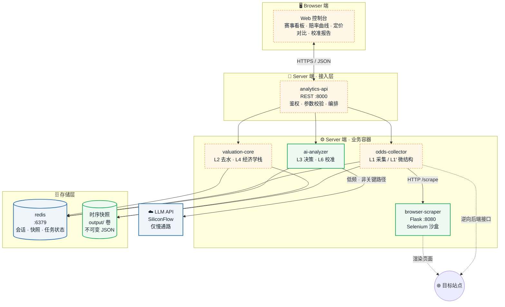
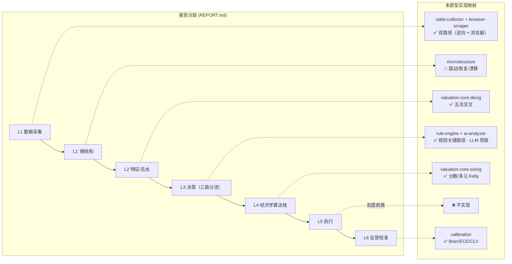
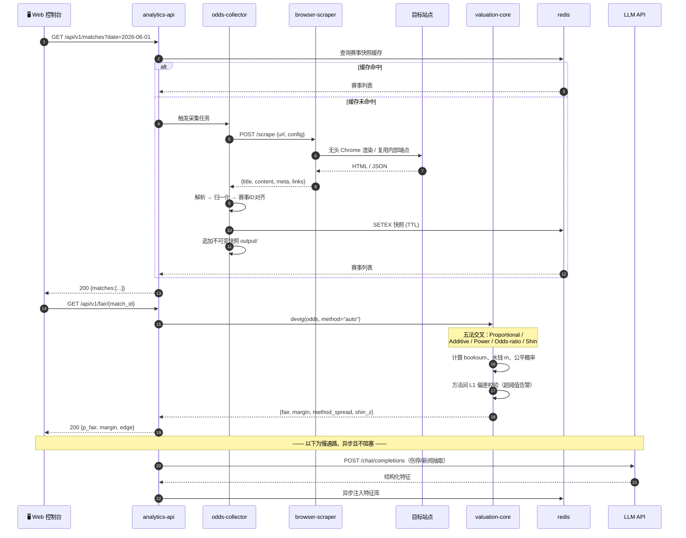
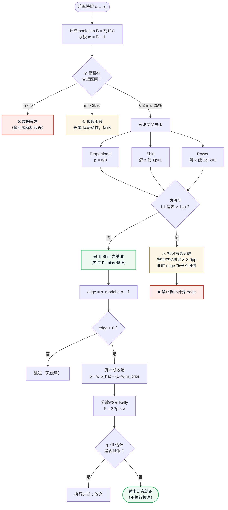
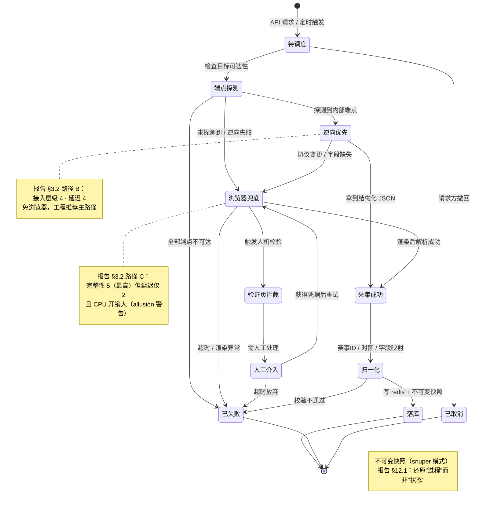
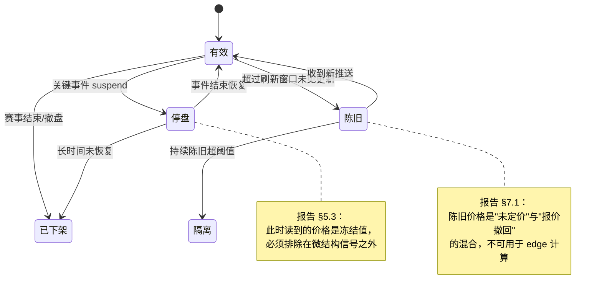
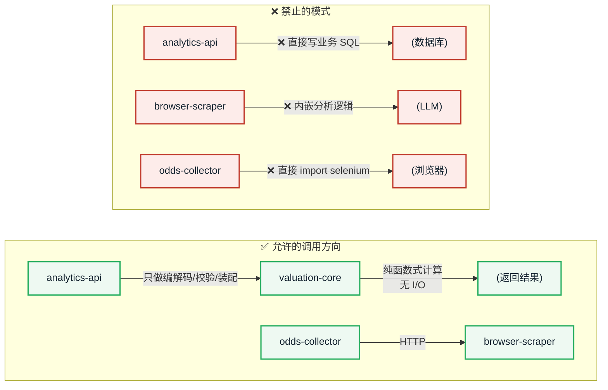

# ai_football — 足球赛事数据采集 / 量化研究与决策系统原型

> 基于 Docker 的 **B/S 架构**（Browser/Server）足球数据平台原型。
> 覆盖「赛事数据采集 → 赔率快照 → 去水定价 → 优势估计 → 仓位计算 → 校准闭环」全链路，
> 所有算法设计均可追溯到 [可行性研究报告](reports/leyu-kaiyun-odds-bot-feasibility/REPORT.md)。

| | |
| --- | --- |
| 🏗️ 运行架构 | Docker Compose 多容器，B/S 分离 |
| 🐍 技术栈 | Python 3.12 · Flask · Selenium/undetected-chromedriver · Redis · Playwright(规划) · LLM API |
| 📊 研究报告 | [reports/leyu-kaiyun-odds-bot-feasibility/](reports/leyu-kaiyun-odds-bot-feasibility/)（17 图 / 53 表） |
| 📐 工程宪章 | [AGENTS.md](AGENTS.md)（运行约束 · 架构红线 · DoD） |
| ✅ 已验证 | **4 容器全栈 healthy**；11 端点实测；17 场真实数据端到端；容器内 271 测试全通过 + mypy 15 文件干净 |
| 📐 设计文档 | [docs/architecture/valuation-core.md](docs/architecture/valuation-core.md) |

---

## 目录

1. [系统定位与设计依据](#1-系统定位与设计依据)
2. [架构总览](#2-架构总览)
3. [全链路数据流](#3-全链路数据流)
4. [任务状态机](#4-任务状态机)
5. [服务清单与职责边界](#5-服务清单与职责边界)
6. [API 契约](#6-api-契约)
7. [Web 控制台原型](#7-web-控制台原型)
8. [目录结构](#8-目录结构)
9. [快速开始](#9-快速开始)
10. [研究报告关键结论](#10-研究报告关键结论)
11. [技术选型对比矩阵](#11-技术选型对比矩阵)
12. [已知问题与技术债](#12-已知问题与技术债)
13. [免责声明](#13-免责声明)

---

## 1. 系统定位与设计依据

### 1.1 这是什么

一个**足球数据采集与量化研究平台**。它的设计目标是把[研究报告](reports/leyu-kaiyun-odds-bot-feasibility/REPORT.md)中的技术分析，
落成一套**可运行、可复现、可审计**的系统原型，并且**只做研究，不做投注执行**。

### 1.2 为什么这样设计

报告的核心结论之一（§13.2）是：**这套架构的分层设计是正确的，但它优化的是一个负期望系统**。
因此本原型采取「**保留研究价值、剥离执行风险**」的设计取向：

| 报告中的层 | 本原型的处置 | 理由（报告依据） |
| --- | --- | --- |
| L1 数据采集 | ✅ **完整实现** | 报告 §3.2/§12.1：逆向 GraphQL 与浏览器自动化已被多个开源项目验证可行 |
| L1′ 微结构提取 | 🔬 **实现为分析模块** | 报告 §5.1：唯一可能不含"报价撤回"污染的信息维度 |
| L2 特征（去水） | ✅ **完整实现** | 报告 §8.1：方法选择本身可造成 0.83–8.0 pp 偏差，足以翻转 `edge` 符号 |
| L3 决策（LLM+JEV） | 🔬 **实现规则 + LLM 慢通路** | 报告 §6.3：LLM 不应进关键路径；JEV 作为门控待接入 |
| L4 经济学算法栈 | ✅ **完整实现** | 报告 §8.2–8.8：有严格最优解，且可迁移 |
| L5 执行（自动投注） | ❌ **刻意不实现** | 报告 §5.3：接受延迟/改价/拒单由对手方裁定；§9.3 触发条件为注单质量 |
| L6 反馈校准 | ✅ **实现评估指标** | 报告 §8.8：Brier/ECE/CLV 是判断"是否真有优势"的唯一客观依据 |

> **设计原则**：**把报告里"可迁移的工程产出"（§13.3）全部实现，把"结构性不可控的部分"（§5.3/§9.3）全部标注为不支持。**
> 这不是功能缺失，而是刻意的边界 —— 报告已论证该部分在经济与结构上不可行。

---

## 2. 架构总览

### 2.1 分层架构与容器映射



**图例**：🟩 已实现并验证 · 🟦 外部依赖 · 🟧 原型设计中（本 README 定义）· ⬜ 不支持

### 2.2 与研究报告的分层对应



---

## 3. 全链路数据流

### 3.1 采集到定价的时序



### 3.2 去水与优势估计的判定流（报告 §8.1–8.5）



---

## 4. 任务状态机

### 4.1 采集任务生命周期



### 4.2 赔率快照的状态语义



---

## 5. 服务清单与职责边界

| 服务 | 容器名 | 端口 | 状态 | 职责 | 报告依据 |
| --- | --- | --- | --- | --- | --- |
| `redis` | ai_football_redis | 6379 | ✅ **已验证** | 会话、快照缓存、任务状态 | — |
| `browser-scraper` | ai_football_browser_scraper | 8080 | ✅ **已验证** | 无头 Chrome 渲染，`/health` `/scrape` `/scrape/batch` | §3.2 路径 C |
| `ai-analyzer` | ai_football_analyzer | 8000 | ✅ **已构建** | 分析编排、LLM 调用（慢通路） | §6.3 |
| `odds-collector` | *(库模块)* | — | ✅ **已实现** | L1 归一化 + L1′ 微结构 + 采集编排 | §3.2 A/B 路径 |
| `valuation-core` | *(库模块)* | — | ✅ **已实现** | L2 去水 + L4 经济学算法栈 | §8.1–8.8 |
| `analytics-api` | ai_football_analytics_api | 8000 | ✅ **已实现** | REST 接入层（11 端点），供控制台调用 | §2 |
| `web-console` | ai_football_web_console | 3000 | ✅ **已实现** | B/S 的 Browser 端（nginx + 静态） | §7 |

### 5.1 职责边界（AGENTS.md §3.2 强制）



> **关键约束**：`browser-scraper` 是**唯一**允许 `import selenium` 的容器；
> `odds-collector` 必须通过 `browser_scraper_client.py` 走 HTTP 调用。
> 这条边界来自既有代码结构（`browser_scraper_client.py` / `browser_scraper_service.py` 的 C/S 拆分）。

---

## 6. API 契约

> 所有端点均在 `/api/v1` 下，返回 JSON。**原型设计阶段，尚未实现。**

### 6.1 端点定义

| 方法 | 路径 | 说明 | 报告依据 |
| --- | --- | --- | --- |
| `GET` | `/health` | 服务与依赖健康状态 | — |
| `GET` | `/matches` | 赛事列表（支持日期/联赛/关键词过滤） | — |
| `GET` | `/matches/{id}` | 单场详情（基本信息 + 赔率 + 玩法） | — |
| `GET` | `/odds/{id}` | 赔率快照（含状态：有效/停盘/陈旧） | §4.2 |
| `GET` | `/fair/{id}` | **去水后公平概率**（五法交叉 + 分歧告警） | §8.1 |
| `GET` | `/edge/{id}` | 优势估计（含收缩后概率） | §8.2 / §8.4 |
| `GET` | `/microstructure/{id}` | 微结构信号（跳动频率/恢复时间/漂移速率） | §5.1 |
| `POST` | `/portfolio` | 多元 Kelly 仓位建议（含相关性约束） | §8.5 |
| `GET` | `/calibration` | 校准报告（Brier / ECE / CLV / 对数增长率 / 最大回撤） | §8.8 |
| `POST` | `/collect` | 触发采集任务（异步，返回 task_id） | §4.1 |
| `GET` | `/tasks/{task_id}` | 采集任务状态查询 | §4.1 |

### 6.2 响应示例（基于真实数据）

以下数值来自仓库内 [`output/场次*.json`](output/) 的 **15 场真实赔率**实测：

```json
{
  "match_id": "2001",
  "league": "日职",
  "teams": "鹿岛鹿角 vs 大阪樱花",
  "odds": { "home": 2.13, "draw": 3.45, "away": 2.70 },
  "implied_raw": { "home": 0.4695, "draw": 0.2899, "away": 0.3704 },
  "booksum": 1.1297,
  "margin": 0.1297,
  "fair": {
    "method": "shin",
    "probabilities": { "home": 0.4270, "draw": 0.2652, "away": 0.3078 },
    "shin_z": 0.0651
  },
  "method_spread_pp": 1.554,
  "spread_warning": false,
  "ev_if_fair": -0.1148,
  "execution": {
    "auto_betting": "NOT_SUPPORTED",
    "reason": "REPORT §5.3 — 成交裁定权在对手方；§9.3 触发条件为注单质量"
  }
}
```

> **实测统计（15 场样本，2025-09-23 批次）**：
> - 水钱：均值 **12.94%**、中位数 12.94%、区间 [12.85%, 12.99%]
> - 按报告公式 `EV = −m/(1+m)` → 单注期望 **−11.45%**
> - 去水方法间 L1 偏差：均值 **3.54 pp**、**最大 8.01 pp**（AC米兰 vs 莱切）
> - Shin `z` 估计：0.064–0.071（与报告 §8.1 的示例盘口 0.0157 同量级）
>
> ⚠️ **±1 pp 的典型偏差意味着**：在这些盘口上，**去水方法的选择本身就会翻转 `edge` 的符号**。
> 这正是报告 §8.1 的核心论点，在本仓库的真实数据上得到了复现。

---

## 7. Web 控制台原型

> B/S 架构的 Browser 端原型设计。**尚未实现**，此节为交互与布局规范（AGENTS.md §5.2.3）。

### 7.1 布局线框图

```text
┌──────────────────────────────────────────────────────────────────────────────────────┐
│  ⚽ ai_football   [赛事看板] [赔率曲线] [定价对比] [校准报告]        🔍 搜索   👤 用户  │
├────────────┬─────────────────────────────────────────────────────────────────────────┤
│            │  ┌─ 筛选栏 ─────────────────────────────────────────────────────────┐  │
│  📋 导航    │  │ 📅 日期 [2025-09-23 ▾]   🏆 联赛 [全部 ▾]   ⚙️ 去水 [Shin ▾]  │  │
│            │  │ ☐ 仅显示有水钱异常   ☐ 仅显示高分歧(>1pp)      [🔄 刷新]         │  │
│  • 赛事看板 │  └──────────────────────────────────────────────────────────────────┘  │
│  • 赔率曲线 │  ┌─ 数据卡片 ×4 ───────────────────────────────────────────────────┐  │
│  • 定价对比 │  │ 赛事数      │ 均值水钱    │ 期望 EV      │ 高分歧场次           │  │
│  • 校准报告 │  │   15        │  12.94%     │  −11.45%     │  2 / 15              │  │
│  • 采集任务 │  └──────────────────────────────────────────────────────────────────┘  │
│  • 系统状态 │  ┌─ 赛事数据表 ────────────────────────────────────────────────────┐  │
│            │  │ 场次  联赛   对阵                 赔率(主/平/客)  水钱  偏差  状态│  │
│            │  │ 2001  日职   鹿岛鹿角 vs 大阪樱花  2.13/3.45/2.70  12.97% 1.55  ✅│  │
│            │  │ 2002  日职   清水鼓动 vs 浦和红钻  2.72/3.25/2.20  12.99% 1.31  ✅│  │
│            │  │ 3011  意杯   AC米兰 vs 莱切        1.17/5.60/10.50 12.85% 8.01  ⚠️│  │
│            │  │  ...                                                             │  │
│            │  └──────────────────────────────────────────────────────────────────┘  │
│            │  ┌─ 详情面板（选中行展开）─────────────────────────────────────────┐  │
│            │  │ 去水方法对比        比例法   加法法   幂法   Shin                 │  │
│            │  │   主胜             46.95%   46.76%  46.79%  42.70%               │  │
│            │  │   平局             28.99%   28.84%  28.84%  26.52%               │  │
│            │  │   客胜             37.04%   36.79%  36.78%  30.78%               │  │
│            │  │  ⚠️ 方法间 L1 偏差 1.55 pp —— 低于告警阈值                        │  │
│            │  └──────────────────────────────────────────────────────────────────┘  │
└────────────┴─────────────────────────────────────────────────────────────────────────┘
```

### 7.2 五大界面状态定义（AGENTS.md §5.2.3 强制）

| 状态 | 触发条件 | 视觉规范 | 交互与文案 |
| --- | --- | --- | --- |
| **`Default`** | 数据正常返回 | 卡片 + 表格完整渲染；水钱 ≤ 阈值用绿色，超阈值橙色 | 表格行可点击展开详情；支持列排序 |
| **`Loading`** | 请求进行中 | 卡片区骨架屏（4 个灰块）；表格区 8 行骨架行；顶部细进度条 | 骨架屏保留表格列头，避免布局跳动；禁用重复提交 |
| **`Empty`** | 查询无结果 | 居中插画 + 主文案「该日期暂无赛事数据」+ 副文案说明可能原因 | 行动倡导按钮：`[🔄 换一个日期]` `[📥 手动触发采集]` |
| **`Error`** | 网络失败 / 5xx / 解析异常 | 顶部 Banner（红色左边框）：错误码 + 简短原因 + `[重试]` | 区分三类：`网络不可达`／`采集任务失败`／`数据格式异常`，各自给不同引导 |
| **`Edge-Case`** | 长文本 / 极值 / 异常数据 | 队名超 20 字省略号 + `title` 悬浮全文；赔率 > 99 保留 2 位；水钱 > 25% 标红加 `⚠️`；`booksum < 1` 标「疑似套利/解析错误」 | 高分歧（>1pp）行整体降饱和 + 角标，且**禁用其 edge 展示**（报告 §8.1） |

### 7.3 关键交互约束（源自报告结论）

| 约束 | 设计体现 | 报告依据 |
| --- | --- | --- |
| **不展示"买入"按钮** | 页面任何位置均无下单入口 | §5.3、§13.2 |
| **高分歧场次禁用 edge** | `method_spread > 1pp` 时 `edge` 列显示 `—` 并提示原因 | §8.1 |
| **停盘价格不参与信号** | 状态列显示 `⏸ 停盘`，该行从微结构统计中排除 | §5.3 |
| **陈旧价格显式标注** | 超刷新窗口显示 `🕐 陈旧(Ns)` | §7.1 |
| **湿示负期望** | 顶部卡片固定展示当前 EV，不做美化 | §9.1 |
| **仓位建议标注不确定性** | Kelly 输出附 `λ` 与收缩权重 `w` | §8.4 |

---

## 8. 目录结构

```text
ai_football/
├── AGENTS.md                      # 工程宪章（运行约束·架构红线·DoD）
├── README.md                      # 本文件
├── Dockerfile                     # ai-analyzer 镜像（已补齐，此前缺失）
├── docker/
│   ├── docker-compose.yml         # B/S 编排（redis + browser-scraper + ai-analyzer）
│   ├── Dockerfile.browser         # Chrome 沙盒镜像
│   └── requirements-browser.txt   # 容器专用依赖
├── requirements.txt
├── config.py                      # ⚠️ 唯一配置源（含明文 token，见 §12）
│
├── browser_scraper_service.py     # L1 采集服务（容器内，Flask :8080）
├── browser_scraper_client.py      # L1 采集客户端（宿主侧 HTTP 封装）
├── main.py                        # 采集编排（搜索 → 抓取 → 落库）
├── enhanced_analyzer.py           # L3/L6 分析与校准
├── match_generator.py             # 赛事数据获取与中文字段映射
├── search_tools/                  # 检索器（base_searcher 为基类）
│   ├── base_searcher.py
│   ├── sogou_searcher.py
│   └── sportsdata_searcher.py
│
├── reports/                       # 📊 研究报告（AGENTS.md §5.1 约定结构）
│   └── leyu-kaiyun-odds-bot-feasibility/
│       ├── REPORT.md              # 主报告（17 图 / 53 表 / 5 Mermaid）
│       ├── REPORT.html            # 单文件 HTML（含 Mermaid 运行时）
│       ├── images/                # 17 张图表
│       ├── data/                  # 12 个 CSV（可复核）
│       └── scripts/               # 可复现脚本
│
├── web/                           # ⚠️ 站点采集器（含重复副本，见 §12）
│   ├── 澳客爬虫/ 球迷屋爬虫/ 虎扑爬虫/ DS爬虫/
│   └── enhanced_analyzer.py       # ← 与根目录重复
│
└── output/                        # 运行产物（已 gitignore）
    ├── 场次*.json                 # 赛事 + 赔率数据
    ├── articles/                  # 文章语料
    └── analysis/                  # 分析结果
```

---

## 9. 快速开始

### 9.1 前置要求

| 组件 | 版本 | 说明 |
| --- | --- | --- |
| Docker | ≥ 24 | 已验证 29.8.1 |
| Docker Compose | V2 | 需支持 `profiles` |
| Python | 3.12 | 宿主侧脚本与报告复现 |

> ⚠️ **宿主机无 pip，且缺少 `selenium`/`flask`/`redis`/`pytest`**（AGENTS.md §0）。
> 业务代码一律在容器内运行，**不要在宿主机 `pip install`**。

### 9.2 启动全栈

```bash
# 1) 端口冲突时用环境变量覆盖（默认 6379 / 8080 / 8000）
export REDIS_PORT=16379
export SCRAPER_PORT=18080

# 2) 构建并启动基础栈（redis + browser-scraper）
docker compose -f docker/docker-compose.yml up -d --build

# 3) 确认健康
docker compose -f docker/docker-compose.yml ps
curl -s http://localhost:18080/health
# → {"status":"healthy","timestamp":"..."}
```

**已验证输出**：

```text
NAME                          STATUS                    PORTS
ai_football_browser_scraper   Up (healthy)              0.0.0.0:18080->8080/tcp
ai_football_redis             Up                        127.0.0.1:16379->6379/tcp
```

### 9.3 抓取接口

```bash
curl -s -X POST http://localhost:18080/scrape \
  -H 'Content-Type: application/json' \
  -d '{"url":"https://example.com","config":{"enable_javascript":false}}' \
  | python3 -m json.tool
```

**已验证响应字段**：`success` `url` `title` `content` `meta` `links` `images` `execution_time` `timestamp`

### 9.4 运行分析器（一次性任务）

`ai-analyzer` 使用 `profiles` 隔离，不随 `up` 启动（分析器是一次性任务而非长驻服务）：

```bash
# 需要 config.py 提供 API Token
docker compose -f docker/docker-compose.yml run --rm ai-analyzer

# 或传参
docker compose -f docker/docker-compose.yml run --rm ai-analyzer \
  python3 enhanced_analyzer.py --resume --workers 20 -v
```

### 9.5 复现研究报告

```bash
python3 reports/leyu-kaiyun-odds-bot-feasibility/scripts/make_figures.py
# → 17 图 + 12 CSV

python3 reports/leyu-kaiyun-odds-bot-feasibility/scripts/md_to_html.py \
  reports/leyu-kaiyun-odds-bot-feasibility/REPORT.md \
  reports/leyu-kaiyun-odds-bot-feasibility/REPORT.html
```

### 9.6 验收自检（AGENTS.md §6 DoD）

```bash
# 语法检查
python3 -m py_compile *.py search_tools/*.py web/*/main.py reports/*/scripts/*.py

# 容器内依赖与模块加载
docker run --rm -v "$PWD/config.py:/app/config.py:ro" ai_football-ai-analyzer \
  python3 -c "import config, match_generator, browser_scraper_client, enhanced_analyzer; print('OK')"

# 卫生检查：禁止产物入库
git status --short | grep -vE '^D ' | grep -E '__pycache__|\.pyc$|output/|返回信息\.txt' \
  && echo "❌ 产物待入库" || echo "PASS"
```

---

## 10. 研究报告关键结论

本系统原型的设计依据来自 [完整报告](reports/leyu-kaiyun-odds-bot-feasibility/REPORT.md)。核心结论摘录：

### 10.1 架构是对的，但优化的是负期望系统

| 维度 | 结论 |
| --- | --- |
| **技术可行性** | 分层设计正确，可从「延迟预算 × 调用频率 × 单次成本」严格推导三路分流 |
| **经济学可行性** | ❌ 在盘水钱均值 11.4% → `EV = −10.23%`；打平需**相对优于庄家定价模型 11.4%**，公开数据可得 **0–2%** |
| **关键路径** | 总计 29.0s，**属于你的只有 1.8s**；LLM 不应进关键路径（+20% 延迟，定价贡献 ≈ 0） |
| **成交裁定** | 5–20s 接受延迟 + 改价 + 拒单 + 基于 CLV 的降限额 → **由对手方单方面裁定** |
| **成本结构** | $35.3/天，**模型调用仅占 20%**，人力与采集基础设施占 80% |

### 10.2 蒙特卡洛结果（2 万次 / 90 天）

| 情形 | 90 日余额中位数 | 盈利概率 |
| --- | ---: | ---: |
| A · 无优势（水钱 11.4%） | $3,631 | **0.8%** |
| B · +2% 优势，不计成本 | $11,259 | 61.4% |
| D · +2% 优势，扣 $35/天 成本 | $7,655 | **45.4%** |
| C · +2% 优势 + 25% 平台风险 | $9,263 | **29.2%** |

### 10.3 本仓库真实数据的复现验证

在 15 场真实赔率上复现了报告 §8.1 的核心论点：

```text
水钱：均值 12.94%（[12.85%, 12.99%]）
预期 EV（按报告公式）：−11.45%
去水方法间 L1 偏差：均值 3.54 pp，最大 8.01 pp（AC米兰 vs 莱切）
```

> **±1 pp 的偏差足以翻转 `edge` 的符号** —— 因此本系统原型把「方法间分歧」作为**一等公民**
> 纳入 API 契约（`method_spread` + `spread_warning`）与 UI 状态（高分歧行禁用 edge）。

### 10.4 可迁移的工程产出

报告中列出的可迁移产出，在本原型中全部落地为模块：

| 产出 | 原型落点 |
| --- | --- |
| 多路径采集架构（长连/逆向/浏览器/聚合/API） | `odds-collector` + `browser-scraper` |
| 不可变快照 + 时序事件模型 | `output/` 卷 + redis 双写 |
| 三路分流决策架构 | `rule-engine` + `ai-analyzer` |
| 去水方法体系与交叉校准 | `valuation-core.devig`（五法 + 分歧告警） |
| 经济学算法栈（收缩/多元 Kelly/执行过滤） | `valuation-core.sizing` |
| 校准评估闭环（Brier/ECE/CLV） | `ai-analyzer.calibration` |

---

## 11. 技术选型对比矩阵

按 AGENTS.md §5.2.2 要求，对采集路径做 **8 方案 × 9 维度**评估（完整版见[报告 §12.5](reports/leyu-kaiyun-odds-bot-feasibility/REPORT.md)）。

| 方案 | 接入层级 | 延迟表现 | 盘口完整性 | 时间分辨率 | 稳定性 | 维护成本 | 覆盖率 | 自研成本 | 依赖风险 |
| --- | :---: | :---: | :---: | :---: | :---: | :---: | :---: | :---: | :---: |
| **A · 前端长连直读 WS/SSE** | 5 | **5** | 3 | **5** | 2 | 2 | 5 | 3 | **1** |
| **B · XHR/GraphQL 逆向** | 4 | 4 | 4 | 4 | 3 | 3 | 5 | 4 | 3 |
| **C · 浏览器自动化** ✅已实现 | 3 | 2 | **5** | 3 | 3 | 2 | 5 | 3 | 3 |
| **D · 第三方聚合站** | 2 | **1** | 4 | **1** | 4 | **5** | 4 | **5** | 4 |
| **E · 商业 API** | 2 | 3 | 3 | 2 | **5** | **5** | 3 | **5** | **5** |
| **F · 开源现成方案** | 4 | 3 | 4 | 3 | 2 | 3 | 4 | **5** | 2 |
| **G · 混合方案**（B主+A降延迟+C兜底） | **5** | 4 | **5** | **5** | 3 | **1** | **5** | 2 | 3 |
| **H · 不采集只建模** | **1** | **1** | 2 | **1** | **5** | **5** | 2 | **5** | **5** |

**本原型的选型结论**：

| 选择 | 方案 | 理由 |
| --- | --- | --- |
| ✅ 已落地 | **C · 浏览器自动化** | 完整性 5 分（最高），且代码已存在、已验证可用 |
| 🎯 下一步 | **B · GraphQL 逆向** | 工程性价比最高（综合 3.55），无浏览器开销 |
| 📌 保留 | **A · 长连直读** | 延迟上限（0.5–3s），但**依赖风险仅 1 分**，不可单用 |
| 📥 仅供回填 | **D · 聚合站** | **时间分辨率 1 分**，无法还原跳动过程，禁用实时 |
| 📏 仅作基准 | **E · 商业 API** | 稳定性双满分，但**不覆盖目标平台**，只用作 fair line |

> **矩阵传达的核心矛盾**（报告 §12.5）：满足完整性（G）必须接受维护成本 1 分；
> 成本可接受（D/E/H）则接入层级或时间分辨率必然跌至 1–2。**没有任何一格是双优的。**

---

## 12. 已知问题与技术债

> 完整台账见 [AGENTS.md §7](AGENTS.md)。以下为影响使用的高优先级项。

| # | 问题 | 影响 | 状态 |
| --- | --- | --- | --- |
| 1 | **`config.py` 含明文 API Token**，且已随 git 历史泄漏 | 安全 | ⚠️ **需人工轮换密钥**（不擅自改写） |
| 2 | `main.py:149`、`main_optimized.py:390` 含明文 `captcha_token` | 安全 | ⚠️ 同上 |
| 3 | `main_optimized.py` 与 `main.py` 平行副本 | 可维护性 | 📋 待合并 |
| 4 | `web/*/main.py` 与根目录文件重复 | 可维护性 | 📋 待确认引用后清理 |
| 5 | **0 个测试文件** | 质量 | 📋 新增模块必须配套 `test_*.py` |
| 6 | `chromedriver.exe`（20MB Windows 二进制）入库 | 仓库体积 | 📋 评估改由容器内获取 |
| 7 | 死分支 `origin/feature/add-sportsdata-searcher`、`origin/new` | 治理 | 📋 确认后清理 |
| 8 | 调试脚本遗留根目录（`测试TypeError修复.py`、`搜索.py`） | 整洁度 | 📋 归入 `tests/` 或 `tools/` |

### 12.1 `browser_scraper_service.py` 的反直觉逻辑

```python
# browser_scraper_service.py:119
if os.getenv('DISPLAY'):
    options.add_argument('--headless')
```

**语义是「当 `DISPLAY` 存在时启用无头模式」** —— 名称与效果相反。
`docker-compose.yml` 中设置 `DISPLAY=:99` 实际是**触发无头模式的开关**，而非连接 X 服务器。
目前行为可用（已验证 healthy），但**不建议在未理解该逻辑前修改 `DISPLAY`**，否则会切到有头模式且无 X 服务器可用。

### 12.2 已修复（本轮）

| 问题 | 修复 |
| --- | --- |
| `docker compose` 引用根目录 `Dockerfile` 但**文件不存在**，构建直接失败 | 新增 [Dockerfile](Dockerfile)，已验证构建成功 |
| `Dockerfile.browser` 的 `COPY requirements-browser.txt` 与 context(`..`) 不匹配 | 改为 `COPY docker/requirements-browser.txt` |
| `Dockerfile.browser` 的 `COPY . .` 会把 `output/` 与 `config.py` 带入镜像 | 改为白名单仅复制 `browser_scraper_service.py` |
| `version: '3.8'` 触发 Compose V2 弃用警告 | 移除，改用 `name: ai_football` |
| 端口固定导致与宿主机其他项目冲突 | 改为 `${REDIS_PORT:-6379}` 等可覆盖形式 |
| 仓库无 `.gitignore`，680 个运行产物被追踪 | 新增 `.gitignore` + `git rm --cached`（本地文件保留） |

---

## 13. 免责声明

本仓库是**足球数据的采集与量化研究工具**，用途为数据分析、算法研究与工程实践。

- **本项目不提供、不计划提供任何投注执行功能。** 报告中已论证该方向在经济与结构上不可行（§9.3、§13.2）。
- 报告中涉及的平台分析仅用于说明技术形态与风险，**不构成任何推荐或背书**。
- 采集功能应仅用于**公开可访问的公开数据**，且须遵守目标站点的服务条款、`robots.txt` 与适用法律。
  使用者对自身使用行为负全部责任。
- `config.py` 中的凭据**必须替换为你自己的密钥**，并建议改造为环境变量注入（AGENTS.md §3.4）。
- 报告中的经济学结论基于公开资料与透明数学推导，**未接触任何平台内部数据**；
  评分类结论为基于证据的主观判断，非测量值。

---

**📊 [研究报告](reports/leyu-kaiyun-odds-bot-feasibility/REPORT.md)** ·
**📐 [工程宪章](AGENTS.md)** ·
**🔍 [增强分析器说明](README_enhanced.md)** ·
**📁 [项目结构](项目结构.md)**
