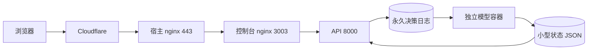

# API 加载失败与模型解耦修复

证据等级 A：2026-10-10 运行日志、py-spy 线程栈及代码。

| 证据 | 原因 | 修复 |
| --- | --- | --- |
| 本地 API 推荐请求超过12秒；线程栈在 deepcopy | 页面响应包含40点训练前缀，频繁复制 | 页面移除训练前缀和场馆提交字段，原始日志继续完整保存 |
| 重启后 health 多次20秒超时，线程栈在统计锁 | 首次健康检查持锁遍历百万级文件 | 首次也异步统计，未完成明确返回 loading，不猜测文件数 |
| 单场明细线程遍历整个快照库 | 单场查询依赖全库缓存构建 | 仅查询指定比赛目录，按比赛索引时间缓存 |
| 同进程 data-model 线程持续 stat | 模型归档统计与主服务竞争 GIL / I/O | 训练、输入提取、推理、统计独立 model-worker；API 被动读状态 |
| 10:40:05 nginx upstream prematurely closed connection | 后端连接中断，可产生502 | 更新容器时短暂中断仍可能发生；Docker DNS动态解析避免持有旧IP；增加上游耗时日志 |

域名实际转发3003，3000属于 Grafana。Cloudflare并不能排除源站问题。本轮未捕获503实例，不能据此断言全部503根因；新增日志带 request_time、upstream_status、upstream_time，可定位后续实例。

验证（退出码均为0，除明确记录的首次失败）：

- `./scripts/cpu-limited.sh run -- python3 -m unittest discover -s tests -q`：1256 tests，11 skipped，46.577秒。
- 容器 Python3.12 `python -m mypy`：77文件无错误；`python -m ruff check .` 最初2处测试格式错误，修正后通过。
- `python3 -m py_compile service/model_service.py service/data_model.py service/analysis.py service/valuation.py store/training_data.py api/app.py`。
- `node --check web/console/workbench.js`；`git diff --check`。
- `./scripts/cpu-limited.sh build analytics-api model-worker`；模型镜像首次缺collector导入依赖，补齐后单独重建及容器导入验证通过。
- `docker exec ai_football_web_console nginx -t`；动态DNS配置已 reload。
- 用户授权后更新 API / model-worker。初步本地控制台并发只读探针：health 200/0.046秒、recommendations 200/0.898秒、data-model 200/0.048秒。此时行情正在恢复，非峰值性能承诺，继续观察有数据时的响应。

未进行真实资金下单测试；既有开关与订单去重状态保留。
