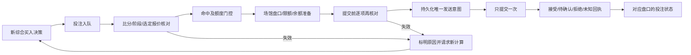

# TASK-34：决策与投注执行错位修复

证据等级 A：生产日志、永久 `live-replay.jsonl.gz` 和本仓库实现。2026-10-10 检查期间，生产投注已开启、执行线程存活，订单库有 6 条 accepted、22 条 pending；它们是已有回执，不代表新版本修复验证。新版启动后归档中有 33 次带买入候选的计算，日志有 17 次整体版本拦截、5 次笼统提交前校验拦截。真实改价、盘口关闭仍然可能导致合理的未提交，不能承诺每个研究决策都产生订单。

## 根因与处理

| 原行为 | 影响 | 修复 |
| --- | --- | --- |
| C105 刷新全量报价即增加整场版本；投注入口要求版本完全一致 | 即使所选价格与比分相同，排队期间收到推送也会阻止执行 | 核对决策比分、阶段、所选原生玩法/盘口/选项/线、价格和新鲜度；允许无关版本刷新 |
| 行情失败也缓存 30 秒且不区分新旧计算 | 新计算已恢复条件仍沿用旧 blocked，短暂机会被遗漏 | 行情失败请求重新计算；新的发布时间可以绕过该失败缓存；历史命中等门控仍按原周期检查 |
| 每个推荐新建账户客户端 | 每次重复获取场馆会话，增加准备耗时 | 执行器复用自己的会话客户端；凭据变化使缓存失效；客户端原有过期刷新保留 |
| 提交前很多失败都返回同一句提示 | 无法判断是比分、盘口、赔率、过期还是设置 | 分开错误原因；日志与状态附 stage、elapsed_ms、对应 decision_at_ms |
| 推荐卡片只显示“盘口开启” | 历史保留推荐被误认为待提交订单，last_result 也无法对应每个盘口 | 返回对应盘口的 queued/blocked/accepted/pending/unknown 状态及订单号；历史展示未生成新买入时明确提示 |
| 可选模型观察在投注入队之前执行 | 观察特征异常可能阻止已计算推荐入队 | 已计算买入先进入投注队列；完整模型服务解耦另行完成 |

新报价不直接套用旧预测下单；推荐过期仍要求新计算。已写入发送意图的订单（包括 pending、rejected、unknown）始终保留逻辑盘口去重，不因重算、改价或重启再次发送。原有真实资金门控、限额、余额与默认关闭规则保留。

## TODO 与验证

开发先完成，再在冻结源码上统一验证。

| 项目 | 验收条件 | 状态 |
| --- | --- | --- |
| 排查 | 日志与归档区分真正买入、预测和历史展示；统计失败原因 | 完成 |
| 执行修复 | 无关版本刷新不误拦截；实际状态变化阻止；新决策恢复检查 | 开发完成 |
| 可观测性 | 推荐对应执行状态；具体原因/阶段/耗时 | 开发完成 |
| 单元回归 | 正常提交、改价/过期/比分变化、新计算恢复、会话复用、重复订单 | 通过，退出码0 |
| 完整检查 | unittest、Python/JS语法、mypy/ruff | 通过，退出码0 |
| 镜像 | 受限构建并隔离验证；不提交真实订单 | 通过，退出码0 |
| 交付 | PR；说明用户部署命令；后续模型解耦、S3任务继续 | 待完成 |

用户要求自行启动。完成后通过 `./scripts/cpu-limited.sh up` 对齐新镜像；单纯 restart 不会替换镜像。代码修改本身不会改变当前容器中的执行逻辑。

2026-10-10 统一验收，以下命令退出码均为0：

- `./scripts/cpu-limited.sh run -- python3 -m unittest tests.test_betting_execution tests.test_betting tests.test_leyu_account tests.test_match_decision tests.test_api -q`：222项。
- `./scripts/cpu-limited.sh run -- python3 -m unittest discover -s tests -q`：1251项，11项跳过，46.295秒。
- `python3 -m py_compile service/betting.py service/analysis.py api/app.py tests/test_betting_execution.py`、`node --check web/console/workbench.js`、`git diff --check`：通过。
- `docker run --rm --cpus=1 -v /root/ai_football:/w:ro -w /w python:3.12-slim sh -c 'pip install -q mypy ruff redis && python -m mypy --cache-dir=/tmp/mypy-task34 && python -m ruff check --no-cache .'`：76文件无类型错误，lint通过。
- `./scripts/cpu-limited.sh build analytics-api`：镜像 `4e40495a2b9b`。
- `docker run --rm --cpus=1 -v /root/ai_football/tests:/app/tests:ro ai_football-analytics-api:latest python -m unittest tests.test_betting_execution tests.test_betting tests.test_leyu_account -q`：Python3.12镜像中78项通过，账户与提交均为mock。
- Playwright CLI `run-code` 执行 `/tmp/task34-browser-check.js`：1440/390/320宽度逐盘口原因与pending回执显示正确，无未捕获JS异常。初次挂接fixture之前静态服务器不提供API而报404，该阶段不作为集成结论。

生产仍为 `ae149953cc1d`，未替用户启动新版；上述结果不冒充真实成交验证。未删改订单库、历史数据或资金设置。
