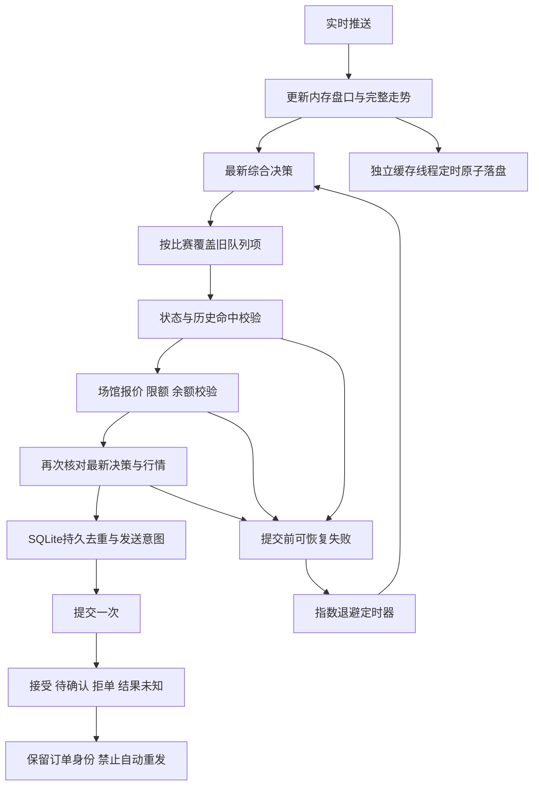

# 自动投注积压修复与提交前重试

证据等级 A：生产线程栈、用户抓包、只读 WebSocket 采样及本仓库代码。独立连接采样337个盘口块，外层ctsp、载荷time、盘口t一致，延迟0.904～3.718秒，中位2.185秒；同阶段主服务缓存中最新报价已落后48秒。因此本轮保留上游时间与15秒默认门槛，修消费积压，不以接收时间冒充新报价。

| 问题 | 原因 | 改动 |
| --- | --- | --- |
| 新计算仍提示报价过期 | 推送线程每5秒序列化并写完整盘口缓存；线程栈多次停在json.dump | 独立缓存线程；紧凑JSON一次写入；退出先停止写入线程，再保存最终缓存 |
| 队列后部推荐已过期 | 一次取走整批旧决策，逐笔网络校验耗时 | 每处理一场时才取最新队列项；每个选项及提交前再次核对最新决策；空推荐会撤回排队项 |
| 暂时错误后没有主动重试 | 仅等待后续推荐，30秒冷却，缺定时重新计算 | 定时退避请求重新决策；重试使用新决策，禁止重放旧payload |
| 历史命中检查与页面排队 | 后台全量统计持台账写锁 | stats/evidence/投注命中查询使用独立只读WAL连接；内存库保留原锁 |
| TLS读取时等待新网络包 | 内核可读不等于TLS明文可读；已解密数据也可能只在SSL缓冲内 | 握手后非阻塞；优先读取pending明文；处理WantRead/WantWrite及部分发送 |
| 订阅更新暂停行情消费 | 接收线程周期调用REST赛程 | 独立订阅线程；失败保留当前订阅，权威空列表才清空；重连只重放最新订阅 |
| 后台历史统计争用磁盘和GIL | 百万快照被rglob重复遍历，并逐文件stat | 单次os.walk按文件名计数；保留S3清理后目录的比赛计数 |
| 决策和落盘抢占接收线程 | 每次重算统计权重、中文标签、完整训练前缀与deepcopy；首轮台账批量写入阻塞replay | 按证据更新缓存权重；缓存标签和时间前缀；可信内存记录用pickle冻结；台账每轮最多64项；每场调度短暂让出执行时间 |
| account偶发慢请求 | 每次缓存过期同步获取场馆账户；并发请求重复获取 | 独立单飞后台刷新；GET立即读缓存；失败保留旧值并明确标记stale/error，凭据变化清空旧账户 |
| settings打开慢 | 每次读取重新汇总全部历史表现 | 读取结算后台已更新的证据快照 |

默认最多5次检查，失败后依次等待2、4、8、16秒；达到上限暂停30秒，之后仅更新的有效决策可以启动下一轮。设置页“执行 → 真实投注 → 提交前重试”可配置次数1～20与基础间隔0.5～30秒，单次间隔封顶30秒。

允许重试：过期决策/报价、比分/阶段变化、盘口/赔率变化，以及只读场馆接口的超时、429、部分5xx。每次重新计算并检查命中、比赛状态、原始盘口标识、报价、限额、余额及当前开关。推荐消失或关闭开关会清除待重试项。达到次数上限不会通过放宽门槛强行执行。

禁止自动重发：已经写入持久发送意图的订单，包括接受、待确认、明确拒单、回执未知和中断发送。同一账户+比赛+玩法+盘口线+方向不因赔率变化而产生第二笔。网络超时发生在扣款提交后时，只显示待核对，不进入提交前重试队列。

状态接口增加attempt、retryable、retry_scheduled、retry_exhausted、retry_after_s、awaiting_new_decision，以及retry_pending与retry_policy；页面展示检查次数、等待重算、暂停与待重试数量。

## CPU与运行边界

2026-10-10用户授权解除运行期CPU限制。Compose中API、Redis、控制台、模型worker与归档worker的默认cpus均为0.0；宿主实读五个容器的cgroup `cpu.max`均为`max 100000`。构建与测试继续经受限脚本或容器2核配额运行，训练子进程仍遵守设置页的CPU/内存配置。归档worker正在全量迁移，先解除其有效cgroup配额，迁移完成后重建容器持久化新Compose配置。

解除前API在4643个调度周期中32次被限流，累计约0.6秒，不能解释数十秒报价延迟；Python单进程的GIL、重复计算、锁和IO仍会造成阻塞。不能把解除CPU限额写成“任何决策都能立即成交”。盘口暂停、推荐撤回、命中/余额/限额不满足等拦截继续生效。

历史nginx日志记录后端连接被拒绝、上游连接提前关闭，与重建/启动时段相邻，是已有502证据；账户同步上游请求与台账长锁也会延长请求。尚未抓到独立503实例，不能宣称其具体原因已经证实。临时部署窗口的502不混入稳定运行成功率。

## 冻结后验证

以下为真实执行结果，退出码均为0。所有订单测试使用假客户端，真实业务检查仅GET查询和行情订阅；未手工发送测试投注、未保存投注开关或额度设置。

| 验证 | 命令/方式 | 结果 |
| --- | --- | --- |
| 宿主完整回归 | `./scripts/cpu-limited.sh run -- python3 -m unittest discover -s tests -q` | 1299项，11跳过，46.597秒 |
| 容器Python3.12完整回归 | `docker run --rm --cpus=2 --network=none -v /root/ai_football:/w:ro -w /w -e PYTHONPATH=/w --entrypoint python ai_football-analytics-api -m unittest discover -s tests -q` | 1299项，11跳过，77.740秒 |
| 类型与lint | 容器中`python -m mypy`、`python -m ruff check .` | 80文件无类型错误；lint通过 |
| 语法 | 对git列出的110个Python文件执行py_compile；`node --check web/console/workbench.js`；`bash -n scripts/cpu-limited.sh` | 通过 |
| 真实运行依赖 | `docker run --rm --cpus=2 --network=none --entrypoint python ai_football-analytics-api -c 'import sys, redis, boto3; print(sys.version); print("runtime storage dependencies OK")'` | Python3.12.15，运行依赖通过；当前仓库无旧版requirements.txt |
| 构建与配置 | `./scripts/cpu-limited.sh build analytics-api model-worker archive-worker`；`docker compose -f docker/docker-compose.yml config -q` | 通过 |
| 部署 | `./scripts/cpu-limited.sh up -d --no-deps analytics-api model-worker` | 两个最新镜像运行；API、模型、Redis、控制台healthy |
| 页面 | Playwright访问真实域名，只读打开设置和数据与模型页 | 重试字段可见；1440/390/320宽无溢出；S3统计渲染；无未捕获JS异常 |
| 第一段稳定探针 | 36轮，每轮并发6项GET，部署结束后单独采样 | 216请求均200；最新上游报价年龄0.6～3.4秒；recommendations p95 3.215秒，account p95 1.063秒 |

较早测试曾发现C105集成用例未隔离update_settings启动的后台执行器，修正测试生命周期后重新冻结并执行上述完整回归。首次容器回归命令未挂载测试目录，报Start directory is not importable；改用只读工作区挂载后完整回归通过。旧AGENTS中的requirements.txt已不存在，依赖核验改为真实运行镜像的redis/boto3导入。

S3全量迁移与进一步持续采样仍在进行，最终核验追加到本文与S3文档。永久走势、全部已发布决策与赛果未因本轮性能修复被轮转或删除。
