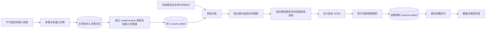
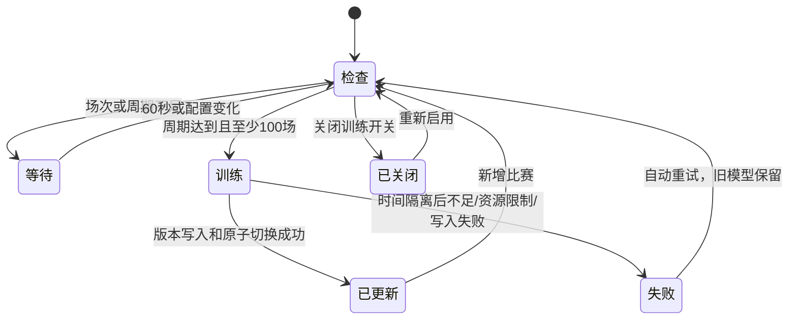

# 数据与模型：多盘口监督校准

证据等级 A：本文描述本仓库 `core/learned_model.py`、`store/training_data.py`、`service/model_training.py` 的可核验实现。页面数字来自实际文件与模型，不使用占位绩效。



## 输入、标签与时间边界

| 数据 | 处理规则 | 防偏差约束 |
| --- | --- | --- |
| 同场多决策 | 新产生的每次计算、每算法、每盘口、盘口线、方向都保存特征 | 不只挑一个独赢或可买入建议 |
| 旧台账 | 纳入可用的各算法多盘口前瞻留痕，去除相同身份重复 | 旧台账本来只冻结首次方向，不能声称恢复了全部计算 |
| 走势 | 本次不可变输入中的最近40个报价点，提取收益率、对数变化波动率、点数 | 截点为 captured_at_ms；同时过滤上游时间与本地首次看到时间；不从赛后曲线补齐 |
| 缺失走势 | 特征零值并独立缺失指示 | 不把缺失当真实平稳走势 |
| 实际结果 | 用已结算真实比赛的全场/半场比分逐盘口重新结算新输入 | 半场比分缺失不猜测；纯走盘、void 不训练 |
| 赢半/输半 | 非走盘部分方向：赢半=1、输半=0 | 对应既有 effective_probability 非走盘语义；不是净盈利概率 |
| 训练周期 | 自上一成功版本之后新增的独立有效已结算比赛数 | 同场更多盘口不会提前触发周期；首次至少100场 |
| 分组/时间隔离 | 按比赛首次决策时间划分前80%训练、后20%验证 | 同场不能跨集合；训练标签产生时间须早于验证最早输入 |
| 样本权重 | 每场训练梯度及指标总权重相等 | 多盘口/多更新的比赛不会靠行数主导训练 |

首版为带 L2 正则化的二元 Logistic 校准，**不是强化学习**。当前30个训练参数；实际以模型文件中的 `parameter_count` 为准。输入包括盘口概率、原算法概率、比分/时间、盘口家族/线/方向、半场标志、走势摘要、算法标志及同一输入快照同盘口方向的多算法概率组合。完整曲线与原始决策仍按既有归档永久保留。

这是共享校准器，不将多个方向输出冒充归一化的全场三分类概率；当前不接入投注执行或旧集成权重。每版本前瞻预测在发生时冻结，当前版本评价与回测分开。持续更新中验证集会滚动变化，不能据此承诺实盘收益。

## 运行与资源

训练、推理、读取训练集合、前瞻评价和归档统计全部在独立 `model-worker` 容器内进行。API 不导入模型算法，不启动模型进程，不管理模型生命周期；分析调度器启动、关闭或重启不会终止独立模型服务。二者通过永久决策日志、已结算台账及原子状态文件交换数据，模型服务无场馆网络和账号环境变量。Linux CPU affinity 实际限制可使用核数（设置1–2核），RLIMIT_AS 限制整个训练进程虚拟地址空间（256–4096 MiB），RLIMIT_CPU 最多600 CPU秒，模型服务监督进程另设900秒墙钟超时；nice=10。资源设置更改/关闭训练会终止本系统自己的训练进程并以新配置重新检查。容器总CPU限制仍由 compose 保证。

独立模型服务按 gzip 成员增量消费永久决策日志，每秒保存输入和游标；先提交记录再更新游标，重启可幂等补读。每60秒检查训练；归档统计在单独受限子进程中每15分钟执行，不阻塞推理或心跳。GET `/api/v1/data-model` 只读取小型 `models/dashboard.json` 缓存，不读取大归档、不触发训练。统计文件数量、压缩后逻辑字节数、实际分配块、台账决策/比赛数及所在文件系统空间；不以“文件数”冒充“原始事件条数”。旧文件不删除。

训练不按每场一条粗略削减，也不因达到某个记录数上限删除或截断输入；资源不足或超时明确失败，保留旧模型并提示调整资源或离线训练。训练失败保留上一个成功模型；版本文件永久保存，`active.json` 仅是最新指针。初次有效比赛不足显示等待。旧 replay 归档不在在线训练中反复扫描，旧缺失特征不会回填未来数据。

设置持久化延用带版本号的 runtime-settings.json；训练开关、比赛周期、CPU/内存经服务端严格整型与范围校验。模型状态包含独立服务心跳、training_running 与 inference_running；心跳过期显示独立服务未运行，保留已有模型信息。训练关闭时独立观察推理继续运行。2026-10-10 用户已授权更新容器，验证通过后同步部署。

## 状态与故障



## 部署与报错处理

nginx 当前通过 bind mount 直接读取工作区静态文件，API 代码则在镜像内。开发时页面先变化、旧API还未重建，`/data-model` 会404；前端显示版本缺失并停止自动轮询，更新后手动刷新即可恢复。旧后端不支持的训练配置禁用，防止把新字段发给旧API。

生产nginx日志记录 `Connection refused` 与 `upstream prematurely closed connection`，含一次紧邻后端重建。因此 recommendations 的已捕获502属于后端短暂不可用。前端单请求执行，网关502/503/504保留旧结果、30秒后再请求，刷新按钮可立即重试。不把502冒充空推荐，也不以提高超时掩盖端口拒绝。

完成验证并构建后执行（不需要手动占用任何新端口）：

```bash
./scripts/cpu-limited.sh up
```

如果镜像未预先构建，先执行 `./scripts/cpu-limited.sh build analytics-api model-worker`。`up` 会让 compose 对齐新镜像；不应只 restart 旧容器。前端无需自行启动第二个同端口服务器。模型服务为第四个服务，有自己的CPU与内存容器上限；原有三个服务独立运行。

前瞻评价要求 predictions.predicted_at 早于结算时刻；后台补读赛后日志产生的预测与缺少生成时间的旧预测均不纳入前瞻绩效。
