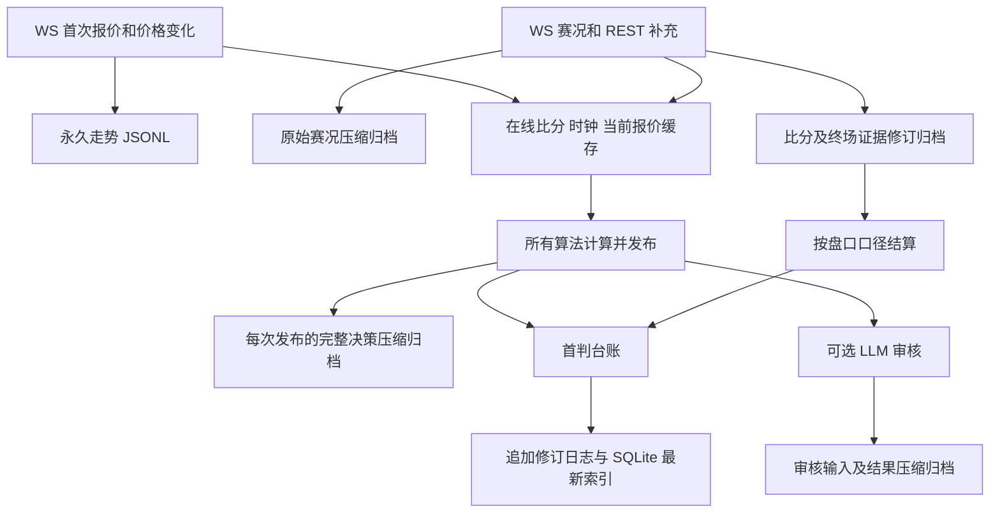
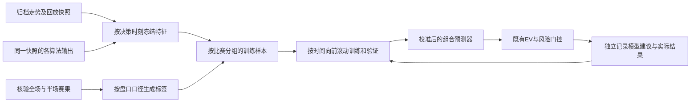

# 用盘口走势、算法预测与赛果训练组合决策模型

核验日期：2026-10-10。本文是现有数据审计和实施方案，尚未训练或接入新模型。
证据分级：A 为本仓库可核验代码及当前运行数据；模型选择与实施顺序为工程建议，
不是模型收益或效果测量。本次实现永久留存与赛况归档，尚未启动训练；
不修改数学模型系数，不通过真实账户发单进行验证。

## 永久留存契约

本次实现取消走势容量清理及所有业务历史日志轮转；已有 `.jsonl.1`、时间戳归档、
SQLite 和抓包原样保留。历史只追加，最新状态索引仍原子刷新。
**生效前已删除或覆盖的数据不能凭空恢复；服务离线、上游未提供的事件也不在档案中。**

| 数据 | 默认宿主路径 | 新行为（A级代码证据） |
| --- | --- | --- |
| 真实赔率走势 | `output/_trends/<match_id>.jsonl` | 同步追加首次报价及每次有效价格变化，含盘口身份、旧/新价、上游时间和本机接收时间；无文件/目录容量上限 |
| 原始赛况及 REST 补充 | `output/_live/events.jsonl.gz` | 追加已解码的比分、阶段、状态、暂停等已知赛况指令，以及 REST 赛况/报价；保留未知字段与原始 `msc`，不猜事件含义 |
| 比分与赛果修订 | `output/_live/score-history.jsonl.gz` | 每次比分、半场比分、终场状态/证据变化均追加，包括节流窗口内变化及赛果更正 |
| 全部实时算法决策 | `output/ledger/live-replay.jsonl.gz` | 每次成功发布均异步追加；无 15 秒采样、无 512 条丢弃；含观察/拒绝原因、所有算法候选、组合及权重证据、配置版本和参数、锚点与输入赛况 |
| LLM 审核 | `output/ledger/llm-reviews.jsonl.gz` | 每次实际审核状态和结论追加，包含当时输入；独立于实验开关，不增加 LLM 调用次数 |
| 旧引擎及手动决策 | `output/decision-runs.jsonl.gz` | 每次新计算追加完整输出及运行配置；缓存读取不是新决策；仅配置台账路径时归档放在台账目录 |
| 首判及结算台账 | `output/ledger/ledger.jsonl` | 继续冻结首次预测以保持统计口径；收盘价和结算更正追加，取消 64 MiB 轮转 |
| 台账索引 | `output/ledger/ledger.sqlite3` | 保存最新修订的查询索引；全部修订可从追加日志审计 |
| 最新在线缓存 | `output/_live/live.json`、`scores.json`、`output/decisions.json` | 继续更新最新状态，完整历史由上述独立归档保留 |

Compose 将宿主 `output/` 挂载为容器 `/app/output`。正常重建容器不会删除该卷数据。
在线走势窗口每盘口最多 400 条；重启只恢复当前盘口，其余比赛按需回填文件尾部，
不扫描全部永久档案。内存窗口和页面事件窗口的裁剪不会删除磁盘历史。



`HistoryJournal` 先压缩，再追加完整 gzip 成员；标准库 `gzip.open` 可连续读取所有成员。
它不改写已有有效历史。批次完成会 `flush/fsync`；可捕获的写入失败回滚本次字节，
队列保留待重试，不丢弃最老记录。运行状态暴露 `pending/last_error`。
决策写入约每秒一批，行情/赛况按收到的批次写入；正常 SIGTERM 会执行退出刷盘，
Compose 的退出宽限设为 60 秒。

**永久保留并不等于无限容量或断电零丢失。** 2026-10-10 本机可用空间测量约 8–9 GiB，
新归档压缩减少新增体积，但不迁移或覆盖既有约 23 GiB 回放。磁盘满时停止成功写入、
保留待写队列并报告错误；需要扩容或外部备份。强制 SIGKILL、断电或退出宽限耗尽时，
尚未刷盘的队列及最后未完成的压缩成员可能需要恢复，不能保证完整。
没有采集到的事件和不知道语义的统计值均不得当作 0。

## 赛况是否改变当前决策

| 输入变化 | 当前直接计算 | 间接影响 | 决策可能变化 |
| --- | --- | --- | --- |
| 进球/比分更正 | 比分条件下剩余进球分布；比分变化使锚点重新拟合 | 通常伴随赔率与盘口变化 | 是，概率、方向、EV 或门控状态都可能变化 |
| 时间/阶段推进 | 剩余时间衰减、半场结算边界、补时限制 | 赔率随时间变化 | 是 |
| 盘口暂停/报价过期 | 暂停或过期时不生成新的可执行推荐 | 重新收到已核验报价后再计算 | 是，可从预测/推荐变为观察 |
| 角球、红黄牌等原始字段 | **尚无已核验的计数特征及模型修正系数** | 上游赔率变化进入所有经济学算法；已进入事件列表的内容也可供 LLM 审核 | 赔率或审核可变；只增加事件而保持比分/时间/报价相同，不会直接改变数学输出 |
| 未知事件码，例如 C110 `mc` | 不解释为红牌/xG | 唤醒重算并保留原始消息 | 重新计算不等于必然改变方向 |

证据：`service/live_expert.py::_calculate` 使用比分、`mst/mmp`、暂停、新鲜度、报价和
走势；`events/msc` 原文不进入概率公式。`service/live_review.py::process_one` 将最近事件
放进审核提示，审核是实验/解释通道；`service/analysis.py::_decide_live_matches` 将经济学
组合原始决策分别交给审核和执行器，执行器并不等待审核结论。
所以不能说“已经按红牌调整了自动投注”。

要让赛况直接改变模型，应先用实际抓包核验统计码、主客归属、累计值/增量、比赛时刻
及撤销事件，再构建红牌人数差、距进球/红牌时间、角球与黄牌速率等特征，并保留缺失标记。
红牌可能同时降低一队进攻和改变另一队防守机会，方向依赖比分、强弱和剩余时间；
角球数量也不是进球概率的固定倍数。先以现有市场模型为基线验证增益，避免把赔率已经
反映的事件影响重复计入。本次补齐留存，没有加入未经数据验证的固定红牌系数。

## 改动前的数据审计

以下为 2026-10-10 08:55 UTC 的只读测量。数据库统计在单个只读事务内查询；
文件目录统计是当时的观测，生产继续写入，后续重跑数字会变化。

| 项目 | 测量值 | 对训练的含义 |
| --- | --- | --- |
| 全部台账最新决策 | 128,606 条 / 2,145 场 | 包含旧数据、虚拟赛事、实验臂，不能全部混为训练集 |
| 真实足球前瞻预测 `live_forecast` | 50,110 条 / 632 场 | 均有入场比分及比赛时钟字段；非空不等于已验证一致性 |
| 已结算真实前瞻预测 | 44,432 条 / 539 场 | 可构建初版监督样本；独立比赛数远少于预测条数 |
| 已结算真实买入建议 | 17,325 条 / 538 场 | 属于策略筛选后的子集，不能只用它训练预测器 |
| 已结算比赛仍有走势文件 | 19 / 539 场 | 仅检查文件存在，不代表保存了该场完整历史 |
| 走势文件（含轮转档） | 324 个 / 266,928,888 字节 | 约 254.6 MiB，接近容量上限 |
| 回放文件 | 717 个 / 24,684,229,111 字节 | 约 23.0 GiB，需要独立归档和流式读取 |
| 前瞻记录的决策时间范围 | 2026-10-09 04:52 至 2026-10-10 08:55 UTC | 约 28 小时，不能验证跨周/月稳定性 |

运行接口 `GET /api/v1/analysis` 报告 `trend_store.enabled=true`，核验时
`dropped=0`、`last_error` 为空，但已经发生 `pruned=202`；这些计数属于当前进程。

本次对回放进行有界字段抽样，**没有全量扫描 23 GiB 或认证回放覆盖率**。
早期回放缺 `markets/input_state`；较新回放的组合候选含
`members=[{algorithm,p_model,ev,weight}]`，可恢复部分算法输出。
改动前的写入缺完整 `evaluations`、`config_version`、配置快照、完整权重证据快照。
大量快照的候选为空，因此文件量不能换算成有效训练样本量。

## 能训练什么

现有 `core/ensemble.py` 已按过去结算数据调整算法权重：比赛内聚类统计、
先验收缩、相对市场 Brier 修正和权重上限。它没有通过训练学习
“第几分钟、什么盘口、什么走势下，该信任哪个算法”的特征关系。

建议增加独立的组合预测器，输入决策当时可见的结构化信息，输出校准后的结果概率。
继续用现有盘口结算与经济学模块计算 EV、额度和执行门控。



一条样本建议为 `(match_id, decision_time, market, line, outcome, snapshot_version)`。
特征包括当前赔率/去水概率、前 1/3/5 分钟价格变化和变动频率、报价新鲜度、
比分差、比赛阶段/剩余时间、各算法概率和 EV、算法分歧，以及缺失标记。
窗口长度是待验证参数；应比较较短和较长窗口，不能把事后选出的最好窗口当成
最终测试结果。未采集的红牌、成交量、xG 不以猜测值补齐。

当前台账按比赛、算法、盘口、盘口线、记录类型冻结首判：不同算法的首判时刻或
选中方向可能不同。组合时必须对齐同一决策快照、同一方向，不能拿各算法“最新一条”
或不同方向的概率直接并排。旧回放中可用的 `members` 比这种拼接更可靠；
缺失算法作为缺失处理，不能填为 0 概率。

标签由核验赛果和原始盘口口径生成。全场盘口使用全场比分，半场盘口必须有半场比分，
剩余比分盘口必须保留入场比分。保留全赢、半赢、走水、半输、全输五种结算状态，
不要把半赢与走水简单变成二分类胜负。未完赛、缺半场证据、作废和口径未知的记录
不能作为已核验标签。台账 `pnl` 是一单位本金的模拟收益，不能当成真实账户现金流水。

首版可先做全场独赢多分类，或结算清晰的整数/半球大小球子集。
四分之一盘口扩展使用完整收益分布；预测五类结算概率时，每单位本金的期望收益为：

`EV = (赔率 - 1) × (P(全赢) + 0.5 × P(半赢)) - P(全输) - 0.5 × P(半输)`。

| 方案 | 用途 | 当前样本适配 | 非线性 | 解释能力 | CPU与依赖 | 首版顺序 |
| --- | --- | --- | --- | --- | --- | --- |
| 正则化 Logistic / 多项 Logistic | 概率校准与算法组合 | 较适合数百场起步 | 弱，需构造交互特征 | 较强 | 低；训练依赖放容器 | 首选基线 |
| CatBoost | 结构化走势、比赛状态与算法输出 | 可尝试小深度，需严格防过拟合 | 强 | 可查看特征贡献 | 中；新增容器依赖 | 第二候选 |
| LightGBM | 同类表格特征，更大样本 | 样本积累后比较 | 强 | 可查看特征贡献 | 中；新增容器依赖 | 与 CatBoost 对照 |
| 时序 Transformer | 长走势序列的端到端预测 | 当前独立比赛数及序列完整性不适合 | 强 | 较弱 | 较高，维护复杂 | 后续研究 |

上述适配为工程判断，没有训练实测或主观分数。5 个基础算法高度相关，
不能将它们视为 5 份独立比赛证据；组合模型也不保证超过市场或现有算法。

## 实施顺序及验证边界

1. 本次已实现追加压缩归档并取消轮转/删除；从新版本生效开始保留新采集数据。
   旧文件原样保留，训练读取时同时处理旧 JSONL 和新压缩档案。
2. 本次补齐新决策的配置版本和参数、全部算法输出、权重证据快照及本机接收时刻；
   队列/刷盘错误可监控。既有历史缺失字段不能事后假称已记录。
   下一步核验角球/红黄牌统计语义并提取事件特征。
3. 离线抽取和验证可用样本，以同一比赛为分组单位，重复时刻/盘口按预定规则抽样或加权，
   避免一场高频跳价比赛主导训练。真实足球与虚拟赛事分别建模。
4. 按日期向前滚动切分训练、验证和最终留出。**同场所有时刻必须在同一分区**，
   不能随机按记录切分。训练截止日只能使用当时已得到的结算结果和权重证据；
   校准器、归一化和超参数选择同样只用训练/验证段。已有上游时间戳缺本机接收时间的
   走势不能单靠 `ts <= decision_time` 证明当时可见，优先使用已冻结回放行。
5. 比较去水市场概率、现有动态组合与新模型，报告 log loss、Brier、校准、
   等额模拟 ROI、覆盖率、最大回撤和按比赛重采样的置信区间。整数/半球与
   四分之一盘口使用对应标签及评分口径；风险阈值不能在最终留出集上反复调优。
6. 新模型先独立输出模拟建议，积累跨多个日期的前瞻结果；达到事先制定的效果及
   风险标准后才考虑接入现有执行器。训练、验证和模拟观察不发送真实订单。

当前数据可以支持初版组合/校准实验。539 场已结算比赛不等于 44,432 个独立样本，
约一天的前瞻记录也不足以证明长期稳定收益；最先应补的是完整归档和可对齐的快照。

## 复核方法

只读核验：`./scripts/cpu-limited.sh run -- python3 -` 中使用
`sqlite3.connect(db.resolve().as_uri() + '?mode=ro', uri=True)`，执行 `BEGIN` 后汇总。
本次核验命令退出码为 0；未触发结算接口、重启或投注。

```sql
SELECT count(*) AS rows, count(DISTINCT match_id) AS matches
FROM decisions
WHERE competition_type = 'real'
  AND trigger = 'live_forecast'
  AND status IN ('won', 'lost', 'half_won', 'half_lost', 'push');
```

目录大小按每个匹配文件的 `stat().st_size` 求和；训练覆盖率需要另行对全部归档
逐行抽取、去重、按比赛和时刻对齐后报告，不能用目录大小或文件存在率替代。
现有 Mermaid 渲染器为 `reports/leyu-kaiyun-odds-bot-feasibility/scripts/md_to_html.py`，
支持原生围栏转换及 CDN 不可用时的可读图源降级。

## 构建与启用

修改后按当前三容器架构验证。生产服务由用户自行重建启动，未自动重启或发送订单。

```bash
./scripts/cpu-limited.sh build analytics-api
./scripts/cpu-limited.sh up --no-deps --force-recreate analytics-api
```

默认路径由后台启动装配，走势和赛况目录位于 `SNAPSHOT_ROOT` 的上级目录。
定制 `ANALYSIS_LEDGER_ROOT` 或 `ANALYSIS_RESULT_PATH` 时，决策归档随对应目录设置移动，
需确保目录挂载可写且位于持久化卷。
排查磁盘和留存状态：`df -h .`、`GET /api/v1/analysis`、`GET /api/v1/workbench`
中的实时服务/决策健康字段。路径未配置的纯内存测试实例不会假称已落盘。

## 本轮实际验证

| 命令 / 场景 | 实际结果 | 退出码 |
| --- | --- | --- |
| `./scripts/cpu-limited.sh run -- python3 -m unittest discover -s tests -q` | 1228 用例，11 跳过 | 0 |
| Python 3.12 新镜像，网络禁用；`python -m unittest tests.test_history tests.test_live_expert tests.test_final_evidence tests.test_ledger tests.test_runtime_settings tests.test_ensemble tests.test_live_review -q` | 73 用例通过；包含超旧容量阈值不轮转、不删除和写盘失败重试 | 0 |
| Docker Python 3.12，`python -m mypy --cache-dir=/tmp/mypy-cache` / `python -m ruff check --no-cache .` | 71 源文件无类型错误；lint 通过 | 0 |
| 改动文件 `python3 -m py_compile ...` / `git diff --check` | 通过 | 0 |
| `./scripts/cpu-limited.sh build analytics-api` | 镜像 `3200576387f8`；2 核限额构建 | 0 |
| 新镜像的隔离 HTTP/退出试验 | `/health` 200；发 SIGTERM 后退出码 0，待写决策刷盘；新实例追加保留旧 gzip 成员 | 0 |
| Markdown 渲染器及 Playwright CLI | 2 张 Mermaid SVG、4 张表；阻断 CDN 后 2 张图均退化为非空可读图源 | 0 |
| 当前 Compose 只读状态核验 | 三容器 healthy，运行限额均为 2 核；生产仍使用旧镜像 `a62c520c0603` | 0 |

压缩及延迟的**本地 fixture 测量**：100 个决策，未压缩 2,386,088 字节，
压缩后 123,939 字节；计算加冻结副本 P95 为 13.926 ms，100 条压缩/追加/fsync 共
71.635 ms。该 fixture 只有 2 个基础算法，不能据此推算真实全量流量、磁盘寿命或收益。
它用于确认追加压缩可工作；启用后应监控实际增长速率和待写队列。
本轮验证没有重启生产，没有提交真实投注或调用生产结算写接口。
