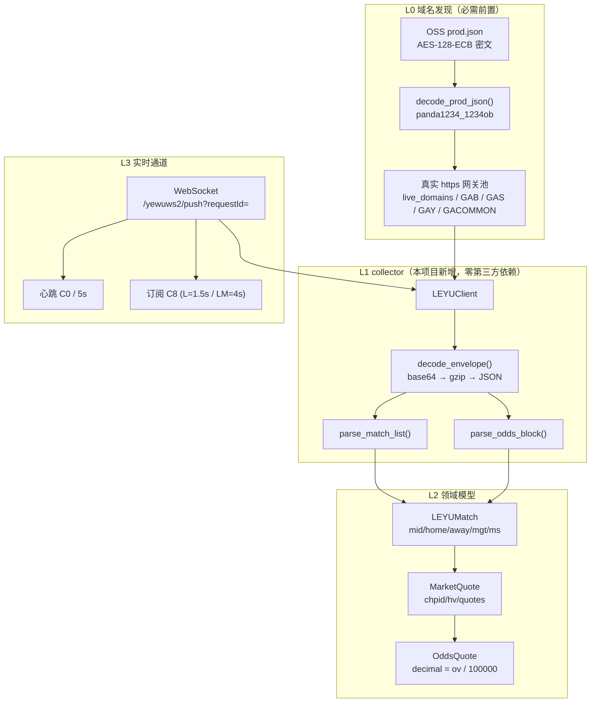
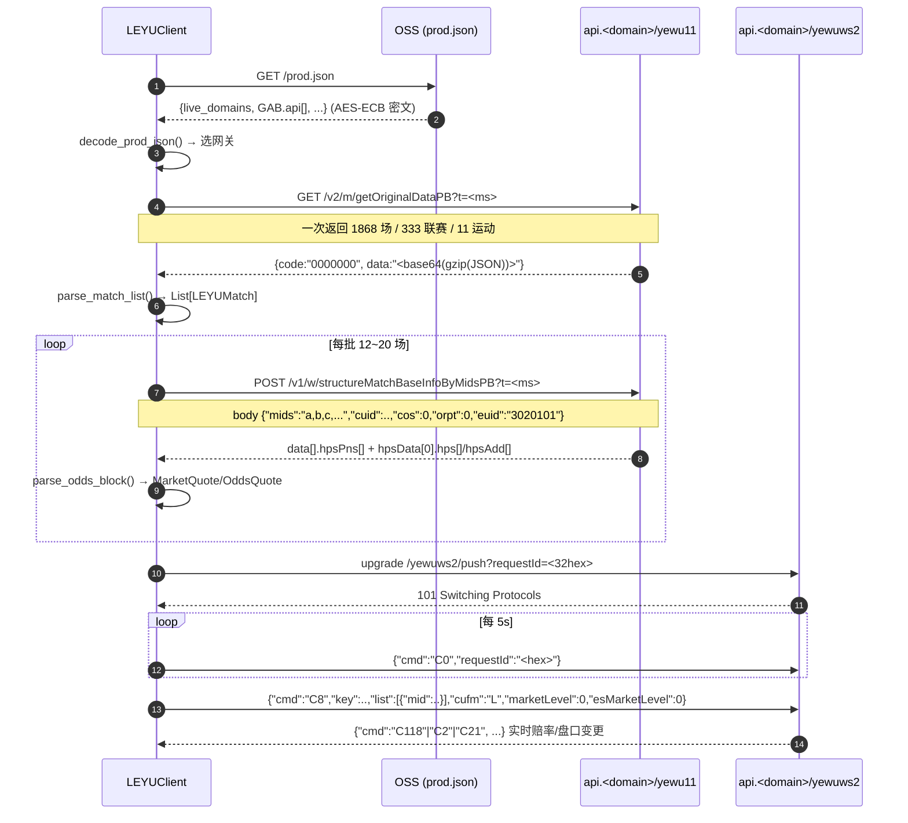
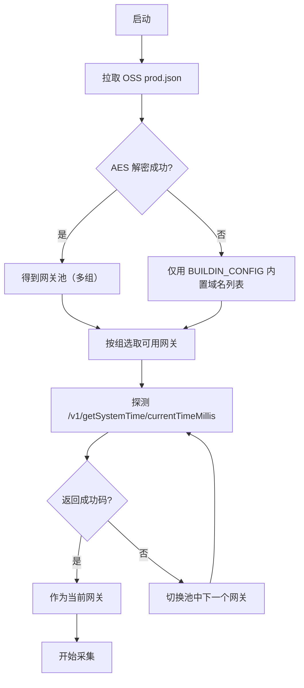
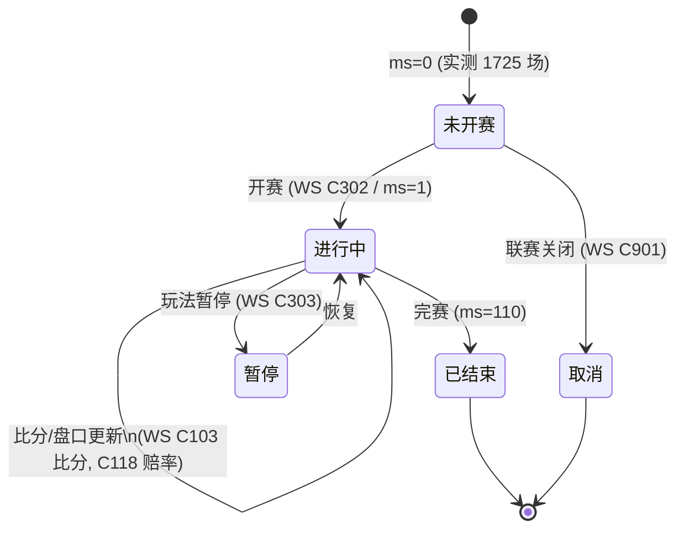

# 乐鱼（leyu）赛事 / 盘口 API 协议还原

> **来源**：仓库根目录 `leyu.saz`（Fiddler Session Archive，898 个会话，2699 个条目，
> 采集进程 `chrome:112208` / `chrome`，抓包时间 2026-09-29 ~ 09-30）。
> **方法**：只读离线解析（`tools/saz_extract.py`）+ 前端 JS 逆向（`WebSocketClient-DBZzJqlx.js`、
> `index-DKYh4SHz.js`、`index-D6PjBGGO.js`）。
> **产出代码**：`collector/leyu_client.py`，用例 `tests/test_leyu_client.py`（40 例）。
> 本文件所有结论均可由上述两者复现；**不含任何猜测字段**。

## 0. 证据分级（AGENTS.md §5.3）

| 级别 | 含义 | 本文档中的对应内容 |
| --- | --- | --- |
| **A** | 一手可核验代码 / 抓包原文 | 端点路径、请求头、响应体结构、`ov` 编码、AES 密钥与密文、WS 指令码、重连/心跳参数 |
| **B** | 由 A 类证据推导 | 字段语义映射（如 `ms` 状态取值分布）、盘口 `hpt` 分类、`cufm` 节流语义 |
| **C** | 社区/经验，未验证 | 未出现——本文档未采用任何 C 类信源 |

**未验证项已显式标注**（见 §7）。

---

## 1. 系统分层与数据流



### 时序：一次完整的"全量赛事 + 实时盘口"



---

## 2. 传输契约（A 类证据）

### 2.1 网关与路径

| 项 | 值 |
| --- | --- |
| 业务前缀 | `/yewu11/`（`API_PREFIX_JOB`）、`/yewu12/`（用户）、`/yewu40/`（埋点）、`/yewurecord/`（注单） |
| WS 前缀 | `/yewuws2/`（`API_PREFIX_WBSOCKET`） |
| 时间戳 | 所有 REST 带 `?t=<毫秒>`（缓存击穿位） |
| 观测到的网关 | `api.vk3whcw.com`、`api.z0ugnx7k.com`、`api-umc.4u9jjgl.com` 等 **36 个**轮换域名 |

### 2.2 固定请求头

```http
lang: zh
request-code: {"panda-bss-source":"2"}
requestId: <32 位 hex 会话令牌>   # 会话期常量；实测即会话凭证，勿泄露
checkId:   pc-<md5>-<cuid>-<毫秒时间戳>                  # 服务端不回校验
Origin:    https://<前端域名>/
Referer:   https://<前端域名>/
User-Agent: Mozilla/5.0 (Windows NT 10.0; Win64; x64) ... Chrome/153.0.0.0 Safari/537.36
```

> ### ⚠️ 关键结论：**不存在请求签名**
>
> 对 sid 347 / 379 / 426 等会话的完整请求头与请求体做了字符串取证，
> `sign` / `signature` / `nonce` / `timestamp` **均不出现在任何请求中**
> （`tests/test_leyu_client.py::test_capture_has_no_signature_params` 断言锁定）。
> `checkId` 只是带时间戳的追踪 ID，服务端响应会回显自己的 `checkId`。
> 因此本客户端**不伪造任何签名**——伪造签名既无必要，也会引入虚假的"绕过"叙述。
>
> ### 🔑 关键结论（2026-09-30 实测）：**`requestId` 就是会话令牌**
>
> 直接 HTTPS 连真实网关做了对照实验：
>
> | 请求头 `requestId` | 上游响应 |
> | --- | --- |
> | 抓包原始值（脱敏，见 §2.2 说明） | `code=0000000`，**成功**，`data` 371 115 字节 |
> | 随机 32 位 hex | `code=0401013`，`账户信息已过期,请重新登录` |
> | 空串 | `code=0401013` 同上 |
>
> 即：**业务端点需要有效会话**，而会话凭证就是 `requestId` 本身
> （抓包请求头中确实**没有** Cookie / Token / Authorization，
> 故 `requestId` 是唯一的会话载体）。
>
> **实践含义**：
> 1. 调用业务端点必须提供**有效会话的 requestId**
>    （环境变量 `LEYU_REQUEST_ID`，或由浏览器登录后取得）；
> 2. 随机生成 `requestId` 只能用于探测连通性（会得到业务层错误，而非网络错误）；
> 3. 本客户端在鉴权失败时抛 `AuthError` 并给出可操作提示，
>    不把「业务层鉴权失败」伪装成成功。

### 2.4 `data` 字段的三种形态（实测）

早期实现假设 `data` 恒为 base64+gzip，导致系统时间接口必报错。实测存在三种：

| 形态 | 端点示例 | 处理 |
| --- | --- | --- |
| `base64(gzip(JSON))` | `getOriginalDataPB` | 解码为 JSON |
| 明文 JSON | `category/getCategoryList` | 直接解析 |
| **明文标量字符串** | `getSystemTime/currentTimeMillis` → `"1790812193894"` | 原样返回 |

判别依据是 **gzip 魔数** `1f 8b`：有魔数则必须解压成功，否则报错
（绝不把损坏的 gzip 静默当明文）；无魔数则走明文路径。

### 2.3 响应封装

```json
{"code":"0000000","data":"H4sIAAAAAAAAA...","msg":"成功","ts":1790785716076}
```

`data` 是 **base64(gzip(UTF-8 JSON))**，**不是 protobuf**（端点名带 `PB` 后缀属历史命名）。
少数端点（`category/getCategoryList`、`eventInfo`、`platformsCount`）直接回明文 JSON。

成功码集合：`{"0000000", "200", "0"}`（新旧版本并存）。

---

## 3. 全量赛程：`GET /yewu11/v2/m/getOriginalDataPB`

**一次调用即拿到全部运动 × 全部联赛 × 全部赛事**（实测 `len(matchsList)=1868`），无需分页。

```http
GET /yewu11/v2/m/getOriginalDataPB?t=<ms>
```

解码后顶层结构：

| 字段 | 实测规模 | 语义 |
| --- | --- | --- |
| `spList[]` | 42 条 | `csid` 运动 ID、`csna` 运动名 |
| `tids_obj[]` | 333 条 | `tid` 联赛 ID、`tn` 联赛名、`tlev` 层级 |
| `matchsList[]` | **1868 条** | 赛事主体 |
| `menus{}` | 11634 键 | 彩种/玩法菜单名映射 |

赛事主体字段（49 个，以下为已用字段）：

| 字段 | 类型 | 语义 | 实测分布 |
| --- | --- | --- | --- |
| `mid` | str | **赛事主键** | 唯一 |
| `csid` | str | 运动 ID | 足球=1（1090 场） |
| `tid` | str | 联赛 ID | 333 个 |
| `mhn` / `man` | str | 主队 / 客队名 | — |
| `mhlu` / `malu` | str[] | 主/客队 logo 相对路径 | — |
| `mgt` | str | 开赛时间（**毫秒** EPOCH） | — |
| `ms` | int | 赛事状态 | 0=未开赛 1725 · 1=进行中 127 · 110=已结束 16 |
| `mst` | str | 即时分钟 | — |
| `mmp` | str | 比赛阶段 | — |
| `msc` | str | 比分/统计序列 `"S1\|2:1,S555\|3:4,…"` | `S1`=比分 `S555`=角球 `S12001`=黄牌 `S11001`=红牌 |
| `mcid` | str | 场次编号 | 如 `周六019`，部分为空 |
| `betAmount` | str | 投注额（小数，字符串） | — |

---

## 4. 实时盘口：`POST /yewu11/v1/w/structureMatchBaseInfoByMidsPB`

```http
POST /yewu11/v1/w/structureMatchBaseInfoByMidsPB?t=<ms>
Content-Type: application/json

{"mids":"5714088,5687515,5687518,...","cuid":"<20位>","cos":0,"orpt":0,"euid":"3020101"}
```

- 抓包中单批 **12 场**；`getMatchBaseInfoByOddsPB` 为单场版（`{"mid":"5714088","mcid":0,"newUser":0}`）。
- 二者共用同一套盘口结构，代码共用 `parse_odds_block()`。

### 4.1 盘口定义 `hpsPns[]`

| 字段 | 语义 | 实测取值 |
| --- | --- | --- |
| `chpid` / `hpid` | 盘口 ID | 1、2、4、17、18、19 … |
| `hpn` | 盘口中文名 | 全场独赢 / 全场让球 / 全场大小 / 上半场独赢 / 上半场让球 / 上半场大小 |
| `hpt` | 盘口类型 | **1=独赢 · 2=让球（亚盘）· 5=大小球** |
| `hmm` | 是否含盘口线 | 1=含（让球/大小），0=不含（独赢） |
| `hsw` | 可选盘口线 | `"1,2,3,4,5,6"` |
| `mct` | 主盘口线 | `1.5` / `1` |
| `hshow` | 是否展示 | `"Yes"` |

### 4.2 赔率 `hpsData[0].hps[]` / `hpsAdd[]`

```jsonc
{ "chpid": "1", "ctsp": "1790785712143",
  "hl": { "hv": "3",                 // 盘口线
          "ol": [                    // ⚠️ 每一项就是一个投注选项
            { "oid": "147728961044955237", "ot": "1", "ov": 3200000,
              "ov2": "-0.90", "on": "主胜", "otd": 47, "ots": "T1", "cds": "N02" } ] } }
```

> `hl` **既可能是 dict 也可能是 list**：主盘口是 dict，附加盘口 `hpsAdd` 是
> "每个盘口线一个元素"的数组。把 `hpsAdd` 的多条线合并会污染水位计算，
> 故实现按 `(chpid, hv)` 拆成多个 `MarketQuote`
> （`tests/…::test_added_lines_split_into_separate_markets` 锁定）。

### 4.3 `ov` 赔率编码（本协议最关键的还原点）

```text
decimal = ov / 100000
```

实证对照（sid 360，厄立特里亚 vs 南非）：

| 选项 | `ov` | 还原十进制 | 佐证 |
| --- | --- | --- | --- |
| 客胜（南非） | `107000` | **1.07** | 强队大热 |
| 平局 | `850000` | **8.50** | — |
| 主胜（厄立特里亚） | `3200000` | **32.00** | 弱队冷门，与 1.07 互斥合理 |

水位校验：`1/1.07 + 1/8.50 + 1/32.00 = 1.0835` → 水位 **8.35%**，落在合理区间；
若误用其他编码（如 `/1000` 或直接当小数），水位会为负或超过 100%，可立即发现。

`ov2` 为马来盘水位，换算：`decimal = 1 + 1/|ov2|`（`ov2<0`）或 `1 + ov2`（`ov2>0`）。
实测两者互相一致（如 `ov=211000` ↔ `ov2=-0.90` → 均为 ≈2.11）。

`cds` 数据源标识（本项目只做记录，不做跨源聚合）：`N01`/`N02` 内部盘、
`A01`/`G01` 聚合盘、`L01-Bet365`、`L02-12Bet`。

---

## 5. 实时推送：`wss://<host>/yewuws2/push?requestId=<32hex>`

### 5.1 连接与保活（JS 常量实证）

| 参数 | 值 | 出处 |
| --- | --- | --- |
| 心跳间隔 | **5 s** | `heartbeatInterval = 1e3*5` |
| 心跳超时 | **8 s** | `heartbeatTimeout = 1e3*8` |
| 重连间隔 | **4 s** | `reconnectInterval = 1e3*4` |
| 心跳报文 | `{"cmd":"C0","requestId":"<hex>"}` | `heartbeatSendData` |

握手仅需 `requestId`；抓包中 sid 324 得到 `101 Switching Protocols`。

> 注意：WS 握手**不做业务鉴权**（因此随机 requestId 也能升级成功），
> 但订阅后能否收到有效推送仍取决于该会话是否有效。
> 不要把「握手成功」误读为「无需凭证」（详见 §2.2 的实测对照表）。

### 5.2 客户端上行指令

| 指令 | 语义 | 报文要点 |
| --- | --- | --- |
| `C00` | 关闭连接 | — |
| `C0` | 心跳 | `requestId` |
| `C01/C03/C04/C05` | 赛事列表 / 3 / 4 / 5 | — |
| **`C8`** | **全站盘口赔率订阅（买量最大）** | `key`、`list[{mid}]`、`cufm`、`marketLevel`、`esMarketLevel`、`oddsType` |
| `C13` | 赛事详情页订阅 | `mid`、`requestId`（抓包中动画页使用） |
| `C4` | 主动推送订阅 | `uuid = <requestId>_Z01` |
| `C2 / C21 / C118` | 单个盘口赔率 | `hid`、`mid` |
| `C3` | 订单 | — |
| `C5 / C51` | 菜单 | — |
| `C6` | 热门直播 | — |
| `C7` | 全局开关 | — |
| `C9` | 联赛状态 | `tid`，`cclose="1"` 关闭 |

### 5.3 服务端下行（`R_` 前缀）

`C101` 赛事状态 · `C102` 赛事事件 · `C103` 比分 · `C104` 盘口状态 · `C105` 玩法状态 ·
`C106` 注单赔率 · `C107` 视频动画 · `C108` 财务日结 · `C110` 玩法计数 · `C112` 分类切换 ·
`C118` 盘口赔率 · `C201/C202` 订单状态/计数 · `C301` 菜单分段 · `C302` 开赛 ·
`C303` 玩法暂停 · `C801` 补时 · `C901` 联赛关闭 · **`C1301`** 动画页赛事增量。

### 5.4 `cufm` 节流（B 类：由 JS 常量推导）

| 值 | 节流 | 客户端行为 |
| --- | --- | --- |
| `L` | **1500 ms** | 请求体参与合并（同 `key` 覆盖），`lodash.throttle(…,1500,{leading,trailing})` |
| `LM` | **4000 ms** | `one_send=1` 强制单发；或 `cufm=="LM"` 的列表推送 |

`cclose="1"` 表示退订。

---

## 6. 域名轮换（可用性前提）

`oss/prod.json` 中所有域名均为 **AES-128-ECB + PKCS7 + Base64** 密文：

| 用途 | 密钥（Utf8 明文） | JS 出处 |
| --- | --- | --- |
| prod.json 域名池 | `panda1234_1234ob` | `DomainState.DECRYPT_KEY` |
| `?api=` URL 参数 | `OBTY20220712OBTY` | `DECRYPT_KEY_URL_API` |

解密结果（`decode_prod_json()`）：

```text
live_domains.pc  → https://prolivepc.dbsportxxx13ky.com
GAB.api[]        → api.9qx9js6.com:17025 / api.vur70no.com:17025 / api.rah492x.com …
GAS.api[]        → api.1p54wbe.com / api.etx7rn0.com …
GACOMMON.api[]   → api.ybj4ra7.com / api.3qttu0s.com …
```



> 抓包中出现的 36 个 `api.*` 域名分属不同组，**同一时刻只需一个可用网关**。

---

## 7. 采集路径对比与选型

| 维度 | **A. REST 快照轮询**（本项目采用） | B. WebSocket 推送 | C. 浏览器渲染抓取 |
| --- | --- | --- | --- |
| 接入层级 | 应用层 JSON API | 应用层 WS 协议 | DOM（Selenium） |
| 延迟表现 | 轮询周期决定（可做到 5~15 s） | **最优**（服务端主动推，秒级） | 差（渲染 + 等待） |
| 盘口完整性 | **完整**（`hpsPns` + `hpsAdd` 全量线） | 增量事件，需自己维护状态 | 仅页面已渲染部分 |
| 稳定性 | 高（幂等 GET/POST） | 中（需处理心跳/重连/断线丢事件） | 低（反爬、前端改版） |
| 维护成本 | **低**（字段已固化 + 40 例回归） | 高（指令码/节流语义多） | 高 |
| 覆盖率 | **1868 场 / 333 联赛 / 11 运动** | 需逐场订阅 | 受渲染滚动限制 |
| 资源占用 | 低（纯 HTTP，零浏览器） | 低 | **高**（每实例一个 Chrome） |
| 依赖风险 | 仅标准库 | 需 WS 客户端 | 需 Docker + Chrome 沙盒 |
| 合规/风控 | 请求量可控，可退避 | 长连接易被风控标记 | 最易触发风控 |

**选型结论**：以 **A（REST）为主**，覆盖全量赛程与全量盘口；
**B（WS）作为可选增量通道**（`ws_subscribe_odds()` 已就绪，接入 WS 运行时即可启用）；
**C 不采用**——本项目已有 `browser_scraper_service` 容器专司浏览器能力，
本协议还原证明主站数据**无需浏览器即可获得**，可直接卸载该层负担。

**敏感性方向**：若把轮询周期从 10 s 改为 3 s 或 60 s，上述"完整性/覆盖率"结论不变
（一次调用即返回全量），仅"延迟表现"列随周期线性变化。

---

## 8. 赛事状态机



---

## 9. 未验证项（诚实披露）

1. **WebSocket 下行报文未在抓包中捕获**——saz 里 sid 324 只有握手（101），
   没有帧内容（Fiddler 对 WS 帧默认不落盘）。指令码语义来自 JS 常量表与页面逻辑，
   属 **B 类**；实际帧结构需真实连一次才能确认。
2. **`getOriginalDataPB` 无分页/无参数**——本抓包中该请求无 query 参数（除 `t`），
   但未验证是否存在服务端条数上限（实测返回 1868 场）。
3. **`cufm` 节流数值**来自 JS 常量（1500/4000 ms），非服务端契约，属 B 类。
4. **`ov` 编码**已用三档赔率（1.07 / 8.50 / 32.00）交叉验证；
   极端值（如 `ov=100000` 即 decimal 1.00）未出现，实现按非法丢弃处理。
5. **合规边界**：本还原仅用于技术与经济学研究（AGENTS.md §0.5）；
   项目不做合规规避，不实现投注/下单链路（`C3`、`yewurecord` 相关端点已识别但未实现）。

---

## 10. 复现命令

```bash
# 1) 结构化导出抓包（只读，不发起任何网络请求）
python3 tools/saz_extract.py leyu.saz

# 2) 语法与用例（宿主机可直跑，零第三方依赖）
python3 -m py_compile collector/leyu_client.py tests/test_leyu_client.py
python3 -m unittest tests.test_leyu_client -v      # 期望 40 passed

# 3) 全量回归
python3 -m unittest discover -s tests -q           # 期望 469 passed
```
