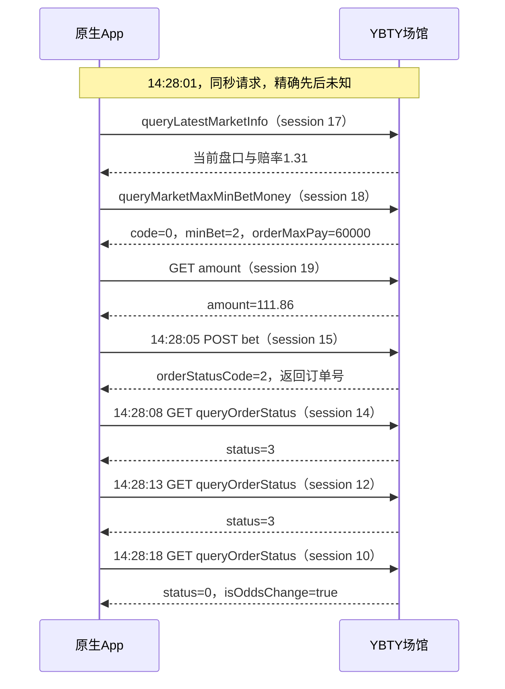

# 乐鱼下注抓包与当前接口实现对照

核验日期：2026-10-10。源码基线：`4ff424c`。
证据等级 **A**：用户提供的 `leyu-detail.zip` 原始 HTTP 抓包和当前可核验源码。
抓包只有一笔单关流程，不代表所有场馆版本、玩法和账户都采用相同契约。
本文不保存账号、令牌、requestId、订单号和完整请求头；未调用线上接口或提交注单。

## 结论

四个主要接口路径一致，但协议实现并非完全一致。已离线复现当前
“场馆未返回该单关的有效投注限额”错误：抓包 session 18 返回成功业务码、
相符选项 ID 和有效限额，响应的 `playId=""`、`type=""` 却不满足当前过滤条件。
因此匹配结果为 `None`，在余额核验和提交之前被阻止。

此前健康状态中的旧来源 `6001 token已过期` 不能证明这笔流程被会话问题阻断。
本次抓包明确证明 App 的前置接口和提交请求均得到成功业务响应。

## 抓包流程

按抓包时间排序，不能按压缩包编号排序。时间为抓包原始显示值，时区未由该字段明确声明。



`queryOrderStatus.status` 与提交回执的 `orderStatusCode` 是不同字段；不能套用同一套枚举。
仅凭这笔抓包不能确认最终状态 `0` 的业务含义，也不能把外层成功码当成已成交。

## 接口与字段对照

以下路径均相对于动态场馆网关。当前实现也使用会话中的网关地址，而非固定抓包域名。

| 项目 | App 抓包 | 当前实现 | 判断 |
| --- | --- | --- | --- |
| 最新盘口 | POST `/yewu13/v1/betOrder/client/queryLatestMarketInfo` | 同一路径和方法 | 一致 |
| 最新盘口请求 | `idList` 含盘口、赛事、选项、玩法 ID，`placeNum=4` | 相同主字段，额外 `chpid`；仅已有元数据时带 `placeNum` | 不完全一致；多余字段影响未证实 |
| 限额接口 | POST `/yewu13/v1/betOrder/client/queryMarketMaxMinBetMoney` | 同一路径和方法 | 一致 |
| 限额请求 | 7 字段：`deviceType,marketId,matchId,matchType,oddsValue,playId,playOptionId` | 同主字段，额外方向、盘口线、最终赔率、串关与比分等字段 | 不完全一致；影响未证实 |
| 限额响应匹配 | `playOptionsId` 相符，`playId=""`，`type=""`，`code=0` | 强制 `playId` 相符且 `type="1"` | **确定不兼容，直接触发 blocked** |
| 限额数值 | `minBet="2"`，`orderMaxPay="60000"` | 解析有限数值并检查投注额处于区间 | 抓包金额2符合当前数值检查 |
| 余额 | GET `/yewu12/api/user/amount?cuid=…&rdm=…` | GET 相同路径，未携带这两个查询参数 | 不完全一致；影响未证实 |
| 提交路径 | POST `/yewu13/v1/betOrder/client/bet` | 同一路径和方法 | 一致 |
| 金额和赔率 | `betAmount="2"`，`oddFinally="1.31"`，`odds="131000"` | 金额格式 `"2.00"`，赔率乘100000 | 数值一致；响应金额`200`与请求`2`尺度不同 |
| 盘口线 | 最新盘口 `marketValue="0.5"`，提交 `marketValue="+0.5"` | 使用模型/盘口中的原始字符串，如 `"0.5"` | 格式差异；是否强制要求加号未证实 |
| acceptOdds | `1` | `2` | 值不一致，含义需核验，不能直接替换 |
| 提交额外字段 | 未出现 `currencyCode,deviceImei,openMiltSingle,scoreBenchmark` | 顶层及详情添加这些字段 | 不完全一致；是否允许额外字段未证实 |
| 展示/赛事元数据 | 提交带 `placeNum,tournamentId,matchInfo,matchName,playName,playOptionName,sportName` | 只有上游提供时才保留 | 当前元数据可能不完整 |
| 首次回执 | 外层成功，详情 `orderStatusCode=2`，有订单号 | 判为 `pending`、`submitted=true` | 首次等待确认的解析一致 |
| 后续确认 | GET `/yewu13/v1/betOrder/queryOrderStatus`，3次轮询 | 未实现该查询流程 | **缺少后续状态确认** |

## 请求头差异

session 15/17/18/19 使用 `x-api-client=android`、`x-api-site=2001`、
`x-api-token`、`requestid`、`lang=zh`、`user-agent=okhttp/4.12.0`。
审计时 `_venue_headers` 使用 `requestId`、`Lang=zh-CN`、浏览器 User-Agent、
`clientVersionType=4`、Origin/Referer，缺少以上三个 `x-api-*` 字段。

HTTP 头名称大小写不构成协议差异，但头值和缺失字段构成差异。
抓包不能单独证明这些字段都必填；现有系统已取得限额列表，故不能据此宣称鉴权完全失败。

## 确定性离线复现

执行：

```bash
./scripts/cpu-limited.sh run -- python3 tools/audit_leyu_bet_capture.py leyu-detail.zip
```

脚本只读取 zip，通过替换 `_venue_request` 返回抓包响应，不调用网络，
也不调用 `submit_bet`。为独立定位限额问题，将抓包提交 DTO 的 `+0.5`
归一化为最新盘口响应的 `0.5`，并补充当前实现所需的空 `scoreBenchmark`。

修复前结果：`option_id_matches=true`、`business_code_succeeds=true`、
`stake_within_bounds=true`，但 `legacy_play_id_matches=false`、`legacy_type_passes=false`。
因此报错“场馆未返回该单关的有效投注限额”。这些 legacy 字段仅用于对照旧过滤规则。

当前 `tests/test_leyu_account.py` 的模拟限额响应使用非空 `playId`
且省略 `type`（被默认成`1`），没有覆盖抓包中的两个显式空字段，因此此前测试通过。

## 后续修复范围与边界

1. 限额解析应依据真实契约识别选项，并区分空字段与明确矛盾字段；仍须检查
   业务码、唯一匹配及有效数值，不能用默认限额绕过。
2. 请求头和请求 DTO 应逐项对齐并用脱敏离线夹具验证；抓包未证明的字段语义
   （尤其 `acceptOdds`、金额单位和状态枚举）需另外确认。
3. 对已返回订单号的 pending 记录补充后续查询设计；查询失败或状态未知时
   保留未知状态，不能自动重发原订单。
4. 行情版本变动是另一个独立拦截原因；本次抓包不能证明应该放宽该检查。

## 抓包核验后的代码修复

用户随后要求修复代码。本次修改 `prepare_bet`：限额请求收敛为 session 18
的7个字段；响应按 `playOptionsId` 唯一匹配，允许可选回显 `playId/type`
为空或缺失，有非空值时仍检查矛盾。业务码必须明确成功，重复匹配、无匹配、
失败/缺失业务码、无效数值、金额越界均在读取余额前阻止。

修复后同一离线脚本输出 `outcome="passed"`，调用流程到达余额检查。
`network_requests=0`、`submit_calls=0`。新增回归用例覆盖抓包空字段、
矛盾字段、失败/缺失业务码、重复记录、NaN/无限大和金额越界。

请求头、`acceptOdds` 和后续订单状态枚举未在本次限额修复中改变；
后续确认查询仍是未实现的独立事项。未更改配置或重启运行容器。

## 注单中文名称修复

后续排查新自动注单的英文球队/联赛名称，确认 App 捕获请求使用 `lang=zh`，
当前语言值已改为 `Lang=zh` 并增加中文 `Accept-Language`。另外，自动执行器
从实时赛事信息补齐中文 `matchInfo/matchName/sportName/playName/playOptionName`，
此前行情 DTO 只带投注编号，没有这些名称，直接依赖了场馆的默认展示。
回归测试验证中文名称与原始投注选项、编号、盘口线同时保留。

对既有自动注单使用 `Lang=zh` 做只读查询，名字仍为英文；历史记录不会随语言头
改动而回写，因此本次补充请求展示字段只影响新订单。没有发送测试资金订单。
