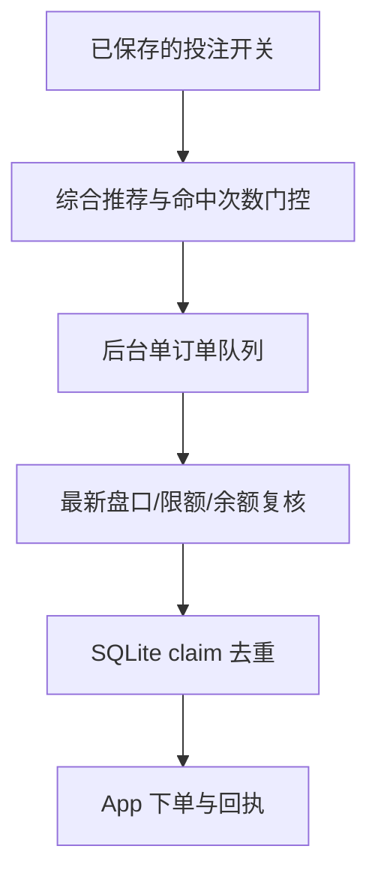

# 乐鱼体育下注适配边界

当前 App 逆向结果确认 YBTY 单关下注端点为：

```text
POST /yewu13/v1/betOrder/client/bet
```

请求模型是 Android 客户端的 `OBBetRequest`。单关请求包含一个
`seriesOrders` 元素，里面的 `orderDetailList` 至少需要以下来自当前盘口的
标识：`matchId`、`marketId`、`playId`、`playOptions`、`playOptionsId`、
`oddFinally`。赔率必须使用提交前重新读取的最终值，不能使用历史快照中的旧赔率。


服务端提供 `POST /api/v1/bet/draft`（只生成草稿）和后台执行器。执行器使用同一
App 会话调用 `queryLatestMarketInfo`、`queryMarketMaxMinBetMoney`、余额接口，随后调用
`POST /yewu13/v1/betOrder/client/bet`。提交意图先写入 `betting-orders.sqlite3`，
唯一键由账号、赛事、玩法、盘口线和选项组成；超时或缺少唯一订单号标记为未知，禁止自动重发。
`POST /api/v1/bet/preview` 只计算金额与门控结果。

赔率、行情版本、置信度、金额与上游盘口/选项 ID 不参与订单唯一键。同一账号对同一
赛事、玩法、盘口线、方向最多自动发送一次，即使赔率变化、决策刷新、执行器重启，
或者方向先改变再回到原方向，也不会再次发送。首次查重在账户接口调用前完成；最终
查重和写入 `sending` 在 SQLite `BEGIN IMMEDIATE` 事务内完成，提交事务后才调用场馆。
两个执行器使用不同价格同时处理同一推荐，也只能产生一个发送意图。

旧版本曾错误地把赔率计入唯一键。升级首次执行时会在事务中为所有旧记录补充
`selection_key`，保留原始订单号、回执、时间和 `identity`，包括此前已产生的重复记录。
旧回执没有保存账号信息，因此这些记录的 `account_key` 保持为空，同一盘口方向会保守地
拦截所有账号的新提交；新记录使用账号哈希区分账号。历史记录无从识别时阻止发送，
并回滚迁移，不清空订单库。明确拒单、待确认、发送中和结果未知也都占用去重记录。

投注配置默认关闭。对于旧配置中已开启的计划开关，草稿仍要求：来源必须是
`economic_ensemble` 综合推荐（单一算法结果会被拒绝）、比赛进行中、盘口开启、
历史命中次数达到阈值、盘口原始标识完整，并采用固定值或“综合置信度 × 固定值”
计算额度。单元测试中的固定 2 元只验证草稿金额，不表示真实成交。

## 当前限制

执行器只支持真实足球的经济学综合推荐和单关订单；不执行虚拟赛事、单一算法结果、过期推荐或历史赔率。订单执行依赖运维注入的有效 App 会话和体育场馆余额。系统无法撤销已接受订单，未知回执必须人工到 App 注单页核对。

## 开关与实际能力的诊断

设置中的 `betting_enabled` 是后台执行器的总开关。可核验的代码证据（A级）：
`RuntimeSettings` 保存开关并在提交前再次校验；`BettingExecutor` 只接收服务端综合推荐；
`LeyuAccountClient.prepare_bet` 复核最新盘口、限额和余额；`submit_bet` 严格解析唯一订单回执。



| 场景 | API 状态 | 界面行为 |
| --- | --- | --- |
| 默认关闭 | `configured_enabled=false` | 队列不提交订单，设置页显示关闭 |
| 开启但执行器未启动 | `configured_enabled=true`，`execution_enabled=false` | 继续显示未启动原因 |
| 开启且执行器就绪 | `execution_enabled=true` | 满足全部门控后提交单关订单 |
| 回执明确拒单 | `status=rejected` | 写入最近执行状态，不自动重试 |
| 回执未知 | `status=unknown` | 停止重发，要求到 App 注单页核对 |

`GET/POST /api/v1/settings` 的 `capabilities.betting` 报告保存配置、执行器就绪状态和最近订单；
`GET /api/v1/bet/status` 可单独读取。预览和草稿响应的 `execution` 使用同一能力信息，
`allowed` 仅表示计划门控结果。测试使用模拟场馆接口，没有发送真实资金订单。
