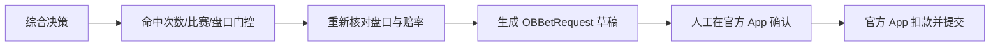

# 乐鱼体育下注适配边界

当前 App 逆向结果确认 YBTY 单关下注端点为：

```text
POST /yewu13/v1/betOrder/client/bet
```

请求模型是 Android 客户端的 `OBBetRequest`。单关请求包含一个
`seriesOrders` 元素，里面的 `orderDetailList` 至少需要以下来自当前盘口的
标识：`matchId`、`marketId`、`playId`、`playOptions`、`playOptionsId`、
`oddFinally`。赔率必须使用提交前重新读取的最终值，不能使用历史快照中的旧赔率。



服务端提供 `POST /api/v1/bet/draft`，只返回可核对的请求草稿和
`submission=manual_only` 标记。它不会访问扣款端点，也不会保存账号 token 或密码。
`POST /api/v1/bet/preview` 只计算金额与门控结果。

投注配置默认关闭。即使在设置中打开，草稿仍要求：来源必须是
`economic_ensemble` 综合推荐（单一算法结果会被拒绝）、比赛进行中、盘口开启、
历史命中次数达到阈值、盘口原始标识完整，并采用固定值或“综合置信度 × 固定值”
计算额度。当前真实测试配置使用固定 2 元，但该值仍由运行时设置控制。

## 当前限制

系统不提供后台自动提交真实资金订单的接口。真实订单由官方 App 的最终确认页提交；这样可以在提交前重新确认比赛、盘口、最终赔率、金额和余额，避免赔率变化、盘口关闭或重复请求造成不可逆扣款。
