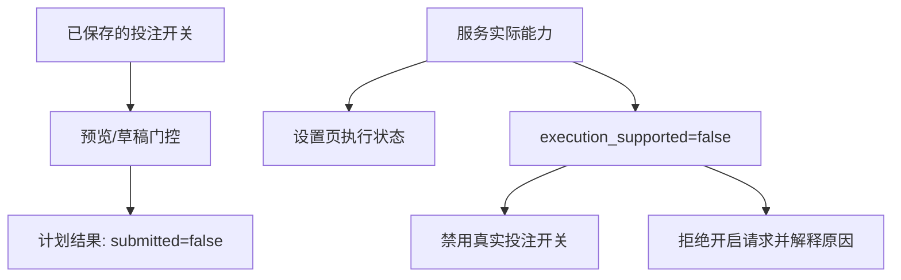

# 乐鱼体育下注适配边界

当前 App 逆向结果确认 YBTY 单关下注端点为：

```text
POST /yewu13/v1/betOrder/client/bet
```

请求模型是 Android 客户端的 `OBBetRequest`。单关请求包含一个
`seriesOrders` 元素，里面的 `orderDetailList` 至少需要以下来自当前盘口的
标识：`matchId`、`marketId`、`playId`、`playOptions`、`playOptionsId`、
`oddFinally`。赔率必须使用提交前重新读取的最终值，不能使用历史快照中的旧赔率。


服务端提供 `POST /api/v1/bet/draft`，只返回可核对的请求草稿和
`submission=manual_only` 标记。它不会访问扣款端点，也不会保存账号 token 或密码。
`POST /api/v1/bet/preview` 只计算金额与门控结果。

投注配置默认关闭。对于旧配置中已开启的计划开关，草稿仍要求：来源必须是
`economic_ensemble` 综合推荐（单一算法结果会被拒绝）、比赛进行中、盘口开启、
历史命中次数达到阈值、盘口原始标识完整，并采用固定值或“综合置信度 × 固定值”
计算额度。单元测试中的固定 2 元只验证草稿金额，不表示真实成交。

## 当前限制

系统不提供后台自动提交真实资金订单的接口。真实订单由官方 App 的最终确认页提交；这样可以在提交前重新确认比赛、盘口、最终赔率、金额和余额，避免赔率变化、盘口关闭或重复请求造成不可逆扣款。

## 开关与实际能力的诊断

设置中的 `betting_enabled` 是计划门控，开启后不会产生实际订单。可核验的代码证据（A级）：
`RuntimeSettings` 只保存配置；`plan_bet` 返回 `executable=false`；`draft_ybty_bet`
返回 `submission=manual_only`；API 只有预览和草稿路由，实时分析没有下单调用。



| 场景 | API 状态 | 界面行为 |
| --- | --- | --- |
| 默认关闭 | `configured_enabled=false`，执行未启用 | 禁用真实投注开关，显示不支持说明 |
| 从旧文件恢复开启 | `configured_enabled=true`，执行仍未启用 | 开关不显示为执行中，说明旧配置不代表下单 |
| 请求开启 `betting_enabled` | HTTP 400，配置与版本不变 | 显示没有下单执行器的具体原因 |
| 保存其他设置 | 能力信息随响应返回 | 保存成功提示与投注能力说明同时保留 |
| 预览或草稿被拒绝 | `allowed=false`，`submitted=false` | 返回门控原因，同时说明执行不支持 |

`GET/POST /api/v1/settings` 的 `capabilities.betting` 将保存的配置与实际能力分开报告。
预览和草稿响应的 `execution` 使用同一能力信息，`allowed` 仅表示计划门控结果。
本次验证范围为离线 API 与浏览器模拟响应，没有验证或发送真实资金订单。
