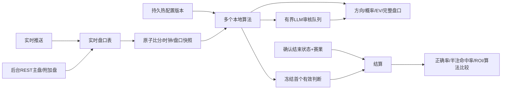

# 实时盘口、决策验证与热配置（TASK-30）

## 实施 TODO（编码前制定）

- [x] #30 REST 主/附加盘口补入实时表；保留半场、原始未知类型、不完整组，分别标记完整性和可估值状态。
- [x] #30 删除列表接口强制每类一线/48线截断；前端按全场/半场/其他分组展开，保留数值分析密度。
- [x] #30 实现两种可对比算法：当前市场拟合 Poisson、锚定市场并按剩余时间衰减的 Poisson；去水支持比例法和 power 法。
- [x] #31 首次有效方向及首次达标建议分别冻结到独立决策账本（每场、算法、市场族、记录类型一条），后续刷新不覆盖、不重复增加样本；保存当时比分、时钟、赔率、参数版本。
- [x] #31 以明确结束证据和最终比分自动判赢/输/半赢/半输/走水；独赢方向正确率与亚洲盘半注命中率分列，按算法/版本分组。
- [x] #31 历史补比分直接查待结算 ID，避免当前赛程不含历史比赛时永远无结论；缺失证据的旧记录不伪造赛果。
- [x] #32 原子校验/落盘/换配置版本；即时重排当前赛事计算；旧版本计算和 LLM 回复不得发布到新版本。
- [x] #32 设置页：算法、多算法主显示选择、去水、时效、EV/概率门槛、锚点周期、LLM地址/模型/预算/密钥；密钥只写不读。
- [x] #32 LLM 在独立有界工作线程审核当时的判断，不阻塞秒级快路径；超时/错误/过时回复透明标记。
- [x] 正常/异常/并发/重启测试、全量 unittest/mypy/ruff、浏览器三页交互与热改行为验证。
- [x] 限核构建部署至8001/3003、更新持久部署指针、校验镜像/静态资源哈希、提交依赖 PR（前置 #29 尚未合入）。

## 数据与决策边界

盘口展示保留上游所有可读报价，未知市场使用原始编号和选项标签。不完整/过期/停盘盘口不能参加概率拟合。已核验的全场 HAD、OU 用于当前模型；AH 滚球结算规则、加时和半场模型暂未核验，不制造估值。两个 Poisson 算法均为市场基准，并无已证明的独立预测优势。

可计算时输出最可能的独赢方向以及主大小球线方向，称为“模拟判断”。达到概率及EV门槛的方向标为“模拟建议”；没有达标项仍输出方向用于前瞻验证。账本冻结每场/算法/HAD或OU的首个有效判断；首次达标建议使用独立身份，历史页单独切换。因此任意刷屏或改门槛都不会重复刷高同类命中率。不同算法分别计分，总样本并不代表独立比赛数。不会发送投注。

## 热更新契约

POST `/api/v1/settings` 携带当前 version 和局部 settings。先严格校验类型/范围/主算法/LLM地址，再原子落盘（0600权限）并换不可变对象；冲突返回409。保存失败不改变内存。每个计算捕获同一份配置，发布前复查版本。已冻结历史保持原版本。恢复文件在后台采集开始前加载。LLM 密钥由环境或设置文件提供，GET只返回 has_key；禁用不触发请求，启用后在有界队列异步运行。

## 验证口径

| 指标 | 分子 | 分母 | 排除 |
| --- | --- | --- | --- |
| 独赢方向正确率 | HAD全赢 | HAD全赢+全输 | 待确认、无法结算、其他市场 |
| 半注命中率 | 全赢+0.5赢半 | 赢权重+输权重 | 走水、待确认、void |
| 模拟ROI | 冻结赔率单位本金净收益 | 已结算判断的单位本金 | 待确认、void |

证据等级A：本仓库可核验代码、单元测试及生产接口；没有把模型概率或公开基准正确率当作本系统已实现战绩。

## 2026-10-09 验证记录（实测A）

| 验证 | 命令 / 方法 | 结果 |
| --- | --- | --- |
| Python语法 | `python3 -m py_compile` 49个业务/工具/报告脚本 | exit 0 |
| 基础依赖 | 限制2核的 `python:3.12-slim` 内安装并 import requests/bs4 | exit 0 |
| 全量用例 | `./scripts/cpu-limited.sh run -- python3 -m unittest discover -s tests -q` | 1104 tests，11 skipped，exit 0 |
| 类型与lint | 限制2核容器内 `python -m mypy` / `python -m ruff check .` | 59 files，0错误；All checks passed，exit 0 |
| JS语法 | `node --check web/console/workbench.js` / 浏览器回归脚本 | exit 0 |
| 浏览器 | playwright-cli `run-code --filename tests/browser/workbench_flows.js`，18025静态预览，浏览器路由专用测试fixture | Default/Loading/Empty/Error/Edge-Case，三页、参数保存/拒绝、手机和安全DOM断言通过，exit 0 |
| 限核构建 | `./scripts/cpu-limited.sh build analytics-api` | exit 0，构建上下文1.05MB（此前约3.3GB） |
| 生产部署 | compose + `output/deploy/task30-live-settings.compose.json`，8001 API / 3003 UI | exit 0，三容器healthy，NanoCpus均2000000000 |
| 生产热修改 | API修改EV .02→.025→.02 | v1→v2→v3，新结果v3；0600持久配置；GET无密钥字段 |
| 发布一致性 | 4个关键Python文件及3个静态资源 SHA-256 对照 | 全部一致 |
| 秒级计算 | 生产事件→结果延迟分位数（该时段样本） | P50 165.464ms、P95 225.480ms、P99 447.299ms，非长期SLA |
| 真实留痕 | `/ledger/history?cohort=prospective&type=real` | 首场4条、两算法各2条，0已结算，等待确认赛果；旧70条真实比赛建议暂无可核验比分 |

生产静态资源已冻结；`output/deploy/current.compose.json` 指向本次版本。关键截图仅本地运行产物：`output/playwright/task30-production-{live,detail,history,settings}.png`。预览fixture未写入生产API或账本。LLM异步请求、过期版本隔离、错误/超时由单测验证；生产默认保持审核关闭，可在设置页启用。没有把新产生的概率包装成正确率，也没有补造旧比赛终场。
