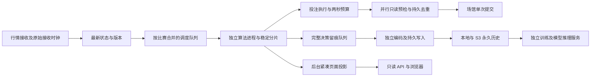

# TASK-38：最新盘口至投注提交的两秒链路

实施基线：TASK-37 诊断与 `f5b5b8a` 的生产修复。用户要求从系统获取最新盘口至决策下注不超过两秒。

## 执行契约

用户目标是获取最新盘口至决策下注的整体时间不超过两秒。实现同时统计两种终点：发送扣款请求，以及取得场馆回执；场馆返回待确认时，不能计为已接受。起点是所选报价在本系统的实际接收时刻，保留上游原始报价时间。发送前的两秒绝对期限是执行约束，不能等同于整条链路已通过验收。两个时间口径均展示，期限拦截不得作为达标提交，也不得通过改写接收时间、跳过门控、重复发送实现达标。

无法取得新报价、场馆预检超时、会话未就绪、配置不允许或推荐已撤回时，记录明确状态并等待新行情重新计算。超时发生在扣款请求发送之后，继续按回执未知处理，禁止自动重发。

## 开发 TODO

全部开发完成后冻结代码，再执行回归与性能验证。

| 任务 | 状态 | 交付与检查 |
| --- | --- | --- |
| T1：报价接收时钟、分段耗时、两秒预算 | 已开发并回归通过 | 不混淆最早触发、最新输入、选中报价和原始来源时间 |
| T2：算法进程隔离、稳定比赛分片、紧凑训练输入 | 已开发并回归通过 | 同场顺序、配置版本、全部盘口线和决策时间边界 |
| T3：独立 replay 编码写入、初判批量提交、快照索引批量更新 | 已开发并回归通过 | 完整历史、不丢记录、失败重试和正常停机刷新 |
| T4：场馆连接复用、只读并行预检、后台会话预热 | 已开发并回归通过 | 保留余额、限额、赔率、赛况与发送意图校验 |
| T5：后台页面投影与链路状态展示 | 已开发并回归通过 | 多个浏览器不触发同步计算或全量扫描 |
| T6：正常、改价、超时、崩溃、重复提交回归 | 已通过 | 模拟场馆，不手工提交真实投注 |
| T7：构建、更新容器与稳定运行测量 | 已部署并完成容量对照；严格两秒未通过 | 两进程稳定配置、两套完整窗口、命令及退出码、未执行状态与实际延迟 |

## 进程与数据流



走势、赛况、所有已发布决策和实际结果保持完整持久化。实时算法不支持的 RAW 盘口仍完整采集与归档，不为它们重复构建算法训练前缀；支持的所有盘口线继续独立计算。训练输入同时按源时间与首次观测时间过滤，不能异步读取决策之后的数据替代原输入。

## 验证记录

证据等级 **A**：本仓库代码、标准库测试、模拟场馆及生产接口测量。数值均为测量值；模拟场馆的延迟由命名常量控制，不能替代真实场馆响应。

开发后完成以下验证，全部退出码 **0**：

```bash
python3 -m compileall -q api collector core service store tests tools
node --check web/console/workbench.js
bash -n scripts/cpu-limited.sh
docker compose -f docker/docker-compose.yml config --quiet
git diff --check
./scripts/cpu-limited.sh run -- /usr/bin/python3 -m unittest discover -s tests -q
docker run --rm --cpus=2 -v /root/ai_football:/w -w /w ai_football-analytics-api:latest python -m unittest discover -s tests -q
docker run --rm --cpus=2 -v /root/ai_football:/w -w /w python:3.12-slim sh -c 'pip install -q mypy ruff && python -m mypy && python -m ruff check .'
docker run --rm --cpus=2 -v /root/ai_football:/w -w /w ai_football-analytics-api:latest python -c 'import redis,boto3,orjson,api.app,collector.http_transport,service.live_workers; print("runtime imports OK")'
LIVE_COMPUTE_PROCESSES=2 LEYU_FAST_BETTING=1 PYTHONPATH=. ./scripts/cpu-limited.sh run -- /usr/bin/python3 tools/live_latency_benchmark.py --matches 24 --output /tmp/task38-benchmark-final.json
```

宿主回归：1342 用例，53.879s，跳过 10 项；Python 3.12 容器：1342 用例，91.342s，跳过 11 项。mypy 检查 84 文件，ruff 无错误。宿主当前 `/usr/bin/python3` 为 3.13，与历史 AGENTS 基线不同；生产仍使用 Python 3.12。宿主未安装依赖，静态工具只在临时容器安装。

首次全量回归发现并修正增量导入问题：仅跳过导入扫描会把其他写入者追加的历史修订越过。现在本进程写入前只检查活跃台账的导入偏移，公共恢复读取仍检查全部文件；历史修订不会丢失。首次静态检查的类型错误已修正，未把失败轮次计为通过。追加回归一度发现等待时间会返回负值，现统一钳制为零；最终两套全量回归均通过。

| 模拟场馆负载 | 结果 |
| --- | --- |
| 每轮 24 场同时更新，3 轮，每场 200 个 RAW 报价及 HAD/OU 盘口，真实调度器及五种算法 | 72 次完整决策、72 次成功提交 |
| 只读预检 / 回执模拟等待 | 80ms / 40ms |
| 接收至决策 | P95 248.609ms，最大 262.383ms |
| 所选盘口接收至提交 | P95 1278.27ms，最大 1331.694ms |
| 所选盘口接收至回执 | P95 1318.393ms，最大 1371.79ms |
| 两秒内提交 / 超时拦截 | 72 / 0 |

上述模拟不进行真实账户请求或扣款。原始结构化结果在 `docs/architecture/data/TASK-38-benchmark.json`。场馆等待增大、同时买入数增多会消耗预算；超时会单独报告并等待新行情，不能当成达标成功。实际场馆接受延迟仍需单独实测。

## 实现细节与边界

- 两个持久 spawn 算法进程按比赛固定分片，调度每分片一场，各分片独立连续取下一场，替代串行 64 场、逐场主动等待及批次屏障。真实约 120 场负载下仍有排队，因此追加四进程容量对照；完整窗口出现 22 次计算错误/工作进程恢复，最终恢复默认两个进程。Compose 可通过 `LIVE_COMPUTE_PROCESSES` 覆盖，当前实现最多四个，扩缩容需重启以重新建立比赛锚点及分片。仅等待空闲分片的待办；所有待办所属分片忙碌时通过事件等待，避免零间隔空转抢占主进程 GIL。版本改变的结果不发布；坏进程恢复不在 API 进程里计算。
- 相同赔率/比分的拟合结果采用 8192 项有界缓存，赔率或比分变化自动重新拟合；共享概率分布、半场分布及盘口收益只计算一次。同一盘口的去水共识只计算一次，各算法仍逐盘口线计算。RAW 当前报价、滚动走势及原始存储保留，避免为不支持的 RAW 玩法重复复制训练前缀。
- 完整 replay 的不可变字节记录在算法子进程冻结，主进程仅附加发布元数据；完整记录在写入子进程还原后编码/压缩/fsync，避免主进程反复 pickle 整份数据。实时 IPC 只展开受支持的盘口、每算法预测及推荐结果；大候选数组保持在完整冻结记录内，详情可按该次计算还原全部算法输出。所有 RAW 盘口仍在完整冻结记录内保存；滚动走势作为另一个不展开的详情缓存字节块传输，原始完整走势继续由 TrendStore 永久归档，避免每次决策重复存储 RAW 的四十点窗口。详情请求按该次计算对应冻结缓存解码，不读取未来行情，也不持有计算锁解码。初判台账采用单批 fsync/SQLite 提交，并由另一后台线程投影。首次历史导入后，执行证据只检查活跃台账追加修订；普通历史/重新结算查询继续全量核对，避免每笔预检遍历历史文件目录。投注等待对应 publication_id 的完整 replay 持久确认。持久化进程响应超时保留在途写入，下一次先读取原确认，不直接终止写到一半的记录。
- 会话登录在后台预热，HTTP 连接复用；最新盘口、余额与限额三项只读请求并行，回复全部核验后才允许发送；原始赔率在容差内发生最小变化时重新读取该赔率对应的限额。最多四项预检并行，但扣款请求串行，每次提交前重新验证最新推荐、比分、盘口及配置。
- 页面工作台和推荐数据由单一后台发布者整理。GET 直接读取不可变缓存，首次返回明确加载态；失败保留上次结果并标注年龄。重启用 live-book JSON 缓存通过可选的 orjson 编码器加速，标准库模式仍可运行。缓存保留原始标识与价格精度，原始走势、事件和严格 JSONL 留痕的持久协议不变；编码失败保留上一份原子缓存。后台投影共享已发布缓存，避免多次 deepcopy 全板；列表先筛选可展示盘口再构造公开字段，详情与留痕仍保留所有 RAW 盘口。浏览器不参与决策或下单调度。
- 2s 的绝对时限贯穿预检、持久确认和发送，场馆回执使用独立网络等待时限，避免把已按时发送但尚未回执的请求误标为超时未知；不因新决策或重试重置旧盘口时钟。恢复报价没有新的接收时钟，必须等待新行情。预检预算耗尽与截止时间到期不启动旧报价重算定时器；冷却期结束仍等待严格更新的报价，且执行入口处理新报价与旧请求失败的竞态。发送后未知结果始终按持久意图去重，不自动补发。

## 部署与生产测量

本轮通过 `scripts/cpu-limited.sh build analytics-api model-worker archive-worker` 构建，分两步用 `docker compose -f docker/docker-compose.yml up -d --no-build analytics-api model-worker` 与 `... archive-worker` 更新容器；实际退出码均为 0。测试/构建受限至两个核，运行期遵循用户已授权的解除 CPU 配额要求，`NanoCpus=0`、API 的 `cpu.max=max 100000`。API、模型、控制台与 Redis 健康；归档服务运行中，它没有配置 healthcheck。部署后核验 12 个关键源码 SHA256 与容器一致。

只读采样并行请求本机 `:3003/api/v1/workbench?type=real`、`recommendations?type=real`、`account` 与 `bet/status`，每两秒一轮。公开域名以 curl 每四秒请求 workbench。只观察用户原有自动流程，不手工触发扣款；另外只读 SQLite 统计本次部署后持久订单状态。生产测量是短窗口，不能替代 TASK-37 提出的至少 30 分钟长期验收。

增加缓存编码前的独立六分钟窗口存于 `data/TASK-38-production-before-checkpoint.json`：720 个本机 GET、90 个公开域名 GET 均 200。12 次已发送请求全部在两秒内，发送 P95/最大 1874.289ms；165 次期限拦截不计为成功，回执 P95/最大 2267.842ms。真实决策滚动 P95 曾为 990.193–2323.444ms，末次窗口 P95 为 2053.015ms；因此该版本没有通过严格的全部两秒验收。此处订单计数来自接口采样时刻，之后订单状态可能继续变化，不能与稍晚的 SQLite 数量混算。

缓存编码单独用实际 52469 行、15484128 字节的 payload，在 Python 3.12 新镜像中各执行 5 次，并逐次检查 `json.loads(encoded)==payload`。标准库平均 179.631ms，orjson 3.13.0 平均 24.644ms，约快 7.3 倍；结果在 `data/TASK-38-checkpoint.json`。这是编码测量，包含构造缓存及整个比赛链路的时间另计。

最终业务源码的完整稳定窗口为 358.768s；四进程追加对照窗口为 358.195s。数据分别在 `data/TASK-38-production-two-workers.json`、`data/TASK-38-production-four-workers.json`。最终恢复两进程，`data/TASK-38-production.json` 保存采用配置的完整观测，并附恢复部署后的只读健康核验。稳定窗口不包含容器替换的启动间隙。

| 生产指标 | 两进程（最终采用） | 四进程（容量试验，已恢复） |
| --- | --- | --- |
| 本机 GET / 域名 GET | 720 / 90，全部 200 | 720 / 90，全部 200 |
| 工作台 / 推荐 GET P95 | 473.595 / 486.974ms | 654.604 / 666.811ms |
| 真实输入至决策，末次最近 2048 条 P95 / P99 | 2551.751 / 9005.799ms | 1940.115 / 7065.902ms |
| 首分钟后 149 个真实滚动窗口的 P95 范围 | 1249.716–2551.751ms | 840.503–1940.115ms |
| 实际发送 / 两秒内发送 | 8 / 8 | 4 / 4 |
| 所选报价接收至发送 P95 / 最大 | 1950.942 / 1950.942ms | 1706.536 / 1706.536ms |
| 所选报价接收至回执 P95 / 最大 | 2320.749 / 2320.749ms | 2272.039 / 2272.039ms |
| 期限拦截次数（不能计为成功） | 111 | 99 |
| 部署后持久订单状态（只读 SQLite 后续时刻） | 6 待确认，2 拒绝 | 1 待确认，3 拒绝 |
| 计算错误 / 工作进程恢复计数 | 0 / 0 | 22 / 22 |
| replay 待写 / 丢弃，末次 | 1 / 0 | 1 / 0 |

四进程在模拟中更快，真实窗口末段出现工作进程一秒调用预算耗尽及恢复，不能保留这一配置或只截取前段无错误的数据。两进程、四进程观测并非同一批比赛的受控实验，表中差异不证明单个参数的独立因果贡献。真实输入年龄长尾还包含用较早输入重算的决策，原始时钟未清零；最早触发至决策也存在超过两秒的样本，不能把所有长尾都解释为行情静默。

**验收结论：本轮技术优化已部署，严格“每条盘口至决策下注完成 ≤2s”未通过。** 72 次模拟接受及 8 次真实发送都在预算内，不能替代全部决策的成功执行率；111 次期限拦截没有发单，6 次待确认不能计为接受。一条关联实单从报价接收到发送为 1950.942ms、到回执为 2320.749ms，已经超过整体要求。当前可控的剩余瓶颈包括调度长尾以及仍与 API 共享主进程的行情、执行与 IPC；提高进程数并不能消除这些成本。场馆预检和回执还受上游等待影响，必须继续保留各自计时，不能通过放宽截止时间解决。后续严格验收需要代表负载的长期关联样本及上游响应能力，当前只有短窗口证据。

四进程使用同一离线模拟负载：72 次决策、72 次接受、72 次两秒内发送、0 次期限拦截。决策 P95 150.707ms、最大 156.801ms；发送 P95 1178.85ms、最大 1219.163ms；回执 P95 1218.947ms、最大 1259.303ms。命令 `LIVE_COMPUTE_PROCESSES=4 LEYU_FAST_BETTING=1 PYTHONPATH=. ./scripts/cpu-limited.sh run -- /usr/bin/python3 tools/live_latency_benchmark.py --matches 24 --output /tmp/task38-benchmark-four-workers.json` 实际退出码 0，结果见 `data/TASK-38-benchmark-four-workers.json`。配置变更后的 Compose 校验及 `docker compose -f docker/docker-compose.yml up -d --no-build analytics-api` 均退出码 0；业务源码保持冻结，无新增业务修改。

浏览器用 Playwright CLI 验证工作台与推荐买入页面正常加载，并展示中文状态、实际输入延迟及盘口至发送耗时。Markdown 渲染与 Mermaid SVG 检查退出码为 0，屏蔽 CDN 后原始图源仍可读。临时文档 URL 首次误带目录前缀得到 404，改为正确 URL 后通过；此前 Python urllib 的公开请求 403 与 curl 的 200 已区分，未计为后端 502。

追加容量部署时，旧浏览器在 API 容器替换的启动阶段记录 3 次工作台 502。API 健康后恢复 200，未隐瞒或并入稳定窗口的全 200 结果；本轮没有实现无中断部署。重新打开浏览器完成稳定阶段核验。最终生产详情额外确认五种算法各有 13 个候选输出，22 个盘口中包含 RAW，且保留本次输入截止时间；紧凑 IPC 没有删除详情或留痕中的候选数据。

最终页面断言首次误用 Playwright CLI 的回调参数得到工具 TypeError；改为 CLI 的 `async (page)` 参数后验证实时连接、输入延迟及发送耗时显示，退出码 0。这是核验命令的错误，没有修改产品逻辑。
