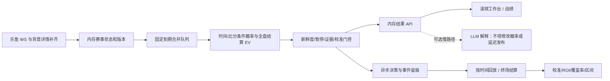

# 实时滚球专家系统：实施前详细 TODO（TASK-25）

2026-10-08。关联 #23 秒级调度、#24 战绩、#25 总任务。本规划先于业务创新提交。

## 用户目标与验收

|目标|可验证验收|边界|
|---|---|---|
|秒级采集→计算|本机接收事件→发布算法结果 P95≤1000ms；算法 P95≤100ms；持续跳价不饿死|上游生成到服务器的延迟单独报告，不能凭本机耗时保证|
|历史战绩|四分之一盘、缺失比分、半注盈亏、独立建议身份、时间不变、并发追加均有回归|历史被覆盖的建议无法凭空恢复；未确认终场保持待结算|
|App 风格两页|滚球工作台、战绩；定价和校准并入详情；桌面/手机与五状态实测|借鉴本地 APK 的配色/密度，不复制品牌资产或假造赛事|
|专家水平|按比赛切分、按时间留出，Brier/log loss/校准/ROI/覆盖率/区间同时报告|高正确率是待验证目标，不是现有模型能力声明|

## 详细执行清单（按依赖顺序）

- [x] P0 审计：只读验证采集、复现 .25/.75 结算，核验 App 配色和文献。
- [x] P0 建立独立缺陷 issue 与规范隔离 worktree；保留已恢复的账号保护、gzip 修复。
- [x] P0 提交本规划、研究报告与两页原型，之后才实施创新。
- [ ] P1 结算：解析 slash 和数值四分之一盘；拒绝负数/布尔/缺字段/非有限比分与赔率；补正常和异常测试。
- [ ] P1 台账：独立 decision_id、修订时间 updated_at 与不可变 at；按修订去重，保留多次建议；事务锁覆盖读改写；追加结算修订，避免轮转档案复活旧状态。
- [ ] P1 统计：明确模拟一单位本金（没有实际成交）；赢半/输半单列；按半注权重命中率；获利建议率、ROI、样本量、按类型统计；滚球 CLV 限制与旧格式可追溯迁移。
- [ ] P1 历史恢复：生产台账只读备份，在副本上重算；仅使用明确 done/终场证据；记录无法恢复数量，不以 0:0 补缺失比分。
- [ ] P2 事件内存：提供比分/时钟/暂停/行情的一致快照与版本；关键场上事件也唤醒算法；未知 C110 保留原文类型，不臆测红牌/xG。
- [ ] P2 调度：首个到期时间固定，后续事件合并；快路径每 0.1–0.25 秒批处理；不 REST、不扫描全盘、不调用 LLM；独立收集计算与排队延迟 P50/P95/P99。
- [ ] P2 模型：比分条件下剩余进球分布；盘口赔率去水拟合、时间衰减、走势与赛况一致性、四分之一盘完整结算期望；真实足球/EAFC 分离。
- [ ] P2 门控：过期、暂停、缺比分/时钟、未知比赛类型、未验证模型均明确原因；进球后等一致报价重开；输出观察概率与期望，限制同场相关建议。
- [ ] P2 回放：严格使用决策时已知事件；留出按比赛/时间切分；市场基准比较、proper scores、校准、ROI/覆盖率/置信区间；缺少真实结果时报告样本不足。
- [ ] P3 API：精简工作台列表和详情；状态与旧决策时间分开；秒级轮询或推送，限制响应尺寸；页面刷新不得触发 LLM。
- [ ] P3 UI：本地 APK 白蓝色彩、赛事分组、比分时钟、盘口按钮、走势与解释详情；只保留两页主导航；搜索、返回、自动刷新互不覆盖。
- [ ] P4 自测：冻结文件后受限全量 unittest、语法、Docker 依赖、mypy/ruff；真实行情负载延迟；浏览器 Default/Loading/Empty/Error/Edge-Case。
- [ ] P4 发布：生产数据备份、版本化静态目录、保留 gzip 与登录保护；8001/3003 部署，三容器状态和 2 核限额检查；失败可回滚镜像和静态目录。
- [ ] P4 交付：PR、issue 回填真实命令与退出码、研究 HTML/图表、截图与性能数据；列出尚不能证明的专家正确率。

## 架构

## 模型选择与泄漏防护

当前模型从全场盘口拟合进球，LLM 决定推荐；它遗漏合法实时比分和时钟，并把推理时间当调度周期。新快路径以实时比分为条件，模型输出剩余进球再映射终场市场；亚洲让球须核验滚球是否按剩余净胜球结算，未核验口径时禁止推荐。时钟 mst 一手实测是秒值；不同阶段是否重置需要明确规则，不能把 2812 当分钟或随意加 45。

市场拟合是市场基准，不是独立优势。使用滞后模型价格与新盘口比較只能形成研究信号，不能声称战胜庄家。红牌系数依赖比分、强弱、主客和时间，当前事件码未知时不应用常数。EAFC/虚拟足球若缺已知比赛时长，输出盘口观察而不套用 90 分钟模型。

所有特征标注接收时刻与可用性；回放只看此前事件，终场仅作标签。重复同场信号不能当独立样本做区间；命中率与 ROI 都用每场分组/覆盖率解释。置信度来自验证样本，不能拿 LLM 自评当统计置信区间。

## 发布与回滚

开发在 /tmp/ai-football-task25，生产输出仍在 /root/ai_football/output。不重复登录、不修改账号列表。先离线修复台账副本，成功后更新服务；保留旧镜像、静态目录与部署 override。无需触碰其他项目的 8000 端口。
