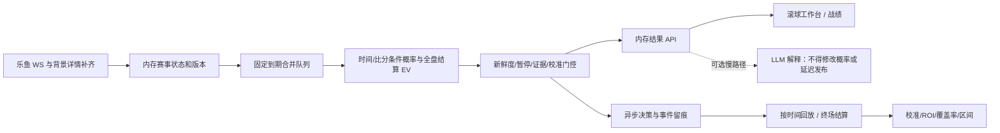

# 实时滚球专家系统：实施前详细 TODO（TASK-25）

2026-10-08。关联 #23 秒级调度、#24 战绩、#25 总任务。本规划先于业务创新提交。

## 用户目标与验收

|目标|可验证验收|边界|
|---|---|---|
|秒级采集→计算|本机接收事件→发布算法结果 P95≤1000ms；算法 P95≤100ms；持续跳价不饿死|上游生成到服务器的延迟单独报告，不能凭本机耗时保证|
|历史战绩|四分之一盘、缺失比分、半注盈亏、独立建议身份、时间不变、并发追加均有回归|历史被覆盖的建议无法凭空恢复；未确认终场保持待结算|
|App 风格两页|滚球工作台、战绩；定价和校准并入详情；桌面/手机与五状态实测|借鉴本地 APK 的配色/密度，不复制品牌资产或假造赛事|
|专家水平|按比赛切分、按时间留出，Brier/log loss/校准/ROI/覆盖率/区间同时报告|高正确率是待验证目标，不是现有模型能力声明|

## 详细执行清单（按依赖顺序）

- [x] P0 审计：只读验证采集、复现 .25/.75 结算，核验 App 配色和文献。
- [x] P0 建立独立缺陷 issue 与规范隔离 worktree；保留已恢复的账号保护、gzip 修复。
- [x] P0 提交本规划、研究报告与两页原型，之后才实施创新。
- [x] P1 结算：解析 slash 和数值四分之一盘；拒绝负数/布尔/缺字段/非有限比分与赔率；补正常和异常测试。
- [x] P1 台账：独立 decision_id、修订时间 updated_at 与不可变 at；按修订去重，保留多次建议；事务锁覆盖读改写；追加结算修订，避免轮转档案复活旧状态。
- [x] P1 统计：明确模拟一单位本金（没有实际成交）；赢半/输半单列；按半注权重命中率；获利建议率、ROI、样本量、按类型统计；滚球 CLV 限制与旧格式可追溯迁移。
- [x] P1 历史恢复：生产台账只读备份，在副本上重算；仅使用明确 done/终场证据；记录无法恢复数量，不以 0:0 补缺失比分。
- [x] P2 事件内存：提供比分/时钟/暂停/行情的一致快照与版本；关键场上事件也唤醒算法；未知 C110 保留原文类型，不臆测红牌/xG。
- [x] P2 调度：首个到期时间固定，后续事件合并；快路径每 0.1–0.25 秒批处理；不 REST、不扫描全盘、不调用 LLM；独立收集计算与排队延迟 P50/P95/P99。
- [x] P2 模型：比分条件下剩余进球分布；盘口赔率去水拟合、时间衰减、走势与赛况一致性、四分之一盘完整结算期望；真实足球/EAFC 分离；用户已明确以真实足球为主，UI 默认真实足球。
- [x] P2 门控：过期、暂停、缺比分/时钟、未知比赛类型、未验证模型均明确原因；进球后等一致报价重开；输出观察概率与期望，限制同场相关建议。
- [x] P2 回放：严格使用决策时已知事件；留出按比赛/时间切分；市场基准比较、proper scores、校准、ROI/覆盖率/置信区间；缺少真实结果时报告样本不足。
- [x] P3 API：精简工作台列表和详情；状态与旧决策时间分开；秒级轮询或推送，限制响应尺寸；页面刷新不得触发 LLM。
- [x] P3 UI：本地 APK 白蓝色彩、赛事分组、比分时钟、盘口按钮、走势与解释详情；只保留两页主导航；搜索、返回、自动刷新互不覆盖。
- [x] P4 自测：冻结文件后受限全量 unittest、语法、Docker 依赖、mypy/ruff；真实行情负载延迟；浏览器 Default/Loading/Empty/Error/Edge-Case。
- [x] P4 发布：生产数据备份、版本化静态目录、保留 gzip 与登录保护；8001/3003 部署，三容器状态和 2 核限额检查；失败可回滚镜像和静态目录。
- [x] P4 交付：PR、issue 回填真实命令与退出码、研究 HTML/图表、截图与性能数据；列出尚不能证明的专家正确率。

## 架构



## 模型选择与泄漏防护

当前模型从全场盘口拟合进球，LLM 决定推荐；它遗漏合法实时比分和时钟，并把推理时间当调度周期。新快路径以实时比分为条件，模型输出剩余进球再映射终场市场；亚洲让球须核验滚球是否按剩余净胜球结算，未核验口径时禁止推荐。时钟 mst 一手实测是秒值；不同阶段是否重置需要明确规则，不能把 2812 当分钟或随意加 45。

市场拟合是市场基准，不是独立优势。使用滞后模型价格与新盘口比較只能形成研究信号，不能声称战胜庄家。红牌系数依赖比分、强弱、主客和时间，当前事件码未知时不应用常数。EAFC/虚拟足球若缺已知比赛时长，输出盘口观察而不套用 90 分钟模型。

所有特征标注接收时刻与可用性；回放只看此前事件，终场仅作标签。重复同场信号不能当独立样本做区间；命中率与 ROI 都用每场分组/覆盖率解释。置信度来自验证样本，不能拿 LLM 自评当统计置信区间。

## 发布与回滚

开发在 /tmp/ai-football-task25，生产输出仍在 /root/ai_football/output。不重复登录、不修改账号列表。先离线修复台账副本，成功后更新服务；保留旧镜像、静态目录与部署 override。无需触碰其他项目的 8000 端口。


## 已实施的范围与后续研究

上述回放项已实现训练/留出、proper scores、校准和独立比赛区间；公开数据没有同期乐鱼赔率，因此 ROI 和市场比较明确返回未知。完成评估流程不等于已经证明模型达到专家水平。线上当前发布研究观察概率，不生成未经验证的正式推荐。2026-10-10 留存更新：每次发布的完整算法结果异步追加到 `live-replay.jsonl.gz`，
取消15秒采样和队列丢弃；走势、原始赛况、比分修订及审核结果永久追加，不轮转/清理旧历史。
历史中的旧采样日志仍然是不完整数据。详见 [永久留存与训练方案](decision-model-training.md)。

- [ ] 后续研究：收集同源赛况、盘口与经确认终场的前瞻样本，按比赛/时间验证收益和概率，满足统计证据后才升级推荐。
- [ ] 后续研究：核验场上事件码及滚球 AH 结算口径；未核验前不施加红牌/xG 系数或让球推荐。
- [ ] 后续研究：自然 App token 到期后的长期续期验收；本轮沿用已恢复会话，未重新提交口令。

119条旧正式建议缺少确认终场，不能恢复此前被旧键覆盖的建议；数据缺口仍保留待结算。真实足球默认展示，虚拟比赛使用独立统计且不套用90分钟模型。

## 已发布版本与运维

生产目录 `/root/ai_football`，端口8001 API、3003控制台；静态资源冻结在 `output/deploy/task25-live-workbench/html/`。当前 override 为 `output/deploy/current.compose.json`；原 `console-fixes.compose.json` 同步指向本轮版本。重建后要更新对应镜像 tag，保留回滚 tag。

```bash
# 当前版本，实际发布exit0
ANALYTICS_PORT=8001 CONSOLE_PORT=3003 AI_FOOTBALL_CPUS=2 \
  docker compose -f docker/docker-compose.yml -f output/deploy/current.compose.json \
  up -d --no-deps --wait --wait-timeout 60 analytics-api web-console redis

# 实际验证exit0
curl -fsS http://127.0.0.1:8001/health
docker exec ai_football_redis redis-cli ping

# 回滚备用，配置与镜像已验证；未执行回滚
ANALYTICS_PORT=8001 CONSOLE_PORT=3003 AI_FOOTBALL_CPUS=2 \
  docker compose -f docker/docker-compose.yml -f output/deploy/task25.rollback.compose.json \
  up -d --no-deps --wait --wait-timeout 60 analytics-api web-console
```

回滚镜像 `ai_football-analytics-api:before-task25` 和原冻结静态目录保留；台账备份在 `output/deploy/before-task25-ledger/`，重算报告在 `output/deploy/task25-production-regrade.json`。程序回滚不会自动倒退台账。自然token续期没有在测量期触发，不能称其已实测。

|验证命令|实际结果|
|---|---|
|`./scripts/cpu-limited.sh run -- python3 -m unittest discover -s tests -q`|1071 tests，14 skipped，42.401s，exit0|
|`docker run --rm --cpus 2 --cpuset-cpus 0-1 -v /tmp/ai-football-task25:/w:ro -w /w ai_football-analytics-api:task25-live python -m unittest discover -s tests -q`|Python3.12，1071 tests，14 skipped，58.724s，exit0|
|受限Docker `python -m mypy` / `python -m ruff check .`|57文件无错误 / All checks passed，exit0|
|受限Docker逐文件 `py_compile.compile(..., doraise=True)` / `node --check web/console/workbench.js`|exit0|
|`AI_FOOTBALL_CPUSET=0-1 ./scripts/cpu-limited.sh build analytics-api`|镜像49f0026cda2a，exit0|
|受限生产镜像 `python -c 'import redis, urllib.request, service.live_expert'`|exit0|
|`docker compose -f docker/docker-compose.yml config --quiet`|exit0|
|Playwright执行 `tests/browser/workbench_flows.js` / 3003真实交互|五状态 / 桌面手机详情与历史均exit0|
|公开回放、中文字体Docker图表生成、Markdown→HTML|exit0；2统计图、4截图、5CSV|
|HTML在线及阻断CDN验收|Mermaid和图片正常；离线保留可读图源，exit0|

最终真实足球滚动2048条延迟P95=205.243ms，计算P95=1.893ms；120次API请求与边界见研究报告及 `data/live-performance.csv`。三容器均healthy，实际 `cpu.max` 均为 `200000 100000`。


交付 PR：[#26](https://github.com/1420970597/ai_football/pull/26) 已合入 main（1358a8a）。秒级与战绩缺陷分别关联 #23/#24；#25 保留同源前瞻模型能力验证跟踪。

TASK-25 开发 worktree 和分支已在合入后清理，工作区已同步 main。上表 `/tmp/ai-football-task25` 是当时的冻结测试目录；重新验证时将 Docker 挂载源换为当前仓库 `$PWD`。#23/#24 已关闭，#25 保留前瞻能力验证。
