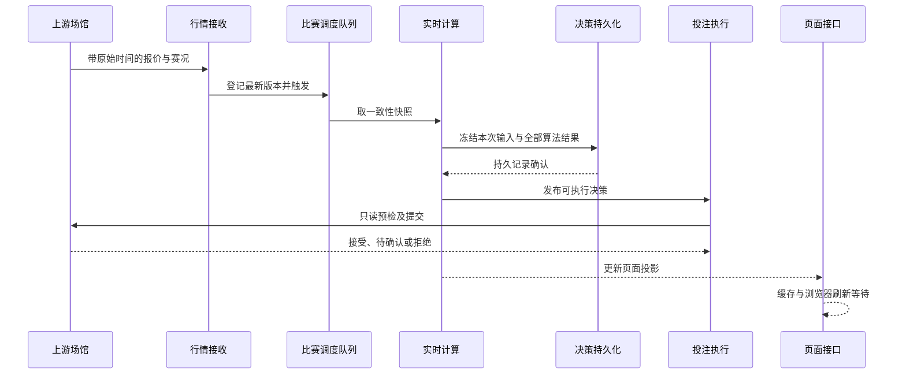
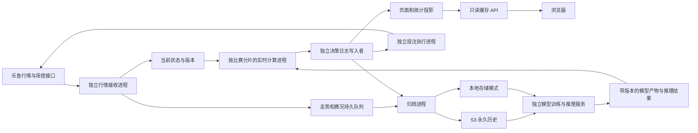

# TASK-37：实时决策与页面延迟的诊断及改造方案

日期：2026-10-10。诊断基线：`f5b5b8a`，当前生产部署与 TASK-36 一致。
本文是待实施的技术方案，所列目标不是优化完成后的测量值。本轮只读采样与文档整理，没有修改生产业务逻辑。

## 1. 已确认的现象

证据等级 **A**：本机生产接口、宿主 `/proc`、容器配置、线程栈和仓库代码。没有采用社区经验值替代实测。

| 证据 | 本轮读数 | 含义与边界 |
| --- | --- | --- |
| 16:23 UTC 工作台，最近 2048 条整体计算样本 | `compute_ms` P50 13.212ms，P95 90.994ms，最大 10.508s | 大部分核心计算较短，但存在秒级长尾；此指标不覆盖计算结束后的记录冻结与入队 |
| 同一接口的真实比赛样本 | `event_to_result_ms` P50 13.830s，P95 20.901s | 从该比赛最早待处理触发到核心计算结束的延迟，包含调度等待；不是上游发送到本机的网络延迟 |
| 16:27 UTC 工作台 | 真实比赛 P50 13.959s，P95 21.141s；初次台账待写 0，replay 待写 23 | 台账已排空时仍有明显延迟，不能继续把全部延迟归因于旧记录积压 |
| 本轮分析接口的调度状态 | 待处理 14 场，最早任务距应处理时间已超 9.2s；实时批量 64 | 已有本地排队证据；待处理数量不含已取出但尚未计算完的整批任务 |
| 本轮本机请求，经 :3003 访问 | 工作台 200 / 4.921s；推荐 200 / 0.987s；分析 200 / 13.546s | 三次独立请求，不能作为 P95；推荐请求复用了工作台缓存，不能据此判断冷请求已足够快 |
| 前轮迁移结束后的稳定探针 | 216 次本机 GET、36 次公网 curl 均 200；推荐 P95 6.093s | 来源 `task36-postmigration-stable.jsonl`；和本轮单次请求分开解释 |
| API 容器配置及实际 cgroup | `NanoCpus=0`；`cpu.max=max 100000` | 运行期 CPU 硬配额已经解除，继续解除同一限制没有收益 |
| 本轮主机内存与 API 内存 | 主机 7.76GiB 内存、约 9.83GiB Swap 已用；API RSS 约 3.39GiB、VmSwap 约 0.95GiB | Swap 已用量本身不能证明当前换页，需与下行速率联合判断 |
| `vmstat -w 1 10` 的 9 个区间样本 | 换入 1172～15180KiB/s；换出 0～33144KiB/s；I/O 等待 2%～19%；CPU 空闲 36%～68% | 当前确有换页和磁盘等待；是全机指标，不能把所有磁盘耗时都归到本项目 |
| 本轮无局部变量的 py-spy 单次栈 | 调度线程持 GIL 构建 `training_history`；后台同时做快照索引更新、台账统计、目录扫描 | 确认这些工作并存；单次栈不能给出各项耗时百分比 |

临时原始证据位于 `/tmp/task37-latency-workbench.json`、`/tmp/task37-latency-current-workbench.json`、`/tmp/task37-latency-analysis.json` 和 `/tmp/task37-latency-profile.json`。原始接口数据可能含场馆盘口信息，未作为仓库附件提交。

目前证据支持三个优化重点：实时调度的串行等待；计算、历史复制和页面投影共享进程；内存换页及后台磁盘工作。尚不能精确分摊三者各自造成多少秒延迟。

## 2. 延迟必须拆开计量

上图为目标时序。当前 replay 在内存排队后异步保存，`compute_ms` 和 `event_to_result_ms` 均在完整记录冻结、函数返回和执行器入队之前计时结束，尚不能表示整条执行链路。

需要关联同一个 `match_id + state_version + config_version + decision_id` 的以下时间：

| 阶段 | 建议指标 | 时钟与解释 |
| --- | --- | --- |
| 上游报价到本机收到 | `source_to_receive_ms` | 原始报价墙钟与接收墙钟之差；核验时钟偏差、原始时间语义，不能改成接收时间 |
| 收到、解析和更新状态 | `receive_to_state_ms` | 本机单调时钟；拆出解码、锁等待和状态更新 |
| 第一次触发到开始计算 | `first_trigger_queue_ms` | 衡量等待公平性，包括防抖；合并后的任务仍保留第一次触发时间 |
| 最新输入接收到开始计算 | `latest_input_queue_ms` | 与上一指标并存，防止把最早触发等待误当作最新报价年龄 |
| 计算、冻结及发布 | `calculate_ms`、`freeze_ms`、`persist_ack_ms`、`publish_ms` | 分别统计；保存现有指标兼容性，新增完整调用耗时 |
| 投注前执行 | `execute_queue_ms`、`venue_preflight_ms` | 分开观察等待和上游只读接口；重试间隔另列 |
| 提交与场馆回执 | `submit_to_ack_ms` | 上游控制；接受延迟、回执未知不能伪装成成交 |
| 页面 | `projection_age_ms`、GET 耗时、浏览器显示延迟 | 页面缓存的年龄与请求耗时分开测量 |

`price_source_age_s` 是“现在减去最近报价时间”，也包含上游没有发新报价的静默时间。当前 11～12s 的读数不能直接解释成 11～12s 网络运输耗时。各阶段 P95 也不能直接相减或相加来分配端到端延迟，应使用关联样本。

## 3. 当前实现中的具体成本

| 代码位置 | 当前行为 | 改造方向 |
| --- | --- | --- |
| `service/analysis.py` 的 `_effective_batch`、`_trigger_batch` | 实时模式固定取最多 64 场，同一线程逐场计算；每场主动让出最多 50ms | 用小批次或时间预算控制调度，每次取最新状态；真实、虚拟和未核验比赛分离队列，保留公平调度 |
| `service/live_expert.py` 的 `_calculate` | 所有报价含 RAW 盘口都逐条构建最多 40 点训练历史，即便算法并不支持该玩法 | 算法热路径只处理当前支持的全部盘口线；RAW 盘口仍完整采集、归档与按需展示；冻结训练输入在专用记录路径完成 |
| `service/live_expert.py` 的 `compute`、`results` | 冻结完整记录、刷新保留推荐与遍历盘口时持共享锁；计算与 API 在同一进程 | 缩短锁内区段，使用不可变输入和结果；页面读取紧凑投影，避免扫描全盘口 |
| `service/ledger.py` 的 `_append`、`record_live` | 每条初判重复扫描台账导入状态、写 JSONL、fsync、提交 SQLite；实验与结算共享写锁 | 专属单写入者批量持久提交，导入仅启动和恢复时执行；幂等身份与事务语义保留 |
| `service/live_expert.py` 的 `flush` | 先等待初判台账再写完整 replay | replay 持久队列与统计投影独立推进，投影慢不能阻塞完整训练记录保存 |
| `store/snapshot_store.py` 的 `append_many`、`_update_index` | `append_many` 逐条 append，反复写完整索引 | 批量写快照后统一提交索引，恢复时核对完整性 |
| 台账结算与快照统计 | 后台重复聚合历史与扫描目录，仍消耗内存、磁盘和 CPU | 按新结算结果增量更新证据；目录量和空间统计缓存，低频全量校准 |
| `api/app.py` 的工作台及推荐接口 | 缓存过期后由 GET 现场生成投影、查证据与复制数据；TTL 分别 1.5s/3s | 后台单飞生成版本化紧凑响应，GET 直接读取；异常时返回带年龄的旧投影 |
| `web/console/workbench.js` 的 `poll` | 请求完成后再等待 `POLL_MS=5000` | 页面改为 SSE 增量更新或较短自适应轮询；这只缩短显示等待，不改变后台自动投注触发 |

例如请求耗时 6s 时，现有页面两次请求开始时间约相隔 11s。这是代码行为示例，不是本轮另一次计时。

64 场每场让出 50ms 的理论累计上限为 3.2s，仅是参数上限计算，不能当作实测贡献。让出时间有助于行情线程工作；应在进程隔离后重新测量，不能先直接删除而使接收重新饥饿。

## 4. 目标进程边界

当前独立的 `model-worker`、`archive-worker` 继续保留。基础实时算法的计算从 API 进程移出，模型训练与推理保持独立服务边界；训练、模型载入、S3 历史读取不能成为行情接收或页面 GET 的同步步骤。模型结果必须携带版本和输入截止时间。

分片使用稳定的 `match_id` 哈希，不用每个 Python 进程随机化的内建 hash。每场只允许一个分片持有计算状态；扩缩容需要迁移锚点、走势前缀、待处理版本和配置版本。发布前核验状态版本，提交前再次核验当前报价、赛况及配置。

先降低单进程热数据与换页，再试 1、2 个实时计算进程，根据完整调用耗时与队列年龄选择数量。当前约 8GB 主机与其他服务共用，直接复制现有约 4GB 的工作集会加重换页。跨进程只传递该场的紧凑快照，禁止每次传全体盘口或复制完整台账。

投注执行保持账户级唯一消费者。持久发送意图与去重仍在场馆提交之前完成；不能为了低延迟取消这一顺序。提交后的超时仍为回执未知，不能自动重复扣款。

## 5. 实施 TODO 与顺序

以下均为待开发项。

| 优先级 | TODO | 完成判据 |
| --- | --- | --- |
| P0-1 | 增加上述分段时钟和队列年龄，记录完整 `compute()` 耗时；给 API 增加缓存命中指标 | 能关联一次决策从接收、计算、持久化到执行的各阶段；新指标不泄露凭据 |
| P0-2 | 减少 RAW 盘口进入算法热路径的工作；训练历史只冻结一次；已结束比赛在持久确认后回收内存 | 所有受支持盘口线、所有算法和所有已发布决策仍完整保存；内存稳定，无未来数据泄漏 |
| P0-3 | 单写入者批量提交台账；replay 独立持久队列；快照索引批量更新；结算证据增量更新 | 两类持久队列长期不增长；重启、部分写入、SQLite 失败可恢复，无误报保存成功 |
| P1-1 | API 后台生成紧凑投影；缓存单飞；请求不计算、不扫描目录、不聚合全部历史 | 冷启动、过期刷新、多个浏览器并发时请求耗时稳定，错误和缓存年龄可见 |
| P1-2 | 隔离行情、实时计算、投注执行与只读 API；以稳定分片保持同场顺序 | 慢计算或慢页面不阻塞行情；状态更新中途发生时旧结果不能进入执行 |
| P1-3 | 页面增量推送或自适应轮询 | 后台决策生成到页面显示的等待可单独量化；无重复轮询或无限重连 |
| P2 | 在以上完成后，根据工作集、换页、队列增长决定升级内存或 CPU | 在代表性负载下有实测容量依据；不能用解除 CPU 配额代替消除 GIL 和磁盘竞争 |

批量提交起始参数可以试“最多 64 条或等候 50ms”，它们是实验参数，不是已经证明最优的值。用 16/64/128 条、10/50/100ms 对比吞吐、持久确认延迟和崩溃恢复；增大批次通常降低写入成本但增加等待。内存不足时增加分片可能使延迟反而升高。

## 6. 保留数据与时间边界

待计算行情可以按比赛合并为最新状态，原始走势和赛况持久记录仍保存。所有已经发布的决策、每个算法对各盘口线的输出、实际结果必须完整留存；不能用少保存比赛、盘口或决策的方式改善延迟。

训练输入绑定决策冻结时的不可变前缀，同时校验上游事件时间与本系统首次观测时间均不晚于输入截止时间。若使用历史引用降低重复存储，引用必须能在本地或 S3 重建同一份前缀并验证哈希，不能异步读取最新走势冒充当时输入。

持久队列用本地 WAL 或已有可靠存储溢出，内存只保留有限热数据。写入失败应显式报告、保留待恢复记录，容量持续不足时限制新的发布并补足吞吐。不得静默删除已发布记录或无限堆内存。S3 上传在持久日志之后异步推进，远端完成并校验后才按已有归档协议清理本地副本。

## 7. 验收目标与可控边界

以下是拟定目标，不是承诺值。先在与生产相当的比赛数、盘口数和更新速率下验证；同时保留“真实比赛”与其他类型的独立指标。

| 指标 | 第一阶段目标 | 取样方式 |
| --- | --- | --- |
| 本机最新输入收到至可执行决策发布 | P95 ≤ 2s | 至少 30 分钟、至少 2000 条关联决策样本，包含完整冻结与持久确认 |
| 本机工作台、推荐、账户 GET | P95 ≤ 500ms | 分别记录缓存命中、过期刷新、冷启动；至少 1000 次低负载请求，并在隔离环境模拟多个浏览器 |
| 浏览器显示 | 新决策发布后通常 ≤ 1s 更新 | 不包含上游行情静默；网络与页面投影年龄分别记录 |
| 持久化及内存 | 已发布决策缺失 0，队列不持续增长，热工作集稳定 | 校验序号、恢复重放与 S3 回读；观察 RSS、VmSwap、区间换页及 I/O 等待 |
| 订单正确性 | 无同盘口方向重复提交、无过期版本执行 | 假场馆测试改价、暂停、重复信号、重启、配置变化和提交后超时；生产仅只读观察 |

上游推送静默、网络往返和场馆自身的接受延迟无法在本地消除，应分别呈现。如果达不到目标，依据分段指标定位并调整容量，不能把 15s 行情门槛放宽、重置报价时间或增加重试来伪装低延迟。

本轮验证范围仅为只读诊断与技术文档。业务回归、进程拆分故障恢复和上述性能目标须在后续实现冻结后验证。

## 8. 本轮文档校验

以下命令与断言实际执行，最终退出码均为 0：

- `python3 -m py_compile reports/leyu-kaiyun-odds-bot-feasibility/scripts/md_to_html.py`：渲染脚本语法检查。
- 在 `/tmp/task37-latency-doc` 执行 `python3 md_to_html.py low-latency.md low-latency.html`：生成约 22.4KB HTML；静态检查确认两个 Mermaid 块及运行时成功、降级钩子。
- Playwright CLI `run-code`：正常加载后断言两个图均生成 SVG；拦截 CDN 再加载，断言两个图源均可见且非空。临时浏览器与本地 HTTP 服务已关闭。
- `git diff --cached --check`：提交前空白与补丁格式检查。

首次临时浏览器启动因 root 下 Chrome 沙盒限制失败；改用仅用于本地文档核验的临时启动配置。首次 `file:` 导航被 CLI 禁止；改为绑定 `127.0.0.1` 的临时 HTTP 服务后完成上述断言。没有改动项目容器的浏览器或运行配置。
