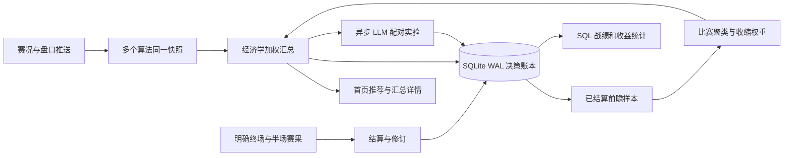
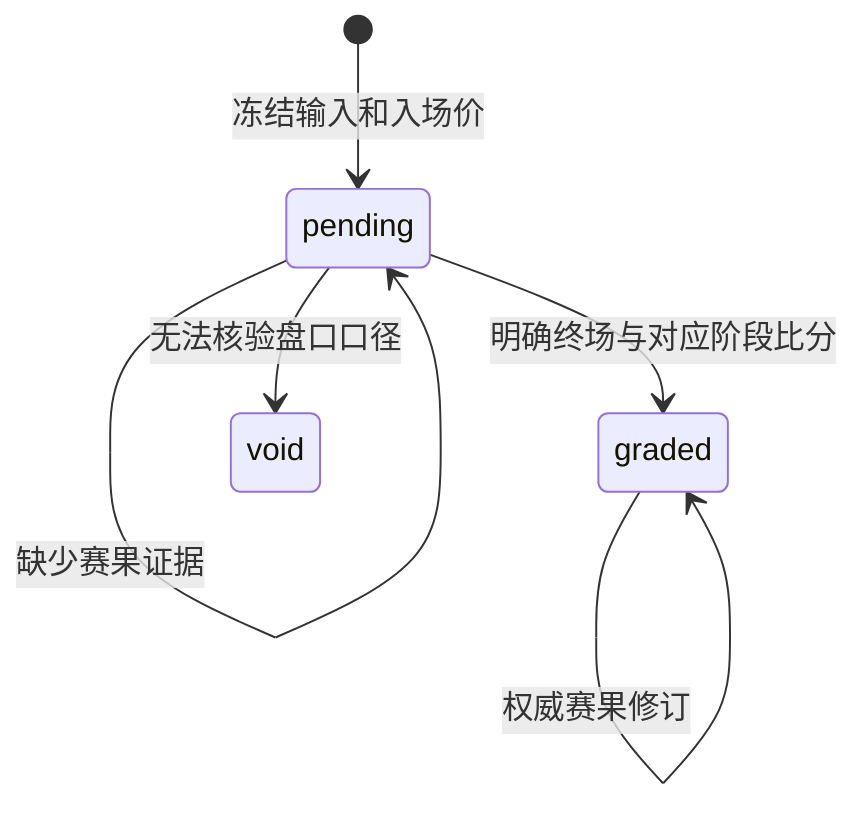

# 决策战绩、数据库与经济学汇总实施计划

## 证据与目标

2026-10-09 生产实测（A：API / 本地代码）：历史接口 5.83 秒；最近 30 天 1,445 条建议全部 pending。
JSONL 约 38MB，每次追加使全库解析缓存失效；历史接口重复计算全库 summary。
比分文件有结束标记，但与待结算比赛不重合；不能把最后看到的比分猜成终场。
后续一手证据核验发现真正根因：抓包所含官方前端语言字典 `ms` 为 `3=结束`、`110=即将开赛`，`msc.S2=上半场比分`。旧代码分别误用了 `110` 与 `S0`；旧无证据 `done` 不可继续用于结算。
官方字典来自 `leyu.saz` 对应 `index-BYprrvdd` 语言资源（解码资源暂存于 `/tmp/football-sports-assets/721_c.txt.js`，不入库）；语义回归落在 `tests/test_final_evidence.py`。
当前首页只用主算法，详情重复列出各算法。缺少汇总留痕、有效样本权重与配对 LLM 实验。

## 执行 TODO（按依赖顺序；代码完成与检查通过）

- [x] 1. 赛果闭环：修复终场状态识别、持久半场比分；索引 pending 场次；独立本地结算先执行，再做限量历史补查；无结束证据保留 pending 并显示原因。
- [x] 2. SQLite WAL：事务、主键与查询索引；JSONL 增量、幂等迁移，保留审计原文件；SQL 分组统计与分页，页面读取不调用上游。
- [x] 3. 全盘口正确率：赢/输为正确/错误，赢半/输半计半单位，走水剔除正确率分母；pending/void 不计收益；旧记录独立。
- [x] 4. 经济学汇总：同场同盘口同线同报价归并各算法；历史有效样本按比赛聚类，Beta 收缩与 Brier 评分调整权重；分歧惩罚与同场总敞口限制。
- [x] 5. 汇总记录冻结：概率、置信度、算法权重版本与建议仓位入库；总体默认用汇总建议，独立算法只用于对比，避免重复计算本金。
- [x] 6. 收益统计：等额本金 ROI、冻结置信度/Kelly 仓位 ROI、算法 ROI、置信度区间、累计收益。
- [x] 7. 配对实验：相同输入时点/报价的经济学建议与经济学+LLM 审核策略；记录确认/弃权/失败/超时，两个实验臂同时结算；展示配对样本、准确率差与收益差。
- [x] 8. 首页推荐板与汇总详情；历史算法/权重/收益/实验对照表；热设置控制权重先验与实验启用。
- [x] 9. 正常/异常回归、迁移与性能实测、全套检查、三容器部署、真实 API/UI 验证、远程 Issue 与 PR 更新。

## 数据库取舍

以下为工作负载适配判断，非性能测量（A：各数据库官方架构；本系统单 API 写入）。

| 方案 | 事务写入 | 索引查询 | 并发读 | 运维 | Python 接入 | 增量迁移 | 本项目适配 |
| --- | --- | --- | --- | --- | --- | --- | --- |
| SQLite WAL | ACID、单写者 | B-tree | WAL 读写并行 | 无新服务 | 标准库 | 单事务批量 | 首选；磁盘本地持久卷 |
| PostgreSQL | ACID、多写者 | B-tree / 多类型 | MVCC | 新服务、备份监控 | 新驱动 | 批量导入 | 多节点阶段再迁移 |
| DuckDB | 分析型事务 | 列式扫描 | 分析并行 | 嵌入式 | 新依赖 | 批量分析 | 离线研究合适，高频写入非首选 |

## 链路

## 统计与实验契约

所有收益为模拟记录，1 单位固定本金和冻结仓位分别统计。汇总、单算法、实验分开，不能把同场五算法相加当作五次独立机会。
自适应只使用决策之前已结算的真实足球、前瞻样本；按比赛聚类平均 Brier，样本不足向共同先验收缩。
算法预测高度相关，汇总概率与统计置信度分别展示；不把模型概率称为历史正确率。
权重更新记录证据截止时间与版本，已有决策不随未来权重重写。
LLM 作为额外筛选策略：确认保留、观察/拒绝弃权；错误与迟到单独统计，不伪装成成功审核。
完整比较必须使用两个实验臂的共同入场记录，弃权本金为零；除入选正确率外，显示覆盖率与每机会收益。
样本量不足时不给出“必须使用/取消 LLM”的结论。

## 实验限制与网关修复

对照实验为相同盘口方向的模拟持有策略：经济学臂保留方向，LLM 臂在确认时保留、观察/拒绝时弃权；不是让 LLM 事后重猜赛果。
同场每盘口/线/配置版本冻结首个输入。正确率只针对实际保留的方向；额外展示覆盖率、每机会收益差，避免靠大量弃权制造虚高正确率。
生产初次启用发现网关正常响应实际是 `{success:true,data:ChatCompletion}`，原客户端未解包导致审核错误；仅在显式布尔成功时解包，错误响应不接受。

## 验证

复用现有 Markdown 渲染器，已确认 Mermaid 围栏及离线降级实现。完成后记录生产接口延迟、真实结算数量、全部验证命令与退出码。

## 实测交付（2026-10-09）

| 项目 | 命令/方法 | 结果 | 退出码 |
| --- | --- | --- | --- |
| 语法 | `python3 -m compileall -q core store collector service api tests` + `node --check web/console/workbench.js` | 通过 | 0 |
| 单元测试 | `./scripts/cpu-limited.sh run -- python3 -m unittest discover -s tests -q` | 1,125 项；11 项跳过 | 0 |
| 容器依赖与静态检查 | Docker Python3.12 内安装项目 dev、Ruff 后 `python -m ruff check .` / `python -m mypy` | 双通过，65 文件 | 0 |
| 浏览器 | Playwright CLI `run-code --filename tests/browser/workbench_flows.js` | 五态、推荐、汇总收益、实验、热设置、移动、DOM 安全 | 0 |
| 数据库真实副本 | 约38MB原账本副本迁移与查询 | 首次迁移4.2秒；重复筛选97ms | 0 |
| 生产历史 | `/api/v1/ledger/history?type=real&cohort=prospective&limit=100` | 0.15–0.68秒；原实测5.83秒 | 0 |
| 真实结算 | 正确终场状态/比分自动回填 | 前瞻90条已结算，85条非走水，**1场**，半注正确率70.63%，模拟等额ROI33.65% | 0 |

这些是当前测量值，非长期收益预测。许多历史记录缺冻结置信度/仓位，该指标保留空值；新的汇总记录已有冻结仓位，随真实完赛产生收益。缺失旧赛果继续待核验。
生产 LLM 网关已验证成功响应解包，但模型上游实际多次 HTTP502/503，实验记录单独显示失败，成功审核样本不足，**尚不能判定引入 LLM 是否有益**。
前瞻、汇总、单算法和实验分别记账。实验支持配置版本分层首判，接口故障不进入成功审核配对统计；运行故障另以 operation / errors 展示。

数据库参考：<https://sqlite.org/wal.html>、<https://www.postgresql.org/docs/current/mvcc.html>、<https://duckdb.org/docs/stable/connect/concurrency.html>。
本地页面截图：`output/playwright/task37-production-live.png`、`task37-production-history.png`、`task37-production-mobile-history.png`（运行产物不入库）。

截至交付：实验功能与故障统计已完成；生产模型上游502/503使有效成功审核样本尚未形成。Issue #41 保持跟踪，不能提前声称已完成 LLM 有效性验证。
