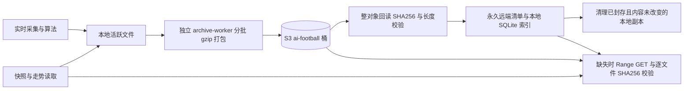

# 本地与 S3 永久归档

证据等级 A：本仓库实现、用户指定 S3 服务器的真实回读验证。默认 local；当前部署启用 s3。SDK 依赖只安装在容器内，凭据与 CA 从只读 client 卷读取，不提交、不输出。保留 TLS CA 校验。



| 文件种类 | S3 | 本地策略 |
| --- | --- | --- |
| 不可变盘口快照 | 每文件独立压缩成员，聚合成 pack | 校验后清理 JSON，保留比赛目录与 _index.json |
| 旧决策 replay | 完整归档，全部保留 | 旧轮转文件清理；新 schema-v2 日志需模型消费完成 |
| 新决策、事件、比分与分析日志 | 按UTC小时封存后归档 | 保留当前小时；replay 消费游标追平后才清理 |
| 盘口走势 | 完整旧文件与每小时分片 | 本地尾部或 S3 回读，保留活跃小时 |
| 模型版本、配置、当前缓存 | 备份入桶 | 小型运行状态保留本地 |
| 订单去重 / 台账 / 训练输入 / 观察预测 SQLite | SQLite backup 一致性快照入桶 | 保留活跃数据库，避免破坏运行、重启去重与训练 |
| 归档索引 | 永久远端 manifest 可重建 | catalog.sqlite3 留本地，供快速定位 |

打包目标32 MiB源数据或2000文件；大文件流式压缩，避免内存读入数十MB旧决策文件。每个成员记录原始路径、字节数、SHA256、压缩偏移与长度。整 pack 和 manifest 上传后回读校验，再事务登记本地索引。清理前重核本地 size/mtime/hash；重启清理重新核验远端 pack。上传/校验失败不会删除源文件。远端旧对象永久保留，不实施生命周期淘汰。

独立 archive-worker 默认0.5核、512MiB，每300秒追加同步，网络/凭据只给归档与主服务，模型容器无网络与场馆凭据。页面分别展示本地文件、S3原始数据、S3对象占用与硬盘空间，避免将副本相加冒充去重后总量。统计由后台更新，磁盘空间每次读状态时更新。

配置文件 `output/storage-settings.json`：

```json
{"backend":"s3"}
```

没有该文件默认local；也支持 `ARCHIVE_BACKEND=local|s3`。S3配置默认 `client/credentials.json`，容器用 `S3_CONFIG_FILE=/app/client/credentials.json`。目录已忽略，不入镜像。切回local之前先回填缺失文件，不能只改开关而让历史不可读：

```bash
docker compose -f docker/docker-compose.yml stop archive-worker
docker compose -f docker/docker-compose.yml run --rm archive-worker python -m service.archive_service --rebuild --restore
```

确认恢复完成并有足够磁盘空间后，将backend改为local；归档worker在local模式等待，既有采集逻辑恢复单文件追加。恢复不会覆盖已存在的活跃状态。灾难恢复可先用 `--rebuild` 从远端清单重建本地catalog，再选择恢复所需数据。并发恢复/全量清理应停止归档worker。

验证记录：

- `./scripts/cpu-limited.sh run -- python3 -m unittest discover -s tests -q`：1263项，11跳过，47.196秒，退出0。
- 容器Python3.12 `python -m mypy`：79文件无错误；`python -m ruff check .`：通过，退出0。
- 语法编译、`node --check web/console/workbench.js`、`git diff --check`、compose配置解析：退出0。
- `./scripts/cpu-limited.sh build analytics-api model-worker archive-worker`：退出0。
- 指定S3真实集成：上传 → 整对象回读校验 → 清理测试本地副本 → Range读取 → 恢复原文件，退出0。仅删除本次测试创建的随机pack及其manifest。
- 假客户端测试覆盖上传失败、远端内容损坏、源文件改变、清理失败、恢复索引、幂等迁移、本地默认、快照/走势远端回读、运行状态保护。

首次全量迁移结果将在完成后附入本文。debug截图、认证缓存、凭据不参与业务归档迁移。
