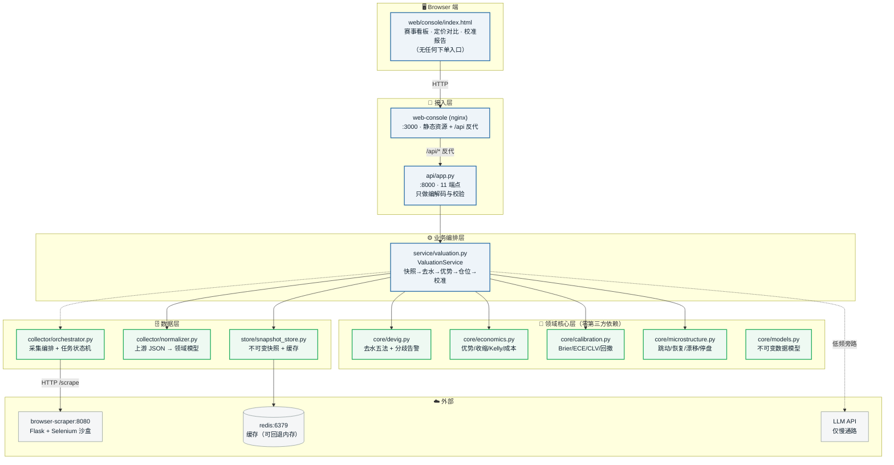
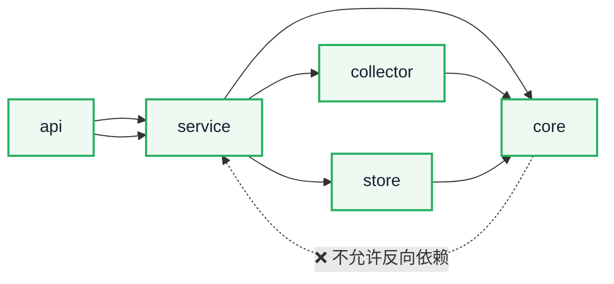
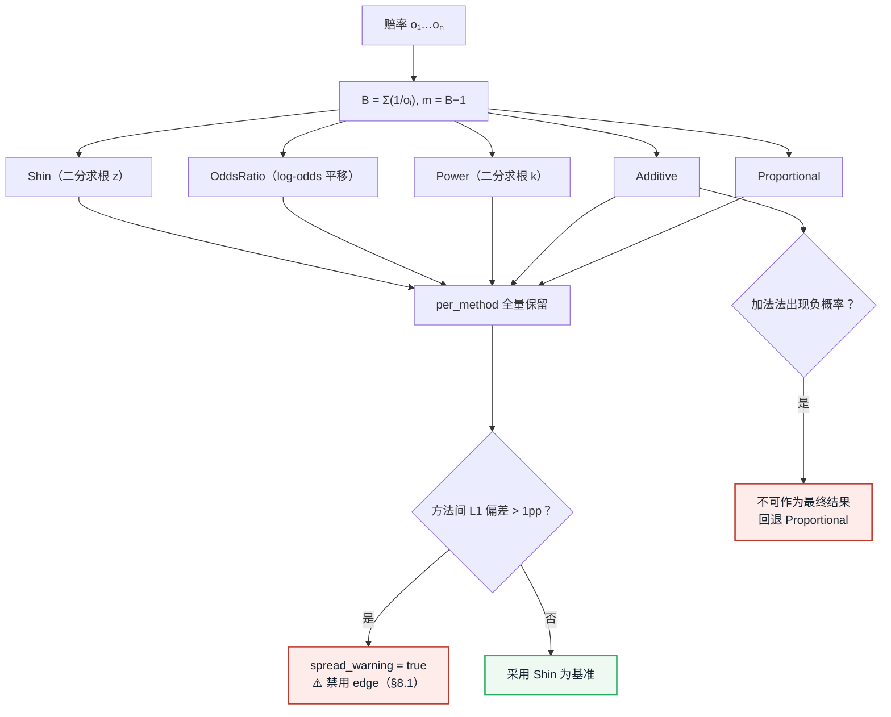
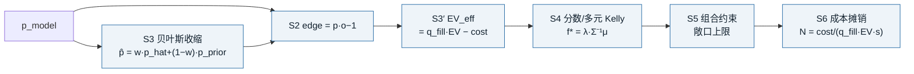
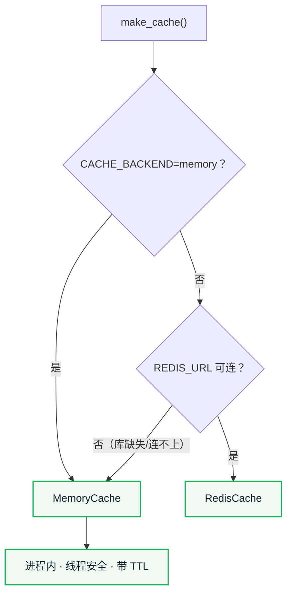
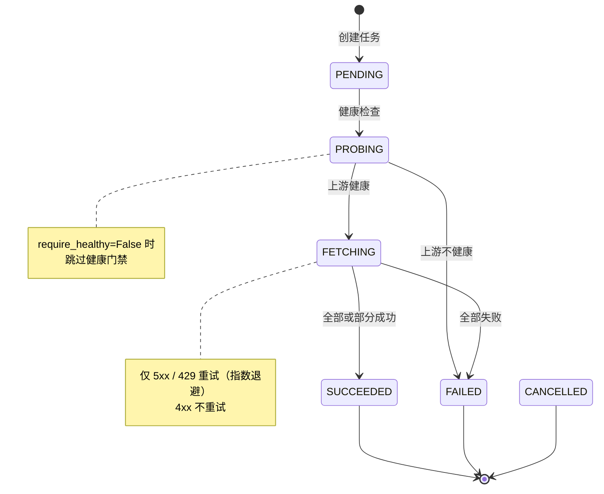

# valuation-core —— 估值与经济学算法栈设计

> 本文档描述 `core` / `store` / `collector` / `service` / `api` 五层的设计依据、
> 接口契约与验证方式。全部结论可追溯到
> [可行性研究报告](../../reports/leyu-kaiyun-odds-bot-feasibility/REPORT.md)。

| 项目 | 内容 |
| --- | --- |
| 文档类型 | 架构 / 技术方案设计 |
| 对应报告 | `REPORT.md` §5.1 §5.3 §7 §8.1–8.8 §12.1 §13.2 |
| 代码位置 | `core/` `store/` `collector/` `service/` `api/` |
| 测试 | `tests/`（8 个测试文件） |
| 设计原则 | **核心层零第三方依赖** · **L5 执行层刻意不实现** |

---

## 1. 设计目标与边界

### 1.1 目标

把报告中的技术分析落成**可运行、可复现、可审计**的系统原型：

1. 采集层可对接真实数据源（多路径：逆向 / 浏览器 / 官方 API）
2. 估值层严格实现报告 §8 的全套经济学算法
3. 评估层提供校准闭环（Brier / ECE / CLV）
4. 全程可单测、可容器化、可复现

### 1.2 三层边界（**最重要的设计决策**）

报告 §13.2 的核心结论是：**架构设计正确，但它优化的是一个负期望系统**。
因此本原型采取"保留研究价值、剥离执行风险"的取向：

| 报告分层 | 实现状态 | 依据 |
| --- | :---: | --- |
| L1 数据采集 | ✅ 完整 | §3.2 / §12.1：逆向与浏览器自动化已被开源项目验证 |
| L1′ 微结构提取 | ✅ 完整 | §5.1：唯一未被"报价撤回"污染的信息维度 |
| L2 特征（去水） | ✅ 完整 | §8.1：方法选择可造成 0.83–8.0 pp 偏差，足以翻转符号 |
| L3 决策（规则+LLM） | ✅ 规则在关键路径；LLM 在旁路 | §6.3：LLM 入关键路径 +20% 延迟、定价贡献 ≈ 0 |
| L4 经济学算法栈 | ✅ 完整 | §8.2–8.8：有严格最优解，可迁移 |
| **L5 执行（自动投注）** | ❌ **刻意不实现** | §5.3 成交裁定权在对手方；§9.3 触发条件为注单质量 |
| L6 反馈校准 | ✅ 完整 | §8.8：Brier/ECE/CLV 是判断"是否真有优势"的唯一依据 |

> **L5 不实现不是功能缺失，而是设计边界。** API 层在每个仓位响应中显式返回
> `execution.auto_betting = "NOT_SUPPORTED"` 并附报告章节引用。

---

## 2. 分层架构



### 2.1 依赖方向（严格单向）



**约束（AGENTS.md §3.2）**：

| 规则 | 说明 |
| --- | --- |
| `core/` **仅标准库** | 宿主机无 pip 且依赖不全，核心算法必须零依赖可测 |
| `core/` **纯函数式** | 不做任何 I/O（网络/文件/数据库） |
| API 层只做编解码 | 业务逻辑一律委托 service |
| 存储访问收敛在 store | 不散落在 api 或 collector |
| **只有 browser-scraper 容器可 `import selenium`** | 采集经 `collector.orchestrator.ScrapeClient` 走 HTTP |

---

## 3. 核心算法设计

### 3.1 去水（`core/devig.py` · 报告 §8.1）

**设计要点**：不是"选一个方法算一下"，而是**同时算五种方法并报告分歧**。



**实测（本仓库 17 场真实数据）**：

| 指标 | 值 |
| --- | --- |
| 水钱均值 | **12.94%** |
| 去水方法间 L1 偏差 | 均值 **3.54 pp**，最大 **8.01 pp** |
| Shin `z` 估计 | 0.064–0.071 |
| 公平定价 EV | **−11.45%** |

> **这是报告 §8.1 核心论点在本仓库数据上的复现**：±1 pp 的偏差足以翻转
> `edge` 的符号。因此系统把「方法间分歧」作为**一等公民**纳入 API 契约
> （`method_spread_pp` + `spread_warning`）与 UI（高分歧行禁用 edge）。

**实现细节**：
- 二分求根（非牛顿法）：无需导数，对单调函数稳定收敛
- 各方法独立 try/except：单方法失败不影响其它方法
- 归一化收口，保证 `Σp = 1`

### 3.2 经济学算法栈（`core/economics.py` · 报告 §8.2–8.7）



**必须重申的上限（报告 §7.1）**：

> S1–S6 全部是「**给定 `p_model` 之后**」的最优处理。
> 它们能让一个**真实存在**的优势实现最大几何增长率，但**无法创造优势**。
> 若 `p_model` 不含信息，整条栈只是在更精细地分配一个负期望。

**关键实现**：

| 函数 | 公式 | 报告依据 |
| --- | --- | --- |
| `expected_value_from_margin` | `EV = −m/(1+m)` | §8.1 |
| `shrink_probabilities` | `p̂ = w·p_hat + (1−w)·p_prior`，`w = n/(n+k)` | §8.4 |
| `q_fill_model` | `q_fill = base·exp(−a·EV)·exp(−b·(s−s_ref))` | §8.3 |
| `multivariate_kelly` | `f* = λ·Σ⁻¹μ`（高斯消元） | §8.5 |
| `solve_linear_system` | 高斯消元 + 部分主元 | §8.5 |
| `breakeven_bets` | `N = cost/(q_fill·EV·s)` | §8.7 |
| `ruin_probability_bound` | `P ≈ ((1−f)/(1+f))^(1/f²)` | §8.6 |

**`q_fill` 的两个负偏导**（报告 §8.3 核心断言，已实现并测试）：

```
∂q_fill/∂EV  < 0   优势越大越易被拒单（庄家用 CLV 识别优势玩家）
∂q_fill/∂s   < 0   注额越大越易被降限额（stake factoring）
```

> 高斯消元为手写实现（非 numpy）：核心层必须零依赖。已覆盖
> 需要换行的场景（首元为 0）与奇异矩阵报错。

### 3.3 校准指标（`core/calibration.py` · 报告 §8.8）

| 指标 | 公式 | 用途 |
| --- | --- | --- |
| Brier | `(1/N)Σ(p−y)²` | 概率预测总体质量 |
| ECE | `Σ(n_b/N)·\|acc_b − conf_b\|` | 分箱校准，检测系统性过度自信 |
| CLV | `o_bet/o_close − 1` | **注单质量核心指标** |
| 对数增长率 | `(1/T)Σlog(1+r_t)` | 与 Kelly 目标一致 |
| 最大回撤 | `max(W_peak−W_t)/W_peak` | 生存能力 |

> **CLV 的双重角色**（报告 §8.8）：既是**你判断自己是否真有优势**的指标，
> 也是**庄家判断你是否优势玩家**的指标（§5.3）。同一数字，同时是
> 成功的证明与被封的原因。系统在 CLV 为正时显式提示该风险。

### 3.5 多玩法市场层（`core/markets.py`）

**设计要点**：把「玩法」抽象为**数据源无关的市场规格**，使去水、EV、校准
对玩法完全通用——下游只需一个概率向量，不关心它来自胜平负还是比分。

```text
MarketSpec（静态描述）
  ├── code        规范代码，如 "HHAD(-1)" / "CRS"
  ├── outcomes    结果标签，顺序即概率向量顺序
  ├── space       结果空间类型 ★ 关键
  └── line        盘口线（让球/大小球）

ResultSpace（结果空间）
  ├── EXACT_PARTITION  互斥且穷尽 → 和为 1，可直接去水（8 种玩法）
  ├── OVERLAPPING      结果互相重叠 → 和为 2，**不可归一化**（DC 双重机会）
  └── DERIVED_SUBSET   单腿子集 → 无固定和，不可去水
```

**为何必须显式建模结果空间**：双重机会的 `1X` 与 `12` 都包含「主胜」，
三者概率之和为 2。若误当作完备划分归一化，每个概率会被**静默砍半**
（0.705 → 0.352），**不抛任何异常**。这类缺陷无法靠异常捕获发现，
只能靠显式建模 + 回归测试守护。

**派生市场（比分模型）**：从两队期望进球 `(λ_home, λ_away)` 建立
独立泊松比分矩阵 `M[i][j]`，再**解析地**导出任意玩法的模型概率。
这是 `p_model` 的唯一来源，也是「真实 edge」判定的前提。

**已验证的数学性质**（均有测试守护）：

| 性质 | 验证结果 |
| --- | --- |
| 9 种玩法的概率和均等于其 `space.expected_sum` | ✅ |
| HAD 与手算泊松解析解一致（归一后） | 差异 5.6e-17 |
| CRS 按胜/平/负聚合精确等于 HAD | 差异 < 1e-12 |
| HAFU 按**全场**（第二个字母）聚合 ≈ HAD | 差异 < 4e-3 |
| TT 各项等于比分矩阵对应反对角线之和 | 差异 < 1e-12 |
| 让球线越负 → 主胜概率越低 | ✅ 单调 |
| 跨玩法边际校验对自洽模型零告警 | ✅ |

**跨玩法一致性校验**（`cross_market_marginals`）：同一场比赛的多个玩法由
**同一个**比分分布生成，因此存在可检验的约束（如「全场主胜 = Σ HAFU[*/*H]」）。
若市场违反这些恒等式，说明要么采集/解析有误，要么存在真实套利——
**两种结论都需要人工介入，故只报告不自动裁定**。

> ⚠️ 实现教训：校验 HAFU 时曾把「半场维度」当成「全场维度」
> （用 `Σ HAFU[H/*]` 而非 `Σ HAFU[*/*H]`），产生 **10.3 pp 的假告警**。
> 半全场标签的第一个字母是半场，第二个才是全场。

### 3.4 微结构信号（`core/microstructure.py` · 报告 §5.1）

| 信号 | 含义 |
| --- | --- |
| `tick_frequency` | 跳动频率 → 信息正在流入 |
| `recovery_seconds` | 恢复时间 → 冲击大小 |
| `drift_rate` | 漂移速率 → 方向性信息 |
| `suspension_seconds` | 停盘时长 → 重大事件 |

**污染判据（报告 §5.1）**：停盘时长占窗口 > **30%** 时，
信号被对手方风控行为主导 → 标记 `usable = False`。

**停盘期处理（报告 §5.3）**：停盘状态的价格是**冻结值**，
已从跳动统计中剔除（`tick_count` 不计入停盘期间的赔率变化）。

---

## 4. 存储设计（`store/snapshot_store.py` · 报告 §12.1）

### 4.1 不可变快照

```
<root>/
  <source>/                         多源冗余（报告 §3.4）
    <league>/
      <match_id>_<home>_vs_<away>/
        <UTC时间戳>_<market>.json    每次采集一个新文件，永不覆盖
        _index.json                  赛事级索引
```

**写入保证**：临时文件 + `os.replace`（同目录原子替换），
并发下不会读到半截 JSON。

**不可变性验证**：同一快照重复写入 → 生成**新文件**而非覆盖（已测试）。

### 4.2 缓存回退



**设计理由**：无 Redis 时不影响运行与单测 —— 这是"核心可独立验证"原则的延伸。

### 4.3 路径安全

`safe_name()` 阻止路径穿越：`../../etc/passwd` → `etc_passwd`，
保留中文（`日职` 不变），长度上限 80。已测试。

---

## 5. 采集设计（`collector/`）

### 5.1 归一化（`normalizer.py`）

**上游真实结构**：中国体育彩票官方 API V2 的落盘 JSON（`output/场次*.json`）。
这是**合法数据源**（官方 API，非爬取）。

**协议漂移容忍（报告 §3.3）**：解析器对缺字段**记录告警但不中断整批**：

| 缺失情况 | 行为 |
| --- | --- |
| 1X2 缺一个赔率 | 跳过 1X2，让球仍产出 |
| 缺基本信息/队名/场次号 | 跳过该场并记录告警 |
| 时间字段非法 | 回退 `default_time` |
| 赔率非数值 | 记为告警，跳过该市场 |

**幂等去重（报告 §4.4）**：去重键 `(match_id, market, captured_at, odds)`。

### 5.2 采集编排（`orchestrator.py`）



**安全设计**：URL 协议白名单（仅 `http`/`https`）——
`urllib` 支持 `file://`，若不校验则动态 URL 可被用于读取本地文件。

**零依赖 HTTP**：用标准库 `urllib`（非 `requests`），
可在宿主机无 pip 环境下直接单测；测试通过**注入 opener** 完全隔离网络。

---

## 6. API 契约（`api/app.py` · README §6）

| 方法 | 路径 | 说明 |
| --- | --- | --- |
| `GET` | `/health` | 服务 + 快照存储 + 缓存后端状态 |
| `GET` | `/api/v1/matches` | 赛事列表（支持 date/league/q 过滤） |
| `GET` | `/api/v1/matches/<id>` | 单场详情（含全部快照） |
| `GET` | `/api/v1/odds/<id>` | 按市场分组的赔率序列 |
| `GET` | `/api/v1/fair/<id>` | **去水五法交叉 + 分歧告警** |
| `GET` | `/api/v1/edge/<id>` | 优势估计（含收缩） |
| `GET` | `/api/v1/microstructure/<id>` | 微结构信号 |
| `POST` | `/api/v1/portfolio` | 多元 Kelly 仓位建议 |
| `GET` | `/api/v1/calibration` | 校准报告 |
| `POST` | `/api/v1/collect` | 触发采集（异步） |
| `GET` | `/api/v1/tasks/<tid>` | 任务状态 |

### 6.1 零信息假设（**核心诚实性设计**）

`/edge` 在未提供独立 `p_model` 时，**默认采用去水后的公平概率**，
即"市场是对的"这一零信息假设。此时 `edge ≡ −m/(1+m) < 0`。

> 这不是实现缺陷，而是报告核心结论的直接体现：
> **没有独立信息源，就不存在优势。**
> 系统在响应的 `notes` 中显式说明这一点。

### 6.2 安全与健壮性

| 措施 | 说明 |
| --- | --- |
| 入参类型与区间校验 | `_q_int` / `_q_float` / `_body_float`，失败返回 400 |
| 请求体大小限制 | 64 KB |
| 响应不得含 NaN/Inf | `json.dumps(allow_nan=False)` |
| 错误不泄露堆栈 | 兜底 handler 只回简短 detail |
| 安全响应头 | `X-Content-Type-Options: nosniff` 等（nginx 层） |
| 前端无 innerHTML | 全部 DOM 用 `createElement`/`textContent` 构建（消除 XSS） |

---

## 7. 前端设计（`web/console/index.html`）

### 7.1 五大界面状态（AGENTS.md §5.2.3）

| 状态 | 触发 | 实现 |
| --- | --- | --- |
| `Default` | 数据正常 | 卡片 + 表格完整渲染 |
| `Loading` | 请求中 | 6 行骨架屏（CSS 动画） |
| `Empty` | 无结果 | 文案 + `[换一个日期]` 行动按钮 |
| `Error` | 网络/5xx | 顶部 Banner + `[重试]`，区分三类错误 |
| `Edge-Case` | 长文本/极值 | 高分歧行降饱和 + 角标，并**禁用其 edge 列** |

### 7.2 关键交互约束（源自报告结论）

| 约束 | 依据 |
| --- | --- |
| **页面无任何下单入口** | §5.3 / §13.2 |
| 高分歧（>1pp）禁用 edge | §8.1 |
| 停盘价格不参与信号统计 | §5.3 |
| 固定展示当前 EV，不做美化 | §9.1 |
| 仓位建议标注 λ 与收缩权重 | §8.4 |

---

## 8. 对比与评估矩阵（AGENTS.md §5.2.2）

按规范要求（≥3 方案 × ≥6 维度），对**存储与缓存方案**做 4 × 8 评估。

| 方案 | 查询性能 | 写入原子性 | 时序保真 | 依赖复杂度 | 可测试性 | 部署成本 | 扩展性 | 迁移成本 |
| --- | :---: | :---: | :---: | :---: | :---: | :---: | :---: | :---: |
| **不可变 JSON 快照（本方案）** | **3** | **5** | **5** | **5** | **5** | **5** | 3 | **5** |
| SQLite 单文件 | 4 | 4 | 3 | 4 | 4 | 5 | 2 | 3 |
| PostgreSQL + TimescaleDB | **5** | **5** | **5** | 2 | 3 | 2 | **5** | 2 |
| Parquet + DuckDB | **5** | 3 | **5** | 3 | 4 | 4 | 4 | 3 |

**评分口径**：0 = 最差，5 = 最优。为基于本原型需求的主观评估。

**选型理由**：

| 维度 | 为何选不可变 JSON |
| --- | --- |
| 时序保真（5） | 报告 §12.1：需要还原**过程**而非**状态**；每快照一文件天然保真 |
| 写入原子性（5） | `os.replace` 同目录原子替换，无部分写风险 |
| 可测试性（5） | 零依赖，`tempfile.mkdtemp()` 即可完整单测 |
| 依赖复杂度（5） | 核心层零第三方依赖（AGENTS.md §1 硬约束） |
| 扩展性（3） | **短板**：全量扫描随规模线性劣化 |

> **诚实说明**：本方案在**扩展性上明显弱于 TimescaleDB**。
> 当快照量达到 10⁶–10⁷ 量级（报告 §4.3 估算的日均盘口级记录）时，
> `_all_snapshots()` 的全量扫描会成为瓶颈，届时需迁到列存/时序库。
> 当前选择是**用扩展性换"零依赖可验证性"**，这与 AGENTS.md §1
> 的宿主机约束一致。

---

## 9. 验证与测试

### 9.1 测试覆盖（AGENTS.md §4.3 强制）

| 测试文件 | 覆盖模块 | 重点 |
| --- | --- | --- |
| `test_models.py` | `core/models.py` | 快照校验、状态语义、字符串赔率归一 |
| `test_devig.py` | `core/devig.py` | 五法数值性质、Shin z、分歧告警、负概率回退 |
| `test_economics.py` | `core/economics.py` | 收缩、Kelly、高斯消元、q_fill 负偏导、破产单调性 |
| `test_calibration.py` | `core/calibration.py` | Brier/ECE 边界（p=1.0）、CLV 双刃剑提示 |
| `test_microstructure.py` | `core/microstructure.py` | 停盘剔除、污染判据、漂移符号 |
| `test_store.py` | `store/snapshot_store.py` | 不可变性、原子写、路径穿越、缓存失效 |
| `test_normalizer.py` | `collector/normalizer.py` | 协议漂移容错、幂等去重、状态推断优先级 |
| `test_orchestrator.py` | `collector/orchestrator.py` | 重试策略、协议白名单、任务状态机 |
| `test_api.py` | `api/app.py` | 16 端点、错误路径、零信息假设 |
| `test_markets.py` | `core/markets.py` | 9 玩法结果空间、Poisson 派生、边际闭合、键解析歧义拒绝、`OverflowError` 防护 |
| `test_multi_market.py` | `collector` + `service` | 全玩法解析、fail-loud 告警、edge 公式、遗留名映射 |

**约定**：每个模块的测试覆盖**至少一条正常路径 + 一条边界/异常路径**。

**当前规模**：12 个文件 / **429 用例**（`pytest` 全绿）、`mypy` 28 源文件 Success。

### 9.2 权威检查命令

```bash
# 1. 单元测试（容器内；宿主机无 pytest）
docker run --rm -v "$PWD:/w" -w /w python:3.12-slim sh -c \
  "pip install -q pytest && python -m pytest tests/ -q"

# 2. 类型检查（容器内；AGENTS.md §1 要求业务代码走容器）
docker run --rm -v "$PWD:/w" -w /w python:3.12-slim sh -c \
  "pip install -q mypy && mypy core store collector service api"

# 3. 全栈集成
docker compose -f docker/docker-compose.yml up -d --build
docker compose -f docker/docker-compose.yml ps      # 4 容器须全 healthy
curl -sf http://localhost:8000/health
```

### 9.3 开发过程中发现并修复的真实缺陷

以下均为编写测试时暴露的**实际 bug**（非风格问题）：

| # | 缺陷 | 影响 | 修复 |
| --- | --- | --- | --- |
| 1 | `OddsSnapshot` 校验赔率但未写回 float | **上游字符串赔率导致 `booksum` 崩溃** | `object.__setattr__` 归一化 |
| 2 | `_match_state` 优先级错误 | `销售状态=0`（停售）被误判为可用 | 赛事级状态提为硬门禁 |
| 3 | `list_matches` 只返回单市场赔率 | **前端赔率列显示 `—`** | 按市场分别取最新 |
| 4 | `ruin_probability_bound` 漏 `/f` | 破产概率非单调（赌注越大越低） | 指数改为 `1/f²` |
| 5 | `api/app.py` 裸 `float()` 解析入参 | 非法输入返回 500 而非 400 | `_body_float` 校验 |
| 6 | `log_message` 参数名不匹配基类 | 类型检查报 override 不兼容 | 改名为 `format` |
| 7 | Dockerfile 引用不存在（compose 无法构建） | 构建直接失败 | 新增 `Dockerfile` / `Dockerfile.analytics` |
| 8 | `Dockerfile.browser` COPY 路径与 context 不匹配 | 构建失败 | 改为 `docker/requirements-browser.txt` |
| 9 | `redis` 未装 → `cache_backend: memory` | 缓存不跨进程 | 镜像内安装 redis 客户端 |
| 10 | 容器启动不导入语料 → `match_dirs: 0` | 控制台无数据 | entrypoint 自动导入 |

**多玩法轮次新增**：

| # | 缺陷 | 影响 | 修复 |
| --- | --- | --- | --- |
| 11 | 采集器只映射 `HAD`/`HHAD` | **TTG/CRS/HAFU 赔率被静默丢弃** | 新增 `parse_pooled_odds` 覆盖全 5 玩法 |
| 12 | 双重机会当作完备划分归一化 | **概率静默砍半**（0.705→0.352），无异常 | 引入 `ResultSpace.OVERLAPPING`（和为 2） |
| 13 | `float(10**400)` 抛 `OverflowError` | 异常穿透校验层 | 转换助手统一捕获 `OverflowError` |
| 14 | edge 公式误写为 `(p_model−p_market)×odds` | **恒为负，掩盖真实正期望** | 修正为 `p_model×odds−1` |
| 15 | 遗留市场名（`1X2`/`AH`） | **模型找不到市场对照**，静默无对照 | 加入市场名规范化映射 |
| 16 | API 路由器只认死字面量 `<id>` | `/markets/<id>/<market>` **永不匹配** | 改为通用占位符 `<name>` |
| 17 | HAFU 校验用错维度（半场当全场） | 产生 10.3 pp **假告警** | 改用第二个字母（全场）聚合 |
| 18 | `goalLine` 缺失时告警 | 每场刷 4 条噪音，淹没真实问题 | 改为可选字段 |
| 19 | `vec` 类型从首个分支推断 | mypy 8 处 `assignment` 错误 | 显式标注 `Tuple[float, ...]` |

> 缺陷 12、14 的共同特征是**不抛异常、只产生错误数值**——
> 这类缺陷无法靠异常处理发现，只能靠显式建模 + 回归测试。
> 这也是本节存在的意义：记录「哪些坑踩过」，而非罗列功劳。

---

## 10. 已知限制与后续工作

### 10.1 明确的限制

| 限制 | 说明 | 依据 |
| --- | --- | --- |
| **不实现投注执行** | 设计边界，非缺陷 | §5.3 / §9.3 / §13.2 |
| 快照全量扫描 | 规模到 10⁶⁺ 需迁时序库 | §4.3 |
| 无结算数据 | 校准报告默认样本为空 | §8.8 |
| `q_fill` 参数为量级示意 | 非实测值；敏感性方向明确 | §11.3 |
| 无鉴权 | 原型阶段；生产需加 | — |
| 前端无自动化测试 | 仅手工浏览器验证 | §9.1 |

### 10.2 后续工作（按价值排序）

1. **接入结算数据** → 让 L6 校准闭环（Brier/ECE/CLV）真正生效
2. **微结构信号持久化** → 当前为按需计算，未落库
3. **路径 B（逆向 GraphQL）采集器** → 报告 §3.2 综合得分最高的路径
4. **快照存储迁移** → 引入列存/时序库解决扩展性短板
5. **JEV 决策模型接入** → 作为路径 B 的高频门控（报告 §6.2）
6. **鉴权与限流** → 生产化必需

---

## 附录：报告章节索引

| 报告章节 | 代码落点 |
| --- | --- |
| §5.1 微结构信号 | `core/microstructure.py` |
| §5.3 成交裁定 | `api/app.py`（`NOT_SUPPORTED`）、`core/economics.py`（`q_fill`） |
| §6.2 三路分流 | `api/app.py` 路由设计、`service/valuation.py` |
| §7 L4 算法栈 | `core/economics.py` |
| §8.1 去水五法 | `core/devig.py` |
| §8.2–8.4 优势/收缩 | `core/economics.py` |
| §8.5 多元 Kelly | `core/economics.py`（`multivariate_kelly`） |
| §8.6 增长率/破产 | `core/economics.py` |
| §8.7 成本摊销 | `core/economics.py`（`breakeven_bets`） |
| §8.8 校准闭环 | `core/calibration.py` |
| §12.1 不可变快照 | `store/snapshot_store.py` |
| §13.2 结论与边界 | 全局（L5 不实现） |
