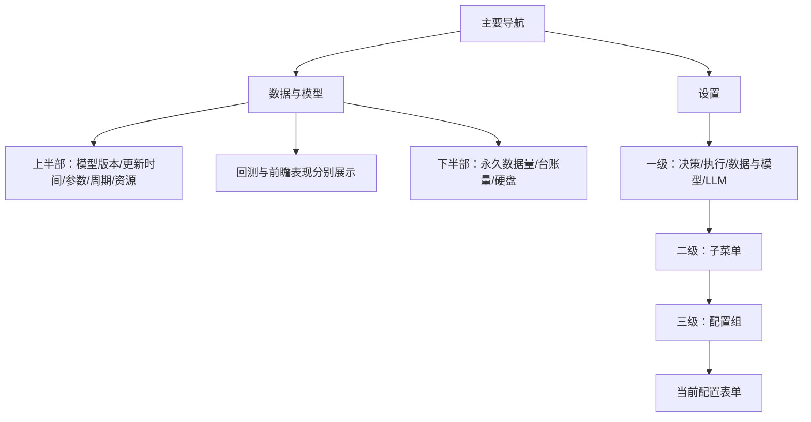

# 数据与模型及三级设置



```text
┌ 足球研究  [滚球][推荐][战绩][数据与模型][设置]  账户 ┐
│ 数据与模型                                  刷新 │
│ 模型状态    最新更新时间   参数量   版本          │
│ 有效比赛/决策    更新进度    CPU/内存              │
│ 表现口径      比赛/决策     正确率 Brier Logloss   │
│ 时间隔离验证 / 同组基准 / 当前版本前瞻 / 前瞻基准 │
├ 持久化数据与硬盘                         统计时间 ┤
│ 台账决策/比赛  文件数  数据量  总容量 已用 可用    │
│ 数据类别       文件数      逻辑大小      实际占用 │
└ 永久保存说明                                    ┘

┌ 设置                             配置版本       ┐
│ [决策] [执行] [数据与模型] [LLM]    一级          │
├───────────────┬─────────────────────────────────┤
│ 模型训练      │ [更新周期][资源限制]    三级       │
│ 实时数据 二级 │ 数据与模型 / 模型训练 / 资源限制 │
│               │ CPU核数  [1]                    │
│               │ 内存MiB  [512]                  │
└───────────────┴─────── 重新读取  保存并立即生效 ─┘
```

切换三级菜单仅隐藏表单，不重建输入；未保存修改保留。保存提交全体配置，数字/URL无效时切换到相应组并定位；服务端版本冲突不会丢弃草稿。重新读取是用户明确丢弃草稿的操作。

| 状态 | 交互与显示 |
| --- | --- |
| Default | 实际模型与存储统计，最近统计时间；当前组显示并有面包屑 |
| Loading | 首屏模型骨架/正在读取，按钮禁用；后台首次统计显示统计中 |
| Empty | 未训练字段为“未训练”、无有效样本为“暂无有效样本”，不是0% |
| Error | 请求/训练/部分统计失败提示，可刷新；旧模型与旧统计仍可显示 |
| Edge-Case | 模型版本和长错误文本换行，小屏双列指标、三级菜单换行，表格局部滚动 |

表格Brier及Log loss越低越好，正确率仅表示非走盘方向判别。训练参数量与LLM模型标识区分，LLM提供方并未公开的参数量不猜测。
