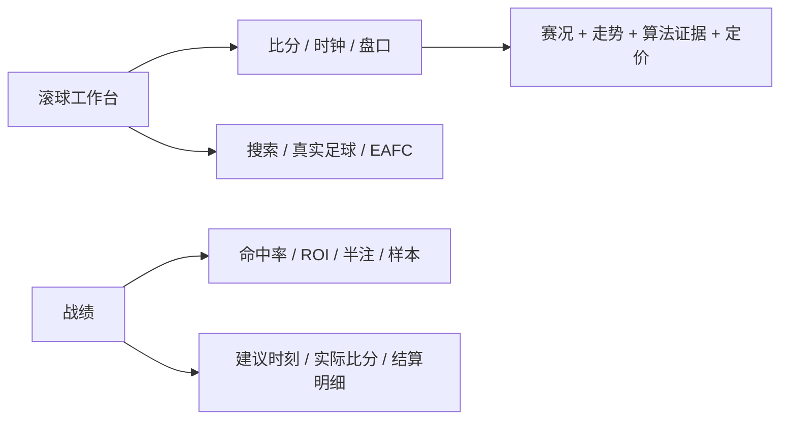
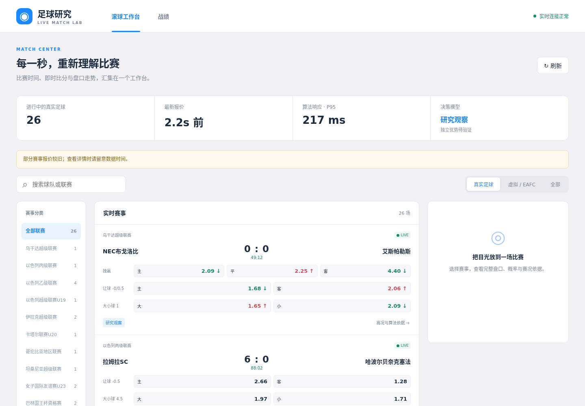
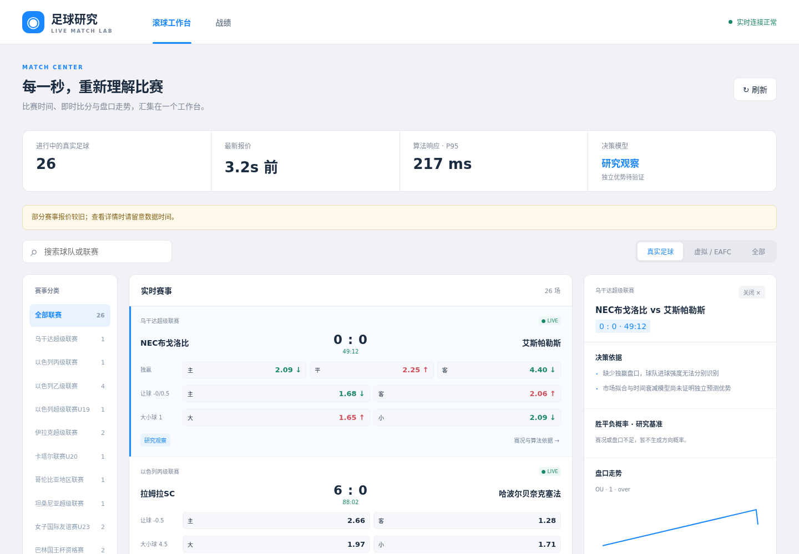
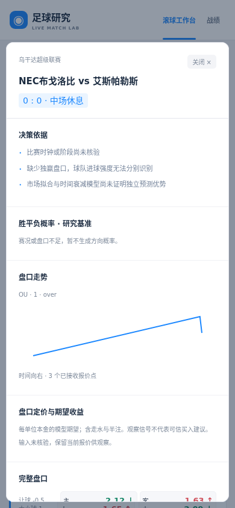
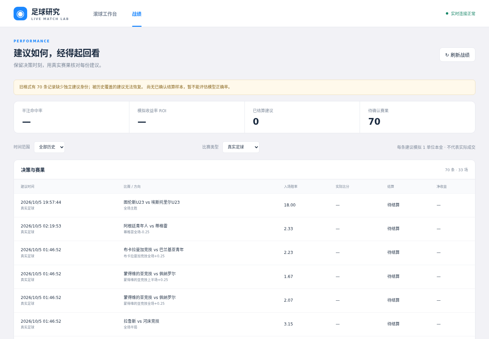

# 滚球工作台原型（TASK-25）

参考：用户提供的乐鱼 App ZIP 内 APK，经 jadx 只读提取的 `res/values/colors.xml`（一手证据 A）。借鉴白底、蓝色选中态、浅灰分组、紧凑赛事行；无品牌图标拷贝。

|token|App 实值|用途|
|---|---|---|
|primary|#1c88ff|选中导航/盘口/操作|
|page|#f2f2f6|页面背景|
|surface|#ffffff|赛事、详情卡片|
|selected|#e8f3ff|选中盘口|
|border|#e4e6ed|行边框|



```text
桌面
┌ 足球研究工作台   [滚球工作台] [战绩]            ●实时连接 / 算法延迟 ┐
├ [搜索球队/联赛________] [全部/真实足球/虚拟]   [刷新]              ┤
│ 侧栏/筛选        赛事与盘口                       详情面板          │
│ 全部联赛         ┌ 联赛 · 实时类型 ─────────────────────────────┐ │
│ 真实足球         │ 58:12  主队 1 : 0 客队                       │ │
│ 虚拟 / EAFC      │ 主胜 [2.10] 平 [3.20] 客胜 [3.60]             │ │
│ 数据状态         │ 大小球 2.25  [大1.93 ↑] [小1.95 ↓]            │ │
│                  │ 算法：观察 / 可验证的原因 · 数据时间           │ │
│                  └─────────────────────────────────────────────┘ │
│                                                  比分与比赛阶段  │
│                                                  盘口走势线图    │
│                                                  概率/EV/数据缺口│
│                                                  [关闭详情]      │
└─────────────────────────────────────────────────────────────────┘
手机：导航和筛选置顶；赛事单列；点赛事打开详情，返回保留搜索和滚动位置。
战绩：总览卡 + 时间/类型过滤 + 日期/建议/入场赔率/赛果/半注盈亏明细。
```

|状态|显示与操作|
|---|---|
|Default|真实赛事、比分/分钟、盘口、算法观察/推荐、最后报价时间；点选详情不被刷新关闭|
|Loading|赛事骨架与加载说明；保留已读赛事并标更新时间，刷新按钮防重复|
|Empty|“没有符合筛选的赛事”，提供清除筛选；采集尚无行情时显示连接状态与刷新|
|Error|可见错误条、重试；旧内容明确标为已保存数据，禁止旧推荐冒充最新|
|Edge-Case|长队名换行/省略并可查看全名；缺比分显示 —；未知时长显示未核验；小屏不横向溢出|

只保留工作台和战绩。原 dashboard/board 合并，pricing/calibration 移入赛事详情与战绩验证区。页面不直接触发慢推理。不得在产品里显示无助于用户判断的协议签名/私有文件/环境变量。

## TASK-26：场次与分析密度修正（#27 / #28）

当前赛程不能被重启载入的历史终场集合过滤。按类型独立统计源端、订阅、算法结果和展示数量；源端计数不可用显示“—”，不把总足球计数放到真实足球栏。每秒轮询只读后台缓存与常数时间计数，不扫描完整盘口表，也不请求上游。

布局保留 App 白蓝配色，去掉宣传标题、页脚和侧栏说明。比赛卡直接显示三项概率条；详情以概率、剩余进球强度、带赔率/时间轴的可切换走势、赔率/模型概率/EV 表为主体。模型局限与数据缺口放到折叠区，估值明确标为模型基准。λ 是预期剩余进球数，不用百分比进度条表达。

```text
┌ 滚球工作台 / 战绩                                  ● 连接 ┐
│ 已分析场数 │ 数据源场数 │ 已订阅 │ 报价年龄 │ 算法 P95     │
│ 搜索球队/联赛                      [真实] [虚拟] [全部]   │
├ 联赛 ──────┬ 比分/时间 + 独赢/让球/大小球 ─┬ 赛事详情 ────┤
│ 联赛及场数 │ 主胜 ▰▰  平 ▰  客胜 ▰       │ 胜平负概率条 │
│            │ 盘口价格 ↑↓                │ 主/客 λ 数值 │
│            │ [详情]                     │ [选择盘口]   │
│            │                            │ 赔率/时间轴图│
│            │                            │ 赔率/概率/EV │
│            │                            │ ▸ 数据状态   │
└────────────┴────────────────────────────┴──────────────┘
```

|状态|本次补充验收|
|---|---|
|Default|源端/订阅/结果计数可不同；概率条、λ、EV 表、走势轴与盘口选择均可用|
|Loading|无源端缓存时计数为“—”；保留骨架，轮询不触发采集请求|
|Empty|确认空赛程显示 0；未知覆盖显示“—”；搜索无匹配可清除筛选|
|Error|断开和报价过期用短状态提示；保留缓存赛事与数据时间|
|Edge-Case|真实/虚拟/未知分类失败不混算；恒定价格曲线仍有可读坐标；手机不横向溢出|


## 生产页面参考（A，2026-10-08）

下图来自3003端口真实数据，无测试夹具。生产桌面1440×1000、手机390×844，详情自动刷新保留、盘口走势、历史真实/虚拟筛选和手机返回均通过浏览器验收，退出码0；Loading/Empty/Error/长队名等状态使用显式测试夹具单独验证。








