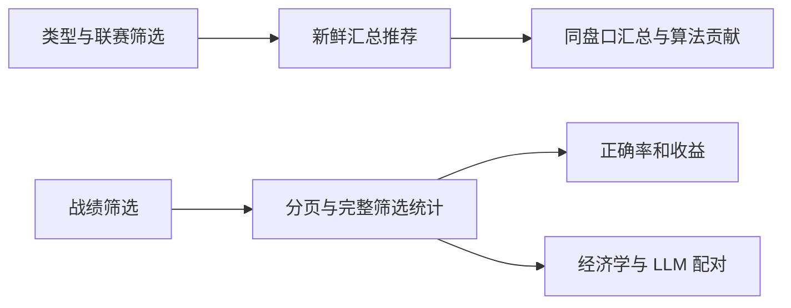

# 汇总推荐与战绩对照

参考：现有乐鱼 App 风格工作台 `docs/prototypes/live-workbench.md`。沿用密集盘口与数值卡片，以推荐、正确率、收益率、样本和权重为主。

```text
┌ 足球研究 ───────── 滚球工作台 · 战绩 · 设置 ─── 连接 ┐
│ 赛事数 / 订阅数 / 新鲜度 / 算法延迟                   │
│ 搜索球队                    真实 / 虚拟 / 全部        │
├ 推荐买入（模拟）─────────────────────────────────────┤
│ 球队对阵          盘口 @赔率                         │
│ 汇总概率 · 统计置信度 · 净EV · 冻结仓位               │
├ 联赛 Sidebar ─┬ 比赛 Content ───────┬ 汇总详情 ───────┤
│ 联赛 / 场数   │ 队名 / 比分 / 时钟  │ 盘口 / P / EV   │
│              │ 完整盘口 / 趋势    │ 展开算法权重     │
└──────────────┴────────────────────┴─────────────────┘
┌ 战绩 ───────────────────────────────────────────────┐
│ 全盘口正确率 / 样本 / 等额ROI / 置信度ROI / 仓位ROI  │
│ 汇总建议正确率与收益（独立记账，不重复本金）          │
│ 时间 / 类型 / 算法 / 首判、建议、旧记录              │
│ 算法 | 正确率/样本 | ROI | 权重 | 有效场次/Brier      │
│ 置信度区间收益         累计收益曲线                  │
│ 纯经济学 / +LLM：配对样本 / 正确率 / 覆盖 / 收益差   │
│ 决策时间 / 比赛方向 / 冻结赔率 / 真实赛果 / 半注盈亏  │
│                  上一页 · 查询耗时 · 下一页          │
└─────────────────────────────────────────────────────┘
```

| 状态 | 推荐与详情 | 战绩 |
| --- | --- | --- |
| Default | 同盘口汇总一行，展开算法贡献 | 正确率、样本、收益、权重与配对实验 |
| Loading | 保留已读内容，骨架显示首次加载 | 刷新按钮禁用，保留当前统计 |
| Empty | 暂无满足门槛的推荐 | 暂无记录；实验未开始显示待启用 |
| Error | 请求失败即标记过期，移除推荐 | 展示错误，保留已有数据允许重试 |
| Edge-Case | 长队名截断；暂停/过期无买入 | pending/void 指标不计；空分母显示 —；移动表格横向滚动 |


