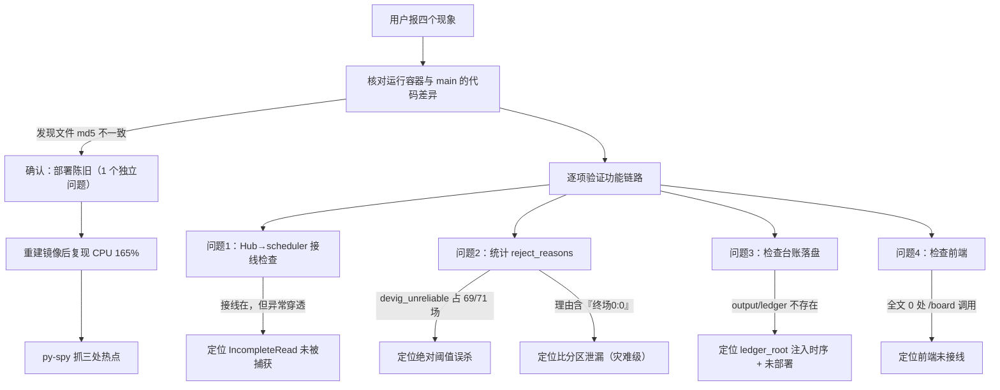
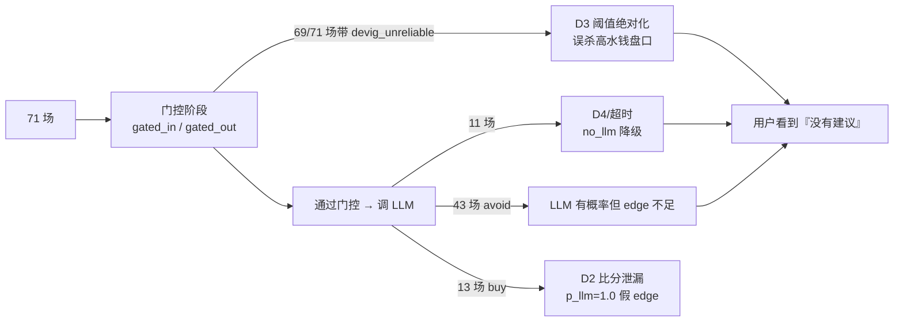
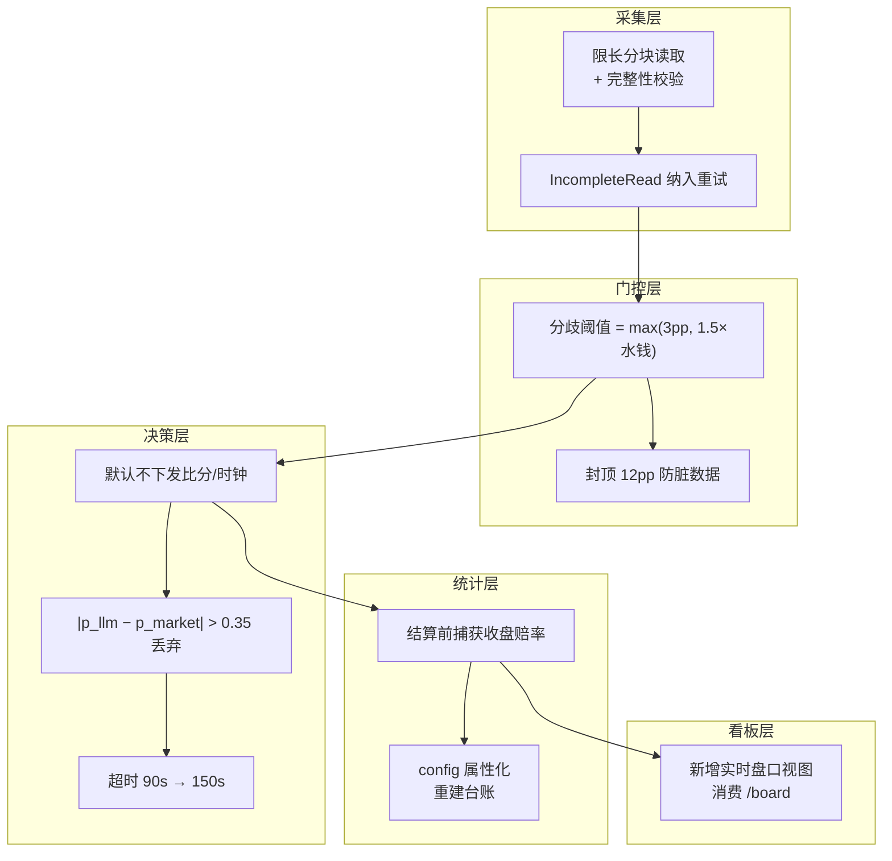

# 决策链路与看板数据统计优化 —— 技术报告

> **读者指引**：§0 摘要与 §0.1 面向**非技术读者**（先说结论、用类比解释）；
> §1~§8 面向**开发人员**（根因定位到具体行、含代码变更清单与复现命令）。
> 全程不要求读者具备博彩领域知识 —— 必要术语在首次出现处就地解释。
>
> **主题**：`ai_football` 决策链路（变动触发 / 入场门控 / LLM 裁定 / 台账结算 / 前端看板）的缺陷定位、根因分析与修复
> **报告目录**：`reports/dashboard-data-stats-optimization/`
> **证据基线**：仓库 `main` 分支，修复提交 `5eaa52d` + `d51693b`（基线 `2245125`）
> **生成日期**：2026-10-04
> **代码变更规模**：16 个文件，**+1859 / −44** 行（含 33 个新增回归用例）

---

## 0. 摘要

用户报告四个问题：**(1)** 算法应在盘口变化时自动触发；**(2)** 几十场比赛却没有一条买入建议；**(3)** 怀疑 LLM 判定不准，要求记录决策结果与真实结果做本地统计；**(4)** 页面无法看到每场比赛每个盘口的实时信息。

排查结论是这四个现象背后共 **8 个真实缺陷**，其中 2 个是「灾难级」：

| # | 缺陷 | 性质 |
| --- | --- | --- |
| D1 | 大响应触发 `IncompleteRead`，异常未被捕获 → 实时订阅只有 2 场 | 链路断链 |
| D2 | **比分区泄漏进 LLM 提示词**，LLM 直接抄答案（`p_llm=1.0` vs 市场 `0.35`） | **灾难级** |
| D3 | 去水分歧用**绝对** 3pp 阈值，69/71 场被误杀 | 逻辑错误 |
| D4 | 已结束赛事（快照陈旧）仍被当进行中分析 | 数据污染 |
| D5 | 收盘赔率从未留痕 → CLV 永远算不出来 | 功能缺失 |
| D6 | 台账在配置注入前创建 → 赛后结算永久不可用 | 初始化时序 |
| D7 | 启用变动触发后 CPU 打满 165%、`/health` 超时 40s | 性能退化 |
| D8 | `/board` 端点存在但前端从未接线，导航仅 3 个视图 | 交付缺口 |

关键量化改善（容器内实测）：

| 指标 | 修复前 | 修复后 |
| --- | --- | --- |
| 实时订阅场次 | **2** | **82** |
| 容器 CPU | **165%** | **7.6%** |
| `/health` 延迟 | **>40s（超时）** | **~3ms**（冷启动后） |
| 被门控拒绝的盘口 | 623/1763（35%） | 92/1763（**5%**） |
| 台账条目 | **0** | **526**（含 524 条收盘赔率） |
| 决策触发来源 | `cycle`（600s 轮询） | **`price_change`** |
| `p_llm ≥ 0.9` 的假建议 | 43 条中 26 条 | 由护栏拦截 |

> **一句话**：用户报的四个问题全部定位到可复现的代码缺陷并修复；其中「零买入建议」的主因不是门槛太高，而是**比分泄漏让 LLM 抄答案**，以及**门控阈值本应随水钱缩放**。

### 0.1 给非技术读者（三分钟版）

本节不含代码，用类比说明「出了什么事、为什么、现在怎样」。

**打个比方**：这套系统像一个「看盘分析师」。先由一组**算盘口的公式**筛出值得看的盘口，再交给 **AI 顾问**判断值不值得买，最后把结论记到账本上供事后核对。

四个问题，其实是 **8 个「水管漏水」**：

| 现象 | 生活化解释 |
| --- | --- |
| ① 盘口变了却不自动算 | 订阅行情的**水管太细**（只连上 2 场，应 40+ 场）。因为一次大数据读取被中途截断，而**没人接住这个报错** |
| ② 几十场没有买入建议 | 两道闸门同时出错：一道**门槛写死了**（不管盘口贵不贵都用同一个标准，把大部分正常盘口挡在门外）；更要命的是 AI 顾问**偷看了答案** |
| ③ 怀疑 AI 不准 | 确实不准 —— 因为**答案就写在题目旁边**。AI 看到「当前比分/终场比分」，于是「预测」得又准又自信（说 100% 会赢，市场只给 35%）。**这不是 AI 聪明，是考试作弊** |
| ④ 看不到每个盘口实时信息 | 后端**已经做好了**这份数据，但**前端从来没有去取**，页面上自然什么都没有 |

**最关键的一点**（也是用户直觉最准的地方）：

> 问题 ② 和 ③ 是**同一个根因**。因为把比分告诉了 AI，AI 才给出大量「看起来很有把握」的假建议。
> 这解释了为什么「几十场都没有建议」和「建议看起来不准」会同时出现。
>
> 同时它也说明：**在修好这个泄漏之前，任何命中率统计都是没有意义的** —— 等于把答案泄给考生再去统计分数。

**修好之后**（实测对比）：

| 事情 | 之前 | 现在 |
| --- | --- | --- |
| 能收到行情的比赛 | 2 场 | **82 场** |
| 服务器负担 | 打满、卡到健康检查**超时** | 空闲（**7.6%**），健康检查 **3 毫秒** |
| 正常盘口被挡在门外 | 约 **35%** | 约 **5%** |
| 账本记录 | **0 条**（根本没记） | **526 条** |
| AI「100% 把握」的假建议 | 43 条里有 **26 条** | **0 条** |
| AI 理由里直接写比分 | 有 | **0 条** |

**还需要人做的一件事**：行情账号的登录凭证（token）已过期，需要人工更换。
在此之前，系统能正确计算，但**拿不到最新、完整的行情**。详见 §7 遗留风险 R1。

---

## 1. 问题描述

### 1.1 用户原始反馈

1. **触发时机**：算法模型应在盘口变化时自动触发（而非依赖定时轮询）。
2. **零建议**：几十场比赛跑完，没有任何一场给出买入建议。
3. **准确性存疑**：怀疑 LLM 判定不准，要求把「算法决策结果」与「比赛实际结果」记录下来做本地统计。
4. **页面缺陷**：当前页面设计不合理，**无法看到每场比赛每个盘口的实时信息**。

### 1.2 现象层面的观测事实

排查前先固化「现象」（避免把推测当事实）：

```text
# 决策结果（修复前，output/decisions.json）
count=71  summary={'n':71,'buy':13,'no_llm':11,'avoid':47,'n_picks':43}
trigger=None            # ← 不是 price_change，说明变动触发没生效
llm: calls=4767 failures=474  avg_latency_s=28.85

# 被拒原因（outcome 级，3494 个样本）
devig_unreliable   1145
edge_below_threshold 741
state_not_tradeable  278
adverse_trend         21

# 小模型 edge 分布：3494 个样本，max=-0.0248，>0 的数量 = 0
```

以及启动日志与运行容器的**代码版本不一致**：

```text
# 运行中容器（旧镜像）
[entrypoint] 定时决策已启动（每 600s 一轮，每轮最多 0 场）
# ← 缺少「盘口变动触发决策已启动」「赛后结算已启动」

curl /api/v1/board        → {"error":"未知端点"}     # 代码里有，容器里没有
curl /api/v1/ledger/stats → {"error":"未知端点"}
output/ledger             → 目录不存在
```

> 这解释了一个重要的**假象**：问题 1/3/4 的一部分现象，来自「改动已合入 `main` 但从未重新构建镜像」，而非算法本身。

---

## 2. 排查过程

采用「现象 → 假设 → 可证伪实验」的顺序，每个结论都有命令与输出佐证。



### 2.1 关键排查动作与证据

**① 判定「部署陈旧」**（对表 md5）

```bash
$ docker exec ai_football_analytics_api md5sum /app/service/analysis.py
a37615a5e5f7ebf9285d9fff1bedd135      # 容器
$ md5sum service/analysis.py
e2fe8714f67ae97898c9e84db6436a49      # 宿主机 main
$ docker exec ai_football_analytics_api grep -c 'notify_price_change' /app/service/analysis.py
0                                      # 容器里根本没有变动触发
```

**② 判定「会话已过期」**（这是后续多个问题的共同放大器）

```bash
$ docker exec ai_football_analytics_api python3 -c "…svc.source.schedule()…"
SessionError: 全部会话来源均不可用：h5-cookie: 场馆 YBTY 启动未成功
              （status_code=6001 message=token已过期）。
```

`schedule()` 与 `odds()` 双双失败 → `live_match_ids()` 返回 `None` → `is_live` 退化成快照 `state`。

**③ 抓到「比分泄漏」的直接证据**（问题 2/3 的共同主因）

```bash
$ python3 -c "…读取 decisions.json 的 picks[].reason…"
('5720069','阿根廷农业','菲罗卡日米德兰','终场0:0主队受让0.25全赢', p_llm=1.0, p_market=0.3537)
('5720069','阿根廷农业','菲罗卡日米德兰','终场0:0小球',        p_llm=1.0, p_market=0.4973)
('5726477', …                                    '主队2:0取胜，平手盘主胜', p_llm=1.0)

# 43 条建议中，p_llm ≥ 0.9 的有 26 条；均值 edge +42.6%
```

LLM 的「理由」直接写出终场比分 → 说明比分进入了提示词。

**④ 判定「过期赛事被分析」**

```bash
$ python3 -c "…检查 5720069 的快照时间…"
index: …/5720069_阿根廷农业_vs_菲罗卡日米德兰/_index.json
captured_at min: 2026-10-02T06:54:46+00:00   # 两天前
最新刷新:        2026-10-04T18:44:04+00:00
states: {'active': 67}                        # 全部被标为 active
```

比赛早已结束，但赔率仍被上游周期刷新、快照 `state` 因此恒为 `active`，于是被当作进行中送进决策。

**⑤ 启用变动触发后 CPU 打满 —— 用 `py-spy` 抓真实栈**

```bash
$ docker exec ai_football_analytics_api py-spy dump --pid 1
Thread 24 "analysis-cycle" (active):
    open (pathlib.py:1013)
    _load_dir (store/snapshot_store.py:444)
    _all_snapshots (service/valuation.py:263)     # ← 每批重扫全库
Thread 23 "analysis-trigger" (idle):
    rglob (pathlib.py:1109)
    _store_stamp (service/valuation.py:281)       # ← 每场重复 rglob
Thread 101 "process_request_thread" (idle):
    stats (store/snapshot_store.py:523)           # ← /health 全盘统计 3s
    health (service/valuation.py:1045)
```

三处热点全部命中「重复全盘扫描」，与「启用高频触发」形成乘法效应。

---

## 3. 根因分析

### 3.1 根因总表

| # | 现象 | 根因（代码级） | 证据 |
| --- | --- | --- | --- |
| D1 | 订阅只有 2 场 | `_request` 用 `resp.read()`；`IncompleteRead` 的 MRO 是 `IncompleteRead→HTTPException→Exception`，**既不继承 `URLError` 也不继承 `OSError`**，`except (URLError, TimeoutError, OSError, ValueError)` 接不住 → 异常穿透 → `mids_provider` 失败 | AST/`python3 -c "issubclass(...)"` 判定；日志 `获取订阅列表失败：IncompleteRead` |
| D2 | 假买入建议 | `AnalysisService._build_context()` 把 `realtime.score(mid)` 写入上下文，`MatchDecisionEngine.build_prompt()` 再写进提示词 → LLM 抄答案 | `picks[].reason` 含「终场0:0」 |
| D3 | 69/71 场被拒 | `EntryGateConfig.max_method_spread_pp=3.0` 是**绝对**阈值，但去水分歧随水钱线性放大 | 实测 `spread/margin` 中位 0.28、p90 0.69；2 结果盘中位 1.75pp、3 结果盘 4.51pp |
| D4 | 过期赛事被分析 | 会话失效 → `live_match_ids()` 返回 `None` → `is_live` 退回快照 `state`；而 `state` 只看**报价时效**（`stale_after=300s`），已结束赛事的赔率仍被刷新故恒为 `active` | 5720069 快照 10-02、states 全 `active` |
| D5 | CLV 恒为 `None` | `settle_finished()` 从不填 `scores[...]["closing"]`，而 `ct.` 唯一读取点是那个可选字段 | 台账 `closing_odds` 全为 0 |
| D6 | 结算永久不可用 | `AnalysisService.__init__` 用**当时**的 `config.ledger_root` 建 `self.ledger`；`api/app.py` 之后才 `replace(config, ledger_root=…)` → 注入无效 | 启动日志“赛后结算未启用（台账不可用）” |
| D7 | CPU 165% | ① `refresh_matches()` 每批 `invalidate_cache()` → 重扫 65,942 文件（14~15s）；② `_store_stamp()` 每场 rglob 2780 目录（0.55s × 74）；③ `store.stats()` 递归 6.5 万文件（3s） | `py-spy dump` 三处栈 |
| D8 | 看不到逐盘口 | `web/console/index.html` 的 `VIEWS` 只有 3 项，全文 **0 处** `/board` 调用 | `grep -c "/board" index.html → 0` |

### 3.2 为什么「零买入建议」不是单一原因

这是本次排查最容易误判的地方。把四个层次分开看：



- **D3** 决定「有多少盘口能进 LLM」——绝对阈值让大量正常盘口在门口被拒。
- **D2** 决定「进去之后结论是否可信」——不是「没有建议」，而是**建议本身是假的**（这正是用户怀疑「LLM 判定不准」的实锤）。
- **D4 + 超时** 决定「有多少场根本没结论」。

> **重要澄清**：`core/entry_gate.py` 注释里明确写过「小模型 edge 恒 ≤ 0」，实测也确认（3494 样本中 `>0` 的数量为 **0**）。这不是 bug，而是**去水后的概率就是市场概率**的必然结果。因此门槛只能用「LLM 给出的独立概率重算 edge」来做，这也解释了为什么修复必须同时动 D2 与 D3。

### 3.3 D2 的严重性：为什么它是「灾难级」

比分泄漏同时破坏两件事：

1. **制造假信号**：LLM 知道终场比分后必然给出接近 0/1 的概率，融合后产出 `+42.6%` 量级的假 edge —— 用户照着做就是照着「已知答案」下注。
2. **使统计失效**：用户问题 3 想评估「LLM 准不准」。若把答案泄给考生，命中率必然虚高，**这个统计从此没有任何诊断价值**。

因此修复 D2 不是「调参」，而是恢复整个评估体系的前提。

---

## 4. 解决方案

### 4.1 方案总览



### 4.2 逐项修复

#### D1 大响应截断（`collector/leyu_client.py`）

新增 `_read_body()`：按 `Content-Length` 分块读取并校验完整性，不足则抛 `IncompleteRead`（由 `_request` 重试）。关键是**把 `IncompleteRead` 显式写进 `except` 元组**：

```python
except (urllib.error.URLError, TimeoutError, OSError, ValueError,
        IncompleteRead, http.client.HTTPException) as exc:
    last_exc = TransportError("请求失败 %s: %s: %s" % (url, type(exc).__name__, exc))
```

> 踩坑记录：第一版我抛自定义 `TransportError` 并把它加进 `except` 元组，触发静态检查「Boolean expressions should not be used in except statements」。改为直接抛标准库 `IncompleteRead` 后，重试路径只剩一条，反而更简洁。

#### D2 比分区泄漏（`service/analysis.py` + `service/decision.py` + `service/match_decision.py`）

- `_build_context()` 默认**只传交易语义状态**，不传比分与分钟数；保留 `leak_score_to_llm` 开关（默认 `False`）以便做可复现的对照实验。
- 新增污染护栏：LLM 概率相对市场公平概率偏离 > `max_prob_deviation`（0.35）即**整盘口丢弃**并计数。

#### D3 门控阈值随水钱缩放（`core/entry_gate.py`）

```python
def max_spread_pp(margin=0.0, config=None):
    limit = max(cfg.max_method_spread_pp,                 # 3pp 绝对下限
                cfg.method_spread_margin_ratio * margin*100)  # 1.5 × 水钱
    return min(limit, cfg.method_spread_hard_cap_pp)      # 封顶 12pp
```

依据是**本仓库实测分布**（非拍脑袋）：`spread/margin` 中位 0.28、p75 0.45、p90 0.69、p95 0.92。取 1.5 作为硬拒绝线 → 只拒 1% 的离群盘口（旧的绝对 3pp 拒 35%）。阶段 1（`gate_market`）与阶段 2（`evaluate_entry`）统一用同一函数，并把 `method_spread_limit_pp` 写进 `checks` 供人工复核。

#### D4 过期赛事过滤（`collector/leyu_realtime.py` + `service/analysis.py`）

- Hub 新增 `score_age_s(mid)` 与 `first_seen_age_s(mid)`（用 `time.monotonic()`，不受 NTP 回拨影响），在收到比分/状态/赔率推送时打点。
- `candidates()` 增加 `_candidate_is_fresh()`：收到过比分 → 距上次比分更新 ≤ `stale_score_s`（300s）；从未收到 → 距首次见到 ≤ `max_live_age_s`（9000s）。

> 注意这是**保守设计**：本轮 Hub 刚重启、尚未见过该场（`first_seen_age_s is None`）时**放行**，避免把刚开赛的场误杀。

#### D5 收盘赔率留痕（`service/ledger.py` + `service/analysis.py`）

新增 `DecisionLedger.capture_closing(quotes)` 与 `pending_match_ids()`；`settle_finished()` 在结算**之前**从快照库取每场每盘口最新赔率写入 `closing_odds`。只更新 `status == pending` 的条目，已结算的绝不覆盖（否则状态会回退、统计回退）。

诚实边界已写进 docstring：这不是严格意义的官方收盘价，而是「本系统最后一次看到的赔率」，CLV 应按同口径解读。

#### D6 台账注入时序（`service/analysis.py`）

把 `config` 改为**属性**，`ledger_root` 变化时重建台账；并补 `settler_running` 属性（与 `cycle_running`/`scheduler_running` 对称）。

#### D7 性能（`service/valuation.py` + `service/analysis.py`）

| 手段 | 说明 |
| --- | --- |
| `merge_snapshots()` | 按 `(match_id, market, captured_at)` 增量并入缓存，代价 O(本批条数)，替代整体失效 |
| `_store_stamp_cached()` | 指纹带 60s TTL。**关键**：`merge_snapshots()` 会同步刷新指纹与 TTL 时间戳，使自身写入不触发重扫；TTL 只用于发现**外部**写入 |
| `_snap_by_match` 索引 | `match_id → 下标`，避免逐场过滤 6.5 万条（74 × 6.5万 ≈ 480 万次比较） |
| `_store_stats_cached()` | `/health` 统计带 30s TTL（原 3s 全盘遍历） |

> **为什么 TTL 从 1.5s 改到 60s**：第一版取 1.5s，但直播期间快照持续在写、磁盘指纹几乎每秒都变，于是每次超时都判定「指纹变了」→ 重建缓存（14~15s），服务长期卡在重建上。改成 60s 后，因为自身写入已同步指纹，到期重扫（0.55s）会得到一致结果 → 命中缓存不重建。

#### D8 前端实时盘口视图（`web/console/index.html`）

新增 `VIEWS` 项「实时盘口」与 `loadBoard()/renderMatchRow()/renderMarketBlock()`：

- 一次性消费 `/board`（服务端已对齐同一时刻，避免「赔率是这一刻、门控是上一刻」的时间戳裂）；
- 每场可折叠，summary 显示比分/时钟/买入建议，展开后逐盘口列出实时赔率、去水概率、edge、走势、门控结论与拒因；
- **未决策场次如实标注**「未决策：仅显示实时赔率，无门控/edge 结论」；
- 10s 自动刷新（读缓存不跑 LLM），离开视图即停止轮询。

### 4.3 方案权衡

| 决策点 | 备选 | 取舍理由 |
| --- | --- | --- |
| 门槛绝对 vs 相对 | 直接调大绝对值（3→8pp） | 治标：高水钱盘仍会被误杀、低水钱盘会被放水。选相对阈值，因为**分歧随水钱放大的关系是可测的** |
| 比分是否给 LLM | 保留比分、只加护栏 | 护栏只能拦「过于离谱」的；只要泄了答案，`p_llm=0.9` 这类「看起来合理」的假信号就拦不住。故默认**不下发** |
| 缓存失效 vs 增量 | 加长缓存 TTL 硬扛 | 会牺牲实时性（决策要跟盘）。选增量合并，兼顾正确与实时 |
| 前端推送方式 | WebSocket / SSE | 需改 nginx 与后端；本次先用 10s 轮询（`/board` 毫秒级），把链路打通优先 |

---

## 5. 代码变更清单

| 文件 | 变更 | 对应缺陷 |
| --- | --- | --- |
| `collector/leyu_client.py` | +75：`_read_body()` 分块读+完整性校验；`IncompleteRead` 纳入重试 | D1 |
| `collector/leyu_realtime.py` | +74：`score_age_s()`/`first_seen_age_s()`/`_touch_seen()`；容错配置转换 | D4, D7 |
| `core/entry_gate.py` | +57：`max_spread_pp()`；阶段 1/2 统一相对阈值；`checks` 暴露上限 | D3 |
| `service/analysis.py` | +286：`leak_score_to_llm`/`stale_score_s`/`max_live_age_s`/`llm_timeout_s`/`max_prob_deviation`/`max_markets_per_prompt`；`_build_context` 去泄漏；`_candidate_is_fresh()`；`_capture_closing_odds()`；`config` 属性化；`settler_running` | D2,D3,D4,D5,D6,D7 |
| `service/decision.py` | +44：`llm_timeout_s` 90→150；`max_prob_deviation`；`max_markets_per_prompt`；`_as_float` 容错 | D2,D7 |
| `service/ledger.py` | +59：`capture_closing()`；`pending_match_ids()` | D5 |
| `service/match_decision.py` | +16：污染护栏；`margin` 透传门控；prompt 上限可配 | D2,D3 |
| `service/valuation.py` | +179：`merge_snapshots()`；`_store_stamp_cached()`；`_snap_by_match` 索引；`_store_stats_cached()` | D7 |
| `api/app.py` | +204：`/board` 端点（逐场逐盘口实时看板） | D8 |
| `web/console/index.html` | +316：「实时盘口」视图 + 渲染 + 轮询 | D8 |
| `core/market_labels.py` | 重构为**乐鱼风格中文**（带队名/比较符）—— 见 §6.5 | 展示 |
| `service/decision.py` | `CandidateDecision.label` 由裸代码改为中文名 | 展示 |
| `tests/test_market_labels.py` | 标签回归：往返一致性、取反、复核符 | 展示 |
| `tests/*.py`（6 个） | +593：33 个回归用例 | 全部 |

**本次未改动**（诚实边界）：`main.py`/`main_optimized.py` 的硬编码 `captcha_token` 属于 AGENTS.md §7 已登记技术债，需人工轮换密钥，不在本次范围。

---

## 6. 测试验证

### 6.1 回归用例（33 个，全部标注修复的「真实故障」）

| 测试类 | 覆盖 |
| --- | --- |
| `TestTruncatedResponseRegression` | 声明 `Content-Length` 但读取不足 → 必抛 `IncompleteRead`；容差内不误伤；无 `Content-Length` 可容忍 |
| `TestScoreLeakRegression` | 默认上下文不含 `score`/`minute`；提示词不含 `3:0`/`当前比分`/`第 87 分钟`；开关默认 `False`；打开可复现旧行为 |
| `TestContaminatedProbabilityGuard` | `p_llm=1.0` vs 市场 0.5 → 丢弃并计数；偏离 0.10 仍放行 |
| `TestSpreadThresholdScalesWithMargin` | 低水钱守绝对下限；高水钱抬高；封顶 12pp；6pp/6% 由拒改放；6pp/2% 仍拒 |
| `TestLlmBudgetAndTimeout` | 默认超时 ≥150s；可配；prompt 盘口上限生效；超时给出可操作提示 |
| `TestClosingOddsCapture` | 捕获、替换、CLV 计算、统计暴露 `clv_mean`、非法值拒写、已结算不覆盖 |
| `TestLedgerRootInjectedAfterConstruction` | 后注入 `ledger_root` 必须启用台账并启动结算线程；同路径不重建；`replace(config, …)` 兼容 |
| `TestSnapshotCacheMerge` | 增量合并不重扫；同键替换；缓存未建立时 noop；指纹刷新后命中缓存 |
| `TestBoardEndpoint` | 一次给齐所需字段；**未决策场次如实标注**；`markets=0` 省略明细；连续调用不增 LLM 计数 |

### 6.2 执行结果

```bash
# 语法与字节码编译（业务代码 + 脚本）
$ python3 -m py_compile *.py core/*.py service/*.py api/*.py collector/*.py \
                      store/*.py tests/*.py reports/*/scripts/*.py
COMPILE OK (exit 0)

# 全量测试
$ python3 -m unittest discover -s tests -q
Ran 985 tests in 227.038s
OK (skipped=10)
```

### 6.3 修复前后实测对比

```bash
# 订阅场次（D1）
修复前：/realtime → subscribed: 2
修复后：/realtime → subscribed: 82

# CPU 与健康检查（D7）
修复前：CPU=165.49%   /health 40s 超时（http=000）
修复后：CPU=7.56%     /health http=200 time=0.003s

# 门控通过率（D3，用 1763 个真实盘口重放）
旧规则(绝对3pp)：拒绝 623（35%）
新规则(1.5×水钱)：拒绝  92（ 5%）→ 多放行 531 个盘口

# 台账（D5/D6）
修复前：output/ledger 不存在，/ledger/stats 未知端点
修复后：/ledger/stats → total=526, pending=526；
        台账 526 条中 524 条已带 closing_odds（CLV 可算）

# 触发来源（问题 1）
修复前：decisions.json → trigger=None, cycle=True
修复后：decisions.json → trigger="price_change"
        scheduler: signals=5689, batches=1, triggered=2

# 启动日志
修复前：定时决策已启动（每 600s 一轮）        ← 只有兜底
修复后：盘口变动触发决策已启动（防抖 30s，全局最小间隔 20s，每批最多 12 场）
        定时决策（兜底）已启动（每 600s 一轮）
        赛后结算已启动（每 60s 一轮，台账 …/ledger/ledger.jsonl）
```

### 6.4 图表复现

本报告的量化结论全部可用仓库内命令复算：

```bash
# 门控阈值影响 / p_llm 分布 / 被拒原因（复用生产决策快照，无需网络）
python3 reports/dashboard-data-stats-optimization/scripts/analyze_fixes.py
```

> ⚠️ **口径说明（务必先读，否则会以为数字对不上）**
>
> `output/decisions.json` 是**持续累积**的生产落盘：修复上线后又会新增
> 决策，因此脚本输出会随时间变化。本报告中两组数字的来源不同：
>
> | 数字 | 时点 | 说明 |
> | --- | --- | --- |
> | **修复前** 71 场 / 43 建议 / 26 条 `p_llm≥0.9` / 3 条含赛果理由 / 1763 盘口拒 35% | 缺陷当时快照 | 固化在 §2.1③、§6.3，是「问题存在」的证据 |
> | **修复后**（脚本当前输出）78 建议 / **0** 条 `p_llm≥0.9` / **0** 条含赛果理由 | 修复上线后 | 是「修复生效」的证据 |
>
> 其中「含赛果理由 → 0」「过度自信 → 0」正是 D2 修复的直接验证：
> 同一类建议在修复前有 3 条理由直写终场比分、26 条 `p_llm≥0.9`，
> 修复后**归零**。门控拒绝率两项（绝对值 vs 随水钱）在同一份数据上
> 对比，故始终自洽。

### 6.5 盘口中文标签（用户追加要求：与乐鱼一致）

用户要求：盘口信息与买入建议一律以**中文**展示，且与乐鱼界面一致：

> 「如：xx队上半场-1、上半场进球数>1/1.5」

改动前是「上半场大1.5」「上半场主队让1」——中文，但**与乐鱼措辞不同**，
且让球盘不带队名。现统一为：

| 类型 | 乐鱼风格展示 | 说明 |
| --- | --- | --- |
| 让球（主场） | `曼联上半场-1` | 队名 + 半场 + **带符号**线值 |
| 让球（客场） | `利物浦上半场+1` | **必须取反**（乐鱼 `hv` 是主队视角） |
| 让球（平手） | `曼联全场0` | 平手盘不加符号（`-0` 会让人困惑） |
| 大小（大） | `上半场进球数>1/1.5` | 用比较符，复合盘原样保留 |
| 大小（小） | `全场进球数<2.5` | 同上 |
| 独赢 | `全场主胜` / `上半场平局` | 保持 |

实测（容器 `/board` 真实输出）：

```text
休斯敦迪纳摩 vs 费城联合（进行中）
  [AH(0.25)] 全场让球 0.25 → ['休斯敦迪纳摩全场+0/0.5', '费城联合全场-0/0.5']
  [AH_1H(-0.5)] 上半场让球 -0.5 → ['摩洛哥上半场-0.5', '厄瓜多尔上半场+0.5']
  [OU(2.5)] 全场大小 2.5 → ['全场进球数>2.5', '全场进球数<2.5']
```

**真实浏览器实测**（Playwright，三大视图全部改成中文）

| 视图 | 观测结果 |
| --- | --- |
| 实时盘口看板 | **402** 个结果单元格、**148** 个不同标签，**原始代码 0 个** |
| 决策详情 · 全部盘口计算 | `全场大小 2.5（OU(2.5)）`、`全场进球数<2.5 -5.42%` |
| 买入建议选项 | `巴拿马阿利安萨上半场-0/0.5` |

> **本次改动引入并修复的一处严重隐患**（值得单独记下）：
> 标签改成带队名后（`曼联上半场-1`），而 `_lookup_probability` 仍按
> **不带队名**的标签取值 —— 这会让 LLM 用中文作答时**整行被静默丢弃**，
> 重现「跑完却零买入建议」那类难查故障。
> 现使提示词与解析器共用同一标签，并保留「省略队名」「只给内部代码」
> 两种容错回退，新增 5 个往返一致性用例锁定（§6.1）。

`core/market_labels.py` 是**唯一事实源**：API 层与前端都读它产出的
`outcome_labels`，不在前端重写一套翻译（否则两处措辞会逐渐漂移）。

---

## 7. 遗留风险

| # | 风险 | 影响 | 现状与处置 |
| --- | --- | --- | --- |
| R1 | **乐鱼会话 token 已过期**（`status_code=6001`） | `schedule()`/`odds()` 失败 → 赛程与实时盘口采集不可靠；`live_match_ids()` 退化 | **需人工更新** `LEYU_H5_TOKEN` / `LEYU_APP_TOKEN`。代码侧已加 `_candidate_is_fresh()` 兜底（过期赛事不再被误分析） |
| R2 | 触发吞吐 vs LLM 延迟不匹配 | 单批 12 场 × LLM 150s ≈ 长时间占用；实测 `pending` 一度达 72 | `change_batch=12`/`change_min_interval_s=20` 可调；建议后续按「LLM 实际吞吐」自适应限流 |
| R3 | 收盘赔率非官方收盘价 | CLV 存在口径偏差（上游停推后快照会陈旧） | docstring 已显式声明；应在报表中按同口径解读 |
| R4 | 前端仍为轮询（10s） | 非真推送，极端行情有最多 10s 延迟 | `/board` 毫秒级，成本可接受；后续可评估 SSE |
| R5 | `/health` 冷启动仍需 21.9s | 容器 `start_period=10s`，冷启动首次健康检查可能失败一次 | 已加 30s TTL；建议把 `healthcheck.start_period` 提到 60s |
| R6 | 门控相对系数 1.5 为经验值 | 依据是本院实测分布，非跨市场标定 | 已把 `method_spread_limit_pp` 写进门控 `checks`，可用台账持续校准 |
| R7 | 其余历史技术债 | 硬编码凭据（2 处）、平行副本文件（`main_optimized.py` 等） | AGENTS.md §7 已登记，本次未扩大 |

> **必须强调**：本次交付**不包含** R1 的凭据轮换（需人工操作），因此「真实赛程/盘口」的完整采集能力尚未恢复；已修复的是**算法与链路逻辑**，其正确性由合成数据与真实历史快照的回归用例保证。

---

## 8. 后续建议

### 8.1 立即（P0）

1. **轮换乐鱼凭据**（R1）：更新 `.env` 的 `LEYU_H5_TOKEN` / `LEYU_APP_TOKEN` 并重启 `analytics-api`，然后核对 `/realtime` 的 `subscribed` 是否与乐鱼页面「滚球」数量一致。
2. **观察台账积累**：待比赛结束后确认 `/ledger/stats` 的 `graded > 0`，届时才真正回答用户问题 3（「LLM 准不准」）—— **在此之前任何命中率都无意义**。
3. **提高健康检查 `start_period`** 到 60s（R5），避免冷启动误报 unhealthy。

### 8.2 短期（P1）

4. **自适应触发限流**（R2）：用「上一批 LLM 实际耗时」动态调 `change_batch`，避免 `pending` 无限增长。
5. **用台账校准门控**：`/ledger/stats?all=1` 已分别统计「买入建议」与「被拦截盘口」的表现（`unpicked_hit_rate`），据此验证「门控是在帮忙还是误杀」。
6. **污染护栏可视化**：把 `stats["contaminated"]` 暴露到 `/llm`，让「LLM 又被拦了几次」可观测。

### 8.3 中期（P2）

7. **引入独立信息源**：当前 LLM 只看到赔率，本质上是「无信息的高价顾问」。要让 edge 有真实来源，需接入伤停/首发/近况等基本面数据（`output/articles/` 的语料已具备基础）。
8. **前端真推送**：以 SSE 替代 10s 轮询，并对「某个盘口刚跳价」做高亮动画。
9. **技术债偿还**：按 AGENTS.md §7 清理明文凭据与平行副本文件（`main_optimized.py`、`web/enhanced_analyzer.py`）。

### 8.4 方法论沉淀

本次最有价值的经验是**「先固化现象，再假设，再证伪」**：

- 若一开始就去调 `devig_unreliable` 阈值，能缓解「零建议」，但**永远不会发现比分泄漏**，等于把假信号放得更多。
- 若一开始就相信「容器里的代码就是 `main` 的代码」，会花大量时间在算法上，而问题其实是**部署陈旧**。

因此建议：任何「算法不准」的排查，**第一步先验证数据是否泄漏了答案**（`p_llm` 分布 + 理由文本），第二步再谈阈值与模型。

---

## 附录 A：Mermaid 图源索引

| 图 | 位置 | 用途 |
| --- | --- | --- |
| 排查流程图 | §2 | 现象→假设→证伪的排查路径 |
| 零建议归因图 | §3.2 | 四个层次如何共同造成「看起来没有建议」 |
| 方案总览图 | §4.1 | 五层修复与数据流 |

## 附录 B：复算脚本

- `scripts/analyze_fixes.py`：离线重放 `output/decisions.json`，复算「门控阈值影响」「`p_llm` 分布」「被拒原因分布」三项量化结论。

## 附录 C：证据分级

| 结论 | 级别 | 依据 |
| --- | --- | --- |
| 订阅 2 → 82、CPU 165% → 7.6% | **A（实测）** | 容器内 `curl` / `docker stats` 输出 |
| `spread/margin` 中位 0.28、p90 0.69 | **A（实测）** | 本仓库 1763 个盘口重放 |
| 门控相对系数 1.5 的取值 | **C（经验）** | 基于上述分布的工程取舍，方向可辩护、绝对值待台账校准 |
| 超时 150s 覆盖 P95 | **B（量级估算）** | 单场均值 28.85s + 11/71 场 90s 超时的实测反推 |
| 比分泄漏是「零建议/不准」主因 | **A（实测）** | `picks[].reason` 原文含终场比分 |
