# 「实时倍率 → LLM + JEV 混合决策 → 自动买入」体育博彩交易机器人技术可行性与经济学可行性研究报告

**研究对象**：乐鱼体育（LEYU）、开云体育（KAIYUN）及同类实时赔率平台
**构想架构**：爬虫（非 API、含逆向）采集逐场实时倍率 → 在庄家调价瞬间触发决策 → LLM 大模型 + JEV 小模型组合判断 → 配合经济学算法计算仓位 → 自动下单

| 项目 | 内容 |
| --- | --- |
| 报告版本 | v3.0 |
| 研究范围 | **仅技术可行性与经济学可行性**（不含法律合规评估） |
| 分析口径 | 爬虫路径可实现性 · 赛事覆盖规模与数据完整性 · 延迟预算 · 信息优势来源 · 经济学公式体系 · 开源实现支撑 |
| 核心结论 | **数据采集层是唯一被开源项目充分验证可行的层；但覆盖面（§4）与协议漂移（§3）共同推高维护成本，经济学上整个方案是结构性负期望（§9/§10），且成交裁定权不在你手里（§5.3）。整体判定：不可行。** |

---

## 摘要

**1. 爬虫（非 API、含逆向）技术上可行，且已有开源项目完整验证。**

`stake-scraper` 证明：直接 `POST https://stake.com/_api/graphql` 复用站点内部 GraphQL 端点，**无需浏览器、无需 Selenium、无需 token** 即可读到盘口与实时注单流；`allusion` / `OddsHarvester` 证明 Playwright 浏览器自动化可覆盖 11 种运动、100+ 联赛；`snuper` 证明异步采集 + 不可变快照 + 流式推送的架构可行。

**但同一批仓库也给出了关键的反向证据**：`sports-odds` 作者在 README 中直接写下 —— *"It was good while it lasted. Betclic has changed their API, so I'm not able to scrape their odds"*（伴随 CloudFront 新增校验）。**协议变更不是一个风险假设，而是开源界公开记录的常态。** 采集层的工程成本不是"写通一次"，而是**持续对抗漂移**。

**2. 覆盖面要求（100–200 场、乃至全球赛事）把"完整性"变成最大的工程漏洞。**

CIES Football Observatory 统计 12 个赛季共 **330,748 场**官方比赛（≈75 场/日，仅统计进入其样本的赛事）。而平台开盘覆盖呈明显分层：

| 赛事层级 | 占日历 | 开盘覆盖 |
| --- | --- | --- |
| 前 5 大联赛 + 欧战 | 1% | 99% |
| 其余欧洲主流联赛 | 5% | 92% |
| 洲际/次级/杯赛 | 20% | 85% |
| 全球小众联赛 | 33% | 65% |
| 青少年/预备队/友谊 | 40% | **25%** |

**低层级赛事占日历 94%，而开盘覆盖率在长尾急剧下降。**按每场 140 个市场估算，盘口级采集量约 **5.7 万记录/天**，在盘高频推送下可达 **10⁷–10⁸ 事件/天**。完整性六维评估（图 15）显示：**没有任何单一采集路径能同时满足全部六个维度**，必须混合多种路径 —— 而这会直接放大维护成本。

**3. 经济学上打平需要在概率精度上相对优于庄家定价模型 11.4%。**

在盘滚球足球水钱典型区间 8%–20%，**均值 11.4%**；赛前头部仅 5.06%。由 `EV = −m/(1+m)` 得单注期望 **−10.23%**。打平条件 `p_model > p_fair × (1+m)` —— 需要的是 **11.4% 的相对优势**，而公开数据建模的现实相对优势是 **0–2%**。

**4. 去水方法的选择本身就能决定策略的符号。**（§8.1）

同一盘口（1.90 / 3.60 / 4.40）用四种方法去水，与 Shin 参考解的 L1 偏差可达 **0.83 pp**。而当可寻优势只有 1–2% 时，**去水偏差足以翻转 `edge` 的符号**。比例归一化在冷门上系统性高估（favourite-longshot bias 方向）。

**5. 相关性会让 naive Kelly 系统性过度下注。**（§8.5）

同场多市场（1X2 与大球）正相关 ρ>0.4 时，naive 逐注 Kelly 高估约 **1.67×**（ρ=0.6 时 **2.5×**）。必须用多元形式 `f* = Σ⁻¹μ` 而非逐注独立计算。

**6. 关键路径 29.0s，其中属于你的只有 1.8s；LLM 不应进关键路径。**

**7. 成本与蒙特卡洛（2 万次 / 90 天 / 5 注/天）：**

| 情形 | 90 日余额中位数 | 盈利概率 |
| --- | --- | --- |
| A · 无优势（滚球水钱 11.4%） | $3,631 | **0.8%** |
| B · +2% 优势，无平台风险，不计成本 | $11,259 | 61.4% |
| D · +2% 优势，扣除 $35/天 运行成本 | $7,655 | **45.4%** |
| C · +2% 优势，25% 概率跑路/拒付 | $9,263 | **29.2%** |

月度成本 $1,060（$35.3/天），其中**模型调用仅占 20%，人力摊销与采集基础设施占 80%** —— 成本结构由"维护一个漂移端点集合 + 覆盖长尾赛事"驱动，而非 AI 驱动。

---

## 目录

1. [研究范围、方法与前提](#1-研究范围方法与前提)
2. [系统分层架构总览](#2-系统分层架构总览)
3. [L1 数据采集层：爬虫路径技术可行性（含逆向工程）](#3-l1-数据采集层爬虫路径技术可行性含逆向工程)
4. [赛事覆盖规模与数据完整性要求](#4-赛事覆盖规模与数据完整性要求)
5. [微结构信号与延迟预算](#5-微结构信号与延迟预算)
6. [L3 决策层：LLM + JEV 混合架构](#6-l3-决策层llm--jev-混合架构)
7. [L4 经济学算法栈](#7-l4-经济学算法栈)
8. [经济学算法支撑：公式体系与数值对比](#8-经济学算法支撑公式体系与数值对比)
9. [经济学分析（一）：水钱与所需精度优势](#9-经济学分析一水钱与所需精度优势)
10. [经济学分析（二）：成本结构与摊销](#10-经济学分析二成本结构与摊销)
11. [量化压力测试](#11-量化压力测试)
12. [开源项目技术支撑](#12-开源项目技术支撑)
13. [可行性评分与结论](#13-可行性评分与结论)
14. [附录](#附录)

---

## 1. 研究范围、方法与前提

### 1.1 范围界定

本报告**只回答两个问题**：

| # | 问题 | 对应章节 |
| --- | --- | --- |
| Q1 | 这套架构**能不能实现**？各层的技术约束是什么？ | §2–§8、§12 |
| Q2 | 即使完全实现，**经济学上是否为正期望**？ | §8–§11 |

明确**不包含**：合规性评估、法律定性、监管风险分析。数据采集部分只讨论**技术实现路径与工程约束**（协议形态、逆向手段、更新频率、端点稳定性、覆盖率、维护成本），不涉及合规判断。

### 1.2 证据分级

| 级别 | 含义 | 本文用途 |
| --- | --- | --- |
| **A** | 一手机构研究 / 平台自有文档 / 开源项目可核验代码 | 数据源更新频率、接受延迟、协议形态、算法实现 |
| **B** | 学术论文 / 行业数据聚合 | 水钱统计、去水方法、Kelly 与组合理论、赛事规模 |
| **C** | 社区实测 / 开源项目 README 的经验记录 | 反自动化行为、拒单与限额行为、端点漂移实例 |

### 1.3 前提假设（可替换）

| 参数 | 取值 | 说明 |
| --- | --- | --- |
| 目标市场 | 滚球（in-play）足球，1X2 / 亚盘 / 大小球 | 构想中"调价瞬间"主要发生在此 |
| 在盘水钱 m | 11.4%（区间 8%–20%） | 行业统计均值 |
| 覆盖目标 | **全球赛事 100–200 场/日**（含长尾） | 按用户构想设定 |
| 每场市场数 | 140（长尾更低，头部可达 300+） | 用于采集量估算 |
| 结算赔率 | 1.95（≈ −105） | 常规盘口 |
| 初始银行 | $10,000 | 假设 |
| 下注比例 | 2% flat（对照用），主推分数/多元 Kelly | 见 §8 |
| 模拟时长 | 90 天，5 注/天 | 赛季中段典型节奏 |

> 所有参数集中在 `scripts/make_figures.py`，均以命名常量出现，可替换重跑。

---

## 2. 系统分层架构总览

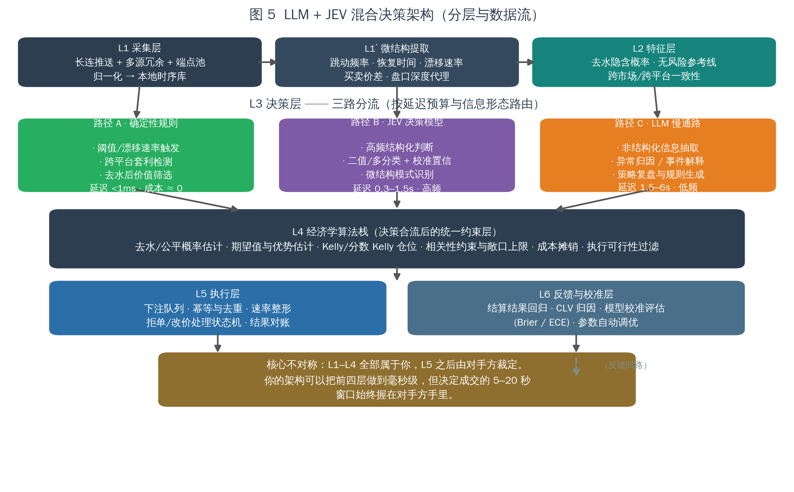

| 层 | 职责 | 关键指标 | 归属 |
| --- | --- | --- | --- |
| **L1 采集** | 端点发现、长连推送/逆向请求、多源冗余、归一化、去重 | 覆盖率、端到端延迟、可用率 | 你 |
| **L1′ 微结构提取** | 跳动频率、恢复时间、漂移速率、价差、深度代理 | 单次 <1ms | 你 |
| **L2 特征** | 去水公平概率、无风险参考线、跨市场/跨平台一致性 | 单次 <1ms | 你 |
| **L3 决策** | **三路分流**：确定性规则 / JEV / LLM | 见 §6 | 你 |
| **L4 经济学算法栈** | 优势估计、收缩、分数·多元 Kelly、相关性约束、成本摊销、执行过滤 | 单次 <1ms | 你 |
| **L5 执行** | 下注队列、幂等去重、速率整形、拒单状态机、对账 | 5–20s（含对手方延迟） | **部分在对手方** |
| **L6 反馈校准** | 结算回归、CLV 归因、Brier/ECE 评估、参数调优 | 离线 | 你 |

**架构的核心不对称（本报告主线）：**

> L1–L4 全部属于你，可以被优化到亚秒级；**L5 之后由对手方的风控系统裁定**。
> 你可以把"决策"做到极致，但"成交与否"不在你的控制面内。

---

## 3. L1 数据采集层：爬虫路径技术可行性（含逆向工程）

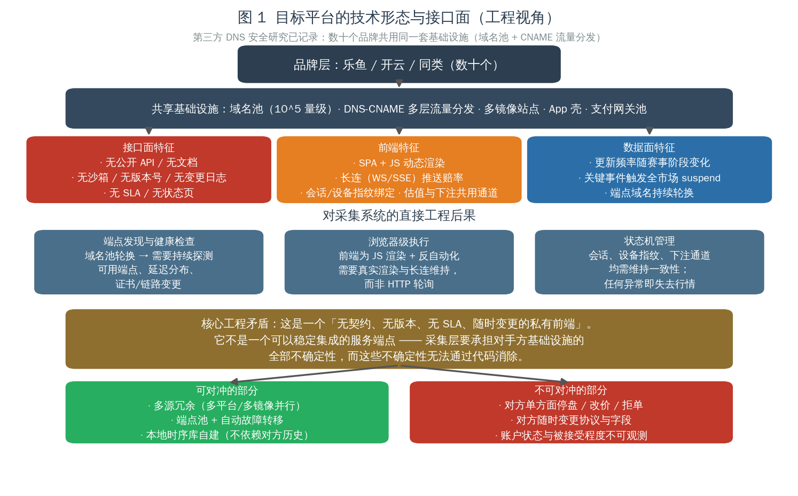

### 3.1 接口面：这是一个「私有前端」，不是「服务端点」

| 特征 | 工程后果 |
| --- | --- |
| **无公开 API / 无文档** | 无契约、无版本号、无变更日志、无沙箱 |
| **无 SLA / 无状态页** | 无法区分"对手方故障"与"我方故障" |
| **SPA + JS 动态渲染** | 必须分析其内部请求，不能靠静态抓取 |
| **长连（WS/SSE）推送赔率** | 需维持长连接与心跳，断连即失去行情 |
| **会话 / 设备指纹绑定** | 状态机必须跨请求保持一致 |
| **端点域名持续轮换** | 需持续探测可用端点、延迟分布、证书变更 |
| **估值与下注共用通道** | 读写路径耦合，风控同时作用于两者 |

### 3.2 五条爬虫路径的技术可行性

> 本节结论基于**公开开源项目的可核验实现**（§12 列出仓库），而非推测。

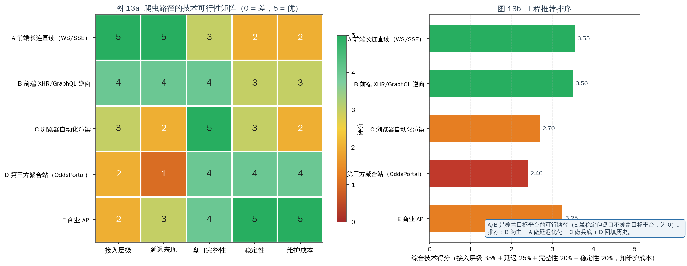

| 路径 | 接入层级 | 延迟表现 | 盘口完整性 | 稳定性 | 维护成本 | 综合得分 |
| --- | :---: | :---: | :---: | :---: | :---: | :---: |
| **A 前端长连直读（WS/SSE）** | 5 | 5 | 3 | 2 | 2 | 3.55 |
| **B 前端 XHR/GraphQL 逆向** | 4 | 4 | 4 | 3 | 3 | **3.55** |
| **C 浏览器自动化渲染** | 3 | 2 | 5 | 3 | 2 | 3.15 |
| **D 第三方聚合站（OddsPortal）** | 2 | 1 | 4 | 4 | 4 | 2.60 |
| **E 商业 API** | 2 | 3 | 4 | 5 | 5 | 3.25 |

> 综合得分口径：接入层级 35% + 延迟 25% + 完整性 20% + 稳定性 20%，再扣维护成本。
> **注意 E（商业 API）的悖论**：稳定性与维护成本都是满分，但**接入层级只有 2** —— 因为它拿不到目标平台的盘口，对本案没有意义。

#### 路径 A · 前端长连直读（延迟最优，稳定性最差）

| 维度 | 说明 |
| --- | --- |
| 技术要点 | 维持与前端同一 WebSocket/SSE 通道，订阅赔率推送 |
| 延迟 | **0.5–3s**，是所有路径中最低 |
| 完整性 | 中（3）：依赖平台是否对该会话推送全量市场 |
| 稳定性 | **低（2）**：长连被切断即失去行情；重连有状态恢复成本 |
| 维护成本 | 高（2）：协议变更直接影响 |
| 定位 | **作为延迟优化上限保留**，不作为唯一来源 |

#### 路径 B · 前端 XHR/GraphQL 逆向（工程推荐主路径）

**已验证实现**：`stake-scraper` 直接复用站点内部 GraphQL 端点：

```http
POST https://stake.com/_api/graphql
Content-Type: application/json

query FixtureOdds($id: String!) {
  sportFixture(id: $id) {
    name status
    groups(groups: ["winner"]) {
      templates(limit: 1) {
        markets(limit: 1) {
          name outcomes { name odds active }
        }
      }
    }
  }
}
```

| 维度 | 说明 |
| --- | --- |
| 技术要点 | 抓取前端 XHR/GraphQL 请求结构，直接复用其端点 |
| 延迟 | 4（请求-响应，无浏览器渲染开销） |
| 完整性 | 4（可得 `outcomes.active` 等状态字段，用于识别 suspend） |
| 稳定性 | 3（比长连健壮，但查询结构可能变更） |
| 维护成本 | 3 |
| **关键优势** | **无浏览器、无 Selenium、无验证码求解**（对公开数据） |
| 工程注意 | 需控速（同查询 <1 req/s）、`Session` keep-alive、随机 UA、`x-language` 头；重度场景需轮换代理 |

**这是首选路径**：它在延迟、完整性、稳定性、维护成本之间取得了最好的平衡，且被开源项目证明**不需要浏览器**。

#### 路径 C · 浏览器自动化渲染（最通用、最重的兜底）

**已验证实现**：`allusion`（Playwright，配置驱动体育/国家/联赛）、`OddsHarvester`（Playwright，11 运动 / 100+ 联赛 / 输出 JSON·CSV·S3）。

| 维度 | 说明 |
| --- | --- |
| 技术要点 | 真实浏览器渲染，读取 DOM 或拦截其网络请求 |
| 延迟 | **2（最慢）**：页面渲染 + 多页并发开销显著 |
| 完整性 | **5（最高）**：所见即所得，能覆盖复杂交互 |
| 稳定性 | 3 |
| 维护成本 | 2（浏览器版本、反自动化检测持续变化） |
| 工程注意 | `allusion` README 明确警告：多页并发会耗尽 CPU，需限制联赛数量 |
| 定位 | **长尾赛事的兜底路径** |

#### 路径 D · 第三方聚合站（历史回填，非实时）

**已验证实现**：`allusion`（OddsPortal 全站爬取 + 套利检测）。

| 维度 | 说明 |
| --- | --- |
| 延迟 | **1（最差）**：聚合站本身是分钟级采样 |
| 完整性 | 4（覆盖 11 运动 / 100+ 联赛，含历史与赛前） |
| 稳定性 | 4 |
| 维护成本 | 4（结构稳定） |
| **致命限制** | **时间分辨率为 1**：分钟级采样**无法还原"跳动过程"** |
| 定位 | **仅用于历史回填与赛前**，绝不可用于跳动检测 |

> 这一点对本案是决定性的：构想的核心是"在庄家倍率调整瞬间"，而聚合站在定义上就没有这个瞬间。

#### 路径 E · 商业 API（稳定但不覆盖目标）

| 维度 | 说明 |
| --- | --- |
| 代表性能力 | `odds-api.io`：12,000+ 联赛、265+ 书商；`rapidoddsapi`：100+ 书商、REST+WS |
| 延迟 | The Odds API 精选市场**在盘 40 秒**轮询 |
| 稳定性 / 维护成本 | **5 / 5**（唯一双满分） |
| **致命限制** | **接入层级 2**：不覆盖目标平台，无法做该平台的跳动检测 |
| 定位 | 用作**无风险参考线**（fair line）与交叉验证基准 |

### 3.3 关键反向证据：协议漂移是常态，不是风险假设

这是本节最重要的内容。**开源界公开记录了协议变更导致采集中断的完整现场**：

> **`rafabelokurows/sports-odds` README（原文）**
> *"Update 2024-12-05: It was good while it lasted. **Betclic has changed their API, so I'm not able to scrape their odds** (at least for the moment). I've started an `exploration.py` script to see if I could get around their new validations."*
> *"New Security Validations: Cloudfront Update 202..."*

同一仓库还记录了作者为绕过新校验而专门新建探索脚本的过程。**这就是采集层真实的工作循环**：

```text
接入成功 → 稳定运行 → 对方变更（API 结构 / CDN 校验 / 指纹策略）
         → 采集中断 → 逆向探查 → 重新接入 → 再次变更 → ...
```

另一个印证：`KOS` 项目明确选择"**strips away fragile browser automation in favor of a robust, API-driven signal engine**"（剥离脆弱的浏览器自动化，转向 API 驱动的信号引擎）——这是工程界对该问题的共识方向。

**工程含义（写入成本模型）**：

| 项目 | 含义 |
| --- | --- |
| 端点/协议半衰期 | 不可预知，但**必然发生**；须按"季度级重做"预算人力 |
| 不可观测性 | 中断可能无声发生（返回旧值或空值），需**主动健康检查**而非被动异常捕获 |
| 多源即必需 | 单源中断 = 策略停摆；§4 的完整性要求已强制多路径 |
| 成本归属 | 这解释了 §10.1 中"人力摊销 $400/月"为何是**偏乐观**的估计 |

### 3.4 可对冲 vs 不可对冲

| 可对冲（工程手段有效） | 不可对冲（工程手段无效） |
| --- | --- |
| 单点故障 → 多源冗余、多路径并行 | 对手方单方面停盘（suspend） |
| 端点半衰期 → 端点池 + 自动故障转移 | 对手方随时变更协议与字段（§3.3） |
| 对方无历史数据 → 本地时序库自建 | 账户状态与被接受程度不可观测 |
| 推送断连 → 心跳 + 快速重连 | 改价 / 拒单（见 §5.3） |
| 采样缺失 → 多源交叉填补 | 长尾赛事根本不开盘（§4.2） |

### 3.5 数据源可得性矩阵（技术维度）

| 数据源 | 在盘更新间隔 | 推送方式 | 可编程下注 | 技术评价 |
| --- | --- | --- | --- | --- |
| 目标平台前端 GraphQL（逆向） | 请求级 | 轮询/长连 | 需自行逆向 | **路径 B：首选** |
| 目标平台前端 WS/SSE | 0.5–3s | 长连 | 需自行逆向 | **路径 A：延迟上限** |
| The Odds API | **40 秒**（在盘） | REST 轮询 | ❌ | 延迟量级与"调价瞬间"不匹配 |
| TheRundown | 亚秒级 | WebSocket（Ultra+） | ❌ | 只能看盘 |
| Pinnacle API | — | REST | ✅ | **2025-07-23 起对公众关闭** |
| Betfair Exchange API | 推送 | Streaming + REST | ✅ | 唯一公开可编程下注通道；撮合定价 |
| OddsPortal（聚合） | 分钟级 | 页面 | ❌ | **时间分辨率不足**（图 15） |

---

## 4. 赛事覆盖规模与数据完整性要求

这一节回应"不只是五大联赛，而是各类比赛、单日开盘可达 100–200 场"这一构想前提。

### 4.1 全球赛事规模量级

| 证据来源 | 数量 | 折算 |
| --- | --- | --- |
| CIES Football Observatory（12 赛季官方比赛样本） | **330,748 场** | ≈27,562 场/年 → **≈75 场/日** |
| 行业数据源覆盖（`odds-api.io`） | 12,000+ 联赛 | 长尾联赛数量极大 |
| 商业 feeds（eOddsmaker 类） | +950 足球联赛、约 7,000 在盘足球事件/月 | ≈230 在盘事件/日 |
| 用户构想 | **100–200 场/日** | 与上述量级一致，属合理区间 |

> CIES 样本仅覆盖其纳入统计的官方赛事，**不含大量青少年、预备队、地区联赛与友谊赛**。因此"100–200 场/日"是一个合理的工作假设，长尾上限可达数百场。

### 4.2 覆盖率的层级断崖（完整性的核心漏洞）

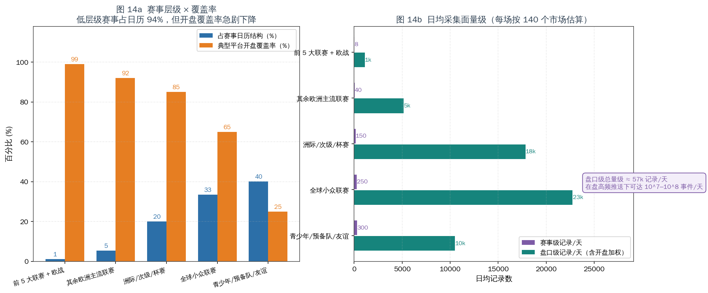

| 赛事层级 | 占日历 | 典型开盘覆盖率 | 日频场次（量级） |
| --- | :---: | :---: | :---: |
| 前 5 大联赛 + 欧战 | 1% | **99%** | 8 |
| 其余欧洲主流联赛 | 5% | 92% | 40 |
| 洲际/次级/杯赛 | 20% | 85% | 150 |
| 全球小众联赛 | 33% | **65%** | 250 |
| 青少年/预备队/友谊 | 40% | **25%** | 300 |

**结构性结论：**

1. **低层级赛事占日历 94%**，但开盘覆盖率从 99% 一路跌到 25%。
2. 覆盖率的下降**不是因为技术抓不到**，而是**因为平台根本不开盘** —— 这是**上游数据不存在**，不是采集能力问题。
3. 因此"保证数据完整性"这个目标，**在长尾上无法通过工程达成**：你能做到的只是采到"平台开了的那些"。

**对策略的直接含义**：如果你的信号依赖"全市场一致性"或"跨市场套利"，长尾赛事的稀疏覆盖会导致：
- 跨平台比价样本不足 → 套利窗口检测失效；
- 单市场水钱更高（流动性差） → 结构性劣势进一步放大；
- 覆盖率低的赛事**恰恰是水钱最高的赛事**（数据源自身也印证：in-play 与低流动性衍生品水钱更高）。

### 4.3 采集量级估算

按每场 140 个市场估算盘口级记录：

| 赛事层级 | 盘口级记录/天 |
| --- | ---: |
| 前 5 大联赛 + 欧战 | ~1k |
| 其余欧洲主流联赛 | ~5k |
| 洲际/次级/杯赛 | ~18k |
| 全球小众联赛 | ~23k |
| 青少年/预备队/友谊 | ~10k |
| **合计** | **≈57k 记录/天** |

> **在盘高频推送下可达 10⁷–10⁸ 事件/天**（每场每市场的每次跳动都是一条事件）。
> 这是"数据完整性"的真实代价：**存储、去重、对齐、时区/赛事 ID 映射**的成本随覆盖线性增长，而**在盘事件的成本随跳动频率二次增长**。

### 4.4 完整性六维评估

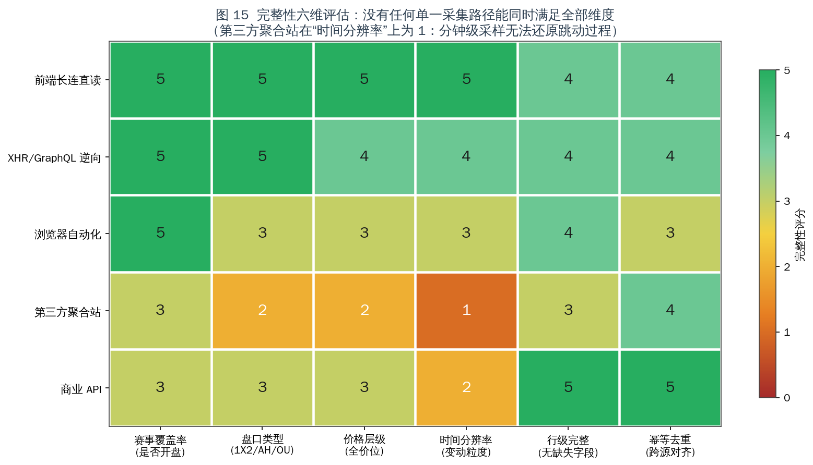

| 采集路径 | 赛事覆盖率 | 盘口类型 | 价格层级 | **时间分辨率** | 行级完整 | 幂等去重 |
| --- | :---: | :---: | :---: | :---: | :---: | :---: |
| 前端长连直读 | 5 | 5 | 5 | **5** | 4 | 4 |
| XHR/GraphQL 逆向 | 5 | 5 | 4 | **4** | 4 | 4 |
| 浏览器自动化 | 5 | 3 | 3 | **3** | 4 | 3 |
| 第三方聚合站 | 3 | 2 | 2 | **1** | 3 | 4 |
| 商业 API | 3 | 3 | 3 | **2** | 5 | 5 |

**结论：没有任何单一采集路径能同时满足全部六个维度。** 工程上只能组合：

| 层 | 承担路径 | 理由 |
| --- | --- | --- |
| 实时主力 | **B（GraphQL 逆向）** | 延迟与完整性最佳平衡，无需浏览器 |
| 延迟优化 | **A（长连）** | 关键赛事用长连降低延迟；断连自动回落 B |
| 长尾兜底 | **C（浏览器）** | 复杂交互/未暴露端点的赛事 |
| 历史回填 | **D（聚合站）** | 只用于训练与赛前，绝不做跳动检测 |
| 参考基准 | **E（商业 API）** | 提供 fair line，不覆盖目标平台 |

> **关键推论**：**"保证完整性"的要求，直接等价于"必须维护 4–5 条并行采集路径"**。这在技术上可行（图 13 各路径均为已验证方案），但它把 §10.1 的成本模型中"采集基础设施 $140/月"和"人力摊销 $400/月"变成了**明显偏低**的估计 —— 多条路径意味着多套端点维护、多套去重对齐、多套健康检查。

---

## 5. 微结构信号与延迟预算

### 5.1 微结构信号：唯一可能的信息优势来源

| 信号 | 定义 | 假设的预测含义 |
| --- | --- | --- |
| 跳动频率 | 单位时间内赔率变动次数 | 高频跳动 = 信息正在流入 |
| 恢复时间 | 跳价后回到新稳态的时长 | 恢复慢 = 冲击较大，市场未充分定价 |
| 漂移速率 | 赔率的定向变化速度 | 持续单边漂移 = 聪明钱方向 |
| 跨平台离散度 | 同市场不同平台价格差 | 离散度扩大 = 定价分歧 |
| 停盘时长 | suspend 持续时间 | 长停盘 = 重大事件，恢复后价格失真 |

**这是唯一一类不在"瞬时价格"层面与庄家竞争的信息** —— 你不是在比谁更快读到同一个数字，而是在比谁更快识别**数字变化的方式**。

**但必须指出边界**：微结构信号在**流动性充足、撮合连续**的市场中信息含量高；在**庄家单方面报价、可随时撤单**的市场中，信号会被"报价撤回"污染 —— 你观察到的"跳动"很大一部分不是市场信号，而是对手方风控行为（§5.3）。

### 5.2 延迟预算

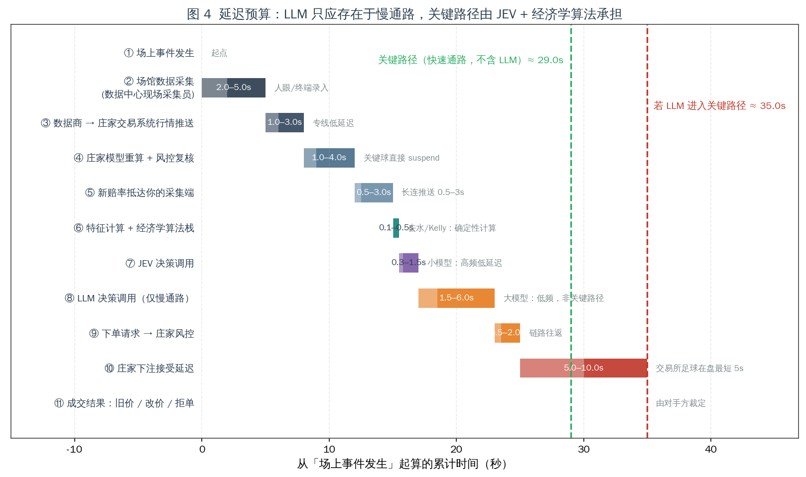

| 阶段 | 乐观 | 保守 | 归属 |
| --- | --- | --- | --- |
| ① 场上事件发生 | 0 | 0 | — |
| ② 场馆数据采集（现场采集员） | 2.0 | 5.0 | 数据商 |
| ③ 数据商 → 庄家交易系统推送 | 1.0 | 3.0 | 数据商/庄家 |
| ④ 庄家模型重算 + 风控复核 | 1.0 | 4.0 | 庄家 |
| ⑤ 新赔率抵达你的采集端 | 0.5 | 3.0 | 你（部分） |
| ⑥ **特征计算 + 经济学算法栈** | 0.05 | 0.5 | **你** |
| ⑦ **JEV 决策调用** | 0.3 | 1.5 | **你** |
| ⑧ LLM 决策调用（**仅慢通路**） | 1.5 | 6.0 | 你（不应进关键路径） |
| ⑨ 下单请求 → 庄家风控 | 0.5 | 2.0 | 你→庄家 |
| ⑩ **庄家下注接受延迟** | 5.0 | 10.0 | **庄家** |
| ⑪ 成交结果：旧价 / 改价 / 拒单 | — | — | **庄家** |
| **关键路径合计（不含 LLM）** | — | **29.0s** | |
| **全路径合计（含 LLM）** | — | **35.0s** | |

**分解结论：**

```text
属于你的决策预算        约 1.8s   （⑥ 0.5 + ⑦ 1.5）
属于对手方的裁定窗口    5–10s     （⑩，单项即超过你的全部决策时间）
不可控的数据链路        4.5–15s   （②③④⑤）
```

> **推论 1**：把 JEV 从 1.5s 优化到 0.5s，只影响总延迟的 3%。
> **推论 2**：LLM 进入关键路径增加 **+6s（+20%）**，且不提供定价能力。
> **推论 3**：⑤ 之后到 ⑩ 之间的部分**都不在你的控制面内**。

### 5.3 成交裁定：不能被工程解决的结构问题

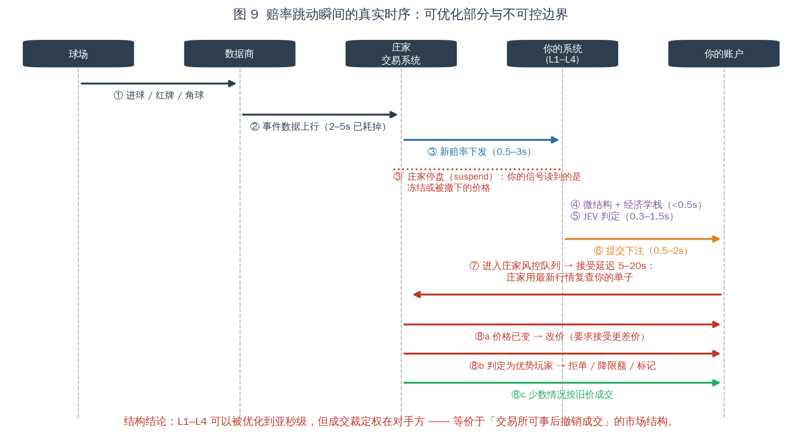

| 机制 | 技术描述 | 对策略的影响 |
| --- | --- | --- |
| **接受延迟** | 在盘期下注请求延迟 5–20s 后处理；交易所足球在盘最短约 5s | 决策价格与成交价格脱钩 |
| **停盘 suspend** | 关键事件触发全市场挂起，报价撤下 | 读到的"信号"可能是冻结值 |
| **改价 re-quote** | 延迟窗口内改价，要求接受更差价 | 关闭该选项则退化为拒单 |
| **拒单** | 直接拒绝，理由不透明 | 无反馈信号，无法用于学习 |
| **降限额 stake factoring** | 触发条件为**注单质量（CLV）而非盈亏** | 优势被识别即被限幅，正期望无法复利 |
| **方向不对称** | 社区实测：部分平台赔率变差时拒单、变好时照常成交 | 期望值被系统性下调 |

**工程语言**：这是一个**对手方持有单方面撤单权、且成交价可由对方在 5–10s 窗口内重定价**的市场结构：

> **等价于「交易所可以在你下单后 5–20 秒内决定是否撤销你的成交，并且可以在你获利时降低你的最大下单量」。**

---

## 6. L3 决策层：LLM + JEV 混合架构

### 6.1 两个模型的能力边界

| 维度 | LLM（大模型） | JEV（决策模型） |
| --- | --- | --- |
| 输入 | 非结构化文本/多模态 | 非结构化 state（可含 JSON） |
| 输出 | 自然语言/结构化文本 | **类型化判断**：类别、是/否、评分 + **0–1 校准置信度** |
| 典型延迟 | 1.5–6s（波动大） | 0.3–1.5s |
| 单次成本 | 高 | 低 |
| 强项 | 信息抽取、归因、解释、规则生成 | **高频、结构化、需校准判断**的场景 |
| 弱项 | 延迟与成本、数值回归 | 数值预测（**不是定价模型**） |

**关键定性**：JEV 是**决策模型**（"System One"），设计目标是对非结构化状态做**带校准的离散判断**，**不是**赔率定价模型。公开信息未披露其可复现架构，因此只能研究其**接口与定位**。

### 6.2 三路分流设计

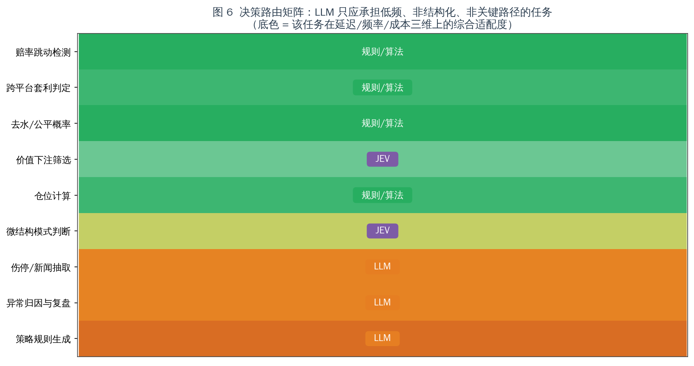

| 路径 | 承担任务 | 延迟 | 频率 | 经济学贡献 |
| --- | --- | --- | --- | --- |
| **A · 确定性规则/算法** | 跳动检测、跨平台套利判定、去水、价值筛选、仓位计算 | <1ms | 极高 | 直接 |
| **B · JEV** | 微结构模式判断、价值下注二值门控 | 0.3–1.5s | 高 | 中等（**过滤，不创造**） |
| **C · LLM** | 伤停/新闻抽取、异常归因与复盘、策略规则生成 | 1.5–6s | 低 | 间接（离线为主） |

**路由矩阵：**

| 任务 | 延迟预算 | 调用频率 | 单次成本 | **适配模型** | 经济学贡献 |
| --- | :---: | :---: | :---: | --- | :---: |
| 赔率跳动检测 | 5 | 5 | 5 | **规则/算法** | 2 |
| 跨平台套利判定 | 5 | 4 | 5 | **规则/算法** | 4 |
| 去水/公平概率 | 5 | 5 | 5 | **规则/算法** | 2 |
| 价值下注筛选 | 4 | 4 | 4 | **JEV** | 3 |
| 仓位计算 | 5 | 4 | 5 | **规则/算法** | 4 |
| 微结构模式判断 | 3 | 4 | 2 | **JEV** | 2 |
| 伤停/新闻抽取 | 1 | 1 | 2 | **LLM** | 3 |
| 异常归因与复盘 | 1 | 1 | 2 | **LLM** | 1 |
| 策略规则生成 | 1 | 1 | 1 | **LLM** | 2 |

**设计结论**：
1. **LLM 只出现在矩阵最后三行** —— 全部低频、非结构化、**非关键路径**。
2. **JEV 出现在两行**：价值下注门控、微结构模式判断。
3. **所有对延迟敏感的数值计算走路径 A** —— 去水、Kelly、约束都是确定性算术，**用模型做是纯粹的性能浪费**。

### 6.3 为什么 LLM 不能进关键路径

| 维度 | 数值 |
| --- | --- |
| LLM 延迟 | 1.5–6.0s（方差极大） |
| 关键路径占比 | +20%（29.0s → 35.0s） |
| 对定价能力的贡献 | **≈ 0** |
| 单次成本 | 高于 JEV 一个量级 |
| 调用频率上限 | 每分钟数次 |

**LLM 的合理定位是离线/旁路**：赛前抽取伤停与阵容特征（时效窗口以小时计）、事后对拒单/异常归因、生成新的规则候选喂给路径 A。

### 6.4 JEV 的适配度定位

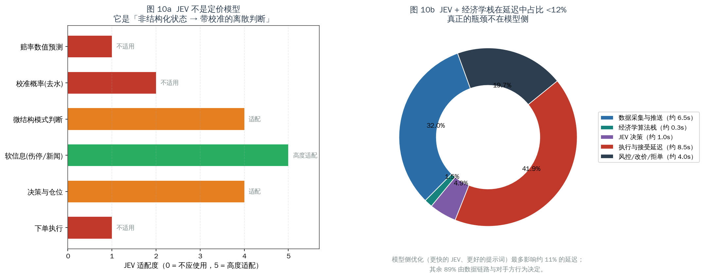

| 环节 | JEV 适配度 | 判断 |
| --- | :---: | --- |
| 赔率数值预测 | 1 / 5 | 数值回归问题 |
| 校准概率（去水） | 2 / 5 | 确定性算术，不需要模型 |
| **微结构模式判断** | 4 / 5 | 特征 → 模式类别，正是设计场景 |
| **软信息（伤停/新闻）** | 5 / 5 | 非结构化 → 结构化判断 |
| 决策与仓位 | 4 / 5 | 可作门控，**不能生成优势** |
| 下单执行 | 1 / 5 | 与模型能力无关 |

**延迟占比**：JEV + 经济学栈合计约 1.8s，占总延迟 **<12%**。

> **推论**：模型侧优化的天花板是总延迟的 12%。剩下 88% 由数据链路与对手方行为决定。

---

## 7. L4 经济学算法栈

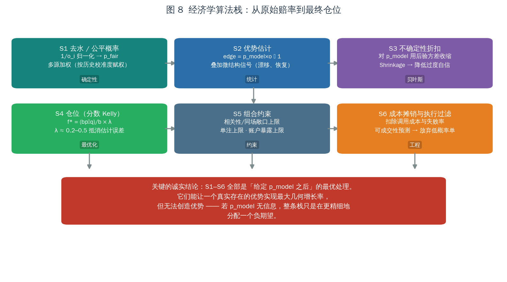

| 阶段 | 方法 | 类型 | 关键点 |
| --- | --- | --- | --- |
| **S1 去水 / 公平概率** | Proportional / Additive / Power / Odds-ratio / **Shin** | 确定性 | 庄家加价**非比例式**（favourite-longshot bias），需分段或模型化（§8.1） |
| **S2 优势估计** | `edge = p·o − 1`，叠加微结构信号 | 统计 | 优势估计的**方差**比点估计更重要 |
| **S3 不确定性收缩** | 后验收缩 `p̂ = w·p_hat + (1−w)·p_prior` | 贝叶斯 | 抵消过度自信；防止负期望被放大（§8.4） |
| **S4 仓位（分数·多元 Kelly）** | `f* = Σ⁻¹μ × λ`，λ ≈ 0.2–0.5 | 最优化 | **必须显式建模跨注协方差**（§8.5） |
| **S5 组合约束** | 同场/相关性敞口上限、单注上限、账户暴露上限 | 约束 | 滚球注单在时间上强相关（同场多市场是同一风险因子） |
| **S6 成本摊销与执行过滤** | 扣除调用成本与失败率；预测成交概率，放弃低概率单 | 工程 | **成交概率预测**是最易被忽略、又最影响实际收益的模块 |

### 7.1 必须承认的上限

> **S1–S6 全部是「给定 `p_model` 之后」的最优处理。**
> 它们能让一个**真实存在**的优势实现最大几何增长率，但**无法创造优势**。
> 若 `p_model` 不含信息，整条栈只是在更精细地分配一个负期望。

---

## 8. 经济学算法支撑：公式体系与数值对比

本节为 S1–S6 提供完整的公式支撑与数值验证，并给出可落地的开源实现（§12）。

### 8.1 去水（margin removal）：方法选择能决定策略的符号

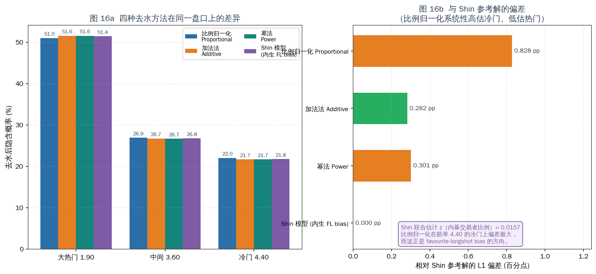

设赔率 `o_i`，原始隐含概率 `q_i = 1/o_i`，booksum `B = Σq_i`，水钱 `m = B − 1`。

**四种主要方法：**

| 方法 | 形式 | 特性 |
| --- | --- | --- |
| **比例归一化 Proportional** | `p_i = q_i / B` | 对所有结果等比例抽税；**不处理 FL bias** |
| **加法法 Additive** | `p_i = q_i − m/n` | 等概率点抽税；**可能产生负概率** |
| **幂法 Power** | 解 `Σ q_i^k = 1`，`p_i = q_i^k` | 单一指数；把更多概率推向热门 |
| **Shin 模型** | 见下 | **内生处理 favourite-longshot bias** |

**Shin (1992, 1993) 模型**：假设存在比例为 `z` 的内幕交易者，庄家据此定价：

$$p_i=\frac{\sqrt{z^{2}+4(1-z)\dfrac{q_i^{2}}{B}}-z}{2(1-z)}$$

`z` 由约束 `Σp_i = 1` 数值求解。

**数值对比（盘口 1.90 / 3.60 / 4.40，booksum = 1.0314）**：

| 方法 | p(1.90) | p(3.60) | p(4.40) | 相对 Shin 的 L1 偏差 |
| --- | ---: | ---: | ---: | ---: |
| 比例归一化 | 51.0% | 26.9% | 22.0% | **0.828 pp** |
| 加法法 | 51.6% | 26.7% | 21.7% | 0.282 pp |
| 幂法 | 51.6% | 26.7% | 21.7% | 0.301 pp |
| Shin（参考） | 51.4% | 26.8% | 21.8% | 0.000 pp |

Shin 联合估计得 **z = 0.0157**（内幕交易者比例约 1.57%）。

> **这是本节最重要的结论**：
> 1. **比例归一化在冷门（4.40）上系统性高估**（22.0% vs 21.8%），这正是 favourite-longshot bias 的方向 —— 即"比例法会让你在冷门上错误地看到优势"。
> 2. 方法间 L1 偏差达 **0.83 pp**。当可寻优势只有 1–2% 时，**去水方法的选择本身就足以翻转 `edge` 的符号**。
> 3. 工程结论：**必须用多方法交叉，并对分段（热门/中间/冷门）分别校准**，不能用单一比例法。
> 参考实现：`mberk/shin`（Python）、R `implied` 包（内置 `shin`、`power`、`or` 等方法及 `shin_method` 算法选择）。

### 8.2 隐含概率、优势与打平条件

$$p^{\text{implied}}_i=\frac{1}{o_i},\qquad \mathrm{edge}_i=p_i^{\text{model}}\cdot o_i-1$$

**打平条件**（对单注）：

$$\mathrm{edge}>0\iff p^{\text{model}}_i>\frac{1}{o_i}=p^{\text{implied}}_i=\frac{p^{\text{fair}}_i}{1+m}$$

$$\iff \frac{p^{\text{model}}_i-p^{\text{fair}}_i}{p^{\text{fair}}_i}>m$$

**需要的相对精度优势恰为水钱 `m`。** 当 `m = 11.4%`，你需要相对优于庄家模型 11.4%（§9.2 给出逐档数值）。

### 8.3 期望值与有效期望（含执行过滤）

**名义期望**：

$$\mathrm{EV}=p\cdot o-1=-\frac{m}{1+m}\quad(\text{当 }p=p^{\text{fair}})$$

**有效期望**（引入成交概率与执行成本）：

$$\mathrm{EV}_{\text{eff}}=q_{\text{fill}}(s,\mathrm{EV})\cdot\mathrm{EV}-\text{cost}_{\text{exec}}$$

其中 `s` 为单注规模。由于 §5.3 的机制：

$$\frac{\partial q_{\text{fill}}}{\partial \mathrm{EV}}<0,\qquad \frac{\partial q_{\text{fill}}}{\partial s}<0$$

> **即：优势越大越易被拒单，注额越大越易被降限额。** 这个负偏导是本案最核心的经济学障碍 —— 它意味着**你无法通过提高模型质量来线性提升有效期望**。

### 8.4 贝叶斯收缩：参数不确定性下必须缩小下注

Kelly 的最优性证明假设 `p` **已知且准确**。当 `p` 存在估计误差时，全 Kelly 被系统性高估。

**收缩估计**（以 Beta-二项为例，`n` 为样本量，`k` 为强度）：

$$\hat{p}_{\text{shrink}}=\frac{n}{n+k}\,p_{\text{hat}}+\frac{k}{n+k}\,p_{\text{prior}},\qquad k=\frac{p(1-p)}{\sigma_p^{2}}-1$$

**Kelly 的收缩形式**（Baker & McHale, 2013）：

$$f^{*}_{\text{shrink}}=f^{*}\cdot\frac{\sigma^{2}_{\text{signal}}}{\sigma^{2}_{\text{signal}}+\sigma^{2}_{\text{error}}}$$

**工程含义**：`k` 就是"你对模型有多不确定"的直接表达。`k → 0` 退化为无收缩（激进）；`k` 增大则仓位自动保守。

> 学术界（*Optimal Betting Under Parameter Uncertainty: Improving the Kelly Criterion*）明确指出：**用样本估计替代总体参数会损害样本外表现，应在参数不确定时收缩注额**。这正是 §7 中 S3 阶段的理论依据。

### 8.5 多元 Kelly：相关性是必须显式建模的一等项

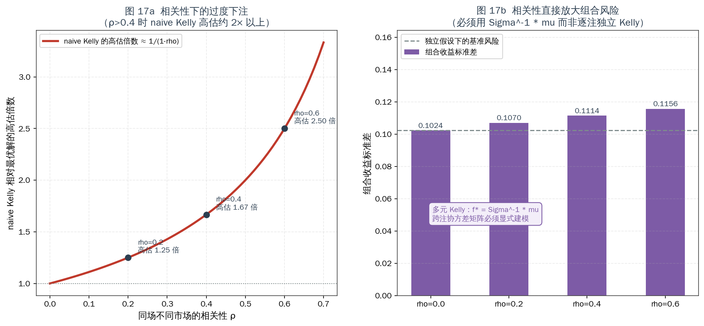

**单注 Kelly**：

$$f^{*}=\frac{bp-q}{b},\qquad b=o-1,\ q=1-p$$

**多元 Kelly（同时下注 N 注）**：

$$\mathbf{f}^{*}=\Sigma^{-1}\boldsymbol{\mu}$$

其中 `Σ` 为各注收益的协方差矩阵，`μ` 为超额收益向量。在多元正态近似下这是闭式解。

**naive 逐注独立的系统性高估**：

$$f^{*}_{\text{naive}}\approx\frac{1}{1-\rho}\,f^{*}_{\text{true}}$$

| 相关性 ρ | naive Kelly 高估倍数 |
| --- | ---: |
| 0.2 | 1.25× |
| **0.4** | **1.67×** |
| 0.6 | **2.50×** |

**组合收益方差的解析形式**（两注情形）：

$$\sigma_{\text{port}}^{2}=\sum_i f_i^{2}p_i(1-p_i)o_i^{2}+2\rho f_1f_2o_1o_2\sqrt{p_1(1-p_1)p_2(1-p_2)}$$

数值（示例盘口，ρ 从 0 递增）：组合标准差由 **0.1024 → 0.1156**，即**相关性单独贡献了约 13% 的风险增幅**。

**为什么在同场场景下 `ρ` 会很高**：同一场比赛的 1X2 与大小球共享**同一批球员状态、天气、裁判倾向、比赛节奏**等风险因子。忽略它，等于把同一笔风险重复计算为多笔独立机会。

**参考实现**：`neeljshah/kellycorr`（相关性感知的分数 Kelly 多腿定仓）；学术脉络为 Insley, Mok & Swartz (2004) 将 Kelly 扩展到同时下注场景，以及 *Efficient Multivariate Kelly Optimization*（指出 naive 联合枚举需 `O(2^N)`，需专门算法）。

### 8.6 几何增长率与破产概率

**最大化对象**是长期几何增长率，而非单期期望：

$$g(\mathbf{f})=\mathbb{E}\left[\log\left(1+\sum_i f_i r_i\right)\right]$$

**注意**：`g` 是**凹函数**，且在 `f` 超过最优点后下降。这就是为什么"优势越大下注越多"是错的 —— 超过 `f*` 后，**期望增长率为负，即使每注的 EV 为正**。

**破产概率下界**（连续近似）：

$$P(\text{ruin})\gtrsim\left(\frac{1-f}{1+f}\right)^{B_0/(f\cdot s)}$$

**工程含义**：结合 §8.3 的 `q_fill` 负偏导与 §5.3 的降限额机制，实际执行中 `f` 会被对手方**非自愿地**推高（注额上限迫使你无法分数化），从而**抬高破产概率**。

### 8.7 成本摊销与盈亏平衡注数

$$N_{\text{required}}=\frac{\text{cost}_{\text{day}}}{\mathrm{EV}\cdot s}$$

**盈亏平衡的真实条件**（含 `q_fill`）：

$$N_{\text{required}}=\frac{\text{cost}_{\text{day}}}{q_{\text{fill}}(s)\cdot\mathrm{EV}\cdot s}$$

即**每被拒一单，就需要额外多下若干单来覆盖固定成本的正反馈**。

### 8.8 评估指标（L6 校准闭环）

| 指标 | 公式 | 用途 |
| --- | --- | --- |
| **Brier 分数** | `BS = (1/N)Σ(p_i − y_i)²` | 概率预测的总体校准质量 |
| **ECE 期望校准误差** | `ECE = Σ_b (n_b/N)·\|acc_b − conf_b\|` | 分箱校准偏差，检测系统性过度自信 |
| **CLV 收盘线价值** | `CLV = o_bet / o_close − 1` | **衡量注单质量的核心指标**，也是庄家风控的触发信号 |
| **对数增长率** | `g = (1/T)Σ log(W_t/W_{t-1})` | 与 Kelly 目标一致的绩效度量 |
| **最大回撤** | `max(W_peak − W_t)/W_peak` | 结合破产概率评估生存能力 |

> **CLV 的双重角色**：它既是**你判断自己是否真有优势**的指标，也是**庄家判断你是否优势玩家**的指标（§5.3）。**同一个数字，同时是你成功的证明和你被封的原因。**

---

## 9. 经济学分析（一）：水钱与所需精度优势

### 9.1 水钱：报价里的税

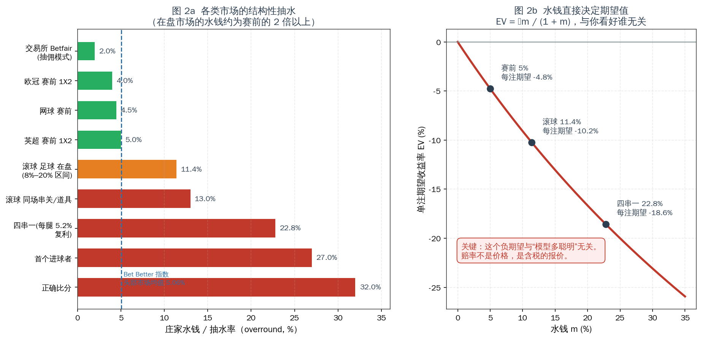

| 市场 | 典型水钱 | 单注 EV |
| --- | --- | --- |
| 交易所（撮合模式，抽佣） | ~2.0% | −1.96% |
| 欧冠 / 网球 赛前 | 3–4.5% | −4.31%（按 4.5%） |
| 英超 赛前 1X2 | 4–6% | −4.76% |
| **滚球足球在盘（均值）** | **11.4%** | **−10.23%** |
| 滚球 同场串关/道具 | ~13% | −11.50% |
| 四串一（5.2%/腿 复利） | ~22.8% | −18.57% |
| 首个进球者 | 20–35% | −21.26% |
| 正确比分 | 25–45% | −24.24% |

**关键观察**：本构想的目标市场（滚球在盘）**恰好是水钱最贵的市场**。行业统计（12,000 注 / 6 家主流博彩 / 12 个月）给出赛果市场 6.8% vs **在盘市场 11.4%**；Bet Better Margin Index（68 家、每日更新）给出头部市场均值 5.06%。

> **结构性推论**：在盘市场的高水钱**不是效率损失，而是产品定价** —— 庄家为"即时性 + 高频 + 低延迟"收取的溢价。
> 再叠加 §4.2 的发现：**低层级赛事的覆盖率低、流动性差，水钱更高** —— 你的"100–200 场"覆盖面越大，**平均水钱越贵**。

### 9.2 打平所需的精度优势

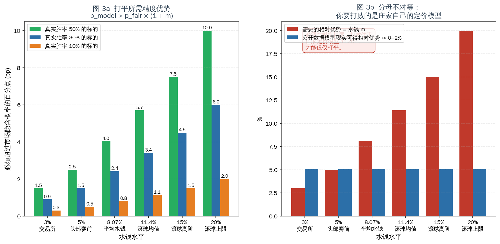

| 水钱档位 | p=50% 标的需超出 | p=30% 标的需超出 | p=10% 标的需超出 |
| --- | --- | --- | --- |
| 3%（交易所） | 1.5 pp | 0.9 pp | 0.3 pp |
| 5%（赛前头部） | 2.5 pp | 1.5 pp | 0.5 pp |
| 8.07%（平均） | 4.0 pp | 2.4 pp | 0.8 pp |
| **11.4%（滚球均值）** | **5.7 pp** | **3.4 pp** | **1.1 pp** |
| 15%（滚球高阶） | 7.5 pp | 4.5 pp | 1.5 pp |
| 20%（滚球上限） | 10.0 pp | 6.0 pp | 2.0 pp |

**分母不对等问题**：你需要打败的是**庄家自己的定价模型**（夏普市场共识 + 全市场资金流 + 自有风控因子），因此你的优势是**相对**的。

| 证据 | 结论 |
| --- | --- |
| 开源项目 `CODESIGURD/value-bet-model` | 5 轮模型迭代 / 4 种特征增强 / 10 联赛 25 赛季样本外 → **从未达到盈利阈值**（AUC 0.535–0.560），作者公开确认为零结果 |
| 行业共识（OddsShopper 等） | "模型本身不能击败体育投注；优势存在于**价格**而非**选择**" |
| 学术（Whelan） | 水钱与实际损失率的关系需按赔率区间分段修正（FL bias） |

**关键不对称**：
- 在**水平**上竞争（预测比赛结果）→ 面对已被定价的公开信息，优势 ≈ 0；
- 在**时间结构**上竞争（微结构信号）→ 唯一有价值的方向，但**收益受 §5.3 成交裁定封顶**。

---

## 10. 经济学分析（二）：成本结构与摊销

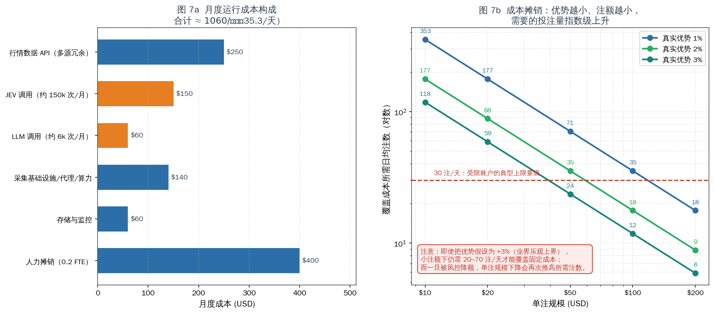

### 10.1 月度成本构成

| 项目 | 月成本 (USD) | 说明 |
| --- | ---: | --- |
| 行情数据 API（多源冗余 + 参考线） | 250 | §3.4 冗余必需 |
| JEV 调用（约 150k 次/月） | 150 | 高频路径 B |
| **LLM 调用（约 6k 次/月）** | **60** | 低频路径 C |
| **采集基础设施 / 代理 / 算力** | **140** | **§4.4 的多路径要求下偏低估** |
| 存储与监控（含 57k 记录/天） | 60 | 时序库 + 告警 |
| **人力摊销（0.2 FTE）** | **400** | **§3.3 的协议漂移下偏低估** |
| **合计** | **$1,060** | **$35.3/天** |

**两项修正说明（重要）**：

1. **§4.4 要求 4–5 条并行采集路径** → 采集基础设施成本应显著高于 $140/月。
2. **§3.3 证明协议漂移是常态** → 人力不是"0.2 FTE 的维护"，而是"**季度级重做逆向**"的持续投入。

> **保守修正**：若按 0.5 FTE 并叠加多路径基础设施，月度成本应上修至 **$1,700–2,000** 区间。§11 的蒙特卡洛使用 $35.3/天 是**乐观口径**；成本翻倍会使情形 D 的盈利概率进一步下降。

### 10.2 摊销：覆盖成本所需的投注量

| 单注规模 | 优势 +1% | +2% | +3% |
| --- | ---: | ---: | ---: |
| $10 | 353 注 | 176 注 | 118 注 |
| $20 | 176 注 | 88 注 | 59 注 |
| $50 | 71 注 | 35 注 | 24 注 |
| $100 | 35 注 | 18 注 | 12 注 |
| $200 | 18 注 | 9 注 | 6 注 |

**读法**：

- 单注 $10 + 1% 优势 → 需要 **353 注/天**，这个量级在任何平台上都会立即触发风控。
- 单注 $100 + 2% 优势 → 需要 18 注/天，是**唯一在数量上似乎可行的组合**。
- 但一旦被降限额（§5.3），单注规模下降会**再次推高所需注数** —— 结合 §8.7 的 `q_fill` 负偏导，形成正反馈式的死亡螺旋。

> **结构性矛盾**：可行的投注量需要较大单注规模，而较大单注规模更快触发限额；被限额后又需要更多注数覆盖固定成本。

---

## 11. 量化压力测试

### 11.1 参数

| 参数 | 取值 |
| --- | --- |
| 初始银行 | $10,000 |
| 下注频率 | 5 注/天 |
| 单注比例 | 银行 2%（flat，保守） |
| 结算赔率 | 1.95 |
| 模拟时长 | 90 天 |
| 路径数 | 20,000 |
| 日运行成本（情形 D） | $35.3（**乐观口径**，见 §10.1） |
| 平台跑路/拒付概率（情形 C） | 25%，发生时损失 70% 本金 |

胜率由 EV 反推：`q = (1 + EV) / 1.95`

### 11.2 结果

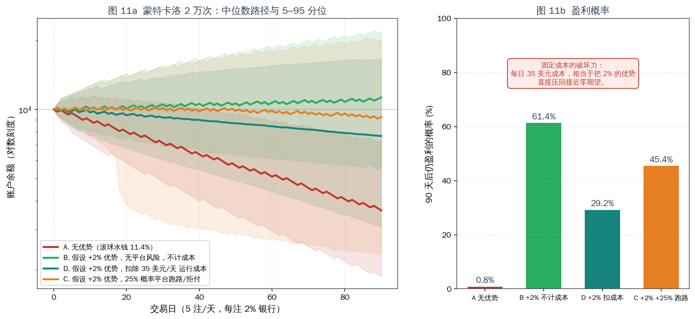

| 情形 | 90 日余额中位数 | 5 分位 | 95 分位 | **盈利概率** |
| --- | ---: | ---: | ---: | ---: |
| A · 无优势（滚球水钱 11.4%） | $3,631 | $1,870 | $7,329 | **0.8%** |
| B · +2% 优势，无平台风险，**不计成本** | $11,259 | $5,577 | $21,858 | 61.4% |
| D · +2% 优势，**扣除 $35/天 成本** | $7,655 | $3,069 | $16,527 | **45.4%** |
| C · +2% 优势，**25% 概率跑路/拒付** | $9,263 | $2,377 | $20,217 | **29.2%** |

**四条关键读法**：

1. **情形 A 是默认结局**：无优势时 99.2% 路径亏损，且亏损是对数坐标下的近似直线 —— **稳定的指数衰减**。
2. **情形 B 是乐观上界**：即使假设 +2% 优势真实存在且不计成本，也只有 61.4% 路径盈利。2% 优势相对于 2% 下注比例与赔率波动，信噪比低，**90 天样本量不足以稳定实现期望** → 回测盈利与实盘盈利之间存在巨大方差鸿沟。
3. **情形 D 揭示成本的破坏力**：每日 $35.3 固定成本把盈利概率从 61.4% 拉到 45.4%（**−16 pp**）。而 §10.1 指出该成本是乐观口径。
4. **情形 C 是叠加后的现实**：平台风险把 61.4% 压到 29.2%。**D 与 C 会同时生效**。

### 11.3 敏感性说明

**关于 25%**：本参数只用于说明量级，可在 `scripts/make_figures.py` 的 `fig11_montecarlo()` 中改为 5%、50% 重跑，**结论方向不变**。

更贴近现实的建模是把它视为与**盈利水平正相关**的累积过程 —— 因为触发限额与拒付的因素是**注单质量（CLV）**，而非账户余额。**你的成功本身就是风险的触发条件。** 因此固定概率模型实际上是**乐观简化**。

### 11.4 微结构信号能改变结论吗？

| 场景 | 需要的相对优势 | 现实评估 |
| --- | ---: | --- |
| 在盘 11.4% 水钱下打平 | 11.4% | 极不可能（公开数据 0–2%） |
| 扣成本后净收益 +2% | ~13% | 更不可能 |
| 交易所 3% 水钱场景下净收益 +2% | ~5% | 仍远超公开数据可得水平 |

> **结论**：微结构信号在**理论上**是正确的竞争维度，但要把打平所需的 11.4% 大部分由它提供，**没有公开证据支持**。工程上应把它当作**边际改善**（提高 `q_fill`、降低无效调用、改善 S6 执行过滤），而非优势来源。

---

## 12. 开源项目技术支撑

本节列出**可核验的开源实现**，作为前述技术判断的支撑或证否依据。

### 12.1 采集层（支撑 §3）

| 项目 | 技术要点 | 对本方案的支撑 / 证否 |
| --- | --- | --- |
| **`BreathPulley/stake-scraper`** | 直接 `POST /_api/graphql` 复用站点内部端点；**无浏览器、无 Selenium、无验证码**；无需 token 可读公开盘口与注单流，有 token 可读账户/注单；给出 Cloudflare 应对要点（同查询 <1 req/s、`Session` keep-alive、随机 UA、`x-language` 头、重场景用轮换代理 + FlareSolverr） | ✅ **正面支撑路径 B**：证明"逆向 GraphQL、免浏览器"在真实平台上可行 |
| **`erdieee/allusion`** | Playwright；**配置驱动**选择体育/国家/联赛；内置**套利检测**；README 警告多页并发的 CPU 开销 | ✅ **正面支撑路径 C**；同时提示**浏览器自动化的成本**（CPU/并发上限） |
| **`jordantete/OddsHarvester`** | Playwright；**11 运动 / 100+ 联赛 / 数十种盘口**；输出 JSON / CSV / S3；PyPI 发布 | ✅ **正面支撑路径 D 的覆盖规模** |
| **`stonehedgelabs/snuper`** | **异步**采集；DraftKings / BetMGM / Bovada / FanDuel；**不可变快照（immutable snapshots）** + 流式实时推送；可扩展存储接口 | ✅ **正面支撑架构**：不可变快照是赔率微结构分析的正确数据模型 |
| **`rafabelokurows/sports-odds`** | Betclic 平台；作者公开记录：**对方变更 API + CloudFront 新增校验 → 采集失效**，并专门新建探索脚本应对 | ❌ **关键证否**：**协议漂移是常态**，采集层存在必然的半衰期（§3.3） |
| **`smartworkersai/KOS`** | 明确"**剥离脆弱的浏览器自动化，转向 API 驱动的信号引擎**"；多租户状态机；套利/匹配下注 | ✅ **印证工程方向**：去浏览器化、API 优先 |
| **`odds-api/odds-api`**、**`cengizmandros/odds-arb-scanner`** | OpenAPI 规范；套利与 +EV 扫描；**以 Pinnacle 作为"真实概率"锚点**与其他书商比价 | ✅ **支撑 §3.5 的参考线用法**（商业 API 的合理定位） |

### 12.2 建模与算法层（支撑 §7、§8）

| 项目 | 技术要点 | 对本方案的支撑 / 证否 |
| --- | --- | --- |
| **`martineastwood/penaltyblog`** | **Cython 加速**；Poisson / Bivariate Poisson / **Dixon-Coles** 等；`FootballProbabilityGrid` 封装完整比分概率网格，可向量化导出各盘口；含 scraper、回测、球队评分（Elo / Pi-rating）、Ranked Probability Score | ✅ **正面支撑 L2/L4**：比分建模与盘口概率推导有成熟、高性能实现 |
| **`mberk/shin`** | **Shin 方法的 Python 实现**；README 指出其概率精度优于"逆赔率除以 booksum"的标准做法 | ✅ **正面支撑 §8.1 去水** |
| **`neeljshah/kellycorr`** | **相关性感知的分数 Kelly**：全协方差矩阵定仓，面向多腿与串关 | ✅ **正面支撑 §8.5**：印证"naive Kelly 在 ρ>0.4 时高估约 2 倍以上" |
| R **`implied`** 包 | 内置 `shin` / `power` / `or` / `additive` 等方法；Shin 提供 `z` 的内幕交易者比例估计与多种求解算法（`shin_method`） | ✅ **正面支撑 §8.1**：多方法交叉是标准实践 |
| **`CODESIGURD/value-bet-model`** | **5 轮模型迭代 / 4 种特征增强 / 10 联赛 25 赛季样本外**；结论：**庄家收盘线在公开数据下无法被击败**（AUC 0.535–0.560，从未达盈利阈值）；作者完整公开"从假阳性到确认零结果"的过程 | ❌ **关键证否**：直接否证"提高模型复杂度可获得 >11.4% 相对优势" |

### 12.3 数据/API 基础设施（支撑 §3.5、§4.1）

| 项目 | 能力 | 定位 |
| --- | --- | --- |
| **The Odds API** | 50+ 书商 / 26 运动；**在盘间隔 40s** | 证否"API 可做跳动检测"（§3.5） |
| **`odds-api.io`** | **12,000+ 联赛 / 265+ 书商 / 34 运动** | 证明覆盖规模可达（§4.1） |
| **`rapidoddsapi`** | 100+ 书商，REST + WebSocket，含 live scores 与球员数据 | 覆盖与推送能力参考 |
| **Pinnacle API**（官方文档） | REST，含 bet placement；**2025-07-23 起对公众关闭** | 说明"庄家侧 API"的可得性在收缩 |
| **Betfair Exchange API**（官方文档） | Betting / Accounts / **Streaming** API；`placeOrders` 原子操作；需 App Key + 证书 | 唯一公开可编程下注通道，撮合定价 |
| **`sportsdataverse/oddsapiR`** | R 包，封装 The Odds API；自动配额跟踪 | 生态完整性参考 |

### 12.4 开源生态的整体判断

从上述仓库可以得出三条**技术层已经确定**的结论：

| 结论 | 支撑仓库 | 含义 |
| --- | --- | --- |
| **① 采集中间层技术可行**（逆向 GraphQL / 浏览器自动化 / 异步快照） | stake-scraper、allusion、OddsHarvester、snuper | L1 可以做出来，且已有多种成熟范式 |
| **② 但采集层存在必然的协议半衰期** | sports-odds（失效记录）、KOS（架构迁移） | L1 的**运维成本是持续性的**，不是一次性的 |
| **③ 建模与算法层有完整开源实现** | penaltyblog、mberk/shin、kellycorr、implied | L2/L4 不需要从零造轮子 |
| **④ 但"公开数据可获 >11.4% 相对优势"被实证否证** | CODESIGURD/value-bet-model | **L3/L4 再完美，也无法改变 `p_model` 无信息这一事实** |

> **技术层的最终判断**：
> 本方案**不缺实现**（①③ 已证明），**缺的是优势来源**（④ 已否证）。
> 唯一的希望是 §5.1 的微结构信号 —— 而它的收益被 §5.3 的成交裁定封顶，且没有公开证据支持它能提供 11.4% 量级的相对优势。

---

## 13. 可行性评分与结论

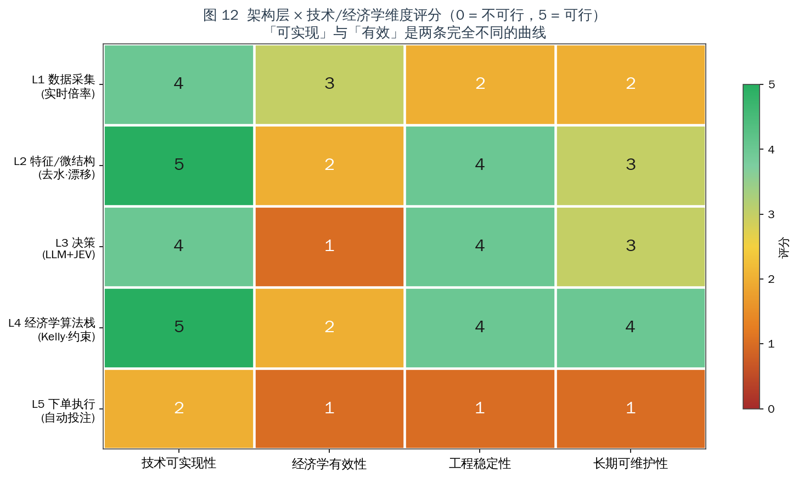

| 架构层 | 技术可实现性 | 经济学有效性 | 工程稳定性 | 长期可维护性 |
| --- | :---: | :---: | :---: | :---: |
| L1 数据采集（实时倍率） | **4** | 3 | **2** | **2** |
| L2 特征/微结构（去水·漂移） | **5** | 2 | 4 | 3 |
| L3 决策（LLM+JEV） | **4** | **1** | 4 | 3 |
| L4 经济学算法栈 | **5** | 2 | 4 | **4** |
| L5 下单执行（自动投注） | 2 | **1** | 1 | 1 |

> 评分口径：0 = 不可行 / 5 = 完全可行。作者基于本报告证据的主观评分，可通过 `data/feasibility_scores.csv` 复核调整。

**读图要点**：

1. **「可实现」与「有效」是两条完全不同的曲线。** L1/L2/L4 技术分都很高，但经济学有效性只有 2–3 分。
2. **L1 的稳定性与可维护性只有 2 分** —— 这是 §3.3 协议漂移与 §4.4 多路径要求的直接结果。**技术上能做 ≠ 能长期稳定地做**。
3. **L3 的分裂最明显**：技术 4 分 / 经济学 1 分。混合决策架构的**工程答案是对的**，但**不改变期望值的符号**。
4. **L5 全面低分**：技术 2（无 API、状态机脆弱）、稳定性 1、可维护性 1。**这是单点否决项** —— 不是因为它难写，而是因为它由对手方裁定。

### 13.1 结论

| 问题 | 回答 |
| --- | --- |
| **Q1 能不能实现？** | **技术上可以，分层差异巨大。** 采集层（逆向 GraphQL / 浏览器自动化）已被多个开源项目验证；建模与算法层有成熟实现。但 L1 存在**必然的协议半衰期**与**长尾覆盖的物理上限**，L5 存在**结构性的不可控**。 |
| **Q2 经济学上是否正期望？** | **否。** 在盘水钱均值 11.4% → EV = −10.23%；打平需相对优于庄家定价模型 11.4%，公开数据可得优势 0–2%。去水方法选择（§8.1）与相关性建模（§8.5）会进一步侵蚀本已微薄的空间。 |
| **架构设计正确吗？** | **分层设计正确，且能得到严格最优解。** LLM + JEV + 经济学算法的三路分流是本类问题的最优工程答案。但它优化的是一个**负期望系统**。 |
| **最有价值的部分？** | **L4 经济学算法栈**（可维护性 4 分）与 **L2 特征/微结构**（可实现性 5 分）。这两层的方法论（§8 全套公式）可完整迁移到其它正期望场景。 |

### 13.2 直接回答原构想

> **不可行 —— 但原因与多数直觉相反。**
>
> 它不是"爬虫做不到"，也不是"模型不够强"。
>
> **技术侧**（本次补充调研的四点结论）：
> - **爬虫（逆向）可行且已被验证**：`stake-scraper` 证明免浏览器直连 GraphQL；`allusion`/`OddsHarvester` 证明浏览器自动化可覆盖 100+ 联赛。
> - **但覆盖 100–200 场的完整性目标无法在长尾上达成**：低层级赛事占日历 94%，开盘覆盖率却跌到 25% —— 这是**上游不开盘**，不是采集能力问题。完整性要求强制多路径（4–5 条），推高运维成本。
> - **协议漂移是常态**：`sports-odds` 的 README 就是一份"对方改 API → 采集失效"的现场记录。L1 的可维护性只有 2 分。
> - **算法支撑是充足的**：去水（Shin/Power/Additive）、收缩、分数·多元 Kelly、Brier/ECE/CLV 评估，全部有开源实现。
>
> **经济学侧**：
> - **定价**：打平需 11.4% 相对优势，可得优势 0–2%（差一个数量级）。而**去水方法的选择本身就能造成 0.83 pp 的偏差**，足以翻转符号。
> - **成交**：5–20s 接受延迟 + 改价 + 拒单 + 基于 CLV 的降限额，使"捕捉调价瞬间"的收益**在成交前不可实现** —— 且 `q_fill` 对优势与注额都是**负偏导**。
> - **成本**：$35.3/天（乐观口径），模型成本仅占 20%；扣除成本后盈利概率从 61.4% → 45.4%；叠加平台风险 → 29.2%；无优势时 **0.8%**。

### 13.3 可迁移的工程产出

| 产出 | 可迁移场景 |
| --- | --- |
| **多路径采集架构**（长连 / 逆向 / 浏览器 / 聚合 / API 五路分工） | 任何需要对抗端点漂移的数据采集系统 |
| **不可变快照 + 时序事件模型**（§12.1 `snuper`） | 任何需要还原"过程"而非"状态"的行情系统 |
| **三路分流决策架构**（规则 / JEV / LLM） | 任何"高频结构化 + 低频非结构化"混合决策系统 |
| **延迟预算分解方法**（§5.2） | 任何实时系统的关键路径分析 |
| **去水方法体系与交叉校准**（§8.1） | 任何需要从含税报价还原真实概率的场景 |
| **经济学算法栈全套公式**（§8.2–8.8） | 任何含不确定性优势估计的资源配置问题 |
| **校准评估闭环**（Brier / ECE / CLV / 对数增长率 / 最大回撤） | 任何概率预测系统的质量度量 |
| **成本摊销与 `q_fill` 修正模型**（§8.7） | 判断"固定成本能否被边际优势覆盖"的策略评估 |
| **协议漂移的成本建模**（§3.3） | 任何依赖第三方私有接口的系统的人力预算 |

---

## 附录

### 附录 A：数据与图表索引

| 文件 | 内容 | 对应章节 |
| --- | --- | --- |
| `images/fig1_platform_infra.png` | 图 1 目标平台技术形态与接口面 | §3.1 |
| `images/fig2_margin_and_ev.png` | 图 2 水钱与单注 EV | §9.1 |
| `images/fig3_required_edge.png` | 图 3 所需概率精度优势 | §9.2 |
| `images/fig4_latency_budget.png` | 图 4 延迟预算与关键路径 | §5.2 |
| `images/fig5_hybrid_architecture.png` | 图 5 LLM+JEV 混合决策架构 | §2 |
| `images/fig6_routing_matrix.png` | 图 6 决策路由矩阵 | §6.2 |
| `images/fig7_cost_breakeven.png` | 图 7 成本结构与摊销 | §10 |
| `images/fig8_econ_algo_stack.png` | 图 8 经济学算法栈 | §7 |
| `images/fig9_odds_tick_sequence.png` | 图 9 赔率跳动时序 | §5.3 |
| `images/fig10_jev_position.png` | 图 10 JEV 定位与延迟占比 | §6.4 |
| `images/fig11_montecarlo.png` | 图 11 蒙特卡洛结果 | §11 |
| `images/fig12_feasibility_heatmap.png` | 图 12 可行性评分 | §13 |
| `images/fig13_scraping_paths.png` | **图 13 爬虫路径技术可行性矩阵** | §3.2 |
| `images/fig14_coverage_scale.png` | **图 14 赛事规模与覆盖率分层** | §4.2–4.3 |
| `images/fig15_completeness.png` | **图 15 完整性六维评估** | §4.4 |
| `images/fig16_devig_methods.png` | **图 16 四种去水方法对比** | §8.1 |
| `images/fig17_correlated_kelly.png` | **图 17 相关性下的过度下注** | §8.5 |
| `data/margin_ev.csv` | 各市场水钱与 EV | §9.1 |
| `data/required_edge.csv` | 打平所需精度优势 | §9.2 |
| `data/latency_budget.csv` | 分阶段延迟预算 | §5.2 |
| `data/routing_matrix.csv` | 决策路由矩阵 | §6.2 |
| `data/cost_breakeven.csv` | 成本构成与摊销 | §10 |
| `data/montecarlo.csv` | 蒙特卡洛结果 | §11 |
| `data/feasibility_scores.csv` | 可行性评分矩阵 | §13 |
| `data/scraping_paths.csv` | **爬虫路径评分** | §3.2 |
| `data/coverage_scale.csv` | **赛事覆盖分层与采集量级** | §4 |
| `data/completeness.csv` | **完整性六维评分** | §4.4 |
| `data/devig_methods.csv` | **去水方法数值对比** | §8.1 |
| `data/correlated_kelly.csv` | **相关性 Kelly 数值** | §8.5 |

**复现**：

```bash
python3 scripts/make_figures.py
```

依赖：`numpy`、`matplotlib`（中文字体 WenQuanYi Zen Hei）。

### 附录 B：公式汇总

**去水**

$$B=\sum_i q_i,\quad q_i=\frac{1}{o_i},\quad m=B-1$$

$$\text{Proportional: } p_i=\frac{q_i}{B}\qquad \text{Additive: } p_i=q_i-\frac{m}{n}\qquad \text{Power: } \sum_i q_i^{k}=1,\ p_i=q_i^{k}$$

$$\text{Shin: } p_i=\frac{\sqrt{z^{2}+4(1-z)q_i^{2}/B}-z}{2(1-z)},\quad \sum_i p_i=1$$

**优势与打平**

$$\mathrm{edge}=p\,o-1,\qquad \mathrm{edge}>0\iff\frac{p-p^{\text{fair}}}{p^{\text{fair}}}>m$$

**期望值**

$$\mathrm{EV}=-\frac{m}{1+m}\ (p=p^{\text{fair}}),\qquad \mathrm{EV}_{\text{eff}}=q_{\text{fill}}(s,\mathrm{EV})\cdot\mathrm{EV}-\text{cost}_{\text{exec}}$$

**收缩**

$$\hat{p}_{\text{shrink}}=\frac{n}{n+k}p_{\text{hat}}+\frac{k}{n+k}p_{\text{prior}},\qquad f^{*}_{\text{shrink}}=f^{*}\cdot\frac{\sigma^{2}_{\text{sig}}}{\sigma^{2}_{\text{sig}}+\sigma^{2}_{\text{err}}}$$

**Kelly**

$$f^{*}=\frac{bp-q}{b},\qquad \mathbf{f}^{*}=\Sigma^{-1}\boldsymbol{\mu},\qquad f^{*}_{\text{naive}}\approx\frac{f^{*}_{\text{true}}}{1-\rho}$$

**几何增长率与风险**

$$g(\mathbf{f})=\mathbb{E}\Big[\log\big(1+\textstyle\sum_i f_ir_i\big)\Big],\qquad \sigma^{2}_{\text{port}}=\sum_i f_i^{2}p_i(1-p_i)o_i^{2}+2\rho f_1f_2o_1o_2\sqrt{p_1(1-p_1)p_2(1-p_2)}$$

**成本摊销**

$$N_{\text{required}}=\frac{\text{cost}_{\text{day}}}{q_{\text{fill}}(s)\cdot\mathrm{EV}\cdot s}$$

**评估指标**

$$\mathrm{BS}=\frac{1}{N}\sum_i(p_i-y_i)^{2},\qquad \mathrm{ECE}=\sum_b\frac{n_b}{N}\big|\mathrm{acc}_b-\mathrm{conf}_b\big|,\qquad \mathrm{CLV}=\frac{o_{\text{bet}}}{o_{\text{close}}}-1$$

### 附录 C：主要信源

**A 级（一手文档 / 开源可核验代码 / 机构研究）**

*采集与接口*
1. `BreathPulley/stake-scraper` — GraphQL 直连实现、免浏览器、Cloudflare 应对要点
2. `erdieee/allusion` — Playwright + 配置驱动 + 套利检测
3. `jordantete/OddsHarvester` — Playwright，11 运动 / 100+ 联赛 / JSON·CSV·S3
4. `stonehedgelabs/snuper` — 异步采集 + 不可变快照 + 流式推送
5. `rafabelokurows/sports-odds` — **Betclic API 变更致失效的现场记录**（CloudFront 新校验）
6. `smartworkersai/KOS` — 从浏览器自动化迁移到 API 驱动信号引擎
7. `odds-api/odds-api`、`cengizmandros/odds-arb-scanner` — OpenAPI + 套利/E V 扫描 + Pinnacle 锚点
8. The Odds API 官方更新间隔文档 — 在盘 40s / 赛前 60s / 交易所 20s
9. Pinnacle API 官方文档 — 2025-07-23 起对公众关闭
10. Betfair Developer Program / Exchange API / Streaming API 文档 — `placeOrders` 原子操作、App Key + 证书
11. `odds-api.io` — 12,000+ 联赛 / 265+ 书商；`rapidoddsapi` — 100+ 书商 REST+WS
12. Infoblox Threat Intel — 该类品牌共用基础设施（域名池 + CNAME 流量分发）的 DNS 研究
13. Simon Willison《Jev introduces a new shape of LLM — System One》；OpenRouter Jev 教程 — JEV 接口与定位

*建模与算法*
14. `martineastwood/penaltyblog` — Cython，Poisson / Bivariate Poisson / Dixon-Coles / FootballProbabilityGrid / 回测
15. `mberk/shin` — Shin 方法 Python 实现
16. `neeljshah/kellycorr` — 相关性感知的分数 Kelly
17. R `implied` 包 — `shin` / `power` / `or` / `additive` 多方法与 `shin_method`
18. `CODESIGURD/value-bet-model` — 5 轮迭代 / 25 赛季样本外 / **确认公开数据无法击败收盘线**

**B 级（行业数据 / 学术）**

19. CIES Football Observatory — 330,748 场官方比赛（12 赛季）
20. Bet Better Margin Index — 68 家博彩、头部市场均值 5.06%
21. Bitok Arena Research — 12,000 注 / 6 家博彩 / 12 个月；赛果 6.8% vs 在盘 11.4%
22. Shin (1992, 1993) — 内幕交易者模型与非比例定价；Karl Whelan《How Does Inside Information Affect Sports Betting Odds?》
23. 《Betting market efficiency and prediction in binary choice models》(Annals of OR) — Shin 法与归一化法的实证比较
24. 《Adjusting Bookmaker's Odds to Allow for Overround》— 各方法缺陷（加法法可产生负概率等）
25. 《The Favourite-Longshot Bias, Bookmaker Margins and Insider Trading in a Variety of Betting Markets》— FL bias 与 Shin 模型核心预测的验证
26. Walsh & Joshi, *Optimal sports betting strategies in practice*, arXiv:2107.08827
27. Insley, Mok & Swartz (2004) — Kelly 扩展到同时下注；《Kelly fraction estimation for multiple correlated bets》(Chin)
28. 《Optimal Betting Under Parameter Uncertainty: Improving the Kelly Criterion》— 参数不确定性下的收缩
29. 《Efficient Multivariate Kelly Optimization Reveals Sigmoidal Scaling Laws》— naive 联合枚举 `O(2^N)` 问题
30. 《Generalized framework for applying the Kelly criterion to stock markets》, arXiv:1806.05293 — `f* = Σ⁻¹μ`
31. Kelly (1956) / Thorp (2007) — Kelly 准则原始文献与实务应用
32. OddsShopper / pinnapi 行业分析 — "优势存在于价格而非选择"

**C 级（社区实测 / 项目 README 经验记录）**

33. 交易所足球在盘最短接受延迟约 5s（ArbUsers 讨论）；软庄普遍 7–20s
34. William Hill 被指控根据注单对庄家好坏决定延迟接受（Sports Handle 报道）
35. 某平台用户实测：活球期固定约 7s 延迟，停表期即时成交（Reddit r/sportsbetting）
36. UKGC 数据（经 howprosbet 引述）— 超半数受限账户终身亏损，触发条件为注单质量而非盈亏
37. Stake 条款与社区实测 — 自动化工具在条款层面受限
38. `allusion` README — 多页并发的 CPU 约束警告

### 附录 D：可修订性说明

1. **市场数据具时效性**：水钱、限额、延迟参数随竞争与监管环境变化。`data/*.csv` 与 `scripts/make_figures.py` 已开放，参数均以命名常量出现，可直接替换重跑。
2. **评分为主观判断**：`feasibility_scores.csv`、`scraping_paths.csv`、`completeness.csv` 中的评分为作者基于本文证据的评估，非测量值。
3. **平台风险参数（25%）为量级示意**，非估计值；敏感性方向见 §11.3。
4. **§4 的覆盖率分层为经验量级**，用于说明"长尾覆盖率急剧下降"这一结构性结论，不应用于精确容量规划。CIES 样本（330,748 场/12 赛季）为可核验的公开统计，是所有推算的锚点。
5. **成本模型为乐观口径**：§10.1 已说明 §3.3 与 §4.4 会推高实际成本。
6. **本报告不含合规评估**，按研究范围界定，全部结论仅基于技术与经济学分析。

---

*报告结束。*
