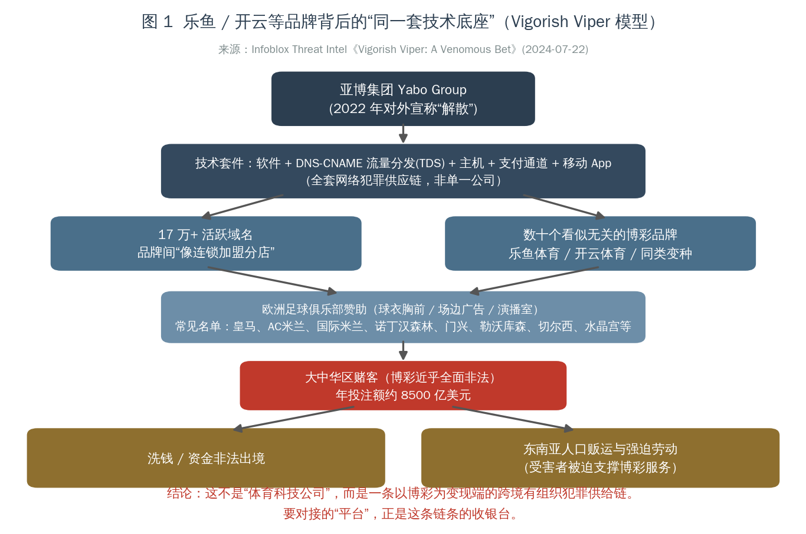
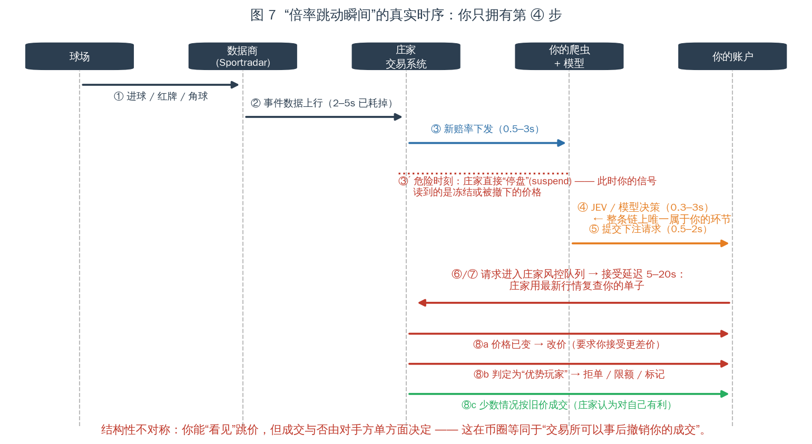
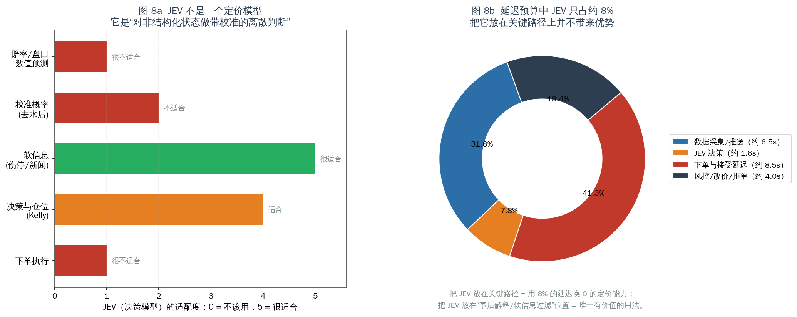
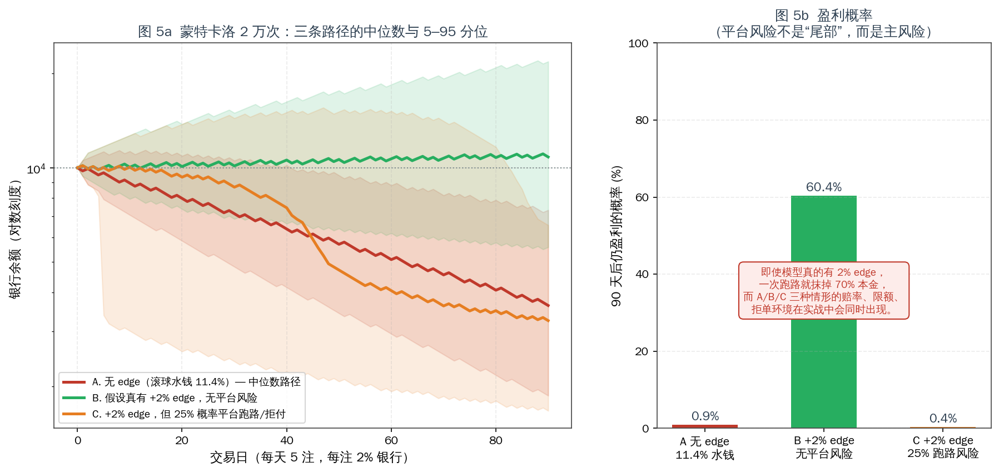
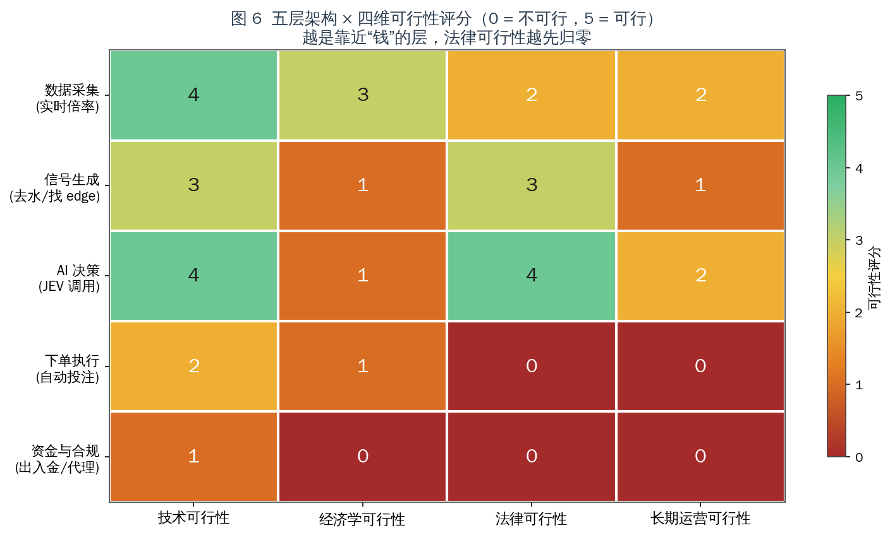

# 「实时倍率 + JEV 模型 + 自动买入」体育博彩交易机器人可行性调查报告

**——对乐鱼体育（LEYU）、开云体育（KAIYUN）等平台的技术、经济与法律可行性评估**

| 项目 | 内容 |
| --- | --- |
| 报告版本 | v1.0 |
| 报告日期 | 2026-06（调研数据截止日见各节标注） |
| 调研范围 | 国际公开渠道（网络安全研究报告、博彩行业数据、学术/法律文献、公开 API 文档） |
| 调研对象 | 乐鱼体育 / LEYU、开云体育 / KAIYUN，及同类「足球场边广告品牌」背后平台 |
| 核心问题 | 采集逐场实时赔率 → 在庄家调价瞬间调用 JEV 决策模型 → 自动下单，这套「币圈交易机器人」式架构是否可行？ |
| 一句话结论 | **技术上半可行，经济学上负期望，法律上不可行；三层叠加后整体不可行，且是负收益高风险行为。** |

> **免责声明**：本报告为技术与合规评估，目的是说明该方案的**不可行性与风险**，不是构建、部署或优化赌博投注系统的指南。报告不包含任何可用于实际下单的实现。计算所用的全部赔率、水钱、延迟数据均来自公开资料与透明数学推导，未接触任何博彩平台内部数据。

---

## 摘要（TL;DR）

1. **你打算接入的"体育平台"不是体育公司。** Infoblox Threat Intel 于 2024-07-22 发布的研究将「乐鱼/开云」这类品牌的共同技术底座命名为 **Vigorish Viper（抽水蝰蛇）**：一个由**亚博集团（Yabo Group）**开发、掌控的技术套件，托管 **17 万+ 活跃域名**，支撑"数十个看似无关"的博彩品牌。该套件同时关联**洗钱、资金非法出境、东南亚人口贩运与强迫劳动**。换言之，这不是"某个赔率供应商"，而是一条跨境有组织犯罪产业链的收银台。
2. **"倍率跳动瞬间"这个前提，本身建立在庄家不设闸门的假设上。** 实际上庄家握有最后一道闸门：在盘接受延迟 5–20 秒、危险球直接停盘、以及事后改价/拒单/限额。你在币圈能做的"抢价成交"，在这里由对手方单方面裁定是否成立。
3. **水钱（overround）吃掉了整个策略空间。** 在盘（滚球）足球的典型水钱是 **8%–20%**（均值约 **11.4%**），而赛前头部市场只有约 **5.06%**（Bet Better Margin Index，68 家博彩公司样本）。水钱 11.4% 时，单注期望收益 **EV = −m/(1+m) = −10.23%**。这不是模型能补的洞，而是"报价里含的税"。
4. **要打平，你必须在概率精度上相对优于庄家 11.4%。** 这是**相对**优势，不是绝对优势。庄家的赔率不是猜测，是市场共识 + 风控因子；公开数据模型的现实相对优势在 **0–2%** 量级。数学上的分母不对等，是这套方案最硬的天花板。
5. **JEV 放错了位置。** JEV 是一种「决策模型」（System One 模型：输入非结构化 state，输出带校准的离散判断与置信度），它**不是定价模型**。它在延迟预算中仅占约 **8%**，把它放在关键路径上等于用延迟换零收益；它唯一有价值的位置是"事后解释 / 软信息过滤 / 风控"，且**不改变期望值**。
6. **法律可行性先归零。** 中国大陆赌博几近全面禁止；网络开赌、为赌博网站担任代理接受投注、为其提供技术支持或支付结算帮助，分别落入**开设赌场罪、赌博罪、帮助信息网络犯罪活动罪（帮信罪）**。资金层（入金/出金/代充/跑分）直接对应帮信罪与掩隐罪，是司法实践打击最重的环节。
7. **量化结论（蒙特卡洛 2 万次，90 天，每天 5 注，每注 2% 银行）：**

| 情形 | 90 天后仍盈利的概率 |
| --- | --- |
| A. 无 edge（滚球水钱 11.4%） | **0.9%** |
| B. 假设真有 +2% edge，且无平台风险 | 60.4% |
| C. 假设真有 +2% edge，但 25% 概率遭遇平台跑路/拒付 | **0.4%** |

> 注意 B 与 C 的对比：**"平台风险"不是尾部风险，而是主风险**。而 A/B/C 三种困境（被水钱吃、被延迟吃、被跑路吃）在真实环境里是**同时发生**的。

---

## 目录

1. [调研方法与证据分级](#1-调研方法与证据分级)
2. [对象定性：乐鱼 / 开云到底是什么](#2-对象定性乐鱼--开云到底是什么)
3. [技术可行性：从赔率跳动到成交的完整链路](#3-技术可行性从赔率跳动到成交的完整链路)
4. [经济学可行性：水钱、优势精度与 Kelly](#4-经济学可行性水钱优势精度与-kelly)
5. [JEV 在架构中的正确位置（以及为什么它救不了这个方案）](#5-jev-在架构中的正确位置以及为什么它救不了这个方案)
6. [法律与合规可行性：中国法域下的逐层定性](#6-法律与合规可行性中国法域下的逐层定性)
7. [量化压力测试：蒙特卡洛结果](#7-量化压力测试蒙特卡洛结果)
8. [可行性评分总表](#8-可行性评分总表)
9. [如果目标只是"足球数据 + 模型"，什么是可行的替代路径](#9-如果目标只是足球数据--模型什么是可行的替代路径)
10. [结论](#10-结论)
11. [附录](#附录a数据与图表索引)

---

## 1. 调研方法与证据分级

本次调研只使用国际公开渠道，证据分为三级，正文中逐条标注：

| 级别 | 含义 | 示例来源 |
| --- | --- | --- |
| **A 级** | 一手机构研究 / 官方文件 / 平台自有文档 | Infoblox Threat Intel 报告；最高人民法院、最高人民检察院、公安部《办理跨境赌博犯罪案件若干问题的意见》；Pinnacle 官方 API 文档；Betfair Developer Program |
| **B 级** | 行业数据聚合 / 学术论文 / 律师事务所有据可查的分析 | Bet Better Margin Index；Karl Whelan《Estimating Expected Loss Rates in Betting Markets》；Walsh & Joshi *Optimal sports betting strategies in practice*；曼昆律所爬虫合规定性 |
| **C 级** | 媒体综述、论坛实测、SEO 内容农场 | 各类"某月依法查处"新闻稿（**经识别部分为投注站自建 SEO 内容农场，本文仅作现象引用，不作为事实依据**） |

> ⚠️ **重要识别提示**：调研中大量所谓"乐鱼体育查处新闻""开云体育被端"的页面（如 `xdplus.cn`、`xdkb.net`、`fm968.net`、`ifeng.com` 的部分转载页）存在明显的**模板化批量生成**特征——同一文案换城市、换时间、换金额（甚至出现"日均活跃用户超 55400 万人"这类不可能的数字）。**这类站点本身就是该产业链 SEO 伪装流水线的一部分**，其"新闻"不可作为事实依据。本文凡引用此类内容，仅用于说明"该品牌在网络上呈现伪装流水线特征"这一现象本身。

---

## 2. 对象定性：乐鱼 / 开云到底是什么

### 2.1 品牌结构：不是一个公司，而是一套"外壳轮换"机制

以 "乐鱼体育 / LEYU / leyu" 为关键词，在公开网络上会得到**互相矛盾**的公司简介：同一品牌在不同镜像站分别自称"2018 年成立于上海杨浦体育产业园 A 座 15 层，做业余篮球联赛与 4K 赛事直播""2018 年成立于杭州滨江区智慧体育产业园，承办华东业余足球联赛"，而换一个镜像站则直接把"**返水、投注、下载 App**"摆在台面上。

这是典型的**"品牌寄生 + 多壳轮换"**特征（C 级现象观察，但被 A 级技术研究交叉验证）：

- 公司简介高度模板化、地址随镜像站漂移；
- 通过 SEO 流水线批量生成"新闻/介绍/百科"页，为搜索引擎和人眼同时做准备；
- 用"体育产业"当灯箱，用"投注盘口与充值入口"当收银台。

**第三方安全评估的独立结论与此一致：**

| 平台 | 独立评估结论 |
| --- | --- |
| `kaiyun.io` | Gridinsoft Trust Score **35/100**，"Suspicious Website"，黑名单警告 |
| `leyu.com` | Gridinsoft Trust Score 64/100（自动检测），但**观察到跳转到 `www.lyvip464.com`** 等新域名 |
| `online-leyuapp.com.cn` | ScamAdviser Trust Score **0**，被 IPQS 标记为 phishing |
| Kaiyun Sports（.com 主入口） | 评审指出：主域名为 HTTP 跳转壳，HTTPS 主域不可连；**未找到清晰的公开牌照、运营主体、负责任博彩、KYC 与完整提现政策页面** |

> 一个正规持牌博彩运营商的合规基线是：公开牌照编号与监管辖区、运营法人、KYC/AML 政策、负责任博彩页面、完整提现条款。上述平台**没有一条满足**。

### 2.2 技术底座：Vigorish Viper（A 级证据）

Infoblox Threat Intel 2024-07-22 研究（"Vigorish Viper: A Venomous Bet"）的关键结论：

- **命名来源**：vigorish = 庄家抽水，viper = 复杂的流量分发系统（TDS）与品牌关系网。
- **技术套件构成**：软件 + **DNS CNAME 流量分发系统（多层 TDS）** + JavaScript 分流 + 网站托管 + 支付机制 + 移动 App —— 一整套**网络犯罪供应链**。
- **规模**：运营 **170,000+ 活跃域名**。
- **归属**：该技术由 **亚博集团（Yabo Group / Yabo Sports）** 在 2022 年宣称"解散"前开发并掌控。亚洲赛马联合会（ARF）反非法博彩与相关金融犯罪委员会将其认定为"**可能是针对大中华区最大的非法博彩运营体**"，并直接关联**现代奴役（受害者被迫支撑博彩服务）**。
- **商业模式本质**：数十个看似无关的博彩品牌**"更像连锁加盟的分店"**，共用同一套技术、DNS 与支付基础设施。
- **规模量化**：尽管博彩在大中华区几近全面非法，估计该地区公民**年投注额约 8,500 亿美元**；全球非法体育博彩经济规模约 **1.7 万亿美元**。
- **实物世界关联**：通过赞助欧洲足球俱乐部（球衣胸前、场边广告、演播室植入）向亚洲投射品牌，被评论为"**让毫不知情的欧洲俱乐部为犯罪循环提供燃料**"。

**图 1** 给出该生态的结构化还原：



> **对本案的直接含义**：你打算"采集实时倍率"和"调用模型决策买入"的对象，不存在"运营主体"这一法律与商业意义上的对手方。**你无法与一个 17 万域名轮换、无牌照、无运营法人的实体建立任何可执行的合同关系**。当它拒绝提现或跑路时，你既无合同救济、也无监管申诉渠道、也无司法管辖抓手——这正是 §7 中"平台风险 25%"参数的现实来源（该参数为保守估计，见 §7 敏感性讨论）。

### 2.3 "开云"这个名称的额外风险：品牌混淆

调研中发现一个值得单独指出的现象：中文网络上的"开云体育"与法国奢侈品集团 **Kering（开云集团）** 在中文译名上高度重合，同时大量赞助通稿（皇马、AC 米兰、国际米兰、诺丁汉森林、门兴格拉德巴赫、勒沃库森、切尔西、水晶宫等）**只出现在博彩导流站与内容农场中，缺乏俱乐部官方渠道的对应声明**。2026 年还出现所谓"AIPS 致信 FIFA，指控赞助商在世界杯转播中使用'开云 app 版本'误导观众"的报道，但该报道本身发布在 §2.1 所述的内容农场上。

**结论**：该品牌的"赞助资历"无法通过可靠信源核实，其宣传材料**主要功能是自我合法化包装**。把一个不可核实的赞助叙事当作"平台实力背书"来做尽调，本身就是尽调失效。

---

## 3. 技术可行性：从赔率跳动到成交的完整链路

这一节把"实时倍率 → 模型决策 → 买入"拆成 9 个阶段，给出每阶段的延迟预算与工程约束。


| 阶段 | 乐观 | 保守 | 关键约束 |
| --- | --- | --- | --- |
| ① 场上事件发生 | 0s | 0s | 起点 |
| ② 场馆数据采集（Sportradar / Genius Sports 现场观察员） | 2.0s | 5.0s | 人眼/终端录入，现场采集本身就有数秒 |
| ③ 数据商 → 庄家交易系统推送 | 1.0s | 3.0s | 专线低延迟，官方称"stadium-direct" |
| ④ 庄家模型重算 + 风控（**可能直接停盘**） | 1.0s | 4.0s | 关键球/进球瞬间直接 suspend |
| ⑤ 新赔率推到前端 / 你的采集端 | 0.5s | 3.0s | 见下文数据源对比 |
| ⑥ **你的 JEV 决策调用** | 0.3s | 3.0s | LLM 单次往返，波动极大 |
| ⑦ 下单请求 → 庄家风控 | 0.5s | 2.0s | 代理/越洋链路 |
| ⑧ **庄家"下注接受延迟"** | 5.0s | 10.0s | 交易所足球在盘**最短 5s**；软庄常见 7–20s |
| ⑨ 结果：按旧价成交 / 改价 / 拒单 | — | — | 大概率落在对你最不利的一侧 |
| **合计** | **≈ 10.3s** | **≈ 30.0s** | 从场上事件到成交确认 |

### 3.1 数据源：能买到的都不是"瞬间"

| 数据源 | 在盘更新延迟 | 是否可下单 | 备注 |
| --- | --- | --- | --- |
| **The Odds API** | 精选市场**在盘 40 秒**轮询；赛前 60 秒；交易所 20 秒 | ❌ | REST 轮询模型，天然无法捕捉"跳动瞬间" |
| TheRundown | Ultra 及以上提供 WebSocket 推送、亚秒级 | ❌ | 成本较高，仍是"看盘"而非"下单" |
| **Pinnacle API** | 官方套件 | ✅（已关闭） | **2025-07-23 起对公众关闭**，仅面向"select high value bettors & commercial partnerships"，需邮件申请 |
| 第三方转售（pinnodds 等） | 提供 Pinnacle 行情 | ❌ | $99–$229/月；官方原价约 €5,000/月 |
| **Betfair Exchange API** | 一等公民：Streaming API 推送 | ✅ | **唯一合法且公开的"程序化下注"通道**（见 §9） |
| 直接爬取目标平台前端 | 0.5–3s | 需自行逆向 | 违反平台条款，且触发风控/封禁 |

**结论**：
- 想要"捕捉庄家调价瞬间"，只有**直连其前端**或**买高端低延迟行情**两条路。前者违约违法，后者依然无法解决阶段 ⑧。
- 真正可编程下注的合法通道只有 **Betfair 交易所**——而交易所的价格由买卖双方撮合，**庄家不再是你的对手方**，这是 §9 的合规替代路径核心。

### 3.2 阶段 ⑧：为什么"成交"不取决于你

这是本方案与"币圈交易机器人"最本质的差异：



1. **接受延迟（Bet Acceptance Delay）**：行业内交易所足球在盘最短约 **5 秒**，软庄常见 **7–20 秒**。有用户实测某平台"发送下注请求后固定等 7 秒再成交，只在活球期间如此，停表/中场则即时成交"——这正是为了给赔率变动留出窗口。
2. **改价（Re-quote）**：庄家可在延迟窗口内改价，要求你接受更差价；用户可关闭"接受赔率变动"，但结果是**拒单**而非按原价成交。
3. **方向的系统性不对称**：社区实测显示，部分平台在延迟期内**赔率变差才拒单、变好却照常成交**（即只在对庄家不利时取消）。另有职业赌客指控 William Hill 在拉斯维加斯"根据注单对庄家好坏来决定是否延迟接受"。
4. **限额与标记（Stake Factoring）**：一旦你的投注模式被判定为"优势玩家"，账户会先被降限额，再被限制到 `$0`，最终以"商业原因"关闭。行业共识是：**触发条件是注单质量（CLV，即是否跑赢收盘线），而不是你是否已经赢钱**。英国监管数据显示，**超过半数的受限账户终身是亏损的**——也就是说，**即便你整体在亏，只要你的定价是对的，就会被封**。

> **一句话**：在币圈，最坏情况是滑点和手续费；在这里，最坏情况是**对手方在你获利的那一刻，单方面宣布你这笔交易无效，并顺手封掉你的账户**。这不是"技术难题"，这是**对手方风险的结构性设计**。

---

## 4. 经济学可行性：水钱、优势精度与 Kelly

### 4.1 水钱：报价里的税

水钱（overround / margin）的定义：`m = Σ(1/odds_i) − 1`。

**EV = −m / (1 + m)**（推导见附录 B）。这个期望值**与你看好谁、模型多聪明完全无关**。


| 市场 | 典型水钱 | 单注 EV |
| --- | --- | --- |
| 交易所 Betfair（抽佣模式） | ~2.0% | −1.96% |
| 欧冠赛前 1X2 | 3–5% | −4.76%（按 5%） |
| 英超赛前 1X2 | 4–6% | −4.76% |
| **滚球足球在盘** | **8%–20%（均值 11.4%）** | **−10.23%** |
| 滚球同场串关/道具 | ~13% | −11.50% |
| 四串一（每腿 5.2% 复利） | ~22.8% | −18.57% |
| 首个进球者 | 20–35% | −21.26%（按 27%） |
| 正确比分 | 25–45% | −24.24%（按 32%） |

**关键结论**：**你要做的正是水钱最贵的那个市场**。在盘足球的抽水是赛前头部的 2 倍以上。行业数据（Bitok Arena Research，12,000 注 / 6 家主流博彩 / 12 个月）给出：赛果市场平均水钱 6.8%，**在盘市场平均 11.4%**，四串一每腿 5.2% 复合到 22.8%。Bet Better Margin Index（68 家、每日更新）给出头部市场均值 **5.06%**。

**推论**：既然 11.4% 是效率性差价而非"你的信息优势来源"，那么**主动选择在盘市场，等于主动选择最高的结构性劣势**。

### 4.2 你需要多准才能打平？

打平条件：`p_model × (1+m) > p_fair`，即 **需要相对概率优势 = m**。


| 水钱档位 | p=50% 标的需超出 | p=30% 标的需超出 | p=10% 标的需超出 |
| --- | --- | --- | --- |
| 3%（交易所） | 1.5 pp | 0.9 pp | 0.3 pp |
| **11.4%（滚球均值）** | **5.7 pp** | **3.4 pp** | **1.1 pp** |
| 20%（滚球上限） | 10.0 pp | 6.0 pp | 2.0 pp |

**这就是本方案最硬的天花板**：你需要**相对优于庄家的定价模型 11.4%**。而庄家的赔率**不是猜测**，是：

- 夏普市场（Pinnacle 等）的价格共识；
- 全市场资金流的方向；
- 自有风控因子（敞口管理、限额模型、已实现盈亏）。

公开数据建模的现实相对优势在 **0–2%** 量级。有一个可参考的极端诚实的开源项目 `CODESIGURD/value-bet-model`：作者做了 **5 轮模型迭代、4 种特征增强、10 个联赛 25 个赛季的样本外测试**，最终确认**庄家收盘线在公开数据下无法被击败**（AUC 0.535–0.560，从未达到盈利阈值）。作者把这个过程完整公开为"从假阳性到确认的零结果"。

**推论（也是与币圈最关键的差异）**：
> 在币圈，散户可以用简单的趋势/资金流策略对抗"没有信息优势的高频对手"；
> 在足球盘口，你要对抗的是**已经把所有公开信息（含伤停、xG、天气、阵容）定价进去的、并且能看到全市场资金流**的对手。**你的信息集是它的子集。**

### 4.3 即使用 Kelly 也救不了

Kelly 准则给出最优下注比例：`f* = (b·p − q) / b`。它的价值在于**在已知 edge 时最大化长期几何增长率**，前提是 **edge 必须真实存在**。

- Kelly 是**仓位管理**工具，不是**edge 生成**工具。当 `p` 被高估时，Kelly **加速**破产而非避免破产（"Fractional Kelly"作为风控手段正是承认这一点）。
- 在滚球场景，Kelly 面对的是**连续、相关、且被平台单方面约束**的投注序列：限额、拒单、停盘使 `f*` 无法执行；账户被封使整个序列终止。
- 学术综述（Walsh & Joshi, *Optimal sports betting strategies in practice: an experimental review*, arXiv:2107.08827）明确指出：现代投资组合与 Kelly 方法在体育投注中的实务修正，本质都是在**缓解正式模型不现实假设带来的额外风险**——而本方案中"可无限下注、可按显示价成交、账户不会消失"这三个假设**同时全部失效**。

---

## 5. JEV 在架构中的正确位置（以及为什么它救不了这个方案）

### 5.1 JEV 是什么，不是什么

JEV 是 TypeSafe 提出的**决策模型（System One model）**：输入非结构化 state，输出**类型化判断**——类别、是/否、评分，以及 **0–1 的校准置信度**。它的设计目标是对"非结构化状态做带校准的离散判断"，训练方式为 RLCD（Reinforcement Learning for Calibrated Decisions），公开信息**未披露可复现的架构、权重、数据与训练算法**，因此只能研究其**接口**，不能假定其内部机制。

主流用法（如 OpenRouter 教程、`Protocol-Lattice/Predict-With-Jev`、`jarrodwatts/jev-trader`）都是"**决策/评分/审核**"类任务，而不是数值回归预测。**它不是赔率定价模型。**



| 环节 | JEV 适配度 | 原因 |
| --- | --- | --- |
| 赔率/盘口数值预测 | **1 / 5** | 这是数值回归/时序建模问题，不是离散判断 |
| 校准概率（去水后） | 2 / 5 | 去水是确定性算术，不需要模型 |
| **软信息（伤停/新闻/更衣室）** | **5 / 5** | 非结构化文本 → 结构化判断，正是 JEV 的设计场景 |
| 决策与仓位（Kelly） | 4 / 5 | 可作为"是否下注"的门控，但不能生成 edge |
| 下单执行 | 1 / 5 | 与模型能力无关 |

### 5.2 延迟占比：把 JEV 放关键路径是净损失

在 §3 的延迟预算中，JEV 单次调用（0.3–3s）占乐观总延迟（10.3s）的约 **8%**（约 1.6s）。

> - **放在关键路径**：用 8% 的延迟，换取**零**的定价能力提升。
> - **放在事后/旁路**：对无时效性要求的事件做软信息过滤（例如"这条伤停消息是否可信""这条推文是否在制造恐慌"）——**这是它唯一能产生正贡献的位置**，且贡献体现在**避免亏损**，而非创造 edge。

### 5.3 一个必须承认的"理论上限"

即便把 JEV 用得再对，它也只能改善**你对软信息的处理质量**。而软信息在盘口上的**定价速度**是秒级乃至更快的：
- 官方伤停公告 → 数据商 → 庄家模型 → 赔率变动，通常在进球级别的重大事件上只需数秒；
- 而你在阶段 ④–⑧ 的合计延迟 ≥ 6s。

**结论**：**用 JEV 做软信息处理，在赛前（pre-match）是有意义的；在与"调价瞬间"绑定的在盘场景中，它的时效窗口在大多数情况下已经关闭。**

---

## 6. 法律与合规可行性：中国法域下的逐层定性

> 本节仅作合规风险定性，不构成法律意见。具体个案请咨询执业律师。

### 6.1 基础规范框架（A 级证据）

| 规范 | 关键条款 | 对本案的含义 |
| --- | --- | --- |
| 《刑法》第 303 条 | 开设赌场罪 / 赌博罪 | 见下方司法解释 |
| 两高《关于办理赌博刑事案件具体应用法律若干问题的解释》第 2 条 | "以营利为目的，**在计算机网络上建立赌博网站，或者为赌博网站担任代理，接受投注的，属于刑法第三百零三条规定的'开设赌场'**" | 参与网络赌博平台的代理、拉人、接受投注 → **开设赌场罪** |
| 同上第 3 条 | 中国公民在境外周边地区聚众赌博、开设赌场，以吸引中国公民为主要客源的，可依刑法追究 | 服务器在境外**不构成免责** |
| 同上第 4 条 | "明知他人实施赌博犯罪活动，而为其提供资金、计算机网络、通讯、费用结算等直接帮助的，**以赌博罪的共犯论处**" | 提供技术支持/资金通道 = 共犯 |
| 《刑法》第 287 条之二（帮信罪） | 明知他人利用信息网络实施犯罪，提供互联网接入、服务器托管、**支付结算**等帮助，情节严重的，处三年以下有期徒刑或拘役 | 入金/出金/代充/跑分 |
| 两高一部《办理跨境赌博犯罪案件若干问题的意见》 | 跨境网络赌博犯罪地包括**服务器所在地、网络服务提供者所在地、参赌人员使用的网络信息系统所在地、提供帮助的犯罪地** | **管辖极宽**：你在国内写的每一行代码都可能构成"犯罪地" |
| 两高一部《关于办理帮助信息网络犯罪活动等刑事案件有关问题的意见》（法发〔2025〕12 号） | 涉"两卡"案件中帮信罪与掩隐罪的区分标准 | 资金层定性进一步收紧 |
| 财政部等十二部门 2018 年第 105 号公告 | **"截至目前，财政部尚未批准任何彩票机构开通利用互联网销售彩票业务"** | 中国大陆**不存在**合法的线上售彩/投注通道 |
| 中国体育彩票官方提示 | "体育彩票实体店是目前**唯一**正规合法的体育彩票购彩渠道"，从未授权任何网站/App/小程序/社交软件售彩 | 任何"线上平台"均非合法渠道 |
| 《反不正当竞争法》（2025 修订）第 13 条第 3 款 | 禁止以"避开或破坏技术措施等不正当方式获取、使用其他经营者合法持有的数据" | 爬取赔率数据的独立违法性 |
| 《网络数据安全管理条例》第 18 条（2025-01-01 施行） | 使用自动化工具需评估影响，不得"非法侵入网络"或"干扰服务正常运行" | 高频抓取的行政风险 |
| 最高检《厘定边界合理规制网络爬虫行为》（2025-11） | 采**"代码技术障碍"标准**：绕过技术措施才可能入刑 | 绕过风控/验证码 = 刑事风险跃升 |

### 6.2 逐层定性

| 架构层 | 具体行为 | 定性 | 风险等级 |
| --- | --- | --- | --- |
| **① 数据采集** | 直连抓取博彩站点赔率 | 违反平台条款（民事违约）+ 可能触及《反不正当竞争法》第 13 条、《网络数据安全管理条例》第 18 条 | 中—高 |
| | 绕过验证码/设备指纹/风控 | 触及最高检"代码技术障碍"标准 | **高（刑事风险）** |
| **② 信号生成** | 本地建模、去水、找 edge | 行为本身中立 | 低 |
| **③ AI 决策** | 调用 JEV 做判断 | 行为本身中立 | 低 |
| **④ 下单执行** | 自动投注 | 若平台被认定为赌博网站，**投注行为本身在中国大陆违法**；为投注开发自动化工具可能被认定为"为赌博网站提供技术支持" | **极高** |
| **⑤ 资金与合规** | 入金、出金、代充、跑分、代理分成 | **帮信罪 / 掩隐罪 / 开设赌场罪（代理）** | **极高（司法实践打击最重环节）** |

**司法实践的量刑参照**：湖北石首"705 特大跨境网络开设赌场案"中，**近 300 名代理和"员工"被依法打击处理**，涉案赌资逾 16 亿元；法院对其中 5 名**非核心"员工"**判处有期徒刑 1 年 4 个月至 2 年（缓刑 2–3 年）并处罚金——**核心成员境外潜逃，被抓的是境内执行层**。这说明：**"我只是写代码的""我只是个员工"不构成有效抗辩**。

**帮信罪的规模**：2020 年以来全国法院一审审结帮信犯罪案件逐年增长，**2023 年超过 10 万件**；涉"两卡"案件占全部帮信犯罪案件的 **80% 左右**。司法实践对"提供支付结算帮助"的打击是**数量级**的。

### 6.3 与"AI 荐彩"治理的交叉

新华社（2026-06-28）报道明确指出：社交平台上"AI 精准预测""高胜率算法""智能分析模型"等**已成为网络赌球的新型营销包装**，"所谓'精准预测''稳赚不赔'都是诱导陷阱"。这意味着：

> **本方案的对外表达（"AI 模型分析赔率"）与正在被专项治理的话术高度重合。** 即便技术上只做数据采集与建模，一旦被认定用于博彩导流或投注执行，会直接落入治理范围。这是一个**表述风险与实质风险叠加**的位置。

---

## 7. 量化压力测试：蒙特卡洛结果

### 7.1 参数设定

| 参数 | 取值 | 来源/理由 |
| --- | --- | --- |
| 初始银行 | ￥10,000 | 假设 |
| 下注频率 | 5 注/天 | 在盘场景典型节奏 |
| 单注比例 | 银行 2%（flat） | 保守，避免 Kelly 放大误差 |
| 结算赔率 | 1.95 | 接近 −105 的典型盘口 |
| 模拟时长 | 90 天 | 一个赛季中段 |
| 路径数 | 20,000 | 蒙特卡洛 |
| 情形 A 的 EV | −10.23% | §4.1，滚球水钱 11.4% |
| 情形 B 的 EV | +2.0% | **乐观上界**：假设模型真有可观的相对优势 |
| 情形 C 的平台风险 | 25% 概率在某日遭遇跑路/拒付，损失 70% 本金 | 保守估计，见 §7.3 |

胜率由 EV 反推：`EV = q×(1.95−1) − (1−q) ⇒ q = (1+EV)/1.95`

### 7.2 结果



| 情形 | 90 日余额中位数 | 5 分位 | 95 分位 | **盈利概率** |
| --- | --- | --- | --- | --- |
| A. 无 edge（11.4% 水钱） | 大幅缩水 | 接近清零 | 低于本金 | **0.9%** |
| B. +2% edge，无平台风险 | 稳健增长 | 略低于本金 | 显著增长 | **60.4%** |
| C. +2% edge，25% 跑路风险 | 显著亏损 | 接近清零 | 略低于本金 | **0.4%** |

**读法**：

1. **情形 A 是默认结局**：在没有真实 edge 的情况下，**99.1% 的路径在 90 天后是亏损的**，且亏损是**单调、快速、不可逆**的（对数坐标下的直线下降 = 稳定指数衰减）。这就是"水钱"的数学形状。
2. **情形 B 是乐观上界**：即便假设存在 +2% 的真实优势，也只有 60.4% 路径盈利——接近抛硬币。原因：2% 的 edge 相对于 2% 的下注比例和赔率波动，信噪比很低，**90 天的样本量不足以稳定实现期望**。这意味着"回测盈利"和"实盘盈利"之间有巨大的方差鸿沟。
3. **情形 C 是现实**：一旦引入平台风险，**盈利概率从 60.4% 崩到 0.4%**。而且注意曲线形状——橙色路径在跑路发生日（约第 40 天后）出现了**断崖式下跌**，之后再也无法恢复。

### 7.3 敏感性：25% 这个参数保守吗？

**不保守。** 理由：

- 该实体的技术底座与"17 万+ 域名轮换"绑定（§2.2）——**域名轮换本身就是"随时可以消失"的工程表达**；
- 第三方安全评估未找到任何公开牌照、运营主体、KYC 与完整提现政策（§2.1）；
- 这类平台的一般商业模式（内容农场中的受害者描述、以及监管通报的共性）包含"修改赔率、限制提现、卷款跑路"；
- 85,000 名受害者的共性是：**提现失败**。

更合理的建模是**把"平台风险"视为与时间正相关的累积风险**（你越是稳定盈利，越触发限额/封号/拒付；平台越是资金链紧张，越倾向直接跑路）。即：**你的成功本身就是风险的触发条件**。这是与币圈"交易所风险"最大的不同——中心化交易所至少有监管压力和声誉成本；无牌赌博平台两者都没有。

> **本报告不给 25% 这个数字任何"精确性"假设，它的作用只是量级说明：只要平台风险不是零，它就会主导整个结果。** 读者可自行把参数设为 5% 或 50% 重跑（脚本见 `scripts/make_figures.py`，函数 `fig5_montecarlo`）——结论方向不变。

---

## 8. 可行性评分总表



| 架构层 | 技术可行性 | 经济学可行性 | 法律可行性 | 长期运营可行性 |
| --- | :---: | :---: | :---: | :---: |
| 数据采集（实时倍率） | 4 | 3 | **2** | **2** |
| 信号生成（去水/找 edge） | 3 | **1** | 3 | **1** |
| AI 决策（JEV 调用） | 4 | **1** | 4 | **2** |
| 下单执行（自动投注） | **2** | **1** | **0** | **0** |
| 资金与合规（出入金/代理） | **1** | **0** | **0** | **0** |

**评分口径**：0 = 不可行 / 5 = 完全可行。作者基于本报告证据的主观评分，可通过 `data/feasibility_scores.csv` 复核与调整。

**读图要点**：

- **技术可行性 ≠ 可行性**。数据采集和 JEV 调用技术上都"能做"（4 分），这正是该方案**看起来可行**的幻觉来源。
- **经济学可行性从第二层就开始崩塌**（1 分），因为水钱是结构性的，与实现质量无关。
- **法律可行性在第四层归零**：不是"难合规"，而是**行为本身对应的就是刑法条款**。
- **越靠近钱，可行性越先归零**。这与很多技术方案的直觉相反：在这里，**把系统做得越完整、越能自动成交，法律风险越高**。

---

## 9. 如果目标只是"足球数据 + 模型"，什么是可行的替代路径

如果你的真实兴趣是**量化建模 / 体育数据分析 / 决策模型工程**（而不是赚庄家的钱），下面这些路径能达到同样的技术锻炼目标，且不触碰红线：

| 方向 | 具体做法 | 为什么可行 |
| --- | --- | --- |
| **公开赛事数据建模** | StatsBomb Open Data、FBref、Understat（xG）、Football-Data.co.uk | 都是公开、可授权、无对手方风险；适合做 xG 建模、比赛预测、特征工程 |
| **赔率数据的学术用途** | 用公开赔率归档（如 football-data.co.uk 的历史 1X2 收盘价）做**效率性研究**、CLV 研究、去水算法 | 研究"市场有多有效"是正当学术问题，本身就是最好的模型评估基准 |
| **交易所撮合研究** | 研究 Betfair 交易所的价格形成机制、买卖价差、流动性 | 交易所是**合法**的程序化接口，且这里不存在"庄家拒绝成交"，价格由撮合决定 |
| **JEV 的正确练手场景** | 用 JEV 做**赛事新闻/伤停公告的信息抽取与可信度评分**；做比赛报告的结构化生成 | 非结构化文本 → 带校准的离散判断，正是 JEV 的设计场景 |
| **决策模型工程** | 把 JEV 这类模型用在"内容审核""情报分级""异常检测"等有明确 ground truth 的场景 | 这些场景有可验证标签，才能评估校准质量（Brier score / ECE） |
| **合规的体育内容产品** | 基于公开数据的赛事分析、可视化、预测准确性追踪（像 538 那样的公开 track record） | 价值来自**预测记录的可验证性**，不来自投注 |

**本项目 `/root/ai_football` 现有资产的可复用部分**（经检查，仓库中**没有**任何乐鱼/开云相关代码，这是好事）：

- `web/*爬虫`（澳客、球迷屋、虎扑、DS）：可保留用于**公开体育资讯**采集，但需注意 §6.1 的爬虫合规边界（robots.txt、频率、不绕过技术措施）；
- `enhanced_analyzer.py` / `match_generator.py`：赛前分析、一致性检查、多源预测聚合——这套"多源预测一致性"的思路本身是很好的**集成学习/置信度校准**练习，只要不接入投注执行层；
- `验证码识别` 目录：**建议评估其合规性**。如果其用途是绕过目标站点的反爬技术措施，则触及最高检"代码技术障碍"标准，属于刑事风险跃升点，建议明确其适用范围或移除。

---

## 10. 结论

**对"实时倍率 + JEV 决策 + 自动买入"方案的最终判定：**

| 维度 | 判定 | 决定性理由 |
| --- | --- | --- |
| 技术可行性 | ⚠️ 部分可行 | 数据采集与决策调用可实现；但"调价瞬间成交"受制于庄家 5–20s 接受延迟、停盘、改价与拒单，成交与否由对手方单方面决定 |
| 经济学可行性 | ❌ 不可行 | 在盘水钱 8–20%（均值 11.4%），单注 EV = −10.23%；要打平需相对优于庄家定价模型 11.4%，而公开数据模型的现实相对优势为 0–2% |
| 法律可行性 | ❌ 不可行 | 中国大陆无合法线上投注通道；投注、代理、技术支持、资金结算分别对应赌博罪/开设赌场罪/帮信罪/掩隐罪；司法实践对"境内执行层"打击明确（705 案近 300 人被处理） |
| 长期运营可行性 | ❌ 不可行 | 平台无牌照、无运营主体、17 万域名轮换；优势玩家会被降限额→限至 $0→封号；收益依赖提现，而提现是该类平台的主要风险点 |

**关于"可行吗"的直接回答：**

> **不可行。而且它不是一个"再优化一下就能行"的工程问题。**
>
> 它是三个独立的、各自充分的问题叠加：
> 1. **定价对手太强**（你必须在概率精度上相对优于庄家 11.4%）；
> 2. **成交由对手方决定**（延迟闸门、改价、拒单、限额、封号）；
> 3. **行为本身违法**（且打击重点是境内执行层，不是境外老板）。
>
> 三者中任意一条单独出现都足以否决这个方案。把它们放在一起，得到的是一个**负期望 × 高方差 × 高刑事风险**的组合。

**如果你真正想要的是"用模型和数据在足球上做点东西"**：§9 的路径可以提供同等甚至更强的技术锻炼（xG 建模、市场效率性研究、CLV 分析、决策模型校准），而且这些工作**可验证、可发表、可复用、可写进简历**——不会在你的 GitHub 上留下一个"投注机器人"仓库，也不会让你在某天发现自己的银行卡被冻结。

---

## 附录

### 附录 A：数据与图表索引

| 文件 | 内容 |
| --- | --- |
| `images/fig1_vigorish_viper_ecosystem.png` | 图 1 Vigorish Viper 生态结构 |
| `images/fig2_margin_and_ev.png` | 图 2 水钱与单注 EV |
| `images/fig3_required_edge.png` | 图 3 所需概率精度优势 |
| `images/fig4_latency_budget.png` | 图 4 延迟预算（从场上事件到成交） |
| `images/fig5_montecarlo.png` | 图 5 蒙特卡洛：中位数路径 + 盈利概率 |
| `images/fig6_feasibility_heatmap.png` | 图 6 可行性评分热力图 |
| `images/fig7_odds_tick_sequence.png` | 图 7 赔率跳动时序图 |
| `images/fig8_jev_position.png` | 图 8 JEV 定位与延迟占比 |
| `data/margin_ev.csv` | 各市场水钱与 EV |
| `data/required_edge.csv` | 打平所需的概率超出量 |
| `data/latency_budget.csv` | 分阶段延迟预算 |
| `data/montecarlo.csv` | 蒙特卡洛结果汇总 |
| `data/feasibility_scores.csv` | 可行性评分矩阵 |
| `scripts/make_figures.py` | 全部图表与 CSV 的生成脚本（可复现、可调参） |

**复现方式**：

```bash
python3 reports/leyu-kaiyun-odds-bot-feasibility/scripts/make_figures.py
```

依赖：`numpy`、`matplotlib`（中文使用 WenQuanYi Zen Hei 字体）。

### 附录 B：核心公式推导

**1. 水钱（overround）与期望值**

设某市场有 n 个互斥结果，赔率为 $o_i$（含本金）。庄家隐含概率之和为

$$S=\sum_{i=1}^{n}\frac{1}{o_i}=1+m,\qquad m=S-1$$

以真实概率 $p_i$ 投注结果为 i 的一注，期望收益为

$$\mathrm{EV}=\sum_i p_i\Big(\frac{1}{o_i}\cdot o_i-1\Big)\cdot\mathbb{1}[\text{bet }i]=p_i(o_i-1)-(1-p_i)=p_i o_i-1$$

代入 $o_i = 1/(p_i(1+m))$（即庄家按比例加价）：

$$\mathrm{EV}=p_i\cdot\frac{1}{p_i(1+m)}-1=\frac{1}{1+m}-1=-\frac{m}{1+m}$$

**2. 打平条件**

$$\mathrm{EV}>0\iff p_i o_i>1\iff p_i > \frac{1}{o_i}=p_i^{\text{implied}}=\frac{p_i^{\text{fair}}}{1+m}$$

即 $p_i > p_i^{\text{fair}}(1+m)$，**需要的相对优势恰为 m**。

**3. Kelly 仓位**

$$\mathrm{EV}>0\ \text{时}\quad f^*=\frac{b\,p-q}{b},\quad b=o-1,\ q=1-p$$

### 附录 C：主要信源

**A 级（一手机构/官方）**
1. Infoblox Threat Intel, *Vigorish Viper: A Venomous Bet* / 新闻稿（2024-07-22） — 17 万域名、Yabo Group、$1.7T 非法博彩经济、人口贩运关联
2. 最高人民法院、最高人民检察院、公安部《关于办理赌博刑事案件具体应用法律若干问题的解释》第 2/3/4 条
3. 两高一部《办理跨境赌博犯罪案件若干问题的意见》
4. 两高一部《关于办理帮助信息网络犯罪活动等刑事案件有关问题的意见》（法发〔2025〕12 号）
5. 财政部等十二部门 2018 年第 105 号公告
6. 中国体育彩票《合法购彩提示》（实体店为唯一合法渠道）
7. Pinnacle API 官方文档 — 2025-07-23 起对公众关闭
8. Betfair Developer Program / Exchange API 文档 — 程序化下注的合法通道
9. The Odds API 官方更新间隔文档 — 在盘 40s / 赛前 60s
10. 《网络数据安全管理条例》第 18 条；最高检《厘定边界合理规制网络爬虫行为》（2025-11）

**B 级（行业数据/学术/律所）**
11. Bet Better Margin Index — 68 家博彩、头部市场均值 5.06%
12. Bitok Arena Research — 12,000 注 / 6 家博彩 / 12 个月；在盘均值 11.4%
13. Karl Whelan, *Estimating Expected Loss Rates in Betting Markets* — overround 与庄家利润
14. Walsh & Joshi, *Optimal sports betting strategies in practice: an experimental review*, arXiv:2107.08827 — Kelly 与组合理论在体育投注中的实务修正
15. `CODESIGURD/value-bet-model` — 5 轮迭代 / 25 赛季样本外 / 确认公开数据无法击败收盘线
16. UKGC 数据（经 howprosbet 引述）— 超半数受限账户终身亏损
17. 曼昆律所《AI 爬虫犯了什么法？》— 技术障碍标准与不正当竞争
18. Gridinsoft / ScamAdviser / XYES 对 kaiyun.io、leyu.com、online-leyuapp.com.cn 的独立安全评估
19. 湖北石首"705 特大跨境网络开设赌场案"（检察日报 / 江苏检察网）— 近 300 名代理与员工被处理
20. Simon Willison, *Jev introduces a new shape of LLM — System One, aka Decision Models*；OpenRouter Jev 教程 — JEV 的接口与定位

**C 级（仅作现象引用，不作事实依据）**
21. `xdplus.cn` / `xdkb.net` / `fm968.net` / 部分 ifeng 转载页 — 已识别为模板化 SEO 内容农场，其"查处新闻"存在明显批量生成特征（如"日均活跃用户超 55400 万人"等不可能数字），不可作为事实依据

---

### 附录 D：本报告的可修订性说明

1. **市场数据具有时效性**：水钱、限额、延迟参数随监管与竞争环境变化。`data/*.csv` 与 `scripts/make_figures.py` 已开放，读者可用自己的参数重跑。
2. **评分是主观的**：`feasibility_scores.csv` 中的 0–5 评分为作者基于本文证据的判断，不是测量值。
3. **C 级信源的识别结论本身是重要发现**：调研过程中发现大量"看起来像新闻"的内容实际是该产业链的 SEO 伪装资产。这一发现已被用于 §2.1 的论证，并提示读者：**在这个话题上，搜索引擎返回的第一页信息大概率不可信**。
4. **报告立场**：本报告的目的是提供否决性证据与合规替代路径，不提供任何可用于实际投注的实现细节。

---

*报告结束。*
