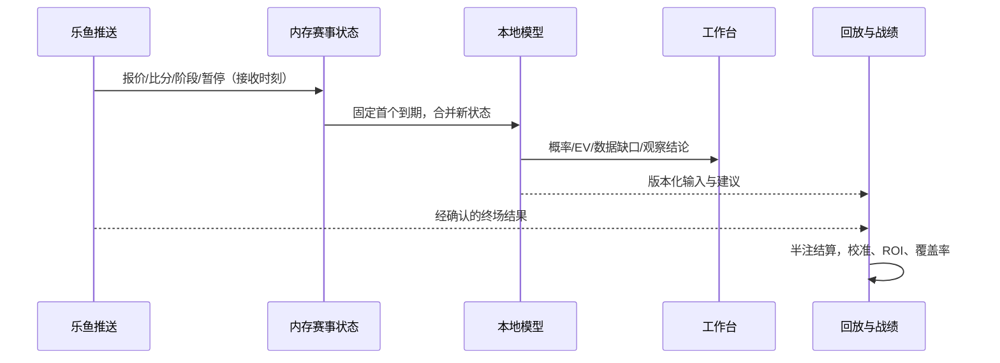
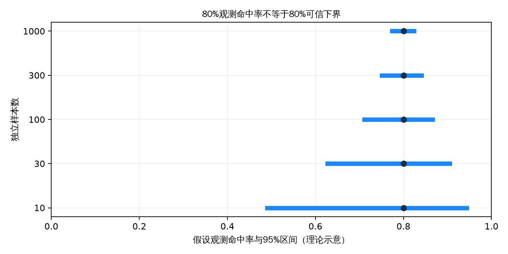

# 实时滚球决策：研究、设计与验证边界

2026-10-08；用户目标：秒级计算、可信战绩、App 风格精简 UI、专家级实时分析。本报告在创新实施前提交。证据 A=一手文档/代码/实测，B=学术研究，C=社区实测。本轮未以营销“高正确率”或社区荐单作为能力证据。

## 结论与研究路线

专家常用比赛时间、比分、场上事件、报价速度和盘口变化解释比赛。这些信息应转为可回放的事件时间特征和校准概率。推荐是否可信，需要在当时可用的信息上，与去水市场基准比较。高命中低赔率不等于正收益；少量精彩案例不足以证明长期优势。

创新选择：事件驱动快计算、比分条件下剩余进球模型、亚洲盘完整支付函数、证据门控、按比赛留出的校准回放。LLM 可解释已有结果，不能凭赔率编造球队状态、比赛事件或统计置信度。

## 成熟方案比较（A；定性比较，无主观数字打分）

|方案|事件接入|时间与场上事件|盘口|实时机制|覆盖依赖|接入成本|能否直接保证预测优势|
|---|---|---|---|---|---|---|---|
|Hudl StatsBomb Live|GraphQL|详细事件 schema，可订阅|需结合赔率源|subscriptions|购买比赛覆盖，客户 token|商业授权，开放历史数据可研究|不能；数据还需建模验证|
|Sportradar Soccer|REST/Push|timeline 与摘要，覆盖分层|独立赔率产品|Live endpoints / Push|低覆盖级别可能缺详细事件|商业账号与套餐|不能；覆盖和延迟需实测|
|Stats Perform Opta|商业数据接口|专业事件与分析|需结合行情|商业产品接入|依产品/赛事授权|商务洽谈|不能；官方产品页不是收益证据|
|Betfair Stream|交易所流|行情和订单，不等于球场事件|交易所价量|增量变更 + 线程安全缓存|市场覆盖与流权限|账户/AppKey|不能；市场是比较基准|
|当前乐鱼|REST/WS|比分、阶段、未知事件码|AH/OU/HAD|WS 秒级实测|App 会话、部分比赛类型不明确|既有接入|不能；需修复信息缺口与验证|

研究不会伪装已接入付费体育数据。当前继续以乐鱼为生产源；公开 StatsBomb 数据仅用于可署名的离线研究。

## 学术证据如何转成实现

|证据|研究发现|实现与限制|
|---|---|---|
|B Dixon & Coles 1997，DOI 10.1111/1467-9876.00065|动态球队强度 Poisson 模型，历史样本拟合与收益研究|提供基线思想，不可照搬 1990 年代回报为当前能力|
|B Dixon & Robinson 1998，DOI 10.1111/1467-9884.00152|比赛内 birth-process 模型|剩余时间与比分需作为状态，不只预测赛前全场|
|B 红黄牌研究，DOI 10.1007/s10479-022-04733-0|1826 场、5 分钟区间；红牌影响与时间、实力、比分有关|未核验事件码不设红牌乘数；不能用固定“红牌 +30%”冒充研究结果|
|B Gneiting & Raftery 2007|proper scoring，sharpness subject to calibration|同时报告 Brier/log loss 和可靠性，不使用模型自评正确率|
|A NIST Wilson 方法|二项比例置信区间|独立比赛级命中率可用，重复同场信号不能当独立样本|
|B Gibbs/Candès ACI，arXiv:2106.00170|分布漂移下自适应覆盖|漂移监测研究方向；不是小样本高胜率保证|

## 一手审计与测量

A：连续跳价每次把 pending 延后 30s；全局间隔 20s、目标批次150s；生产兜底一轮 62.06s。这些是 2026-10-08 抽样值，非稳定性保证。

A：`OU over 2.25`、1:1 被判全输，应输半；`AH home -0.25`、0:0 同样错误。台账取同盘口最新建议且更新报价改写建议时间，历史并非完整的决策轨迹。旧数据必须留备份并承认不可恢复部分。

A：APK 色彩白底 #ffffff、页底 #f2f2f6、蓝 #1c88ff、选中 #e8f3ff。仅采用视觉语言。

A：真实足球详情 mst 样本 2812/273/3689，是秒值。阶段 6/7 的时钟累计或重置必须核验；EAFC 时长不能沿用真实足球90分钟。未知事件、缺时钟和报价不一致应降低覆盖率，而非编造输入提高推荐量。

图为假设观测命中率 80% 时，独立样本量对 Wilson 95% 区间的影响（理论示意，非系统测量值）。CSV 含全部参数和区间。将成功率改为 50% 或 95% 重跑，样本越大区间越窄的方向不变。ROI、赔率与比赛相关性仍须单独评价。

## 验证方案

按比赛 ID 隔离训练与验证，时间顺序留出；只输入当时已收到的比赛状态，终场比分仅作标签。对市场拟合与滞后信号分别测试：市场拟合概率不能称为独立预测优势。完整亚洲支付函数含走水/半注。记录推荐覆盖率、每场一次或明确仓位的 ROI、Brier、log loss、可靠性分桶、缺失率、比赛数和区间。真实足球/EAFC 分开。

系统只记录模拟建议，没有交易执行或成交保证。未验证的模型明确显示“观察/尚未验证”，不以推荐数量或自评置信度替代证据。专家水平必须在独立比赛、足够样本、稳定校准和正收益下检验；短期命中率不能被承诺。

## 来源与检索诚实性

- A [StatsBomb Open Data 与使用条款](https://github.com/statsbomb/open-data)：公开研究需署名，非完整实时授权。
- A [StatsBomb Live 指南](https://live-data-api-guide.statsbomb.com/)：事件与订阅 schema，已读取。
- A [Sportradar Live Match Updates](https://developer.sportradar.com/soccer/docs/soccer-ig-live-match-retrieval)：已读取。
- A [Opta 产品页](https://www.statsperform.com/products/opta-data/)：已读取，不能推导量化延迟或收益。
- A [Betfair 官方流客户端](https://github.com/betfair/stream-api-sample-code)：README 缓存/批量变更已读取；developer.betfair.com 本轮403，未声称读到其正文。
- B [Proper scoring 原文 PDF](https://sites.stat.washington.edu/raftery/Research/PDF/Gneiting2007jasa.pdf)：已提取正文。
- A [NIST 比例区间](https://www.itl.nist.gov/div898/handbook/prc/section2/prc241.htm)。
- B [Adaptive Conformal Inference](https://arxiv.org/abs/2106.00170)。

Crossref 已核验以上三个足球论文的题名/DOI/摘要；不把只有摘要的论文写成全文复现。两次检索 JSON 解码失败未作证据；arXiv:0803.0614 实际题名是 Fitness, chance, and myths，未误标为 birth-process 论文。未使用 SEO 荐单站做能力证据。

## 可复现命令

图表在限2核 Docker 中，挂载 `/usr/share/fonts/truetype/wqy`，运行 `scripts/make_figures.py`；默认生成1图/1CSV。HTML 复用现有报告渲染器 `reports/leyu-kaiyun-odds-bot-feasibility/scripts/md_to_html.py`，支持 Mermaid 与离线文本回退。实施后附回放结果、性能实测与 UI 截图，目标值和实测值分列。
